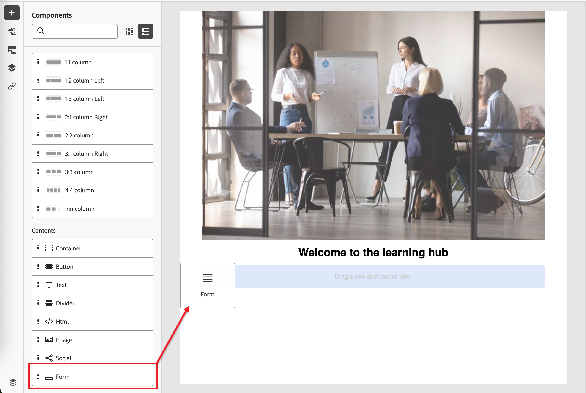

# Authoring dei contenuti - aggiungere moduli

Un modulo è un componente riutilizzabile a cui è possibile fare riferimento tramite più pagine di destinazione e modelli di pagina di destinazione in Adobe Journey Optimizer B2B edition. Si tratta di un blocco di campi e di un pulsante di invio che può essere creato anticipatamente e inserito rapidamente per rendere la progettazione della pagina più rapida e coerente.

Nell&#39;esempio seguente vengono illustrati i passaggi necessari per aggiungere un modulo durante la progettazione della pagina.

1. Nella sezione **[!UICONTROL Contents]** trascinare l&#39;elemento **[!UICONTROL Form]** in un componente strutturale nello spazio di progettazione della pagina.

   {width="600"}

   >[!TIP]
   >
   >Per aggiungere il modulo in modo che occupi l’intero layout orizzontale all’interno dell’e-mail, aggiungi una struttura di colonne 1:1 e quindi trascina e rilascia il modulo al suo interno.

1. Fai clic sull&#39;icona _Modulo_ nella barra degli strumenti del componente oppure utilizza le proprietà **[!UICONTROL Incorpora modulo]** a destra per selezionare il modulo pubblicato.

   {width="600"}

1. Se si desidera ignorare il tipo di **[!UICONTROL completamento]** predefinito per il modulo, modificare l&#39;impostazione in base ai requisiti della pagina o del modello.

   Questa è anche nota come _pagina di ringraziamento_ per il modulo e questa impostazione determina cosa accade quando un visitatore invia il modulo:

   * **[!UICONTROL Resta a pagina]** - Scegli questa opzione per mantenere il visitatore sulla stessa pagina al momento dell&#39;invio del modulo.

   * **[!UICONTROL Pagina di destinazione]** - Scegli questa opzione per selezionare una pagina di destinazione Journey Optimizer B2B edition o Marketo Engage come follow-up.

   * **[!UICONTROL URL esterno]** - Scegliere questa opzione per specificare qualsiasi URL come pagina di follow-up. Dopo che il visitatore ha inviato il modulo, il browser carica l’URL designato.

     >[!TIP]
     >
     >Se desideri utilizzare il modulo per scaricare un file, puoi specificare un URL per il file ospitato. Con questa configurazione, il pulsante Invia funziona come un pulsante di download.

   {width="280"}

1. Se si desidera limitare la visualizzazione del modulo per tipo di dispositivo, modificare l&#39;impostazione **[!UICONTROL Opzioni visualizzazione]**:

   * **[!UICONTROL Mostra solo su dispositivi desktop]**
   * **[!UICONTROL Mostra solo su dispositivi mobili]**
   * **[!UICONTROL Mostra su tutti i dispositivi]** (impostazione predefinita)

1. Se necessario, seleziona la scheda **[!UICONTROL Stili]** nel pannello di destra per impostare i margini del modulo all&#39;interno della pagina.
