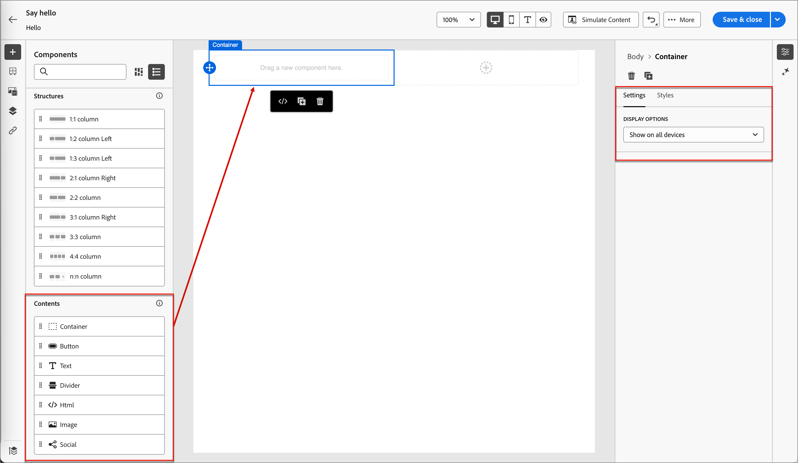

# Authoring dei contenuti - componenti (Prime)

1. Per iniziare la progettazione del contenuto, trascina un elemento dalle **[!UICONTROL Strutture]** e rilascialo nell&#39;area di lavoro.

   Aggiungi tutti gli elementi da _[!UICONTROL Strutture]_ necessari e modifica le impostazioni per ciascuno nel riquadro a destra.

   >[!TIP]
   >
   >Seleziona il componente _[!UICONTROL n:n column]_ per definire il numero di colonne desiderato (tra tre e 10). Puoi anche definire la larghezza di ciascuna colonna spostando le frecce sotto di essa.

   {width="800" zoomable="yes"}

   Le dimensioni di ogni colonna non possono essere inferiori al 10% della larghezza totale del componente struttura. È possibile rimuovere solo colonne vuote.

   Per ulteriori informazioni sull&#39;utilizzo e la formattazione di questi componenti, vedere _[Componenti struttura](../prime/content/structure-components.md)_.

1. Espandi la sezione **[!UICONTROL Contents]** e aggiungi tutti i componenti di contenuto necessari in uno o più componenti della struttura.

   {width="800" zoomable="yes"}

   * [Contenitore](../prime/content/content-components.md#container)
   * [Pulsante](../prime/content/content-components.md#button)
   * [Testo](../prime/content/content-components.md#text)
   * [Divisore](../prime/content/content-components.md#divider)
   * [Immagine](../prime/content/content-components.md#image)
   * [Social](../prime/content/content-components.md#social)
   * [Modulo](../prime/content/content-components.md#form) (solo pagine di destinazione)

1. Se necessario, puoi effettuare ulteriori personalizzazioni per ciascun componente nelle schede _[!UICONTROL Impostazioni]_ o _[!UICONTROL Stile]_.

   Ad esempio, puoi modificare lo stile del testo, la spaziatura interna o il margine di ciascun componente.

1. Per aggiungere contenuto condizionale e adattarlo ai profili target in base alle regole condizionali, selezionare un componente di contenuto e fare clic sull&#39;icona **[!UICONTROL Abilita contenuto condizionale]** nella barra degli strumenti del componente.

   Per ulteriori informazioni, vedere [_Contenuto condizionale_](../user/content/conditional-content.md).
