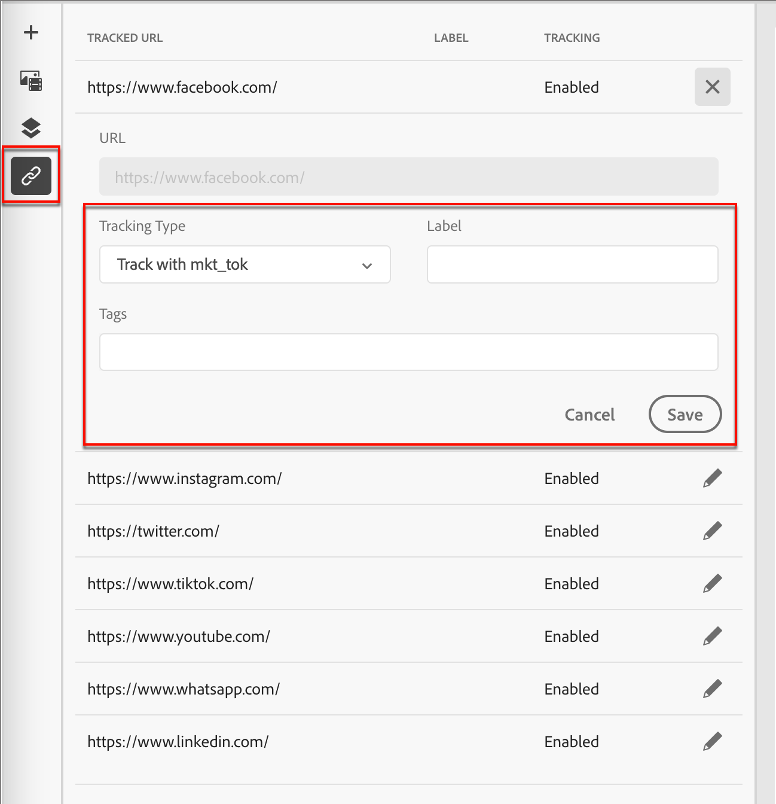

# Authoring dei contenuti - Tracciamento dei collegamenti

1. Fai clic sull&#39;icona _[!UICONTROL Collegamenti]_ a sinistra per visualizzare tutti gli URL del contenuto da tracciare.

1. Se necessario, fare clic sull&#39;icona _Modifica_ (matita) e modificare **[!UICONTROL Tipo di tracciamento]** o **[!UICONTROL Etichetta]**.

   Puoi anche aggiungere _Tag_ per un collegamento.

{width="500"}