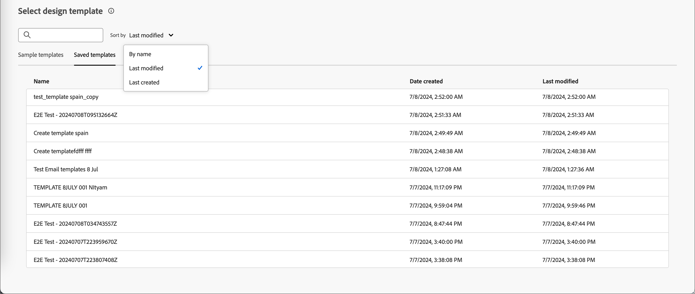

# Authoring dei contenuti - Seleziona modello e-mail

Puoi scegliere tra:

* **Modelli di esempio**. L’interfaccia di Journey Optimizer offre 20 modelli e-mail preconfigurati tra cui puoi scegliere.

* **Modelli salvati**. Utilizza un modello personalizzato salvato che hai creato da zero utilizzando il menu _[!UICONTROL Modelli]_ o salvato da un&#39;e-mail in un percorso utilizzando l&#39;opzione _[!UICONTROL Salva come modello di contenuto]_.

Utilizza la sezione _[!UICONTROL Seleziona modello struttura]_ per iniziare a creare il contenuto da un modello. Puoi utilizzare un modello di esempio o un modello e-mail personalizzato salvato dall’istanza Journey Optimizer B2B Edition.

>[!BEGINTABS]

>[!TAB Modelli salvati]

Nella home page di _Progettare il modello_, la scheda _Modelli di esempio_ è selezionata per impostazione predefinita. Per utilizzare un modello personalizzato, selezionare la scheda **[!UICONTROL Modelli salvati]**.

Viene visualizzato l’elenco di tutti i modelli e-mail creati nella sandbox corrente. Puoi ordinarli per _[!UICONTROL Nome]_, _[!UICONTROL Ultima modifica]_ e _[!UICONTROL Ultima creazione]_.

{width="800" zoomable="yes"}

Selezionare il modello desiderato dall&#39;elenco.

Dopo la selezione, viene visualizzata un&#39;anteprima del modello. In modalità anteprima puoi spostarti tra tutti i modelli di una categoria (campione o salvato, a seconda della selezione) utilizzando le frecce destra e sinistra.

{width="800" zoomable="yes"}

Quando la visualizzazione corrisponde a quella che si desidera utilizzare, fare clic su **[!UICONTROL Usa questo modello]** in alto a destra nella finestra di anteprima.

Questa azione copia il contenuto nel designer del contenuto visivo, dove puoi modificarlo in base alle esigenze.

>[!TAB Modelli di esempio]

Adobe Journey Optimizer B2B Edition offre una selezione di modelli e-mail _preconfigurati_, che possono essere utilizzati per la creazione di e-mail e modelli e-mail.

{width="800" zoomable="yes"}

>[!ENDTABS]