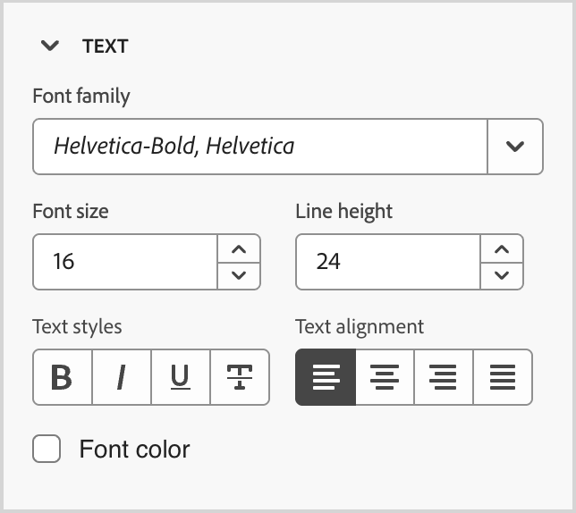

# Snippet

<!-- Content authoring steps for reuse -->

## Configurazione dati intento {#intent-data-note}

>[!NOTE]
>
>I dati intento vengono inclusi quando sono configurati per l’istanza Journey Optimizer B2B edition. È inoltre necessario creare uno o più percorsi di acquisto **o** pubblicati. Per ulteriori informazioni sul modello di rilevamento intento e su come inviare parole chiave, prodotti e categorie, vedere [Dati intento](../user/admin/intent-data.md).

## Nota sulla licenza di AEM Assets {#aem-assets-licensing-note}

>[!NOTE]
>
>Le licenze per AEM Assets as a Cloud Service e Dynamic Media sono prerequisiti per l’integrazione. Verificare che [Dynamic Media con API aperta](https://experienceleague.adobe.com/en/docs/experience-manager-cloud-service/content/assets/dynamicmedia/dynamic-media-open-apis/dynamic-media-open-apis-overview){target="_blank"} sia abilitato. L&#39;integrazione è limitata agli archivi dal _livello di consegna_. Se si utilizza il _livello di creazione_ e si desidera convertirlo, contattare il supporto tecnico Adobe Experience Manager. 
>>A seconda del contratto e della configurazione, è possibile accedere a Adobe Experience Manager Assets as a Cloud Service direttamente da Adobe Journey Optimizer B2B edition durante la progettazione di contenuti visivi.

## Passaggio Authoring dei contenuti - componenti - strutture {#structures-step}

1. Per iniziare la progettazione del contenuto, trascina un elemento dalle **[!UICONTROL Strutture]** e rilascialo nell&#39;area di lavoro.

   Aggiungi tutti gli elementi da _[!UICONTROL Strutture]_ necessari e modifica le impostazioni per ciascuno nel riquadro a destra.

   >[!TIP]
   >
   >Seleziona il componente _[!UICONTROL n:n column]_ per definire il numero di colonne desiderato (tra tre e 10). Puoi anche definire la larghezza di ciascuna colonna spostando le frecce sotto di essa.

   {width="800" zoomable="yes"}

   Le dimensioni di ogni colonna non possono essere inferiori al 10% della larghezza totale del componente struttura. È possibile rimuovere solo colonne vuote.

## Authoring dei contenuti - componenti - passaggio contenuti {#contents-step}

1. Espandi la sezione **[!UICONTROL Contents]** e aggiungi tutti gli elementi necessari in uno o più componenti della struttura.

   {width="800" zoomable="yes"}
   <!--
   reference to the contents elements--->

## Authoring dei contenuti - componenti - passaggio impostazioni {#settings-step}

1. Se necessario, puoi effettuare ulteriori personalizzazioni per ciascun componente nelle schede _[!UICONTROL Impostazioni]_ o _[!UICONTROL Stile]_.

   Ad esempio, puoi modificare lo stile del testo, la spaziatura interna o il margine di ciascun componente.

## Authoring dei contenuti - passaggio delle risorse {#assets-step}

1. Dal selettore _Risorsa_, puoi selezionare direttamente le risorse memorizzate nella libreria di risorse.

   Fai doppio clic sulla cartella che contiene le risorse. Trascina e rilascia gli elementi in un componente struttura.

   Per ulteriori informazioni sull&#39;utilizzo delle risorse del tipo di origine, vedere [Aggiungere risorse al contenuto](../user/content/assets-overview.md#use-assets-for-content-authoring).

   {width="800" zoomable="yes"}

## Authoring dei contenuti - passaggio di personalizzazione {#personalization-step}

1. Inserisci campi di personalizzazione per personalizzare il contenuto da attributi di profili, iscrizioni di pubblico, attributi contestuali e altro ancora.

## Authoring dei contenuti - passaggio di abilitazione del contenuto della condizione {#dynamic-content-step}

1. Fai clic su **[!UICONTROL Abilita contenuto condizione]** per aggiungere contenuto dinamico e adattare il contenuto ai profili target in base alle regole condizionali.

## Authoring dei contenuti - passaggio di tracciamento dei collegamenti {#links-tracking-step}

1. Seleziona la scheda **[!UICONTROL Collegamenti]** dal riquadro a sinistra per visualizzare tutti gli URL del contenuto tracciato.

   Puoi modificare il _Tipo di tracciamento_ o _Etichetta_ e aggiungere tag se necessario.

## Componenti contenuto - stili avanzati {#styles-advanced}

Per applicare attributi CSS aggiuntivi con valori, utilizza le impostazioni di stile **[!UICONTROL Avanzate]**. È possibile modificare i valori degli attributi esistenti o aggiungerne di nuovi. Lo stile viene applicato al componente utilizzando il modello di ereditarietà CSS per i componenti (elementi) padre-figlio.

Gli attributi visualizzati riflettono gli stili attualmente definiti per il componente. È possibile modificare i valori in base a [definizioni CSS](https://www.w3schools.com/CSSref/index.php){target="_blank"}. Fai clic sull&#39;icona _Aggiungi_ (**+**) per aggiungere un nuovo attributo di stile per il componente.

{width="250"}

## Componenti contenuto - Allineamento orizzontale degli stili {#styles-alignment-h}

Espandere la sezione **[!UICONTROL Alignment]** e scegliere l&#39;allineamento orizzontale che si desidera utilizzare: a sinistra, al centro o a destra. Questo stile si traduce in uno stile CSS `text-align` standard e influisce sul modo in cui il componente viene posizionato all&#39;interno del componente che lo contiene.

{width="250"}

## Componenti contenuto - Allineamento stili verticale {#styles-alignment-v}

Espandere la sezione **[!UICONTROL Alignment]** e scegliere l&#39;allineamento verticale da utilizzare: superiore, centrale o inferiore. Questo stile si traduce in uno stile CSS `vertical-align` standard e influisce sul posizionamento all&#39;interno del componente che lo contiene.

{width="250"}

## Componenti contenuto - Allineamento degli stili orizzontale e verticale {#styles-alignment-h-v}

Espandere la sezione **[!UICONTROL Alignment]** e scegliere l&#39;allineamento orizzontale e verticale che si desidera utilizzare. Gli stili di allineamento influiscono sul modo in cui il componente HTML viene posizionato all’interno del componente contenitore (strutturale o contenitore).

L&#39;allineamento orizzontale si traduce in uno stile CSS `text-align` standard ed è possibile scegliere tra sinistra, centro o destra. L&#39;allineamento verticale si traduce nello stile CSS standard `vertical-align` ed è possibile scegliere dall&#39;alto, dal centro o dal basso.

{width="300"}

## Componenti contenuto - stili di sfondo {#styles-background}

Con la scheda _[!UICONTROL Stili]_ selezionata nel pannello di destra, utilizza la sezione **[!UICONTROL Sfondo]** per definire il colore di sfondo per il componente.

Selezionare la casella di controllo e fare clic sul quadrato del colore per scegliere un colore dal selettore. È possibile scegliere un colore immettendo un valore RGB, HSL, HSB o esadecimale noto. In alternativa, è possibile utilizzare il cursore del colore e il campo del colore per selezionare il colore.

{width="300"}

## Componenti contenuto - stili bordo {#styles-border}

1. Nel pannello di destra con la scheda _[!UICONTROL Stili]_ selezionata, espandi la sezione **[!UICONTROL Bordo]** e imposta le opzioni per visualizzare un bordo per il componente:

1. Spostare l&#39;interruttore verso destra per attivare le opzioni di visualizzazione del bordo e impostarle in base ai criteri di progettazione:

   * Per impostare il **[!UICONTROL colore del bordo]**, selezionare la casella di controllo e fare clic sul quadrato del colore per scegliere un colore dal selettore. È possibile scegliere un colore immettendo un valore RGB, HSL, HSB o esadecimale noto. In alternativa, è possibile utilizzare il cursore del colore e il campo del colore per selezionare il colore.

   {width="300"}

   * Per impostare la **[!UICONTROL dimensione bordo]** (larghezza linea), fare clic sulle icone della freccia su e giù per aumentare o diminuire il numero di pixel.

   * Per impostare lo stile **[!UICONTROL Bordo]**, scegliere un valore dall&#39;elenco dei valori standard CSS `border-style`.

   * Per determinare la posizione di visualizzazione del bordo, selezionare ogni casella di controllo **[!UICONTROL Posizione bordo]**.

   {width="250"}

1. Per il **[!UICONTROL raggio bordo]**, impostare il valore numerico in base alla curva desiderata per gli angoli.

   Un valore pari a 0 (impostazione predefinita) produce un angolo al quadrato.

## Componenti contenuto - stili margine {#styles-margin}

Nel pannello di destra con la scheda _[!UICONTROL Stili]_ selezionata, espandi la sezione **[!UICONTROL Margine]** e imposta le opzioni per la spaziatura dei margini all&#39;interno del componente strutturale. Questo stile replica il parametro CSS `margin`, che controlla lo spazio all&#39;esterno del bordo di un componente, separandolo dagli altri componenti. Crea un gap intorno al componente per influenzarne il posizionamento e il layout del contenuto circostante.

Impostate i valori dei margini in pixel in base alle esigenze di progettazione. Puoi impostare il margine per tutti i lati, il bottone superiore, il lato sinistro-destro o ciascun lato del componente in modo indipendente:

* **Tutti i lati** - Per impostare un valore da applicare a tutti i lati, deselezionare la casella di controllo **[!UICONTROL Margine diverso per ogni lato]**. Fai clic sulle icone freccia su e giù per aumentare o diminuire il numero di pixel.

  {width="250"}

* **Inizio-Fine** - Per impostare i margini superiore e inferiore sullo stesso valore, impostare l&#39;icona _Bloccato_ tra le impostazioni superiore e inferiore. Fai clic sulle icone freccia su e giù per aumentare o diminuire il numero di pixel.

* **Sinistra-Destra** - Per impostare i margini sinistro e destro sullo stesso valore, impostare l&#39;icona _Bloccato_ tra le impostazioni sinistra e destra. Fai clic sulle icone freccia su e giù per aumentare o diminuire il numero di pixel.

  {width="250"}

* **Indipendente** - Per impostare ogni margine su un valore indipendente, impostare l&#39;icona _Sbloccato_ tra le impostazioni superiore e inferiore e tra sinistra e destra. Per ogni impostazione, fai clic sulle icone della freccia su e della freccia giù per aumentare o diminuire il numero di pixel.

  {width="250"}

## Componenti contenuto - stili di riempimento {#styles-padding}

Nel pannello di destra con la scheda _[!UICONTROL Stili]_ selezionata, espandi la sezione **[!UICONTROL Spaziatura interna]** e imposta le opzioni per la spaziatura interna nel componente strutturale. Questo stile replica il parametro CSS `padding`, che è lo spazio tra il contenuto di un componente e il relativo bordo. La spaziatura interna consente di controllare la distanza tra il contenuto e il bordo del componente.

Imposta i valori di spaziatura in pixel in base alle tue esigenze di progettazione. Puoi impostare la spaziatura per tutti i lati, il bottone superiore, il lato sinistro-destro o ciascun lato del componente in modo indipendente:

* **Tutti i lati** - Per impostare un valore da applicare a tutti i lati, deselezionare la casella di controllo **[!UICONTROL Spaziatura interna diversa per ogni lato]**. Fai clic sulle icone freccia su e giù per aumentare o diminuire il numero di pixel.

  {width="250"}

* **Inizio-Fine** - Per impostare la spaziatura superiore e inferiore sullo stesso valore, impostare l&#39;icona _Bloccato_ tra le impostazioni superiore e inferiore. Fai clic sulle icone freccia su e giù per aumentare o diminuire il numero di pixel.

* **Sinistra-Destra** - Per impostare la spaziatura sinistra e destra sullo stesso valore, impostare l&#39;icona _Bloccato_ tra le impostazioni sinistra e destra. Fai clic sulle icone freccia su e giù per aumentare o diminuire il numero di pixel.

  {width="250"}

* **Indipendente** - Per impostare la spaziatura per ogni lato su un valore indipendente, impostare l&#39;icona _Sbloccato_ tra le impostazioni superiore e inferiore e tra sinistra e destra. Per ogni impostazione, fai clic sulle icone della freccia su e della freccia giù per aumentare o diminuire il numero di pixel.

  {width="250"}

## Componenti contenuto - stili dimensione {#styles-size}

Nel pannello di destra con la scheda _[!UICONTROL Stili]_ selezionata, espandi la sezione **[!UICONTROL Dimensioni]** e imposta le opzioni per l&#39;altezza e la larghezza del componente:

* **[!UICONTROL Altezza]** - Fare clic sulle icone delle frecce su e giù per aumentare o diminuire il numero di pixel. Il valore predefinito è vuoto (Automatico) e ridimensiona l’altezza dell’elemento in base al suo contenuto.

* **[!UICONTROL Larghezza]** - Utilizza l&#39;interruttore per impostare la larghezza in pixel o in percentuale.

   * Per una larghezza percentuale, utilizzare il dispositivo di scorrimento per impostare il valore percentuale. La percentuale determina la dimensione dell’elemento in base alla casella del contenuto del blocco contenitore, che esclude la spaziatura interna e i bordi. Ad esempio, con un valore pari a 50 la larghezza dell’elemento viene impostata sul 50% della larghezza del contenuto del blocco che la contiene.

     {width="250"}

   * Per una larghezza basata su pixel, fai clic sulle icone freccia su e giù per aumentare o diminuire il numero di pixel. Il valore predefinito è un valore vuoto (Automatico) e la larghezza dell&#39;elemento viene ridimensionata in base al contenuto.

     {width="250"}

## Componenti contenuto - stili di testo {#styles-text}

Nel pannello di destra con la scheda _[!UICONTROL Stili]_ selezionata, espandi la sezione **[!UICONTROL Testo]** e imposta le opzioni per gli stili di testo del componente:

* **[!UICONTROL Famiglia di caratteri]** - Fare clic sull&#39;icona freccia giù per selezionare una famiglia di caratteri per il testo all&#39;interno del componente.

* **[!UICONTROL Dimensione carattere]** - Fare clic sulle icone delle frecce su e giù per aumentare o diminuire la dimensione del carattere oppure immettere un valore. Per i valori immessi, è possibile utilizzare i decimali.

* **[!UICONTROL Altezza riga]** - Fare clic sulle icone delle frecce su e giù per aumentare o diminuire l&#39;altezza della riga oppure immettere un valore. Per i valori immessi, è possibile utilizzare i decimali.

  {width="250"}

* **[!UICONTROL Stili testo]** - Selezionare l&#39;icona per lo stile di testo: _Grassetto_, _Corsivo_, _Sottolineato_ o _Barrato_.

* **[!UICONTROL Allineamento testo]** - Selezionare l&#39;icona per l&#39;allineamento orizzontale del testo: _Sinistra_, _Centrata_, _Destra_ o _Giustificata_.

* **[!UICONTROL Colore carattere]** - Fare clic sul quadrato del colore per scegliere un colore del carattere dal selettore. È possibile scegliere un colore immettendo un valore RGB, HSL, HSB o esadecimale noto. In alternativa, è possibile utilizzare il cursore del colore e il campo del colore per selezionare il colore.

  {width="300"}

## Contenuto - selezione immagine - Marketo DAM {#me-dam}

Scegli questo tipo per sfogliare e selezionare una risorsa immagine dalla libreria B2B edition di Journey Optimizer o dall’istanza connessa di Market Engage.

{width="700" zoomable="yes"}

Dalla finestra di dialogo, puoi scegliere un’immagine dall’archivio e dall’area di lavoro selezionati. Fai clic su **[!UICONTROL Seleziona]** per aggiungere la risorsa.

Sono disponibili alcuni strumenti per individuare la risorsa di cui hai bisogno:

* Fai clic sull&#39;icona _Filtro_ in alto a sinistra per filtrare gli elementi visualizzati in base ai criteri.

* Immetti il testo nel campo _Ricerca_ per filtrare gli elementi visualizzati in modo che corrispondano al nome della risorsa.

  {width="700" zoomable="yes"}

## Contenuto - Selezione immagine - AEM Assets {#aem-assets-dam}

Scegli questo tipo per sfogliare e selezionare una risorsa immagine da un [archivio Experience Manager Assets configurato](../user/admin/configure-aem-repositories.md).

Nella finestra di dialogo _[!UICONTROL Seleziona Assets]_, scegli un&#39;immagine utilizzando gli strumenti disponibili per individuare la risorsa necessaria e fai clic su **[!UICONTROL Seleziona]**.:

* Modifica l&#39;**[!UICONTROL Archivio]** in alto a destra.

* Fai clic su **[!UICONTROL Gestisci risorse]** in alto a destra per aprire l&#39;archivio Assets in un&#39;altra scheda del browser e utilizzare gli strumenti di gestione AEM Assets.

* Fai clic sul selettore _Tipo di visualizzazione_ in alto a destra per modificare la visualizzazione in **[!UICONTROL Vista a elenco]**, **[!UICONTROL Vista griglia]**, **[!UICONTROL Vista galleria]** o **[!UICONTROL Vista a cascata]**.

* Fai clic sull&#39;icona _Ordinamento_ per modificare l&#39;ordinamento tra crescente e decrescente.

  {width="700" zoomable="yes"}

* Fare clic sulla freccia del menu **[!UICONTROL Ordina per]** per modificare i criteri di ordinamento in **[!UICONTROL Nome]**, **[!UICONTROL Dimensione]** o **[!UICONTROL Modificato]**.

* Fai clic sull&#39;icona _Filtro_ in alto a sinistra per filtrare gli elementi visualizzati in base ai criteri.

* Immetti il testo nel campo _Ricerca_ per filtrare gli elementi visualizzati in modo che corrispondano al nome della risorsa.

  {width="700" zoomable="yes"}

## Contenuto - Caricamento immagine {#image-upload}

Scegli questo tipo per selezionare un file dal sistema e importarlo nella libreria di risorse di Journey Optimizer B2B edition.

Nella finestra di dialogo _[!UICONTROL Carica immagine]_, trascina un file dal sistema alla casella del file. La dimensione massima del file è 100 MB.

{width="450"}

I nomi dei file delle immagini selezionate vengono visualizzati nella finestra di dialogo. I nomi dei file di risorse devono essere univoci (per tutte le cartelle) e, se esiste già un file con questo nome, viene visualizzato un messaggio. I nomi possono contenere un massimo di 100 caratteri e non possono contenere caratteri speciali (ad esempio `;`, `:`, `\` e `|`).

Fai clic su **[!UICONTROL Importa]**.
