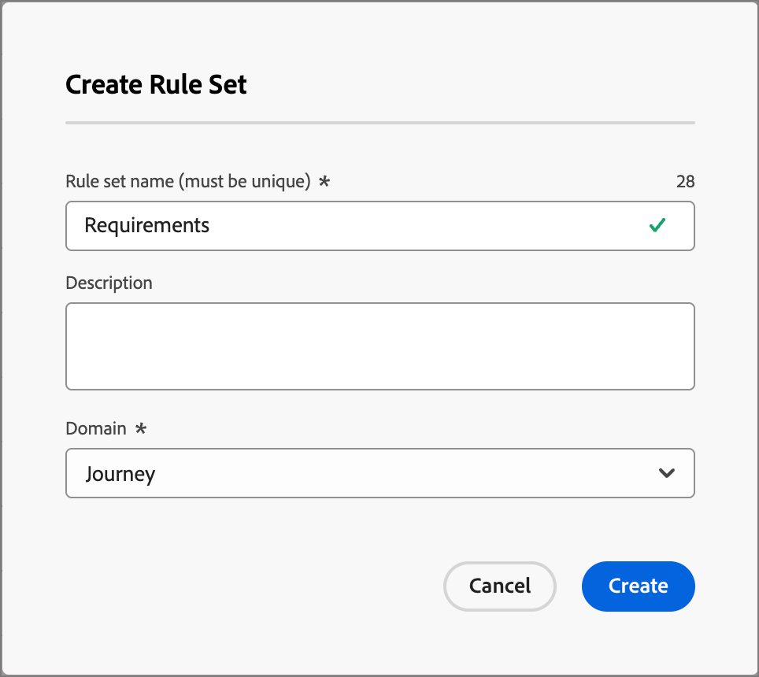
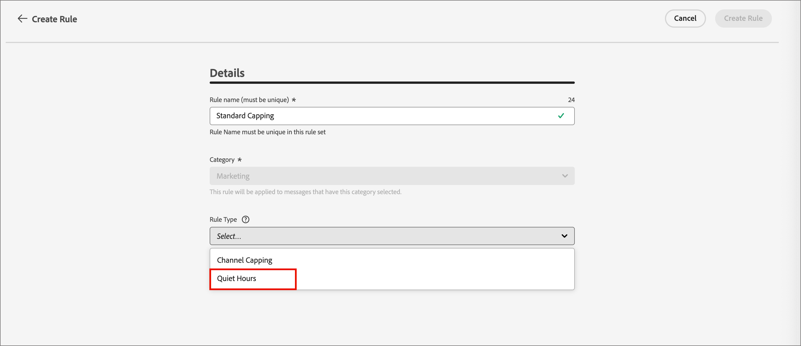

# Regole di business {#business-rules}

>[!CONTEXTUALHELP]
>id="ajo-b2b-prime_business_rules_rule_sets"
>title="Set di regole"
>abstract="Utilizza i set di regole per applicare le regole relative alla quota limite o alle ore di silenzio a diversi tipi di comunicazioni di marketing. Puoi anche creare set di regole per escludere percorsi a una parte del pubblico in base alle regole della quota limite."

Le regole aziendali consentono all’organizzazione di definire e raggruppare più regole in set di regole in modo che gli addetti al marketing possano applicarle alle e-mail in base alle esigenze. Ciò offre una maggiore granularità per limitare la frequenza e il numero di percorsi che un cliente può inserire entro un determinato intervallo di tempo o controllare la frequenza con cui gli utenti ricevono i messaggi a seconda del tipo di comunicazione.

Puoi creare due tipi di set di regole:

* I set di regole **Canale** applicano regole ai canali di comunicazione. Consentono di impostare:

   * **Regole per il limite di frequenza** - Esempio: *Non inviare più di una comunicazione e-mail, SMS, push, direct mail o WhatsApp al giorno.*
   * **Regole per le ore di pausa** - Esempio: *Non inviare messaggi e-mail al di fuori del timeslot delle 8.00 - 21.00.*

* I set di regole **Percorso** applicano a un percorso le regole dei limiti di concorrenza e di immissione. (Non ancora supportata per la versione Beta).

>[!PREREQUISITES]
>
>Per utilizzare le regole business, è necessario disporre delle seguenti autorizzazioni CX Enterprise:
>
>* **[!UICONTROL Visualizza regole di frequenza]**: consente di accedere e visualizzare le regole business.
>* **[!UICONTROL Gestisci regole di frequenza]**: crea, modifica o elimina regole business.

## Accedere e gestire i set di regole {#access-manage}

Per accedere a tutti i set di regole esistenti, espandi **[!UICONTROL Amministrazione]** nel menu di navigazione a sinistra e seleziona **[!UICONTROL Regole business]**.

{width="800" zoomable="yes"}

### Set di regole globali e personalizzati {#global-custom}

Quando si accede a _Set di regole_ per la prima volta, viene creato un set di regole predefinito attivo: **_[!UICONTROL SET DI REGOLE GLOBALE]_**. Si tratta di un set di regole globale che puoi applicare per controllare la frequenza con cui gli utenti ricevono messaggi su uno o più canali. Le regole definite in questo set di regole si applicano a tutti i canali selezionati.

{width="700" zoomable="yes"}

Oltre a questo set di regole predefinito, puoi creare set di regole personalizzati e applicarli a un nodo di percorso o di canale per utilizzare regole specifiche relative a limiti e ore non interattive.

### Aprire un set di regole {#open-rule-set}

Fai clic sul nome di un set di regole per visualizzarne e modificarne le definizioni. Sono elencate tutte le regole incluse in tale set di regole. Utilizza il _menu Altro_ ( **...** ) in alto a destra per attivarlo, disattivarlo o eliminarlo.

{width="700" zoomable="yes"}

### Modificare le regole {#edit-rules}

Per qualsiasi bozza di regola nel set di regole, fai clic sull&#39;icona _Modifica_ (  ) accanto al nome della regola per modificare le impostazioni della regola. Puoi anche fare clic sull&#39;icona _Altro menu_ ( **...** ) per attivare o eliminare la regola.

{width="500" zoomable="yes"}

Per disattivare una regola, fai clic sull&#39;icona _Disattiva_ (  ) accanto alla regola attiva. Nella finestra di dialogo di conferma, fai clic su **[!UICONTROL Disattiva]**. Lo stato cambia in **_[!UICONTROL Inattivo]_** e la regola non si applica alle esecuzioni future dei messaggi. Non influisce su alcun messaggio attualmente in esecuzione.

>[!NOTE]
>
>La disattivazione di una regola o di un set di regole non influisce né reimposta i conteggi sui singoli profili.

## Creare e attivare set di regole personalizzati {#create}

>[!CONTEXTUALHELP]
>id="ajo-b2b-prime_rule_set_domain"
>title="Dominio set di regole"
>abstract="Durante la creazione di un set di regole, è necessario specificare se le regole all’interno del set di regole applicheranno regole di limitazione specifiche per i canali di comunicazione o per i percorsi."

>[!CONTEXTUALHELP]
>id="ajo-b2b-prime_rule_sets_category"
>title="Seleziona la categoria della regola del messaggio"
>abstract="Quando vengono attivate e applicate a un messaggio, tutte le regole di frequenza che corrispondono alla categoria selezionata verranno applicate automaticamente a questo messaggio. Attualmente è disponibile solo la categoria Marketing."

>[!CONTEXTUALHELP]
>id="ajob2b-prime_rule_type"
>title="Tipo di regola"
>abstract="Seleziona il tipo di regola desiderato per il tuo set di regole di canale: utilizza il tipo **Quota limite** per applicare delle regole di limitazione ai canali di comunicazione. Ad esempio, non inviare più di una comunicazione e-mail o SMS al giorno. Seleziona **Ore di silenzio** per definire esclusioni basate sull’orario in modo che non vengano inviati messaggi durante specifici periodi di tempo."

>[!CONTEXTUALHELP]
>id="ajo-b2b-prime_rule_sets_duration"
>title="Reimposta la frequenza di limite"
>abstract="Selezionare il periodo di calendario utilizzato per reimpostare il contatore dei limiti: Orario, Giornaliero, Settimanale o Mensile. Il contatore viene reimpostato automaticamente su 0 all&#39;inizio di ogni nuovo periodo."

>[!CONTEXTUALHELP]
>id="ajo-b2b-prime_rule_set_rule_capping"
>title="Limitazione della regola"
>abstract="Imposta la limitazione della regola. A seconda del dominio del set di regole e della selezione nel campo Tipo di regola, questo campo può definire il numero massimo di messaggi che possono essere inviati a un profilo o il numero massimo di percorsi in cui il profilo può entrare o essere iscritto contemporaneamente."

>[!CONTEXTUALHELP]
>id="ajo-b2b-prime_journey_business_rules"
>title="Set di regole"
>abstract="Seleziona il set di regole da applicare all’azione personalizzata."

>[!NOTE]
>
>Puoi creare fino a 10 set di regole per il dominio del canale e 10 set di regole per il dominio del percorso, per un totale di 20 set di regole.

1. Espandere **[!UICONTROL Amministrazione]** nel menu di navigazione a sinistra e selezionare **[!UICONTROL Regole business]**.

1. Nella pagina dell&#39;elenco _[!UICONTROL Set di regole]_, fare clic su **[!UICONTROL Crea set di regole]** in alto a destra.

   {width="400"}

1. Immetti un **[!UICONTROL Nome]** univoco (obbligatorio) per il set di regole e aggiungi una **[!UICONTROL Descrizione]** (facoltativo).

1. Selezionare il set di regole **[!UICONTROL Dominio]**.

   * **[!UICONTROL Canale]** - Applica ai canali di comunicazione regole di limitazione o di sospensione delle ore.
   * **[!UICONTROL Percorso]** - Applica le regole di limite di immissione e concorrenza a un percorso.

   >[!IMPORTANT]
   >
   >Le regole di percorso non sono ancora supportate in questa versione di Beta.

1. Fai clic su **[!UICONTROL Salva]**.

   {width="700" zoomable="yes"}

### Aggiungi le regole {#add-rules}

Dopo aver creato il set di regole, aggiungi tutte le regole che desideri includere.

1. Fai clic su **[!UICONTROL Aggiungi regola]**.

1. Configura i parametri della regola in base al suo scopo.

   I parametri disponibili per la regola dipendono dal dominio del set di regole selezionato al momento della creazione.

   {width="700" zoomable="yes"}

   Informazioni dettagliate sulla configurazione delle regole di percorso e canale sono disponibili nelle sezioni seguenti:

   <!-- * [Journey capping](../conflict-prioritization/journey-capping.md) -->
   * [Quota limite per tipo di comunicazione e canale](#frequency-capping)
   * [Ore di silenzio](#quiet-hours)

1. Fai clic su **[!UICONTROL Crea regola]** per confermare la creazione della regola.

   La nuova regola è elencata nel set di regole con stato _Bozza_.

1. Ripeti i passaggi precedenti per aggiungere tutte le regole necessarie per il set di regole.

   Al momento della creazione, una regola ha lo stato _[!UICONTROL Bozza]_ e non può ancora influire su alcun messaggio.

   {width="700" zoomable="yes"}

1. Per attivare una regola per il set di regole, fai clic sull&#39;icona _Altro menu_ ( **...** ) accanto al nome della regola e scegli **[!UICONTROL Attiva]**.

   Nella finestra di dialogo di conferma, fai clic su **[!UICONTROL Attiva]**.

### Attiva il set di regole {#activate-rule-set}

L’attivazione del set di regole lo rende disponibile per l’applicazione a un messaggio di percorso o di canale. Quando un set di regole è attivo, non è possibile aggiungervi altre regole. Puoi disattivarla per apportare modifiche e poi riattivarla.

1. Apri il set di regole dalla pagina dell&#39;elenco _Set di regole_.

1. Fai clic sul _menu Altro_ ( **...** ) in alto a destra e scegli **[!UICONTROL Attiva set di regole]**.

   {width="700" zoomable="yes"}

1. Nella finestra di dialogo di conferma, fai clic su **[!UICONTROL Attiva]**.

   >[!NOTE]
   >
   >La completa attivazione di una regola o di un set di regole può richiedere fino a 10 minuti. Non è necessario modificare i messaggi o ripubblicare i percorsi per rendere effettiva una regola.

Puoi applicare il set di regole attivo a un messaggio o a un percorso, a seconda dell’impostazione del dominio per il set di regole.

## Limitazione della frequenza per canale {#frequency-capping}

Imposta i limiti di frequenza per canale e tipo di comunicazione per limitare il numero di messaggi ricevuti da un profilo ed evitare di sopraffare i clienti con comunicazioni simili. I set di regole del canale applicano regole di limitazione ai canali di comunicazione. Ad esempio, non inviare più di una comunicazione e-mail o SMS al giorno.

L’utilizzo dei set di regole di canale consente di impostare i limiti di frequenza per tipo di comunicazione per evitare di sovraccaricare i clienti con messaggi simili. Ad esempio, puoi creare un set di regole per limitare il numero di _comunicazioni promozionali_ inviate ai clienti e un altro set di regole per limitare il numero di _newsletter_ inviate. Puoi quindi scegliere di applicare la comunicazione promozionale o il set di regole per le newsletter.

>[!IMPORTANT]
>
>Per garantire il corretto funzionamento del limite del livello di canale, assicurati di scegliere lo spazio dei nomi con priorità più elevata durante la creazione di un percorso. Ulteriori informazioni sulla priorità dello spazio dei nomi sono disponibili nella [guida di Platform Identity Service](https://experienceleague.adobe.com/it/docs/experience-platform/identity/features/identity-graph-linking-rules/namespace-priority){target="_blank"}

### Creare una regola di limitazione del canale {#create-capping-rule}

>[!CONTEXTUALHELP]
>id="ajo-b2b-prime_rule_sets_channel"
>title="Definire i canali a cui si applica la regola"
>abstract="Seleziona almeno un canale. I limiti vengo applicati a tutti i canali come conteggio totale."

1. Seleziona il set di regole del canale in cui desideri aggiungere la regola di limite o creane uno nuovo.

1. Nella pagina del set di regole, fai clic su **[!UICONTROL Aggiungi regola]** e immetti un nome univoco per la regola.

   >[!NOTE]
   >
   > Il campo _[!UICONTROL Categoria]_ specifica la categoria di messaggistica per la regola. Attualmente, questo campo è di sola lettura ed è disponibile solo la categoria **[!UICONTROL Marketing]**.

1. Per _[!UICONTROL Tipo di regola]_, scegli **[!UICONTROL Limitazione canale]**.

   {width="700" zoomable="yes"}

1. Nel campo **[!UICONTROL Conteggio limite]**, imposta il valore di limite per la regola.

   Questo valore è il numero massimo di messaggi che possono essere inviati a un singolo profilo utente ogni mese, settimana, giorno o ora, in base alla selezione effettuata negli altri campi.

1. Per **[!UICONTROL Reimposta la frequenza di limite]**, selezionare se si desidera applicare il limite.

   La quota limite si basa sul periodo di calendario selezionato. Viene reimpostato all’inizio dell’arco temporale corrispondente. Scegliere la scadenza del contatore per ciascun periodo:

   * **[!UICONTROL Ora]** - Il limite di frequenza è valido per il numero di ore selezionato. Il contatore viene reimpostato automaticamente all&#39;inizio di ogni finestra temporale. Per un limite di frequenza di 1 ora, viene ripristinato ogni ora, in coincidenza con la fine di un’ora UTC.
   * **[!UICONTROL Giornaliero]** - Il limite di frequenza giornaliero è valido per il giorno fino alle 23:59:59 UTC e viene reimpostato su 0 all&#39;inizio del giorno successivo.
   * **[!UICONTROL Settimanale]** - Il limite di frequenza è valido fino a sabato 23:59:59 UTC di quella settimana. La data di scadenza si applica indipendentemente da quando è stata creata la regola. Ad esempio, se la regola viene creata il giovedì, è valida fino a sabato alle 23:59:59.
   * **[!UICONTROL Mensile]** - Il limite di frequenza è valido fino all&#39;ultimo giorno del mese alle 23:59:59 UTC. Ad esempio, la scadenza mensile di gennaio è il 31/01 alle 23:59:59 UTC.

   >[!IMPORTANT]
   >
   >* Per garantire precisione, assicurati di scegliere lo spazio dei nomi con priorità più elevata durante la creazione di un percorso. Ulteriori informazioni sulla priorità dello spazio dei nomi sono disponibili nella [guida di Platform Identity Service](https://experienceleague.adobe.com/it/docs/experience-platform/identity/features/identity-graph-linking-rules/namespace-priority){target="_blank"} 
   >
   >* Il valore del contatore del profilo viene aggiornato quando viene consegnata la comunicazione. Considera questo quando invii grandi volumi di comunicazioni, perché la velocità effettiva potrebbe comportare che il destinatario riceva l’e-mail pochi minuti o anche alcune ore dopo l’inizio della comunicazione (nel caso in cui invii milioni di comunicazioni simultaneamente). Ciò è importante nel caso in cui un destinatario riceva due comunicazioni in stretta collaborazione. È consigliabile distanziare le comunicazioni di almeno due ore, se possibile, per fornire al destinatario il tempo sufficiente per ricevere la comunicazione e aggiornare di conseguenza il valore del contatore.

1. Utilizza il campo **[!UICONTROL Ogni]** per impostare la frequenza per la regola di limitazione su più ore, giorni, settimane o mesi (a seconda dell&#39;intervallo di tempo specificato).

   Assicurati di immettere un valore che corrisponda al tipo di durata selezionato: 1-23 per _Ogni ora_, 1-30 per _Ogni giorno_, 1-4 per _Ogni settimana_ e 1-3 per _Ogni mese_.

   Il contatore viene reimpostato automaticamente su 0 quando inizia una nuova finestra temporale. Per un limite di frequenza di due giorni, questo ripristino si verifica ogni due giorni alla mezzanotte UTC.

1. Seleziona i canali da utilizzare per questa regola:

   * **[!UICONTROL E-mail]**
   * **[!UICONTROL SMS]** (attualmente non supportato per questa versione di Beta)
   * **[!UICONTROL Notifica push]** (non attualmente supportata per questa versione di Beta)
   * **[!UICONTROL Direct mail]** (attualmente non supportata per questa versione di Beta)
   * **[!UICONTROL WhatsApp]** (non attualmente supportato per questa versione di Beta)

   {width="700" zoomable="yes"}

   Seleziona più canali se desideri applicare il limite su tutti i canali selezionati come conteggio totale.

   Ad esempio, imposta il limite su 5 e seleziona i canali E-mail e SMS. Se un profilo ha già ricevuto tre e-mail di marketing e due messaggi SMS di marketing per il periodo selezionato, viene escluso dalla consegna successiva di eventuali messaggi e-mail di marketing o SMS.

1. Fai clic su **[!UICONTROL Salva]** per confermare la creazione della regola.

   La regola di frequenza viene aggiunta al set di regole con lo stato _[!UICONTROL Bozza]_.

1. Ripeti i passaggi precedenti per aggiungere al set di regole tutte le regole necessarie.

1. Quando la regola di limite è pronta per essere applicata ai messaggi, attiva la regola e il set di regole.

### Applicare il set di regole per la limitazione dei canali {#apply-capping-rule}

1. Durante la creazione di un percorso, aggiungi uno dei [nodi azione](../marketing/action-nodes.md) per un canale selezionato per la regola e modifica il contenuto del messaggio.

1. Nella scheda _[!UICONTROL Azioni]_, impostare l&#39;opzione **[!UICONTROL Regole aziendali]** sul set di regole con la regola di quota limite.

   {width="600" zoomable="yes"}

   >[!NOTE]
   >
   >Nell’elenco sono disponibili solo i set di regole attivati.

   <!--Messages where the category selected is **[!UICONTROL Transactional]** will not be evaluated against business rules.-->

1. Prima di attivare il percorso, assicurati di pianificarne l’esecuzione per almeno 10 minuti nel futuro.

   Fornisce il tempo necessario per compilare i valori dei contatori nel profilo per la regola business selezionata. Se attivi immediatamente il percorso, i valori dei contatori del set di regole non possono essere compilati sui profili dei destinatari e il messaggio non viene conteggiato per le regole del limite di frequenza per i set di regole personalizzati.

<!-- 
1. You can view the number of profiles excluded from delivery in the [Customer Journey Analytics report](../reports/report-gs-cja.md), and in the [Live report](../reports/live-report.md), where frequency rules will be listed as a possible reason for users excluded from delivery.

-->

>[!NOTE]
>
>Puoi applicare diverse regole allo stesso canale, ma una volta raggiunto il limite inferiore, il profilo verrà escluso dalle consegne successive.

Durante il test delle regole di frequenza, si consiglia di utilizzare un profilo di test appena creato, perché quando viene raggiunto il limite di frequenza di un profilo, non è possibile reimpostare il contatore fino al periodo successivo. La disattivazione di una regola consente ai profili con limiti di ricevere messaggi, ma non rimuove o elimina eventuali incrementi del contatore.

## Impostare le ore di silenzio {#quiet-hours}

**_Ore tranquille_** consente di definire esclusioni basate sul tempo per i canali e-mail, SMS, push e WhatsApp. Garantiscono che non vengano inviati messaggi in specifici periodi di tempo, aiutandoti a rispettare le preferenze dei clienti e i requisiti di conformità.

>[!NOTE]
>
>Nella versione corrente di Beta, nei percorsi sono supportati solo i canali e-mail e WhatsApp.

Puoi applicare le ore non interattive tramite set di regole e assegnarle a singole azioni del canale in percorsi per un controllo preciso. Semplificando questi standard è possibile migliorare la customer experience, risparmiare tempo e garantire la conformità con le regole di comunicazione:

* **Non svegliare il cliente** - *Il cliente giusto, il canale giusto, il momento giusto* è il mantra di molti addetti al marketing, quindi ha senso che la tempistica è una parte critica del percorso del cliente. Impostando una regola di orario non interattivo, i brand hanno un maggiore controllo su quando i contatti ricevono i messaggi, garantendo che li ricevano quando è più probabile che intervengano sul messaggio.
* **Comodità**: intercetta facilmente le comunicazioni tra campagne e percorsi quando devi impedire a un pubblico di ricevere un messaggio senza dover interrompere l&#39;intero percorso o la campagna.
* **Risparmio di tempo** - Gestisci le esclusioni in un&#39;unica posizione creando una **regola basata sul tempo**, invece di aggiungere più nodi condizione con espressioni personalizzate.\
  <!--* **Extra Safeguard** - Benefit from an extra safeguard in case audience criteria or time-window configurations were incorrectly set, ensuring individuals are still excluded when they should be.-->

>[!BEGINSHADEBOX]

**Guardrail e limitazioni**

* **Ritardo di propagazione** - Gli aggiornamenti a una regola relativa alle ore non interattive possono richiedere fino a 12 ore per essere applicati alle azioni del canale che utilizzano già tale regola.
* **Latenza per volumi elevati** - In caso di comunicazioni di volumi elevati, il sistema potrebbe impiegare più tempo per iniziare ad applicare correttamente la soppressione delle ore non interattive.

>[!ENDSHADEBOX]

<!--* **Custom actions** – For custom actions, only quiet hours rules are enforced. If a rule set also includes other rules (e.g., frequency capping), those rules are ignored.-->
<!--* **Pre-suppression window** – The system begins suppressing communications 30 minutes before quiet hours start, ensuring that no messages are delivered once the quiet period begins.-->

### Creare regole di orario non interattivo {#create-quiet-hour-rules}

>[!NOTE]
>
>Le ore non interattive possono essere definite solo in **_set di regole personalizzati_**. Il set di regole globale non supporta la configurazione delle ore non interattive.

1. Seleziona il set di regole del canale in cui desideri aggiungere la regola o creane uno nuovo.

1. Nella pagina del set di regole, fai clic su **[!UICONTROL Aggiungi regola]** e immetti un nome univoco per la regola.

   >[!NOTE]
   >
   > Il campo _[!UICONTROL Categoria]_ specifica la categoria di messaggistica per la regola. Attualmente, questo campo è di sola lettura ed è disponibile solo la categoria **[!UICONTROL Marketing]**.

1. Per il _[!UICONTROL tipo di regola]_ selezionare **[!UICONTROL Ore non interattive]**.

   {width="700" zoomable="yes"}

1. Nella sezione **[!UICONTROL Date e ore]**, definisci quando applicare le ore non interattive:

   * Per **[!UICONTROL Fuso orario]**, scegli un fuso orario standard per tutti i destinatari nel pubblico, indipendentemente dai loro singoli fusi orari.

     Per utilizzare il campo del fuso orario da ciascun profilo, selezionare **[!UICONTROL Usa fuso orario locale destinatari]**.

     >[!IMPORTANT]
     >
     >Se un profilo non ha un valore per il fuso orario, le ore non interattive non vengono applicate per quel profilo.

   * Fai clic sull&#39;icona _Calendario_ e specifica il periodo di tempo in cui applicare le ore non interattive.

      * **[!UICONTROL Settimanale]** - Scegli giorni specifici della settimana e una fascia oraria. Puoi anche applicare la regola **[!UICONTROL Tutto il giorno]**.

      * **[!UICONTROL Data personalizzata]** - Scegli date specifiche nel calendario e una sequenza temporale. Puoi anche applicare la regola **[!UICONTROL Tutto il giorno]**.

     {width="450"}

   * Fai clic sul pulsante **[!UICONTROL Aggiungi altre date]** per aggiungere fino a cinque periodi separati.

1. Nella sezione **[!UICONTROL Gestione delle azioni durante le ore non interattive]**, scegliere il modo in cui i messaggi vengono trattati durante il periodo di tempo selezionato:

   

   * **[!UICONTROL Messaggio coda]** - I messaggi vengono inviati al completamento del periodo di sospensione a meno che non si trovi nello stato In pausa.

     >[!NOTE]
     >
     >Se un messaggio rimane in coda per un profilo per più di 7 giorni, viene eliminato.

   * **[!UICONTROL Elimina messaggio]** - I messaggi non vengono mai inviati.

     >[!NOTE]
     >
     >Se si seleziona **[!UICONTROL Ignora]** e si applica questa regola a un&#39;azione del percorso, il profilo viene rimosso dalla consegna del messaggio e lasciato dal percorso.

1. Fai clic su **[!UICONTROL Salva]** per confermare la creazione della regola.

   La regola delle ore non interattive viene aggiunta al set di regole con lo stato _[!UICONTROL Bozza]_.

1. Ripeti i passaggi precedenti per aggiungere al set di regole tutte le regole necessarie.

1. Quando la regola è pronta per essere applicata ai messaggi, attiva la regola e il set di regole.

### Applicare ore non interattive a un&#39;azione del percorso {#apply-quiet-hours}

Dopo aver salvato la regola e aver attivato il set di regole, puoi applicarlo alle azioni del canale in percorsi.

1. Durante la creazione di un percorso, aggiungi uno dei [nodi azione](../marketing/action-nodes.md) per un canale selezionato per la regola e modifica il contenuto del messaggio.

1. Nella scheda _[!UICONTROL Azioni]_, impostare l&#39;opzione **[!UICONTROL Regole business]** sul set di regole con la regola relativa alle ore non interattive.

   {width="600" zoomable="yes"}

   >[!NOTE]
   >
   >Nell’elenco sono disponibili solo i set di regole attivati.

1. Completa e pubblica il percorso quando sei pronto.
