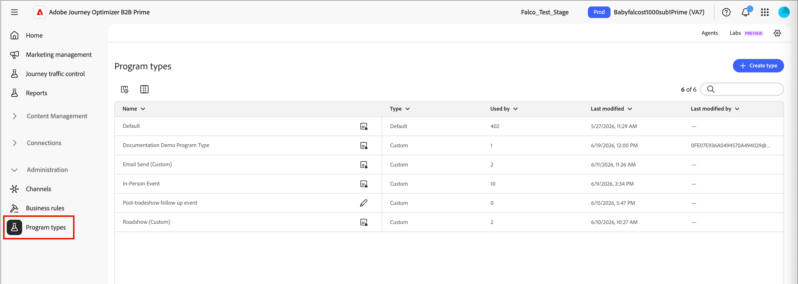

# Tipi di programmi

I tipi di programmi definiscono aspetti importanti dei [programmi](../marketing/programs.md) e dei relativi membri e distinguono tra diversi tipi di programmi di marketing. Ogni tipo di programma definisce le seguenti proprietà, che vengono ereditate per i programmi che utilizzano il tipo di programma:

* **Attributi** - Gli attributi descrivono gli aspetti importanti del tipo di programma, ad esempio le date degli eventi e gli attributi di posizione.

* **Flusso di stato del programma** - Ogni stato viene assegnato a un passaggio nel tipo di programma (ad esempio 1, 2 o 3). I membri di un programma possono passare solo da uno stato con lo stesso numero di passaggio (ad esempio, da _Non mostrato_ a _Partecipato_) o a uno stato con un numero di passaggio superiore (ad esempio, da _Invitato_ a _Registrato_).

  Gli stati del programma si escludono a vicenda e sono lineari, pertanto una persona può avere un solo valore di stato per programma. Durante la progettazione degli stati, pensa a quali stati desideri consentire il movimento tra. Ad esempio, se un utente non viene visualizzato per un webinar ma dispone di un&#39;opzione per partecipare in un secondo momento a un evento on demand, può avere lo stesso numero di stato o deve impostarlo su un numero di stato superiore in modo che un membro del programma possa avanzare.

>[!NOTE]
>
>Se un tipo di programma è utilizzato da almeno un programma, non può essere modificato.

_Per definire un tipo di programma personalizzato :_

1. Nella barra di navigazione a sinistra di [!DNL Adobe Journey Optimizer B2B Prime], espandi **[!UICONTROL Amministrazione]** e seleziona **[!UICONTROL Tipi di programma]**.

   {width="800" zoomable="yes"}

1. Fai clic su **[!UICONTROL Crea tipo]** in alto a destra.

1. Immetti un **[!UICONTROL Nome]** univoco (obbligatorio) e **[!UICONTROL Descrizione]** (facoltativo).

   {width="600" zoomable="yes"}

   >[!TIP]
   >
   >L’inclusione di una descrizione è una best practice e rende la libreria dei tipi di programma più gestibile.

1. Fare clic su **[!UICONTROL Crea tipo]**.

1. Aggiungi **[!UICONTROL Attributi]** per il tipo di programma.

   Per ogni attributo che si desidera aggiungere:

   * Fare clic su **[!UICONTROL Aggiungi attributo]**.
   * Scegli il **[!UICONTROL nome API]** e immetti il **[!UICONTROL nome visualizzato]**.
   * Fai clic su **[!UICONTROL Salva]**.

   {width="600" zoomable="yes"}

1. Definisci i passaggi per **[!UICONTROL Stati programma]**.

   Definisci ogni passaggio da includere nel flusso:

   * Fai clic su **[!UICONTROL Aggiungi passaggio]**.
   * Immettere un nome di stato.
   * (Facoltativo) Fai clic su **[!UICONTROL Aggiungi stato]** e immetti un nome di stato aggiuntivo da includere per il passaggio.

   Selezionare la casella di controllo **[!UICONTROL Contrassegna come completata]** per ogni passaggio che si desidera monitorare come esecuzione di un programma completata.

   {width="600" zoomable="yes"}

1. Fai clic su **[!UICONTROL Fine]** per salvare le modifiche e tornare all&#39;elenco dei tipi di programma.