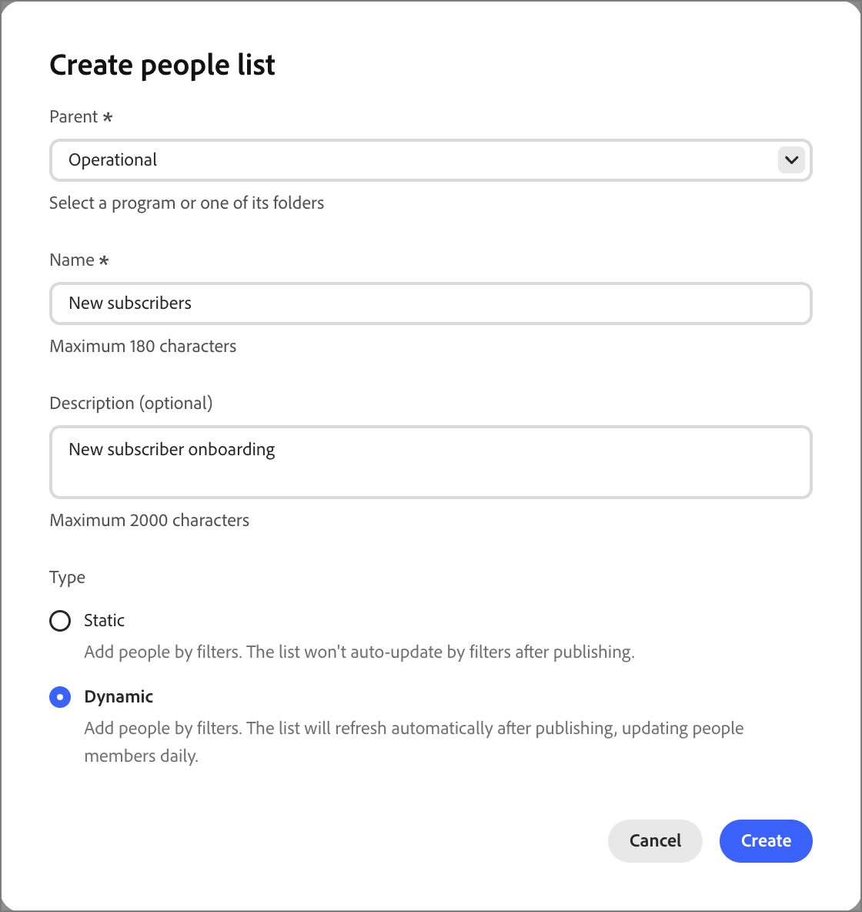

# Elenchi di persone

In [!DNL Adobe Journey Optimizer B2B Prime] gli elenchi persone sono i contenitori di pubblico a livello di persona per il targeting e la voce percorso di persone, con elenchi dinamici per la qualifica live basata su regole ed elenchi statici per l&#39;iscrizione fissa o gestita dal percorso.

## Accedere e sfogliare gli elenchi di persone {#access-and-browse}

1. Nella barra di navigazione a sinistra, espandere **[!UICONTROL Gestione marketing]**.

1. Sulla destra nell&#39;elenco delle risorse **[!UICONTROL Marketing]**, seleziona **[!UICONTROL Elenchi persone]**.

   {width="800" zoomable="yes"}

Nella pagina sono disponibili due schede per la visualizzazione e la gestione di **[!UICONTROL elenchi dinamici]** e **[!UICONTROL elenchi statici]**. Fai clic sulla scheda per passare dalla visualizzazione a elenco a un tipo e viceversa.

È possibile immettere testo nello strumento _Ricerca_ nella parte superiore dell&#39;elenco per filtrare l&#39;elenco visualizzato in base al nome. Utilizzare gli strumenti elenco per personalizzare l&#39;elenco visualizzato:

* Fai clic sull&#39;icona _Personalizza tabella_ (  ) per controllare le colonne visualizzate.
* Fai clic sull&#39;icona _Ripristina colonne_ (  ) per reimpostare la larghezza delle colonne.

Da questo spazio è inoltre possibile:

* Creare nuovi elenchi dinamici e statici
* Elenchi di accesso per rivedere l&#39;iscrizione corrente
* Applicare filtri di appartenenza

<!--
## Audience Hub

The AI Audience Hub is a centralized, AI-driven starting point for all audience-related capabilities across [!DNL Adobe Journey Optimizer B2B Prime]. It is designed to accelerate first-time user success while progressively unlocking advanced intelligence, insights, and control for returning and power users.

The Hub acts as:

* A guided starting point for discovering, creating, and refining person lists, account lists, and buying groups

* A visibility layer for audience health, coverage, overlap, engagement patterns, and AI-driven insights

* A control center for audience governance, optimization, reuse, and readiness for activation across journeys and sales workflows

### High level structure

Prompt-based starting point - Quick Start prompts and freeform input to help users discover, create, or optimize audiences.

1. AI insights feed - Surfaces key audience signals such as overlap, gaps, saturation risk, and optimization opportunities.

1. Adaptive audience library - A personalized view of people lists, account lists, and buying groups that adapts based on usage, relevance, and activation.

1. Optimization and arbitration nudges - Guides users to refine, split, or reuse audiences before activation.

1. Audience visibility and reporting - High-level insight into audience health, engagement patterns, and usage across active journeys.

### Empty and Error States (High-Level)

No audiences / no data - Show Quick Start prompts to help first-time users create or import person lists

Low data or incomplete audience - Explain what's missing (e.g., insufficient contacts, missing persona coverage, or low engagement data) and suggest next steps.

AI insights unavailable - Provide a graceful fallback with a clear explanation, so users understand why insights aren't shown and what actions they can take manually.
-->

## Creare un elenco di persone {#create-people-list}

1. Fai clic su **[!UICONTROL Crea elenco]** in alto a destra della pagina _[!UICONTROL Elenchi persone]_.

1. Nella finestra di dialogo, seleziona un programma come **[!UICONTROL Elemento padre]** per l&#39;elenco.

1. Immettere nell&#39;elenco **[!UICONTROL Nome]** e **[!UICONTROL Descrizione]** (facoltativo).

1. Scegli quindi elenca **[!UICONTROL Tipo]**:

   * **[!UICONTROL Statico]** - L&#39;appartenenza è determinata dai filtri qualificati valutati al momento della creazione dell&#39;elenco. L&#39;iscrizione all&#39;elenco non viene aggiornata a meno che non si qualifichino o non qualifichino manualmente i record.
***[!UICONTROL Dinamico]** - L&#39;appartenenza viene determinata dinamicamente dai filtri qualificati. L’iscrizione all’elenco si aggiorna automaticamente.

   {width="450"}

1. Fai clic su **[!UICONTROL Crea]**.

>[!NOTE]
>
>Eliminazione e duplicazione non sono attualmente supportate per gli elenchi di persone in questa versione di Beta.

## Elenchi statici {#static-list}

L’appartenenza a un elenco statico è definita da filtri semplici che fanno riferimento ad attributi e attività delle persone. L&#39;appartenenza non cambia a meno che non si qualifichino o non si qualifichino manualmente i membri.

>[!NOTE]
>
>Le definizioni dei filtri elenco statico vengono applicate una sola volta quando si aggiungono o rimuovono membri dall&#39;elenco. Il filtro definito non è disponibile in seguito. Se desideri mantenere una definizione del pubblico coerente utilizzando i filtri, utilizza invece un elenco dinamico.

<!--
What internet says about Marketo static lists -- which of these is also true in AJO B2B Prime?

* Manual Targeting: Storing fixed cohorts, such as attendees of a specific webinar, people who purchased a certain product, or a list of competitors.
* Third-Party Syncing: Allowing external platforms (like Amplitude or Twilio Segment) to automatically sync and export groups of users directly into Marketo as targeted audiences.
* Status Tracking: Helping marketers organize leads into specific categories or track multi-value interests without needing to create new, permanent database fields.List 
* Segmentation: Acting as a reliable, unchanging recipient or suppression list for email campaigns and engagement programs. Unlike a Smart List—which dynamically adds or removes people based on changing criteria or rules—a static list serves as a reliable snapshot. People remain on the list until explicitly added or removed by you or a backend flow.

So far, activating to a destination is the only thing that they are used for that I have found.
-->

### Aggiungi membri {#static-list-add-members}

1. Apri l&#39;elenco statico e fai clic su **[!UICONTROL Aggiungi persone]** in alto a destra.

1. Nella finestra di dialogo, definisci le regole per qualificare i lead trascinando i filtri da sinistra.

   Puoi filtrare le persone utilizzando qualsiasi combinazione di:

   * Cronologia delle attività
   * Attributi azienda
   * Attributi della persona
   * Filtri speciali, ad esempio appartenenza al percorso

1. Per salvare le modifiche, fai clic su **[!UICONTROL Fine]**.

1. Selezionare la scheda **[!UICONTROL Membri]**.

   Dopo un breve periodo di tempo, i membri qualificati vengono visualizzati nell&#39;elenco.

### Rimuovi membri {#static-list-remove-members}

1. Apri l&#39;elenco statico e fai clic su **[!UICONTROL Rimuovi persone]** in alto a destra.

1. Nella finestra di dialogo, aggiungi i filtri per far corrispondere i membri che desideri escludere.

1. Per salvare le modifiche, fai clic su **[!UICONTROL Fine]**.

1. Selezionare la scheda **[!UICONTROL Membri]**.

   Dopo un breve periodo di tempo, i membri squalificati lasciano la lista.

### Attiva in una destinazione {#static-list-activate}

Quando si attiva un elenco statico, questo può essere utilizzato nei sistemi a valle, con sincronizzazione continua invece che con esportazioni manuali. Questo è utile per il targeting, la soppressione dei contenuti multimediali a pagamento e l’orchestrazione a valle.

* L’elenco statico funge da contenitore per le persone.
* L&#39;attivazione invia/sincronizza tale appartenenza a una destinazione.
* La destinazione può quindi eseguire delle operazioni con tali persone, ad esempio eseguirne il targeting su LinkedIn o rimuoverle da un pubblico esterno.

Poiché il modello di attivazione è destinato a essere persistente, non un’esportazione una tantum:

* Le persone aggiunte successivamente all’elenco vengono propagate automaticamente.
* Le persone rimosse in seguito vengono disattivate automaticamente.
* Gli addetti al marketing evitano ripetute esportazioni CSV e caricamenti manuali.
* I percorsi possono aggiornare il pubblico nel tempo per un’orchestrazione continua.

1. Selezionare la scheda **[!UICONTROL Elenchi statici]**.

1. Individua l’elenco statico da attivare su una destinazione.

1. Fai clic sull&#39;icona _Attiva_ (  ) accanto al nome dell&#39;elenco statico.

1. Selezionare la casella di controllo per la connessione di destinazione configurata.

   {width="600" zoomable="yes"}

1. Fai clic su **[!UICONTROL Salva]**.

## Elenchi dinamici {#dynamic-lists}

L’appartenenza a un elenco dinamico viene definita utilizzando filtri semplici che fanno riferimento agli attributi e alle attività delle persone. L’iscrizione viene mantenuta automaticamente qualificando e squalificando i lead in base alla logica del filtro.

### Imposta regole di appartenenza

1. Apri l&#39;elenco dinamico e seleziona la scheda **[!UICONTROL Regole]**.

1. Fai clic su **[!UICONTROL Modifica regole]**.

1. Nella finestra di dialogo, definisci le regole per qualificare i lead trascinando i filtri da sinistra.

   È possibile qualificare i lead per l&#39;elenco utilizzando qualsiasi combinazione di:

   * Cronologia delle attività
   * Attributi azienda
   * Attributi della persona
   * Filtri speciali, ad esempio appartenenza al percorso

1. Per salvare le modifiche, fai clic su **[!UICONTROL Fine]**.

1. Selezionare la scheda **[!UICONTROL Membri]**.

   Dopo un breve periodo di tempo, i membri qualificati vengono visualizzati nell&#39;elenco.

Per aprire la pagina [dettagli persona](./person-details.md) in cui è possibile visualizzare le attività di riepilogo e recenti, fare clic sul nome di una persona nell&#39;elenco.

### Duplicare un elenco dinamico

Per un elenco dinamico, un&#39;azione duplicata è simile a una funzione clone. Utilizzare questa funzione per replicare il filtro delle appartenenze e aggiungerlo a un altro programma.

1. Nella scheda _[!UICONTROL Elenchi dinamici]_, fai clic sull&#39;icona _Duplica_ ( **...** ) accanto all&#39;elenco da duplicare.

1. Nella finestra di dialogo, seleziona il programma **[!UICONTROL Principale]** per il percorso duplicato.

1. Immetti un **[!UICONTROL Nome]** univoco (obbligatorio) e **[!UICONTROL Descrizione]** (facoltativo).

   Per impostazione predefinita, nella finestra di dialogo viene utilizzato il nome dell&#39;elenco di origine aggiunto con `_copy`. Immetti un nome univoco diverso per l’elenco, in base alle esigenze.

   {width="375"}

1. Fai clic su **[!UICONTROL Duplica]**.
