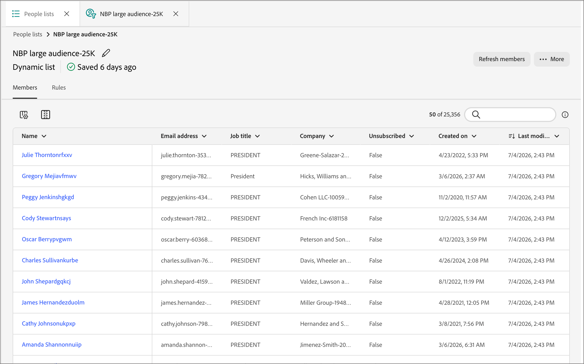

# Dettagli delle persone

In [!DNL Adobe Journey Optimizer B2B Prime], quando si fa clic sul nome di una persona nella scheda _[!UICONTROL Membri]_ di un [elenco persone](./people-lists.md), viene aperta la pagina dei dettagli della persona con una visualizzazione consolidata dell&#39;individuo. Questa pagina fornisce:

* Un riepilogo di tipo utente, coinvolgimento e intento generato dall’intelligenza artificiale
* Una cronologia completa delle attività
* Attributi del profilo e dell’azienda
* Ambito dell’interfaccia di chat dell’Assistente AI per rispondere a domande sulla persona

## Apri dettagli persona {#open-person-details}

1. Nella barra di navigazione a sinistra, espandere **[!UICONTROL Gestione marketing]**.

1. Sulla destra nell&#39;elenco delle risorse **[!UICONTROL Marketing]**, seleziona **[!UICONTROL Elenchi persone]**.

1. Aprire un elenco dinamico o statico.

1. Fai clic sul **[!UICONTROL Nome]** di una persona nell&#39;elenco.

   {width="600" zoomable="yes"}

La pagina dei dettagli della persona viene aperta con tre schede: **[!UICONTROL Panoramica]**, **[!UICONTROL Attributi]** e **[!UICONTROL Società]**.

## Intestazione pagina {#page-header}

L’intestazione mostra il nome della persona come titolo della pagina, insieme a uno strisciante:

* Titolo del processo
* Azienda
* Indirizzo e-mail
* Numero di telefono

Fai clic su **[!UICONTROL Indietro]** per tornare all&#39;elenco di origine.

## Scheda Panoramica {#overview-tab}

La scheda **[!UICONTROL Panoramica]** contiene le schede di riepilogo dei lead e la sequenza temporale dell&#39;attività.

{width="700" zoomable="yes"}

### Riepilogo lead {#lead-summary}

Tre carte forniscono una valutazione generata dall’intelligenza artificiale della persona:

| Scheda | Sommario |
|---|---|
| **[!UICONTROL Persona]** | L&#39;[persona derivata](./personas.md) per la persona, più una breve narrazione che descrive il suo ruolo, azienda e settore. Fai clic sull’icona delle informazioni per maggiori dettagli. |
| **[!UICONTROL Coinvolgimento]** | Punteggio di coinvolgimento della [persona](./engagement-scores.md), tendenza (ad esempio _crescente_) e livello (_basso_, _Medium_, _alto_). |
| **[!UICONTROL Intento]** | Rilevato intento di acquisto, oppure _Nessuno rilevato_, con indicazioni contestuali e un collegamento per aumentare l&#39;intento del prodotto. |

### Attività {#activities}

Sotto il riepilogo del lead, il pannello **[!UICONTROL Attività]** elenca la cronologia completa delle interazioni della persona, raggruppata per data. Ogni gruppo di date è espandibile e comprimibile e ogni riga mostra un timestamp, un tag di tipo attività (ad esempio, _[!UICONTROL Modifica valore dati]_, _[!UICONTROL Aggiungi all&#39;elenco]_, _[!UICONTROL Aggiungi persona al Percorso]_ o _[!UICONTROL Transizione nodo Percorso]_) e una descrizione in linguaggio semplice dell&#39;evento. Se applicabile, la descrizione include un collegamento, ad esempio **[!UICONTROL Visualizza elenco]** o **[!UICONTROL Visualizza percorso]**, per passare all&#39;oggetto correlato.

Utilizza i controlli del pannello per lavorare con la timeline:

* **Tipo di attività** - Filtra la timeline in base a un tipo di attività specifico, ad esempio invii di e-mail, interazioni con webinar o modifiche a elenchi e percorsi.
* **Intervallo date** - Vincola la sequenza temporale a un intervallo di date specifico utilizzando il controllo calendario.
* **[!UICONTROL Esporta]** - Esporta i dati dell&#39;attività visibili.
* **[!UICONTROL Comprimi tutto] / [!UICONTROL Espandi tutto]** - Attiva o disattiva tutti i raggruppamenti di date contemporaneamente.

## Scheda Attributi {#attributes-tab}

{width="700" zoomable="yes"}

Nella scheda **[!UICONTROL Attributi]** i campi del profilo memorizzati della persona vengono visualizzati come un elenco di etichette/valori:

* Nome
* Secondo nome
* Cognome
* E-mail
* Titolo
* Telefono
* Indirizzo
* Città
* Stato
* Paese
* Azienda
* Creato
* Ultimo aggiornamento

## Scheda Azienda {#company-tab}

{width="700" zoomable="yes"}

Nella scheda **[!UICONTROL Società]** sono visualizzati i dati firmografici associati alla società della persona:

* Azienda
* Settore
* Ricavi annuali
* Via di fatturazione
* Città di fatturazione
* Stato fatturazione
* Codice postale di fatturazione
* Paese di fatturazione

I campi senza dati disponibili vengono visualizzati come trattini.

## Chiedi all’assistente di intelligenza artificiale informazioni su una persona {#ask-ai-assistant}

Apri l&#39;icona del pannello **[!UICONTROL Assistente AI]** nella parte superiore della pagina per ottenere assistenza sul record della persona corrente. Il pannello si apre con ambito a quella persona, un chip sotto il thread dei messaggi (ad esempio, _persona: [Nome persona]_) conferma quale record viene registrato come destinazione delle richieste.

{width="700" zoomable="yes"}

### Inizia da un prompt suggerito {#suggested-prompts}

Quando apri il pannello da una pagina dei dettagli di una persona, l’Assistente AI ti accoglie con un messaggio di benvenuto contestuale e con i prompt suggeriti predefiniti, ad esempio:

* _Informazioni su [Nome persona]_
* _Informazioni sulla persona di [Nome persona]_
* _Riepiloga l&#39;attività di coinvolgimento di [Nome persona]_

Fai clic su un prompt suggerito o digita la tua domanda nella casella di input nella parte inferiore del pannello.

### Rivedi la risposta {#review-response}

Quando si seleziona un prompt, viene eseguita una [abilità](../agents/skills.md) in più passaggi, mostrata come passaggi di stato sequenziali (ad esempio, _Cerca persona per ID_ e _Ottieni storia persona_) mentre l&#39;Assistente AI compone la risposta. La risposta è un riepilogo strutturato che può includere dettagli del profilo, cronologia del coinvolgimento e prestazioni dell’e-mail per la persona.

Utilizza il controllo thumbs-up/thumbs-down per valutare la risposta. Come per tutto l’output dell’Assistente IA, controlla la risposta prima di utilizzarla. Per ulteriori informazioni, consulta le [Linee guida per l&#39;utente di Adobe Generative AI](https://www.adobe.com/legal/licenses-terms/adobe-dx-gen-ai-user-guidelines.html){target="_blank"}.
