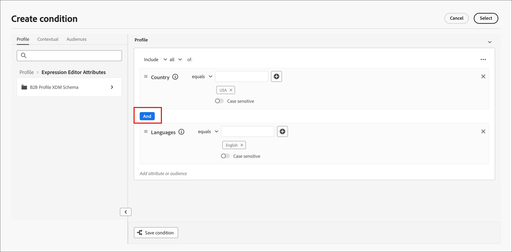

# Contenuto condizionale

Il contenuto condizionale consente di adattare il contenuto delle e-mail e dei frammenti in base alle regole condizionali. Queste regole vengono definite utilizzando gli attributi di profilo o gli eventi contestuali. Puoi creare regole condizionali nel generatore di regole e memorizzarle per riutilizzarle nei tuoi percorsi di persone.

Per aggiungere contenuto condizionale ai frammenti e ai messaggi di posta elettronica, [!DNL Journey Optimizer B2B Prime] consente di applicare le regole condizionali memorizzate nella libreria _Conditions_. Applica le regole condizionali nello spazio di progettazione visivo durante l&#39;authoring di [contenuto e-mail](./email-authoring.md) o di un [frammento](./fragment-authoring.md).

## Aggiungere contenuto condizionale {#add-conditional-content}

>[!CONTEXTUALHELP]
>id="ajo-b2b-prime_conditional_content"
>title="Contenuto condizionale"
>abstract="Utilizza le regole condizionali per creare più varianti di un componente di contenuto. Se non viene soddisfatta alcuna condizione durante l’invio del messaggio, verrà visualizzato il contenuto della variante predefinita."

>[!CONTEXTUALHELP]
>id="ajo-b2b-prime_conditional_rule_select"
>title="Contenuto condizionale"
>abstract="Utilizza una regola condizionale salvata nella libreria o creane una nuova."

Quando crei un [frammento](./fragment-authoring.md) o una [e-mail](./email-authoring.md) nello spazio di progettazione visiva, utilizza le regole condizionali per definire più varianti per un componente di contenuto.

1. Seleziona un componente di contenuto e fai clic sull&#39;icona **[!UICONTROL Abilita contenuto condizionale]** nella barra degli strumenti del componente.

   Vedere [Barre degli strumenti del componente contenuto](./content-components.md#content-component-toolbars).

   Il componente è evidenziato in arancione per indicare che è attivato come componente condizionale. Il riquadro **[!UICONTROL Contenuto condizionale]** viene visualizzato a sinistra con _Variante predefinita_ e _Variante - 1_.

   {width="700" zoomable="yes"}

   Il contenuto originale selezionato e attivato è quello predefinito e si applica quando nessuna delle regole condizionali è soddisfatta per nessuna delle varianti definite.

   Da questo riquadro è possibile definire più varianti per il componente di contenuto selezionato utilizzando le regole condizionali.

1. Passa il puntatore del mouse sulla prima variante (_Variante - 1_) e fai clic sull&#39;icona _Seleziona condizione_ (  ).

   {width="700" zoomable="yes"}

   Viene visualizzata la finestra di dialogo _[!UICONTROL Seleziona condizione]_ in cui è visualizzata la libreria delle condizioni.

   Se si desidera visualizzare i dettagli di una condizione per assicurarsi che sia ciò che si desidera, fare clic sull&#39;icona _Altro menu_ (**...**) e scegliere **[!UICONTROL Visualizza informazioni]**.

   {width="600" zoomable="yes"}

   Se la condizione necessaria non esiste, [creare una regola condizionale](#create-conditional-rule) facendo clic su **[!UICONTROL Crea nuovo]**.

1. Seleziona la regola condizionale e fai clic su **[!UICONTROL Seleziona]** per associarla alla variante.

<!-- 

   You can review the associated condition by clicking the _More menu_ icon (**...**) for the variant and choosing **[!UICONTROL View condition]**.

   {width="600" zoomable="yes"}

   Click X at the top right to close the popup.

   {width="500"}

   -->

1. Per una migliore leggibilità, rinominare la variante facendo clic sull&#39;icona _Altro menu_ (**...**) per la variante e scegliendo **[!UICONTROL Rinomina]**.

   Immetti un nome significativo per la variante che ti aiuti a identificare la variante e il relativo intento.

   {width="600" zoomable="yes"}

1. Con la variante selezionata nel riquadro a sinistra, modifica il componente in modo da modificarne la modalità di visualizzazione nel messaggio quando la condizione è true.

   In questo esempio, la variante del componente testo utilizza una descrizione diversa in base all’area geografica del destinatario.

   {width="600" zoomable="yes"}

1. Se necessario, definire un&#39;altra variante facendo clic su **[!UICONTROL Aggiungi variante]**.

   Ripeti i passaggi da 2 a 5 per selezionare una condizione, rinominare la variante e modificare il componente per la variante.

   Puoi aggiungere tutte le varianti necessarie per il componente contenuto. Modifica la variante selezionata nel riquadro a sinistra in qualsiasi momento per verificare come il componente contenuto viene visualizzato per la condizione.

   >[!IMPORTANT]
   >
   >Il contenuto condizionale viene valutato in base alle regole associate nell’ordine in cui sono elencate le varianti. La prima variante con una condizione che restituisce true viene utilizzata per il componente.
   >
   >Se nessuna delle condizioni della variante definita restituisce true durante l&#39;invio del messaggio, il componente contenuto viene visualizzato in base alla **[!UICONTROL variante predefinita]**.

1. Per eliminare una variante, fare clic sull&#39;icona _Altro menu_ (**...**) per la variante e scegliere **[!UICONTROL Elimina]**.

   Fai clic su **[!UICONTROL Elimina]** nella finestra di dialogo di conferma.

## Regole condizionali {#conditional-rules}

Le regole condizionali sono un insieme di espressioni condizionali che possono essere valutate come true o false. Utilizza queste regole per determinare quale variante di contenuto visualizzare in un messaggio in base a vari filtri, ad esempio attributi di profilo o eventi contestuali.

Le regole vengono memorizzate nella libreria delle condizioni, dove possono essere riutilizzate nelle e-mail e nei contenuti dei frammenti per la tua organizzazione.

<!--
M1.5 info -- out of date?

### Condition filters {#condition-filters}

| Condition type | Filters | Description |
| -------------- | ------- | ----------- |
| **Account** | Account Attributes | Attributes from the account profile, including: <li>Annual revenue</li><li>City</li><li>Country</li><li>Employee size</li><li>Industry</li><li>Name</li><li>SIC code</li><li>State</li> |
| | [!UICONTROL Special filters] > [!UICONTROL Has Buying Group] | The account does or does not have members of buying groups. The filter can also be evaluated against one or more of the following criteria: <li>Solution Interest</li><li>Buying Group status</li><li>Completeness Score</li><li>Engagement Score</li> |
| **Person** | [!UICONTROL Activity history] > [!UICONTROL Email] | Email activities associated with the journey: <li>[!UICONTROL Clicked link in email]</li><li>Opened Email</li><li>Was delivered email</li><li>Was sent email</li> These conditions are evaluated using a selected email message from earlier in the journey. |
| | [!UICONTROL Person Attributes] | Attributes from the person profile, including: <li>City</li><li>Country</li><li>Date of birth</li><li>Email address</li><li>Email invalid</li><li>Email suspended</li><li>First name</li><li>Inferred state region</li><li>Job title</li><li>Last name</li><li>Mobile phone number</li><li>Phone number</li><li>Postal code</li><li>State</li><li>Unsubscribed</li><li>Unsubscribed reason</li> |
| | [!UICONTROL Special filters] > [!UICONTROL Member of Buying Group] | The person is or is not a buying group member evaluated against one or more of the following criteria: <li>Solution Interest</li><li>Buying Group status</li><li>Completeness Score</li><li>Engagement Score</li><li>Is Removed</li><li>Role</li> |
-->

### Creare una regola condizionale {#create-conditional-rule}

>[!CONTEXTUALHELP]
>id="ajo-b2b-prime_conditions_rule_editor"
>title="Creare una condizione"
>abstract="Combina attributi ed eventi contestuali per creare regole che determinano la variante di contenuto da visualizzare nei messaggi e-mail."

Accedi al generatore di regole condizionali dallo spazio di progettazione quando selezioni una condizione per una variante di componente.

1. Nella finestra di dialogo _[!UICONTROL Seleziona condizione]_, fai clic su **[!UICONTROL Crea nuova]**.

   {width="700" zoomable="yes"}

   Questa azione apre la finestra di dialogo _[!UICONTROL Crea condizione]_. Utilizza gli strumenti della finestra di dialogo per combinare gli attributi nell’area di lavoro (in modo simile all’esperienza di creazione dei segmenti in Experience Platform). Gli attributi del filtro sono organizzati in tre schede:

   * **[!UICONTROL Profilo]** - Lo schema XDM del profilo B2B elenca tutti gli attributi di profilo associati allo schema Experience Data Model (XDM) definito in Adobe Experience Platform.

   * **[!UICONTROL Contestuale]** - Quando il messaggio viene utilizzato in un percorso, i campi del percorso contestuale sono disponibili tramite questa scheda.

   * **[!UICONTROL Tipi di pubblico]** - Elenca tutti i tipi di pubblico generati dalle definizioni dei segmenti create nel servizio di segmentazione di Adobe Experience Platform.

   {width="700" zoomable="yes"}

1. Crea la regola condizionale in base alle tue esigenze.

   Per ogni filtro che desideri includere nella regola, trascina e rilascia l’elemento nell’area di lavoro della regola. Espandi il filtro e completa l’espressione.

   {width="700" zoomable="yes"}

   Trascina e rilascia altri filtri, in base alle esigenze.

   Se includi più di un filtro, puoi attivare/disattivare l’impostazione della logica di filtro in base alla modalità di applicazione dei filtri:

   * **[!UICONTROL And]** - La regola valuta come true se **tutti** i filtri sono true.
   * **[!UICONTROL Or]** - La regola valuta come true se **any** dei filtri è true.

   {width="700" zoomable="yes"}

1. Fai clic su **[!UICONTROL Seleziona]** per utilizzare la regola personalizzata per la condizione.

   Se desideri rendere la regola disponibile per il riutilizzo, puoi aggiungerla alla libreria.

### Aggiungere una condizione alla libreria {#add-to-library}

1. Nella finestra di dialogo Crea condizione, fai clic su **[!UICONTROL Salva condizione]** in basso.

1. A destra immettere **[!UICONTROL Nome]** (obbligatorio) e **[!UICONTROL Descrizione]** (facoltativo) per la regola.

   Utilizza un nome significativo e una descrizione utile per consentire ad altri nella tua organizzazione di riutilizzarlo invece di creare una condizione duplicata.

   {width="700" zoomable="yes"}

1. Fai clic su **[!UICONTROL Aggiungi]**.

   La regola condizionale viene salvata nella libreria e puoi selezionarla per la variante corrente. È incluso anche nella libreria per l’utilizzo da parte di qualsiasi altra variante di contenuto dinamico tra percorsi di persone.

>[!NOTE]
>
>Non puoi modificare una regola condizionale salvata nella libreria. Tuttavia, puoi utilizzare una regola salvata per creare una nuova regola. A questo scopo, apri la regola condizionale, apporta le modifiche desiderate e quindi salvala nella libreria con un nuovo nome.

<!--

### Duplicate a rule {#duplicate-rule}

Conditional rules saved to the library cannot be modified. However, you can duplicate an existing rule and change it to create a new rule.

1. Click the _More menu_ icon (**...**) for the variant and choose **[!UICONTROL Duplicate]**.

   A duplicate of the rule opens in the rule builder. Use the duplicate as a starting point for the rule that you want to build.

   {width="600" zoomable="yes"}

1. In the rule builder, change, add, or delete conditions according to what you need.

1. Change the name and description to match the purpose or items in the rule.

1. When your conditional rule is complete, click **[!UICONTROL Save]**.
-->
