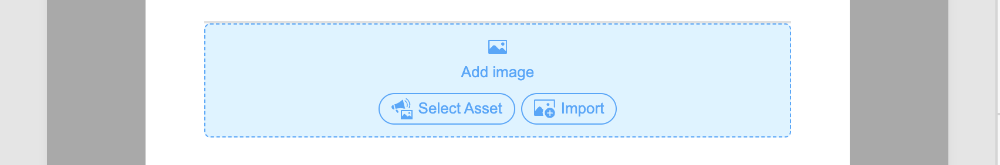

# Risorse

In [!DNL Adobe Journey Optimizer B2B Prime], le risorse sono in genere le immagini utilizzate durante la progettazione del contenuto per supportare i percorsi. Puoi utilizzare queste immagini nei tuoi [messaggi e-mail](email-authoring.md), [modelli e-mail](templates.md) e [frammenti visivi](email-authoring.md#visual-fragments) dal selettore risorse o da una semplice interfaccia a trascinamento all&#39;interno dello spazio di progettazione visiva.

Formati di file supportati: JPG, JPEG, GIF, PNG, EPS, SVG e RGB

>[!NOTE]
>
>In questa versione di Beta, puoi scegliere immagini e risorse da una copia unica della libreria di risorse Marketo Engage direttamente nell’area di lavoro delle e-mail. La modifica delle risorse in Marketo Engage dopo la copia iniziale è **not** riflessa in [!DNL Journey Optimizer B2B Prime].
>
>È possibile caricare risorse immagine aggiuntive dalla libreria _[!UICONTROL Assets]_ o dallo spazio di progettazione dei contenuti. Queste risorse caricate sono disponibili per l&#39;utilizzo solo nell&#39;istanza [!DNL Journey Optimizer B2B Prime].
>
>L’importazione di risorse da sistemi esterni e l’accesso a una libreria di risorse precompilata non sono ancora disponibili. Le versioni future dovrebbero includere l’importazione delle risorse dai sistemi esistenti, il supporto delle cartelle e funzionalità estese di gestione delle risorse.

<!-- You can [edit these assets using Adobe Express](./image-edit-adobe-express.md), and move them into folders to organize them for use across your emails, templates, and fragments. -->

La libreria **Assets** fornisce l&#39;accesso all&#39;archivio centralizzato per l&#39;archiviazione e la gestione delle immagini e di altre risorse creative. Include funzionalità basate sull’intelligenza artificiale che generano automaticamente metadati e consentono la ricerca in linguaggio naturale.

Nel menu di navigazione a sinistra, espandi **[!UICONTROL Gestione contenuto]** e seleziona **[!UICONTROL Assets]**.

{width="800" zoomable="yes"}

>[!BEGINSHADEBOX]

La prima volta che accedi alla libreria _[!UICONTROL Assets]_, rivedi le [_[!UICONTROL Condizioni d&#39;uso generative per l&#39;intelligenza artificiale ]_](https://www.adobe.com/it/legal/licenses-terms/adobe-gen-ai-user-guidelines.html) e conferma il tuo contratto.

{width="500"}

>[!ENDSHADEBOX]

La libreria supporta due opzioni di layout:

* **[!UICONTROL Elenco]** — Fai clic sull&#39;icona _Vista a elenco_ (  ) per visualizzare le risorse in una tabella ordinabile con colonne di metadati.
* **[!UICONTROL Galleria]** — Fai clic sull&#39;icona _Visualizzazione Raccolta_ (  ) per visualizzare le risorse come griglia di miniature visiva.

## Cercare risorse {#find-assets}

Utilizza il campo _[!UICONTROL Cerca]_ per trovare le risorse descrivendo cosa ti serve in linguaggio naturale. I risultati della ricerca si basano su metadati generati dall’intelligenza artificiale, pertanto non sei limitato alla ricerca per nome file.

**Esempi:**

* `team members`
* `nature`
* `exercise`

{width="700" zoomable="yes"}

## Visualizza dettagli risorsa {#view-details}

Seleziona una risorsa nella vista a elenco o a galleria per aprirne la vista dei dettagli a destra, che mostra una descrizione generata dall’intelligenza artificiale, tag, parole chiave e campi di metadati aggiuntivi. Queste informazioni vengono generate automaticamente al caricamento della risorsa. Seleziona la scheda **[!UICONTROL Metadati IA]** per rivedere la descrizione, i tag e i metadati generati.

{width="700" zoomable="yes"}

## Caricare una risorsa {#upload}

1. Fai clic su **[!UICONTROL Carica]** in alto a destra.

1. Nella finestra di dialogo, trascina e rilascia un file dal sistema locale.

   {width="450"}

   In alternativa, è possibile fare clic su **[!UICONTROL Seleziona file dal computer]** per utilizzare il file system locale per individuare e selezionare il file.

1. Fare clic su **[!UICONTROL Carica file]** per confermare e caricare il file nel repository.

Al termine del caricamento, il sistema genera automaticamente una descrizione, assegna tag e parole chiave ed estrae attributi visivi come l’oggetto e l’impostazione. Non è richiesta alcuna assegnazione tag manuale. La nuova immagine viene visualizzata con lo stato _[!UICONTROL ELABORAZIONE]_ fino al completamento del processo.

{width="700" zoomable="yes"}

## Utilizzare le risorse per l’authoring dei contenuti {#assets-authoring}

Utilizza le risorse durante l’authoring di e-mail, modelli di e-mail e frammenti visivi. L&#39;editor del contenuto visivo fornisce l&#39;accesso alle immagini nella libreria _Assets_. Puoi anche caricare una risorsa di immagine, che la inserisce nell’archivio delle risorse interno.

Puoi scegliere la risorsa immagine quando modifichi le impostazioni per un componente immagine o direttamente sull’area di lavoro:

* **_Componente vuoto_** - Quando si aggiunge un componente immagine all&#39;area di lavoro, questo è vuoto e consente di scegliere o importare facilmente un file di immagine.

  {width="500"}

* **_Barra degli strumenti del componente immagine_** - Se nell&#39;area di lavoro è selezionato un componente immagine, la barra degli strumenti consente di scegliere facilmente un&#39;origine e selezionare il file immagine.

  {width="500"}

* **_Impostazioni del componente immagine_** - Se nell&#39;area di lavoro è selezionato un componente immagine, è possibile visualizzare e modificare le impostazioni nel pannello di destra. Per aggiungere o modificare il file immagine visualizzato nel componente, scegli il tipo di origine e seleziona un file di immagine.

  {width="350"}

Fai clic su **[!UICONTROL Seleziona risorsa]** per aprire il selettore risorse, in cui puoi scegliere un&#39;immagine dall&#39;archivio risorse [!DNL Journey Optimizer B2B Prime].

{width="700" zoomable="yes"}

Puoi utilizzare la ricerca e i filtri per individuare la risorsa immagine desiderata. Seleziona la risorsa e fai clic su **[!UICONTROL Seleziona]** per utilizzarla per il componente immagine.

Puoi anche scegliere una risorsa immagine nelle impostazioni dello sfondo di un componente struttura.
