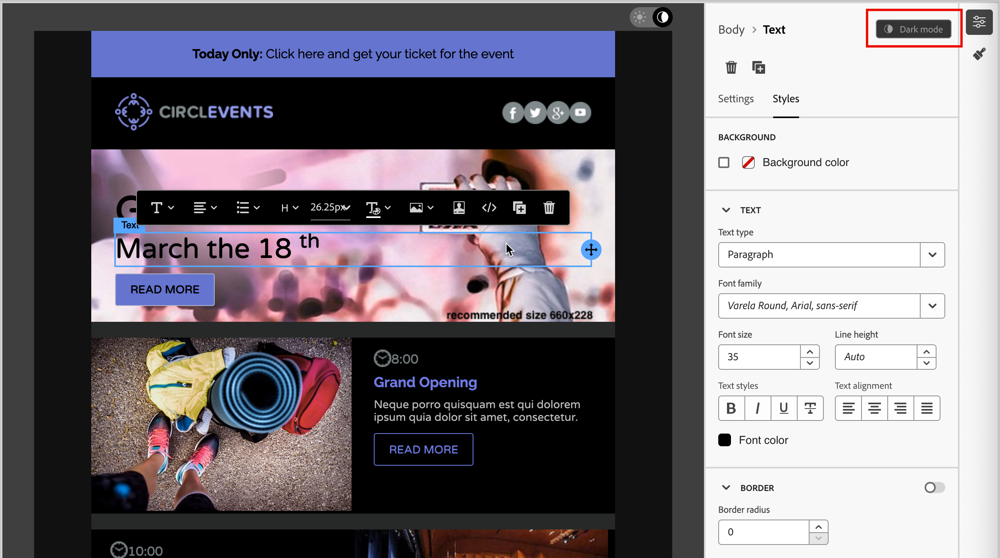

# Modalità scura per il contenuto delle e-mail {#dark-mode}

>[!CONTEXTUALHELP]
>id="ajo-b2b_dark_mode"
>title="Passare alla modalità scura"
>abstract="Passa alla modalità scura per visualizzare in anteprima il rendering e definire le impostazioni personalizzate.  Il rendering dipende dal client e-mail del destinatario. Non tutti i client e-mail supportano la modalità scura personalizzata."

>[!CONTEXTUALHELP]
>id="ajo-b2b_dark_mode_preview"
>title="Passare alla modalità scura"
>abstract="Passa alla modalità scura per visualizzare in anteprima il rendering nei client e-mail che la supportano.  Il rendering finale dipende dal client e-mail del destinatario. Tieni presente che non tutti i client e-mail supportano la modalità scura."

_Modalità scura_ consente a un client e-mail o a un&#39;app di supporto di visualizzare e-mail con sfondi più scuri e colori più chiari per testo, pulsanti e altri elementi visivi. Questo tipo di display può ridurre l&#39;affaticamento degli occhi, ridurre la durata della batteria e migliorare la leggibilità in ambienti scarsamente illuminati, per un&#39;esperienza di visualizzazione più confortevole. In quanto tendenza in crescita tra i principali sistemi operativi e app, ora è un elemento importante nella progettazione di e-mail moderne per garantire che il contenuto rimanga leggibile e visivamente attraente per tutti gli utenti.

Quando [crei il contenuto delle e-mail](./email-authoring.md) nello spazio di progettazione visiva [!DNL Journey Optimizer B2B Prime], puoi passare alla visualizzazione _**[!UICONTROL modalità scura]**_. In questa visualizzazione, puoi anche definire impostazioni personalizzate specifiche per il supporto dei client e-mail quando è abilitata la modalità scura.

## Considerazioni sul client e-mail {#email-client-considerations}

Esiste una varianza significativa nel modo in cui i diversi client e-mail e le diverse app applicano la modalità scura. Per questo motivo, considera con cautela le aspettative relative al rendering in modalità scura. Prima di utilizzare la modalità scura nell’area di progettazione delle e-mail, considera i seguenti casi di utilizzo del client e-mail:

+++Client che non supportano la modalità scura

Alcuni client di posta elettronica non supportano affatto questa funzione, ad esempio:

* [!DNL Yahoo! Mail]
* [!DNL AOL]

Se definisci le impostazioni personalizzate della modalità scura nella progettazione delle e-mail, questi client e-mail non possono visualizzare alcun rendering in modalità scura.

+++

+++Client che applicano la propria modalità scura

Alcuni client di posta elettronica applicano sistematicamente la propria modalità scura predefinita a tutte le e-mail ricevute. Regolano automaticamente colori, sfondi, immagini e altri elementi in base alle impostazioni della modalità scura e non sono possibili impostazioni esterne. Questi clienti includono:

* Gmail (Posta sul desktop, iOS, Android™, Posta sul Web mobile)
* Windows di Outlook
* Outlook Windows Mail

In questo caso, le impostazioni della modalità scura client sovrascriveranno le impostazioni della modalità scura personalizzata definite in [!DNL Journey Optimizer B2B Prime].

+++

+++Client che supportano la modalità scura personalizzata

Molti dei client e-mail più popolari supportano il rendering in modalità scura personalizzata con la query `@media (prefers-color-scheme: dark)`, che è il metodo utilizzato dagli stili e-mail [!DNL Journey Optimizer B2B Prime]. Questo elenco di client include:

* Apple Mail macOS
* Apple Mail iOS
* Outlook macOS
* Outlook.com
* IOS di Outlook
* Android di Outlook™

In questo caso, viene eseguito il rendering delle impostazioni specifiche definite in [!DNL Journey Optimizer B2B Prime]. Tuttavia, possono essere applicate alcune restrizioni in base a ciascun client e-mail. Ad esempio, alcuni client (come Apple Mail 16 (macOS 13)) non generano la modalità scura se le immagini sono presenti nel contenuto dell’e-mail.

Per risultati ottimali, verifica il contenuto con i client e-mail di destinazione.

+++

## Design per modalità scura

Lo spazio di progettazione visiva [!DNL Journey Optimizer B2B Prime] fornisce due tipi di strumenti per la formattazione del contenuto delle e-mail in modalità scura:

* Utilizza la funzione [anteprima](#preview-dark-mode) per rivedere il rendering predefinito in modalità scura per la maggior parte dei client e-mail che supportano.

* Se desideri ignorare le impostazioni predefinite di supporto dei client e-mail, definisci e applica [impostazioni personalizzate in modalità scura](#custom-dark-mode) al contenuto delle e-mail.

### Anteprima modalità scura predefinita {#preview-dark-mode}

1. Apri il contenuto dell’e-mail nello spazio di progettazione e-mail.

   In alto a destra nell’area di lavoro, è presente un selettore luce-buio che attiva la visualizzazione del contenuto tra la modalità chiara (predefinita) e scura.

   {width="700" zoomable="yes"}

1. Cambia il selettore in _modalità scura_ (  ).

   L’area di lavoro visualizza il contenuto utilizzando l’anteprima predefinita in modalità scura.

   Per impostazione predefinita, l&#39;anteprima in modalità scura applica la combinazione di colori `full color invert` a tutti gli elementi ad eccezione di immagini e icone. Questa combinazione di colori rileva le aree con elementi chiari e scuri e le inverte. Gli sfondi chiari diventano scuri e il testo scuro diventa chiaro, gli sfondi scuri diventano chiari e il testo chiaro diventa scuro.

   {width="700" zoomable="yes"}

>[!CAUTION]
>
>Il rendering finale può variare a seconda del client e-mail del destinatario. Per visualizzare una simulazione che si avvicina il più possibile al risultato finale per ogni client e-mail, utilizza l&#39;integrazione di rendering e-mail Litmus disponibile tramite **[!UICONTROL Simula contenuto]** nell&#39;area di progettazione e-mail.

### Definire le impostazioni personalizzate della modalità scura {#custom-dark-mode}

>[!CONTEXTUALHELP]
>id="ajo-b2b_dark_mode_image"
>title="Utilizzare un’immagine specifica per la modalità scura"
>abstract="Seleziona un’altra immagine per la modalità scura.  L’aggiunta di un’immagine specifica non garantisce il rendering corretto in tutti i client e-mail. Non tutti i client e-mail supportano la modalità scura personalizzata."

Dopo il passaggio alla modalità scura, puoi modificare elementi di stile specifici del contenuto che vengono visualizzati solo quando la modalità scura è abilitata nel client e-mail del destinatario (purché supporti tale funzione).

>[!NOTE]
>
>Il rendering finale in modalità scura dipende da ciascun client e-mail, pertanto i risultati possono variare da un client all’altro. Rivedi le [considerazioni sul client e-mail](#email-client-considerations) per ulteriori informazioni.

Lo stile modalità scura personalizzato utilizza la query CSS `@media (prefers-color-scheme: dark)` per rilevare se il client di posta elettronica è impostato sulla modalità scura e applicare la progettazione a tema scuro definita.

_Per definire le impostazioni personalizzate della modalità scura :_

1. Se necessario, sposta il selettore in _modalità scura_ (  ) in alto a destra nell&#39;area di progettazione.

1. Modificare gli attributi dei colori di stile, ad esempio testo, sfondi o pulsanti.

{width="700" zoomable="yes"}

1. Per immagini e icone, definisci risorse specifiche solo per la modalità scura.

   Non è possibile modificare i colori delle immagini e delle icone, ma è possibile definire risorse alternative da utilizzare per la modalità scura. È possibile sperimentare diverse combinazioni di colori per le icone o apportare regolazioni per il colore e la saturazione delle immagini fotografiche.

   {width="80%"}

   Seleziona un&#39;immagine e passa alla **[!UICONTROL modalità scura]** utilizzando l&#39;interruttore dedicato nel riquadro **[!UICONTROL Impostazioni]**. Quindi, seleziona una risorsa immagine diversa dal selettore risorse di Marketo Design Studio.

   Per ulteriori informazioni sulla selezione di una risorsa immagine, vedere [Inserire un&#39;immagine da Marketo Design Studio](./email-authoring.md#insert-image).

1. In qualsiasi momento durante le modifiche alla progettazione, seleziona **[!UICONTROL Passa alla visualizzazione attiva]** per verificare come il contenuto potrebbe essere riprodotto su dispositivi di varie dimensioni.

   Da questa visualizzazione, modifica il selettore in _modalità scura_ (  ) per visualizzare in anteprima la versione in modalità scura del contenuto su diversi dispositivi.

   {width="800" zoomable="yes"}

   >[!CAUTION]
   >
   >La visualizzazione live è un’anteprima generica progettata per confrontare l’aspetto del rendering tra le varie dimensioni dei dispositivi. Il rendering finale può variare a seconda del client e-mail del destinatario.

1. Al termine delle modifiche alla modalità scura, fai clic su **[!UICONTROL Simula contenuto]** per utilizzare gli strumenti di anteprima e verifica per testare la progettazione delle e-mail.

1. Se disponi di un account Litmus Enterprise, seleziona **[!UICONTROL Rendering e-mail]** per visualizzare il rendering finale in modalità scura per vari client e-mail nell&#39;integrazione Litmus.

   >[!CAUTION]
   >
   >Anche se la simulazione si avvicina molto al modo in cui le e-mail vengono visualizzate in modalità scura, il rendering effettivo potrebbe variare a causa delle variazioni nei provider di servizi e-mail o nelle impostazioni a livello di dispositivo.

## Best practice {#best-practices}

Poiché l&#39;adozione della modalità scura aumenta tra i principali client e-mail, è essenziale considerare il rendering delle e-mail in ambienti chiari e scuri, indipendentemente dal fatto che si utilizzi la [modalità scura personalizzata](#custom-dark-mode) o meno.

La modalità scura può alterare i colori, gli sfondi e le immagini, a volte ignorando le scelte di progettazione. Per garantire coerenza visiva, accessibilità e integrità del brand, segui queste best practice:

| Esercitazione |            |
| -------- | ---------- |
| Ottimizzazione di immagini e loghi | Elenco di controllo:<ul><li>Salvare logo e icone come file PNG con sfondi trasparenti per evitare la presenza di caselle bianche visibili in modalità scura. <li>Evitare le immagini con sfondi bianchi o chiari codificati. <li>Se la trasparenza non è un&#39;opzione, posizionate le immagini su uno sfondo a tinta unita nel progetto per evitare scomode inversioni di colore. |
| Guarda i tuoi sfondi | Elenco di controllo:<ul><li>Assicurati un contrasto sufficiente tra il testo e i colori di sfondo per garantire leggibilità sia nelle modalità chiara che in quelle scure. <li>Evita di utilizzare solo i colori di sfondo per i contenuti critici. Alcuni client ignorano i colori di sfondo in modalità scura, quindi assicurati che le informazioni chiave siano ancora visibili. |
| Progettare contenuti accessibili in modalità scura | Elenco di controllo:<ul><li>Utilizza combinazioni di colori facili da distinguere per le persone con daltonismo. <li>Utilizza una palette di mezzitoni per garantire il contrasto sia contro gli sfondi chiari che scuri. <li>Utilizza combinazioni di colori accessibili con contrasto elevato per migliorare la leggibilità e soddisfare gli standard [!DNL Web Content Accessibility Guidelines (WCAG)]. Utilizza strumenti come [!DNL WebAIM Contrast Checker] per verificare il contrasto dei colori. <li>Evita i font sottili in quanto possono influire sulla leggibilità. Se il tuo marchio richiede un font sottile, grassetto in modalità scura. <li>Salta il bianco puro sul nero puro, che può causare affaticamento degli occhi e potrebbe essere invertito automaticamente in alcuni client e-mail. <li>Se la modalità scura non è supportata, fornisci uno stile di fallback accessibile. |
| Verifica le e-mail in un ambiente in modalità scura | Elenco di controllo:<ul><li>Utilizza l&#39;[anteprima in modalità scura](#preview-dark-mode) nello spazio di progettazione delle e-mail, che utilizza combinazioni di colori invertite per individuare i problemi in anticipo. <li>Se disponi di un account Litmus Enterprise, utilizza l&#39;opzione **[!UICONTROL Rendering e-mail]** per simulare le progettazioni tra i principali client e-mail (come Apple Mail, Gmail e Outlook) e vedere come si comportano i colori e le immagini in modalità scura. |

