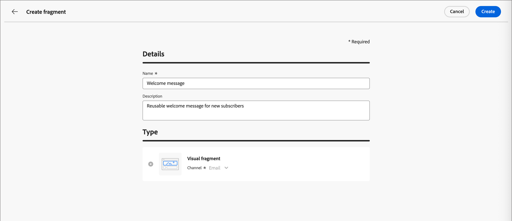

# Frammenti

Un frammento è un componente riutilizzabile a cui è possibile fare riferimento in uno o più e-mail e modelli di e-mail in [!DNL Journey Optimizer B2B Prime]. In genere si tratta di un blocco di contenuto (testo, immagine o entrambi) che può essere precreato e inserito rapidamente in un modello e-mail o e-mail. Con questa funzionalità, puoi precreare più blocchi di contenuto personalizzati da utilizzare da parte dei membri del team di marketing per assemblare contenuti e-mail e migliorare il processo di progettazione. I casi d’uso comuni includono blocchi di contenuto di intestazione/piè di pagina per e-mail, banner di invito per eventi e saluti stagionali.

>[!BEGINSHADEBOX]

**Frammenti visivi**

I frammenti visivi sono blocchi visivi predefiniti creati utilizzando gli strumenti di progettazione visiva che puoi riutilizzare in più e-mail o modelli e-mail. L&#39;ambito corrente di [!DNL Journey Optimizer B2B Prime] e questa documentazione includono solo frammenti visivi.

>[!NOTE]
>
>I frammenti basati su espressioni non sono ancora supportati in [!DNL Journey Optimizer B2B Prime].

>[!ENDSHADEBOX]

Per utilizzare al meglio i frammenti nei flussi di lavoro:

* _Crea frammenti personalizzati_ - Crea frammenti visivi da zero o salvando il contenuto come frammento dallo spazio di progettazione del contenuto visivo.
* _Riutilizza frammenti_ - Puoi utilizzarli tutte le volte che è necessario nel contenuto del modello e-mail o e-mail.

## Accedere e gestire i frammenti {#access-manage-fragments}

Per accedere ai frammenti visivi in [!DNL Journey Optimizer B2B Prime], passare alla barra di navigazione a sinistra ed espandere **[!UICONTROL Gestione contenuto]**. Quindi, seleziona **[!UICONTROL Frammenti]**. Questa azione apre una pagina di elenco con tutti i frammenti creati nell’istanza elencata in una tabella.

{width="700" zoomable="yes"}

La tabella è ordinata in base alla colonna _[!UICONTROL Modificato]_, con i frammenti aggiornati più di recente nella parte superiore per impostazione predefinita. Fai clic sul titolo della colonna per passare da crescente a decrescente.

La struttura di cartelle a sinistra consente di organizzare i frammenti. Per impostazione predefinita, vengono visualizzati tutti i frammenti. Quando selezioni una cartella, vengono visualizzati solo i frammenti e le sottocartelle inclusi nella cartella selezionata.

### Stato del frammento {#fragment-status}

Lo stato del frammento determina la sua disponibilità per l’utilizzo in un messaggio o in un modello e-mail e le modifiche che puoi apportarvi.

| Stato | Descrizione |
| ------ | ----------- |
| Bozza | Quando crei un frammento, questo si trova nello stato Bozza. Rimane in questo stato mentre definisci o modifichi lo spazio di progettazione visiva fino a quando non lo pubblichi per l’utilizzo in un modello e-mail o e-mail. Azioni disponibili: <ul><li>Modifica tutti i dettagli<li>Modifica nello spazio di progettazione visiva<li>Pubblica<li>Duplica<li>Elimina |
| Live | Quando pubblichi un frammento, questo diventa disponibile per l’utilizzo in un’e-mail o in un modello e-mail. Il contenuto del frammento pubblicato non può essere modificato nello spazio di progettazione visiva. Azioni disponibili: <ul><li>Modifica descrizione<li>Aggiungi a un messaggio e-mail o a un modello<li>Crea versione bozza<li>Duplica<li>Elimina (se non in uso) |
| Live (con bozza) | Quando crei una bozza da un frammento live, la versione live rimane disponibile per l’utilizzo in un modello e-mail o e-mail e il contenuto della bozza può essere modificato nello spazio di progettazione visiva. Se pubblichi la versione bozza, questa sostituisce la versione live corrente e il contenuto viene aggiornato nelle e-mail e nei modelli e-mail in cui è in uso. Azioni disponibili: <ul><li>Modifica descrizione<li>Aggiungi a un messaggio e-mail o a un modello<li>Modifica versione bozza nello spazio di progettazione visivo<li>Pubblica versione bozza<li>Duplica<li>Elimina (se non in uso) |
| Archiviato | Il frammento è stato archiviato e non è visualizzato nell&#39;elenco _Frammenti_. |

### Filtrare l’elenco dei frammenti {#filter-list}

Per cercare un frammento in base al nome, immetti una stringa di testo nella barra di ricerca per trovare una corrispondenza. Quando è selezionata una [cartella](#folders), la ricerca viene applicata a tutti i frammenti o cartelle del primo livello gerarchico della cartella.

{width="500" zoomable="yes"}

Fai clic sull&#39;icona _Filtro_ (  ) per visualizzare le opzioni di filtro disponibili e modificare le impostazioni per filtrare gli elementi visualizzati in base ai criteri specificati.

### Personalizzare la visualizzazione delle colonne {#column-display}

Personalizza le colonne da visualizzare nella tabella facendo clic sull&#39;icona _Personalizza tabella_ (  ) in alto a destra.

Nella finestra di dialogo, seleziona le colonne da visualizzare e fai clic su **[!UICONTROL Applica]**.

{width="300"}

### Azioni in blocco {#bulk-actions}

Puoi selezionare più frammenti utilizzando le caselle di controllo e applicare a tutti le operazioni in blocco. Le azioni disponibili vengono visualizzate in una barra delle azioni in blocco nella parte inferiore della pagina dell&#39;elenco. Sono disponibili le seguenti operazioni:

* **[!UICONTROL Sposta nella cartella]** - Sposta i frammenti selezionati in una cartella.
* **[!UICONTROL Archivio]** - Archivia frammenti selezionati.

Puoi anche ordinare l’elenco dei frammenti facendo clic su un’intestazione di colonna qualsiasi e ridimensionare le colonne trascinando il bordo della colonna in modo che si adatti ai dati necessari.

## Creare i frammenti {#create-fragments}

Puoi creare nuovi frammenti visivi in [!DNL Journey Optimizer B2B Prime] facendo clic su **[!UICONTROL Crea frammento]** in alto a destra.

1. Nella pagina _[!UICONTROL Crea frammento]_, immetti un **[!UICONTROL Nome]** (obbligatorio) e **[!UICONTROL Descrizione]** (facoltativo) utili.

   * Nome: massimo 100 caratteri, deve essere univoco, senza distinzione tra maiuscole e minuscole

   * Descrizione: massimo 300 caratteri

   * Alpha, caratteri numerici e speciali sono consentiti

   * I caratteri riservati sono **_non consentiti_**: `\ / : * ? " < > |`

   {width="700" zoomable="yes"}

1. Fai clic su **[!UICONTROL Crea]**.

   Lo spazio di progettazione visivo si apre con un’area di lavoro vuota.

1. Utilizza gli strumenti di progettazione del contenuto per creare il contenuto del frammento visivo:

   * [Aggiungere struttura e contenuto](./fragment-authoring.md#design-fragment)
   * [Aggiungere risorse](./fragment-authoring.md#add-assets)
   * [Spostarsi tra livelli, impostazioni e stili](./fragment-authoring.md#navigate-layers-settings-styles)
   * [Personalizzazione dei contenuti](./fragment-authoring.md#personalize-content)
   * [Modifica tracciamento URL collegato](./fragment-authoring.md#edit-linked-url-tracking)

1. Fai clic su **[!UICONTROL Salva]** in qualsiasi momento per salvare la bozza del frammento.

1. Quando sei pronto a rendere il frammento disponibile per l&#39;utilizzo in un messaggio e-mail o in un modello e-mail, fai clic su **[!UICONTROL Pubblica]**.

## Visualizza dettagli frammento {#view-details}

Fai clic sul nome di un frammento nella pagina dell’elenco per aprire la pagina dei dettagli del frammento. Puoi scegliere di modificare il frammento, rinominarlo o aggiornare la descrizione del frammento. Per salvare automaticamente le modifiche, apporta gli aggiornamenti e fai clic all’esterno del campo nome o descrizione.

>[!NOTE]
>
>Se un frammento pubblicato è utilizzato da un’e-mail o da un modello e-mail, non puoi modificare il nome o il contenuto. Puoi creare una versione bozza se desideri apportare modifiche al frammento.

{width="700" zoomable="yes"}

Fai clic su **[!UICONTROL Modifica frammento]** per aprire il frammento nell&#39;editor di contenuti visivi.

Uscire dalla visualizzazione in qualsiasi momento facendo clic sulla freccia _Indietro_ in alto a sinistra, per tornare alla pagina dell&#39;elenco _Frammenti_.

## Visualizzare i riferimenti ai frammenti {#references}

Per un frammento _Live_, puoi visualizzare un elenco di risorse che attualmente fanno riferimento al frammento (utilizzarlo).

1. Nella pagina dei dettagli del frammento fare clic su Altro (**...**) in alto a destra.

1. Seleziona **[!UICONTROL Esplora riferimenti]**.

   La pagina _[!UICONTROL Utilizzo frammento]_ visualizza un elenco di risorse in cui il frammento è attualmente utilizzato in [!DNL Journey Optimizer B2B Prime], tra e-mail e modelli di e-mail.

   >[!IMPORTANT]
   >
   >Non è possibile eliminare i frammenti attualmente utilizzati da e-mail o modelli e-mail.

   I riferimenti vengono visualizzati in base alla categoria: _E-mail_ o _Modello e-mail_. Ogni e-mail in [!DNL Journey Optimizer B2B Prime] è definita all&#39;interno di un nodo azione _Invia e-mail_ di un percorso di persone, pertanto il percorso padre dell&#39;e-mail che utilizza il frammento viene visualizzato in riferimenti.

1. Fai clic sul collegamento per aprire l’e-mail o il modello e-mail corrispondente in cui viene utilizzato il frammento.

## Utilizzare le cartelle per gestire i frammenti {#folders}

Per navigare facilmente nei frammenti, puoi utilizzare le cartelle per organizzarle in modo più efficace in una gerarchia strutturata. Questo consente di categorizzare e gestire gli articoli in base alle esigenze dell&#39;organizzazione.

Selezionare la cartella _[!UICONTROL Root]_ per visualizzare tutti i frammenti, inclusi quelli presenti in tutte le sottocartelle. Seleziona una cartella della struttura per visualizzarne il contenuto. Dopo aver selezionato una cartella, fai clic su Crea frammento per crearne uno nuovo.

### Creare cartelle {#folders-create}

1. Con la cartella principale selezionata (radice o altra cartella), fare clic su **[!UICONTROL Crea cartella]** in alto a destra.

1. Immetti un **[!UICONTROL Nome]** per la nuova cartella e fai clic su **[!UICONTROL Salva]**.

   La nuova cartella viene visualizzata sopra l&#39;elenco all&#39;interno della cartella padre selezionata.

   È possibile fare clic sull&#39;icona Altro ( **...** ) per rinominare, spostare o eliminare la cartella.

### Spostare le cartelle {#folders-move}

1. Fai clic sul menu _Altro_ (**...**) accanto al nome del frammento che desideri spostare.

1. Scegliere **[!UICONTROL Sposta nella cartella]**.

1. Nella finestra di dialogo, passa alla struttura delle cartelle e seleziona la cartella in cui desideri spostare il frammento.

1. Fare clic su **[!UICONTROL Sposta]**.

### Eliminare le cartelle {#folders-delete}

1. Nella struttura delle cartelle, seleziona l’elemento padre della cartella da eliminare.

1. Fai clic sul menu _Altro_ (**...**) accanto al nome della sottocartella visualizzata da eliminare.

1. Scegliere **[!UICONTROL Elimina cartella]**.

## Modificare i frammenti {#edit-fragments}

Le modifiche apportate a un frammento dipendono dal suo stato corrente:

* Quando un frammento è nello stato _Bozza_, puoi modificarne i dettagli e il contenuto visivo.
* Quando un frammento è nello stato _Live_, puoi modificare la descrizione del frammento, ma non il nome. Non è possibile modificare il contenuto visivo a meno che non si crei una bozza.
* Quando un frammento è nello stato _Live_ con una bozza esistente, la modifica dei dettagli è limitata alla descrizione. Puoi anche modificare il contenuto visivo della versione bozza.

>[!BEGINTABS]

>[!TAB Bozza]

1. Nella pagina dell&#39;elenco _[!UICONTROL Frammenti]_ fare clic sul nome del frammento per aprirlo.

   Viene visualizzata un’anteprima del contenuto visivo.

1. Se necessario, modifica la descrizione.

   {width="600" zoomable="yes"}

1. Per apportare modifiche al contenuto nello spazio di progettazione visivo, fai clic su **[!UICONTROL Modifica]** in alto a destra.

   Utilizza gli strumenti di progettazione visiva secondo necessità:

   * [Aggiungere struttura e contenuto](./fragment-authoring.md#design-fragment)
   * [Aggiungere risorse](./fragment-authoring.md#add-assets)
   * [Spostarsi tra livelli, impostazioni e stili](./fragment-authoring.md#navigate-layers-settings-styles)
   * [Personalizzazione dei contenuti](./fragment-authoring.md#personalize-content)
   * [Modifica tracciamento URL collegato](./fragment-authoring.md#edit-linked-url-tracking)

   Fai clic su **[!UICONTROL Salva]** o **[!UICONTROL Salva e chiudi]** per tornare ai dettagli del frammento.

1. Quando il frammento soddisfa i criteri e desideri renderlo disponibile per l&#39;utilizzo in un&#39;e-mail o in un modello e-mail, fai clic su **[!UICONTROL Pubblica]**.

>[!TAB Live]

1. Nella pagina dell&#39;elenco _[!UICONTROL Frammenti]_ fare clic sul nome del frammento per aprirlo.

   Viene visualizzata un’anteprima del contenuto visivo, con i dettagli del frammento a destra.

1. Se necessario, modifica la descrizione.

1. Se desideri aggiornare il contenuto, fai clic su **[!UICONTROL Modifica]** in alto a destra.

1. Nella finestra di dialogo, fai clic su **[!UICONTROL Conferma]** per creare una versione bozza del frammento.

   {width="300"}

1. Fai clic su **[!UICONTROL Modifica]** in alto a destra.

1. Utilizza gli strumenti di progettazione visiva necessari per aggiornare il contenuto della bozza:

* [Aggiungere struttura e contenuto](./fragment-authoring.md#design-fragment)
* [Aggiungere risorse](./fragment-authoring.md#add-assets)
* [Spostarsi tra livelli, impostazioni e stili](./fragment-authoring.md#navigate-layers-settings-styles)
* [Personalizzazione dei contenuti](./fragment-authoring.md#personalize-content)
* [Modifica tracciamento URL collegato](./fragment-authoring.md#edit-linked-url-tracking)

Fai clic su **[!UICONTROL Salva]** o **[!UICONTROL Salva e chiudi]** per tornare ai dettagli del frammento.

1. Quando il frammento bozza soddisfa i criteri e desideri rendere le modifiche disponibili per l&#39;utilizzo in un messaggio e-mail o in un modello e-mail, fai clic su **[!UICONTROL Pubblica]**.

   Quando pubblichi la versione bozza, questa sostituisce la versione live corrente e il contenuto viene aggiornato nelle e-mail e nei modelli e-mail in cui è già in uso.

>[!TAB Live (con bozza)]

Esistono due modi per aprire la versione bozza per la modifica dalla pagina di elenco _[!UICONTROL Frammenti]_:

* Fai clic sull&#39;icona _Bozza_ () accanto al nome del frammento.

* Fai clic sul nome del frammento per aprirlo. Fai clic sull&#39;icona _Altro menu_ (***...***) in alto a destra e scegli **[!UICONTROL Apri versione bozza]**.

Viene visualizzata un’anteprima del contenuto visivo della versione bozza.

_Per aggiornare il contenuto della bozza :_

1. Fai clic su **[!UICONTROL Modifica]** in alto a destra.

1. Utilizza gli strumenti di progettazione visiva secondo necessità:

   * [Aggiungere struttura e contenuto](./fragment-authoring.md#design-fragment)
   * [Aggiungere risorse](./fragment-authoring.md#add-assets)
   * [Spostarsi tra livelli, impostazioni e stili](./fragment-authoring.md#navigate-layers-settings-styles)
   * [Personalizzazione dei contenuti](./fragment-authoring.md#personalize-content)
   * [Modifica tracciamento URL collegato](./fragment-authoring.md#edit-linked-url-tracking)

   Fai clic su **[!UICONTROL Salva]** o **[!UICONTROL Salva e chiudi]** per tornare ai dettagli del frammento.

1. Quando il frammento bozza soddisfa i criteri e desideri rendere le modifiche disponibili per l&#39;utilizzo in un messaggio e-mail o in un modello e-mail, fai clic su **[!UICONTROL Pubblica]**.

   Quando pubblichi la versione bozza, questa sostituisce la versione pubblicata corrente e il contenuto viene aggiornato nelle e-mail e nei modelli e-mail in cui è già in uso.

>[!ENDTABS]

## Frammenti duplicati {#duplicate-fragments}

Puoi duplicare un frammento utilizzando uno dei seguenti metodi:

* Dalla pagina dell&#39;elenco dei _[!UICONTROL frammenti]_, fare clic sull&#39;icona _Altro_ (**...**) accanto al nome del frammento e scegliere **[!UICONTROL Duplica]**.
* Nella parte superiore destra della pagina dei dettagli del frammento, fai clic su _Altro_ (**...**) e scegliere **[!UICONTROL Duplica]**.

Nella finestra di dialogo, inserisci un nome utile (univoco) e una descrizione. Fai clic su **[!UICONTROL Duplica]** per completare l&#39;azione.

Il frammento duplicato (nuovo) viene quindi visualizzato nell&#39;elenco _Frammenti_, che si trova nella stessa cartella.

<!-- 

## Save a new fragment from email or template content {#save-as-fragment}

When you are creating/editing an email or email template in the visual content editor, you can choose to save all or parts of the content as a fragment so that it is available for reuse.

1. When you have some content to be saved as a fragment, click **[!UICONTROL More]** and choose **[!UICONTROL Save as Fragment]**.

1. Select the different elements to be included in the fragment.

   Select multiple structures by holding the Shift or Control button.

   You can only select structures that are adjacent to each other and the interface does not allow you to select non-adjacent elements.

1. With the content selected, click **[!UICONTROL Create]** at the top right.

1. In the dialog, enter a useful name and description for the fragment. Then click **[!UICONTROL Create]**.

   The new fragment is then displayed in the _Fragments_ listing page and is also available for use within emails and email templates.

-->

## Aggiungere frammenti visivi all’e-mail o al contenuto del modello {#add-to-content}

I frammenti sono progettati per il riutilizzo e possono essere inseriti per la creazione di modelli e-mail e e-mail. Puoi aggiungere fino a 30 frammenti in un messaggio e-mail o in un modello. I frammenti possono essere nidificati fino a un solo livello.

>[!BEGINTABS]

>[!TAB Aggiungere frammenti a un&#39;e-mail]

1. Passare a un percorso di persone e aprire un nodo azione _[!UICONTROL Invia e-mail]_ esistente o [aggiungerne uno nuovo](../marketing/action-nodes.md#add-an-action-node).

1. Fai clic su **[!UICONTROL Modifica corpo dell&#39;e-mail]** per aprire o continuare a [creare il contenuto dell&#39;e-mail](./email-authoring.md).

1. Trascina e rilascia un elemento dal menu **[!UICONTROL Strutture]** per fornire una _struttura_ per il frammento.

1. Per aprire l&#39;elenco dei frammenti pubblicati, fare clic sull&#39;icona _Frammenti_.

   Puoi eseguire le seguenti operazioni:
   * Ordina l’inserzione.
   * Sfoglia, cerca e filtra l’inserzione.
   * Passa dalla visualizzazione scheda (miniatura) a quella elenco e viceversa.
   * Aggiorna l’elenco per riflettere eventuali frammenti creati di recente.

   {width="600"}

1. Trascina e rilascia uno dei frammenti nel segnaposto del componente struttura.

   L’editor esegue il rendering del frammento all’interno della sezione/elemento della struttura e-mail.

Il contenuto del frammento viene aggiornato dinamicamente all’interno della struttura per eseguire il rendering di un’immagine del modo in cui il contenuto viene visualizzato nell’e-mail.

>[!TIP]
>
>Se desideri che il frammento occupi l&#39;intero layout orizzontale all&#39;interno dell&#39;e-mail, aggiungi una struttura di [!UICONTROL 1:1 colonna], quindi trascina e rilascia il frammento al suo interno.

Dopo il salvataggio, l&#39;e-mail viene visualizzata nella pagina dei dettagli del frammento quando viene selezionata la scheda _[!UICONTROL Usato da]_. I frammenti aggiunti a un’e-mail non sono modificabili all’interno dell’e-mail o del modello; il frammento di origine pubblicato definisce il contenuto.

>[!TAB Aggiungere frammenti a un modello di e-mail]

1. Dalla barra di navigazione a sinistra, espandi **[!UICONTROL Gestione contenuto]** e seleziona **[!UICONTROL Modelli]**.

1. [Crea un nuovo modello](./templates-create.md) o apri un modello e-mail esistente.

1. Nel pannello delle proprietà del modello a destra, fai clic su **[!UICONTROL Modifica corpo dell&#39;e-mail]**.

1. Trascina e rilascia un elemento dal menu **[!UICONTROL Strutture]** per fornire una _struttura_ contenente il frammento.

1. Per aprire l&#39;elenco dei frammenti, fare clic sull&#39;icona _Frammenti_ a sinistra.

   Puoi eseguire le seguenti operazioni:
   * Ordina l’inserzione.
   * Sfoglia, cerca e filtra l’inserzione.
   * Passa dalla visualizzazione scheda (miniatura) a quella elenco e viceversa.
   * Aggiorna l’elenco per riflettere eventuali frammenti creati di recente.

   {width="600"}

1. Trascina e rilascia un frammento nel componente struttura.

   L’editor esegue il rendering del frammento all’interno della sezione/elemento della struttura del modello e-mail.

>[!TIP]
>
>Se desideri che il frammento occupi l&#39;intero layout orizzontale all&#39;interno del modello e-mail, aggiungi una struttura di _[!UICONTROL 1:1 colonna]_, quindi trascina e rilascia il frammento al suo interno.

Dopo il salvataggio, il modello e-mail viene visualizzato nella pagina dei dettagli del frammento quando viene selezionata la scheda _[!UICONTROL Usato da]_. I frammenti aggiunti a un modello e-mail non sono modificabili all’interno del modello: il frammento di origine pubblicato definisce il contenuto.

>[!ENDTABS]

## Azioni sui frammenti durante l’authoring di e-mail e modelli {#fragment-actions}

Quando un frammento viene aggiunto a un’e-mail o a un modello e-mail, non è possibile modificarne il contenuto all’interno dell’e-mail o del modello. Tuttavia, puoi applicare le seguenti azioni:

* **[!UICONTROL Elimina]** - Questa azione rimuove il frammento dal contenuto del modello e-mail o e-mail corrente (l&#39;origine del frammento non è interessata).
* **[!UICONTROL Aggiorna]** - Questa azione aggiorna il contenuto del frammento nel modello e-mail o e-mail corrente. L’aggiornamento è utile quando desideri riflettere eventuali modifiche recenti apportate al frammento dopo l’aggiunta all’e-mail o al modello e-mail.
* **[!UICONTROL Duplicato]** - Questa azione duplica il frammento all&#39;interno dello stesso e-mail o modello e-mail all&#39;interno dell&#39;editor, con le stesse dimensioni e aggiunto appena sotto di esso.
* **[!UICONTROL Apri frammento]** - Questa azione apre una nuova scheda del browser con la pagina e i dettagli dell&#39;editor frammenti.
* **[!UICONTROL Esplora riferimenti]** - Questa azione apre la pagina Utilizzo frammento, in cui è possibile visualizzare l&#39;utilizzo del frammento per tipo.
* **[!UICONTROL Interrompi ereditarietà]** - Questa azione interrompe l&#39;ereditarietà del frammento (e delle relative modifiche) dall&#39;origine. Utilizza questa azione per rendere il contenuto del frammento disponibile come contenuto indipendente e modificabile all’interno del modello e-mail o e-mail. Questa azione rimuove anche il modello e-mail o e-mail dal riferimento _Usato da_ per il frammento originale.

Quando selezioni il frammento nella pagina dell’editor, queste azioni sono disponibili nella barra degli strumenti contestuale e nel pannello delle proprietà a destra.

{width="600" zoomable="yes"}
