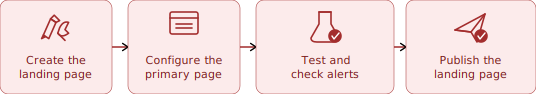
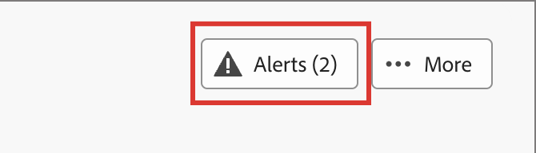

# Creare e pubblicare pagine di destinazione

In qualità di addetto al marketing, puoi definire e pubblicare le pagine da incorporare nei tuoi percorsi. Quando aggiungi una nuova pagina di destinazione, configuri la pagina principale e le eventuali pagine secondarie, progetta il contenuto, verificalo e pubblicalo.

>[!BEGINSHADEBOX]

## Prerequisiti per la pagina di destinazione {#landing-page-prerequisites}

Prima che gli esperti di marketing possano creare pagine di destinazione per supportare i loro percorsi, devono essere attive le seguenti configurazioni e risorse:

* [Sottodominio della pagina di destinazione](../admin/configuration-presets-landing-pages.md#lp-subdomains): configura un sottodominio dedicato all&#39;hosting delle pagine di destinazione.
* [Predefinito per pagina di destinazione](../admin/configuration-presets-landing-pages.md#lp-presets) - Un predefinito definisce il sottodominio e le altre impostazioni applicate alle pagine di destinazione.
* [Modulo](./forms.md) (per casi di utilizzo di acquisizione dati): obbligatorio quando si desidera incorporare un modulo in una pagina di destinazione e inviare dati ad Experience Platform.

>[!ENDSHADEBOX]

## Creare una pagina di destinazione {#create-landing-page}

>[!CONTEXTUALHELP]
>id="ajo-b2b-prime_lp_create"
>title="Definire e configurare la pagina di destinazione"
>abstract="Per creare una pagina di destinazione, devi selezionare un predefinito; configurare la pagina principale e le pagine secondarie; e infine verificare la pagina prima di pubblicarla."

Per indirizzare i membri di un pubblico di percorso a una pagina Web definita quando fanno clic su un collegamento specifico, creare una pagina di destinazione in [!DNL Journey Optimizer B2B Prime].

>[!IMPORTANT]
>
>Prima di creare la prima pagina di destinazione, completa la relativa configurazione. Ciò include la configurazione di un sottodominio per ospitare le pagine di destinazione e la definizione di almeno un predefinito che specifica il sottodominio e le altre impostazioni del canale. Quando crei la pagina di destinazione, selezioni un predefinito. Per la configurazione dell&#39;amministratore, vedere [Configurazione della pagina di destinazione](../admin/configuration-presets-landing-pages.md).
>
>Per i casi di utilizzo relativi all&#39;acquisizione dei dati, crea un [modulo](./forms.md) prima di incorporarlo in una pagina di destinazione.

_Per creare una pagina di destinazione :_

1. Vai alla navigazione a sinistra e seleziona **[!UICONTROL Gestione contenuto]** > **[!UICONTROL Pagine di destinazione]**.

1. Nell&#39;elenco delle pagine di destinazione fare clic su **[!UICONTROL Crea pagina di destinazione]**.

1. Immetti un **[!UICONTROL Titolo]** (obbligatorio) e una **[!UICONTROL Descrizione]** (facoltativo).

   Criteri di titolo e descrizione:

   * **Titolo** — Massimo 100 caratteri. Deve essere univoco (senza distinzione tra maiuscole e minuscole).
   * **Descrizione** — Massimo 300 caratteri.
   * Sono consentiti caratteri Alpha, numerici e speciali.
   * I caratteri riservati sono **_non consentiti_**: `\ / : * ? " < > |`

   {width="600"}

1. Seleziona un **[!UICONTROL predefinito]**.

   Un amministratore [crea i predefiniti per le pagine di destinazione](../admin/configuration-presets-landing-pages.md#lp-presets) per definire il sottodominio e altre impostazioni utilizzate per le pagine di destinazione. Seleziona un predefinito, quindi fai clic su **[!UICONTROL Visualizza predefinito]** per rivederne le impostazioni e confermare che corrispondono ai requisiti della pagina di destinazione.

1. Fai clic su **[!UICONTROL Crea]**.

   Viene visualizzata la pagina principale e le relative proprietà. Scopri come [configurare le impostazioni della pagina principale](#configure-primary-page).

   {width="700" zoomable="yes"}

1. Per aggiungere una pagina secondaria, ad esempio una pagina di ringraziamento o di errore, fare clic sull&#39;icona **+**.

   Puoi aggiungere fino a due pagine secondarie per pagina di destinazione.

Dopo aver configurato e progettato la pagina principale e le eventuali pagine secondarie, [verifica la pagina di destinazione](#test-landing-page) prima di pubblicarla.

>[!CAUTION]
>
>Non puoi accedere alla pagina di destinazione copiando e incollando l’URL definito in un browser web, anche se la pagina è pubblicata. Eseguire il test della pagina utilizzando la funzione di anteprima come descritto in [Eseguire il test della pagina di destinazione](#test-landing-page).

## Configurare la pagina principale {#configure-primary-page}

>[!CONTEXTUALHELP]
>id="ajo-b2b-prime_lp_primary_page"
>title="Definire le impostazioni della pagina principale"
>abstract="Definisci la pagina principale, che viene visualizzata immediatamente quando un destinatario fa clic sul collegamento della pagina di destinazione, ad esempio da un’e-mail o da un sito web."

>[!CONTEXTUALHELP]
>id="ajo-b2b-prime_lp_access_settings"
>title="Definire l’URL della pagina di destinazione"
>abstract="In questa sezione, definisci un URL univoco per la pagina di destinazione. Per la prima parte dell’URL, devi aver già impostato un sottodominio della pagina di destinazione come parte del predefinito selezionato."

La pagina principale è quella che viene visualizzata immediatamente quando un destinatario fa clic sul collegamento della pagina di destinazione, ad esempio da un’e-mail o da un sito web.

_Per definire le impostazioni della pagina principale :_

1. Modifica il **[!UICONTROL Nome pagina]** in base alle tue esigenze, che per impostazione predefinita è _Pagina principale_.

1. Definisci la parte finale dell’URL della pagina.

   Il predefinito selezionato determina la prima parte dell’URL. Un amministratore configura il sottodominio [della pagina di destinazione](../admin/configuration-presets-landing-pages.md#lp-subdomains) come parte del predefinito.

   >[!CAUTION]
   >
   >L’URL della pagina di destinazione deve essere univoco.
   >
   >Non puoi accedere alla pagina di destinazione copiando e incollando questo URL in un browser web, anche se la pagina è pubblicata. Eseguire il test utilizzando la funzione di anteprima come descritto in [Verificare la pagina di destinazione](#test-landing-page).

1. Se desideri una pagina di destinazione anonima, disabilita l&#39;opzione **[!UICONTROL Richiedi utenti identificati]**.

1. Fai clic sull&#39;icona _Calendario_ (  ) per impostare la **[!UICONTROL Scadenza pagina]**.

   Dopo aver selezionato una data di scadenza, scegli l’azione alla scadenza della pagina:

   * **[!UICONTROL URL di reindirizzamento]** - Immettere l&#39;URL della pagina da utilizzare come reindirizzamento.

     {width="400"}

   * **[!UICONTROL Errore del browser]** - Immettere il testo dell&#39;errore da visualizzare al posto della pagina.

     {width="400"}

## Scegli il tipo di progettazione del contenuto {#choose-design-type}

Per aggiungere il _[!UICONTROL contenuto]_ per la pagina, fare clic su **[!UICONTROL Apri Designer]**. Il processo di progettazione inizia scegliendo come iniziare:

* [Creare da zero](#design-from-scratch)
* [Importa HTML](#import-html)

{width="800" zoomable="yes"}

Dopo aver selezionato il metodo preferito per avviare la progettazione della pagina di destinazione, utilizzare gli strumenti di progettazione visiva per [completare il contenuto della pagina](./landing-page-design.md).

### Creare da zero {#design-from-scratch}

Utilizza lo spazio di progettazione del contenuto visivo per definire la struttura e il contenuto della pagina di destinazione. Aggiungendo e spostando componenti strutturali con semplici azioni di trascinamento della selezione, puoi progettare il layout e l’organizzazione del contenuto della pagina in pochi secondi.

1. Dalla home page di progettazione, selezionare l&#39;opzione **[!UICONTROL Progetta da zero]**.

1. [Aggiungi struttura e contenuto](./landing-page-design.md#structure-content-landing-page) alla pagina.

1. [Verifica e modifica il tracciamento URL collegato](./landing-page-design.md#linked-url-tracking).

1. [Verifica la pagina di destinazione](#test-landing-page).

Quando si è soddisfatti del contenuto, fare clic su **[!UICONTROL Salva]**.

### Importa HTML {#import-html}

<!-- originally  from   /help/_includes/content-design-import.md but copied and revised to omit the part about Marketo Engage assets and AEM assets -->

Il contenuto importato può essere:

* Un file HTML con un foglio di stile incorporato
* Un file .zip che include un file HTML, il foglio di stile (.css) e le immagini

  >[!NOTE]
  >
  >La struttura del file .zip non è soggetta a specifici vincoli. Tuttavia, i riferimenti devono essere relativi e adattarsi alla struttura ad albero della cartella .zip. Le immagini vengono sempre caricate nell&#39;archivio [assets](./digital-asset-management.md).

_Per importare un file contenente contenuto HTML :_

1. Nella home page di progettazione selezionare l&#39;opzione **[!UICONTROL Importa HTML]**.

1. Trascina il file HTML o .zip con il contenuto HTML e fai clic su **[!UICONTROL Importa]**.

{width="500"}

>[!NOTE]
>
>L’utilizzo di un tag `<table>` come primo livello in un file HTML può causare la perdita di stile, incluse le impostazioni di sfondo e larghezza nel tag del livello superiore.

Puoi personalizzare il contenuto importato in base alle esigenze con gli strumenti di progettazione visiva.

## Controllare gli avvisi {#check-alerts}

Quando progetti il contenuto di una pagina di destinazione, gli avvisi vengono visualizzati in alto a destra quando mancano le impostazioni chiave.

{width="250"}

Se non trovi questo pulsante, non sono stati rilevati problemi.

Esistono due tipi di avvisi:

* **_Avvisi_** che fanno riferimento a consigli e best practice, ad esempio:

   * `Placeholder links are present in the landing page body`: non dimenticare di sostituire i segnaposto con collegamenti validi.

   * `Text version of HTML is empty`: non dimenticare di definire una versione testuale del corpo della pagina, che viene utilizzata quando non è possibile visualizzare il contenuto HTML.

   * `Empty link is present in page body`: verificare che tutti i collegamenti nella pagina siano corretti.

* **_Errori_** che impediscono di testare o attivare il percorso finché non vengono risolti, ad esempio:

   * `The landing page content is empty`: contenuto pagina obbligatorio.

## Verificare la pagina di destinazione {#test-landing-page}

>[!CONTEXTUALHELP]
>id="ajo-b2b-prime_preview_lp_profiles"
>title="Visualizzare l’anteprima e testare la pagina di destinazione"
>abstract="Una volta definite le impostazioni e il contenuto della pagina di destinazione, utilizza i profili di test per visualizzare in anteprima la pagina."

Una volta definiti le impostazioni e il contenuto della pagina di destinazione, puoi utilizzare i profili di test per visualizzare l’anteprima della pagina. Se hai inserito [contenuto personalizzato](./landing-page-design.md#personalize-content), puoi controllare come questo contenuto viene visualizzato nella pagina di destinazione utilizzando i dati del profilo di test.

>[!PREREQUISITES]
>
>Per visualizzare in anteprima e verificare le pagine di destinazione, devi disporre dell&#39;autorizzazione **[!UICONTROL Pubblica messaggi]** e di un set di dati definito contenente i profili di test.

1. Fai clic su **[!UICONTROL Anteprima e test]** per aprire la selezione del profilo di test.

   >[!NOTE]
   >
   >È inoltre possibile utilizzare **[!UICONTROL Simula contenuto]** nello spazio di progettazione visiva.

1. Dalla schermata _[!UICONTROL Simula]_, seleziona un profilo di test.

   {width="700" zoomable="yes"}

   Se i profili necessari non sono elencati, fare clic su **[!UICONTROL Gestisci profili di test]** per utilizzare un indirizzo di posta elettronica del profilo di test noto e aggiungerlo all&#39;elenco.

   +++Aggiungere profili di test

   Per **[!UICONTROL Spazio dei nomi identità]**, fai clic sull&#39;icona _Seleziona_ (  ) e scegli lo spazio dei nomi `Email` da utilizzare per testare i profili.

   {width="700" zoomable="yes"}

   Nel campo **[!UICONTROL Valore identità]** immettere l&#39;indirizzo di posta elettronica per identificare il profilo di test e fare clic su **[!UICONTROL Aggiungi profilo]**. Puoi ripetere questa operazione per aggiungere più profili.

   {width="700" zoomable="yes"}

   Fai clic sulla freccia indietro in alto a sinistra per tornare alla pagina _[!UICONTROL Simula]_.

   +++

1. Seleziona **[!UICONTROL Apri anteprima]** per verificare la pagina di destinazione.

   L’anteprima della pagina di destinazione viene visualizzata in una nuova scheda. I dati del profilo di test selezionati sostituiscono gli elementi personalizzati.

   {width="600"}

1. Seleziona altri profili di test per visualizzare in anteprima il rendering per ogni variante della pagina di destinazione.

## Pubblicare la pagina {#publish-landing-page}

>[!PREREQUISITES]
>
>Per pubblicare le pagine di destinazione, devi disporre dell&#39;autorizzazione **[!UICONTROL Pubblica messaggi]**. Prima di pubblicare, [verifica e risolvi tutti gli avvisi](#check-alerts).

Quando la pagina della bozza soddisfa i criteri e desideri renderla disponibile per il collegamento nei messaggi di percorso, fai clic su **[!UICONTROL Pubblica]** in alto a destra. Nella finestra di dialogo di conferma, fai di nuovo clic su **[!UICONTROL Pubblica]** per confermare.

{width="250"}

Quando la pagina di destinazione viene pubblicata, viene visualizzata nell&#39;elenco delle pagine di destinazione con lo stato **_[!UICONTROL Pubblicato]_**. Ciò significa che è attivo e pronto per essere utilizzato in un messaggio e-mail o SMS inviato tramite un percorso.

Non è possibile accedere alla pagina di destinazione pubblicata copiando e incollando l’URL in un browser web. Puoi testarlo in qualsiasi momento utilizzando la [funzione di anteprima](#test-landing-page).
