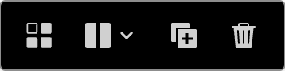
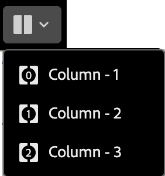
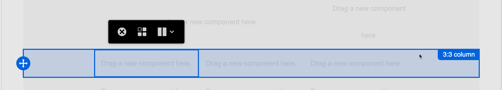

# Componenti della struttura {#structure-components}

>[!CONTEXTUALHELP]
>id="ajo-b2b-prime_structure_components_email"
>title="Informazioni sui componenti di struttura"
>abstract="I componenti di struttura sono elementi di layout che possono essere utilizzati per progettare la struttura di un’e-mail."

>[!CONTEXTUALHELP]
>id="ajo-b2b-prime_structure_components_landing_page"
>title="Informazioni sui componenti di struttura"
>abstract="I componenti di struttura sono elementi di layout che possono essere utilizzati per progettare la struttura di una pagina."

>[!CONTEXTUALHELP]
>id="ajo-b2b-prime_structure_components_fragment"
>title="Informazioni sui componenti di struttura"
>abstract="I componenti struttura sono elementi di layout che possono essere utilizzati per progettare la struttura di un frammento."

>[!CONTEXTUALHELP]
>id="ajo-b2b-prime_structure_components_template"
>title="Informazioni sui componenti di struttura"
>abstract="I componenti di struttura sono elementi di layout che possono essere utilizzati per progettare la struttura di un modello."

Utilizza i _componenti struttura_ nell&#39;area di progettazione visiva per definire la struttura del contenuto. Aggiungendo e spostando elementi strutturali con semplici azioni di trascinamento della selezione, puoi definire rapidamente la forma del layout del contenuto. Ogni componente struttura occupa lo spazio orizzontale e può essere impilato per creare il layout in verticale. <!-- Divide each component into columns to form each content block that you need, then add [content components](./content-components.md) inside them to populate the layout. -->

## Libreria struttura {#structure-library}

Nella parte superiore della libreria _[!UICONTROL Components]_, la sezione **[!UICONTROL Structures]** visualizza i componenti struttura disponibili:

| Icona | Componente | Descrizione |
| ----- | ----------- | ----------- |
|  | [!UICONTROL 1:1 colonna] | Contenitore a colonna singola che occupa la larghezza dello spazio. |
|  | [!UICONTROL 1:2 colonna sinistra] | Contenitore a due colonne che utilizza un rapporto di 1:2 per riempire la larghezza dello spazio. La prima colonna (a sinistra) occupa un terzo della larghezza, mentre la seconda (a destra) occupa i due terzi rimanenti. |
|  | [!UICONTROL 1:3 colonna sinistra] | Contenitore a due colonne che utilizza un rapporto di 1:3 per riempire la larghezza dello spazio. La prima colonna (a sinistra) occupa un quarto della larghezza mentre la seconda (a destra) occupa i tre quarti rimanenti. |
|  | [!UICONTROL 2:1 colonna a destra] | Contenitore a due colonne che utilizza un rapporto di 2:1 per riempire la larghezza dello spazio. La prima colonna (a sinistra) occupa i due terzi della larghezza, mentre la seconda colonna (a destra) occupa il terzo rimanente. |
|  | [!UICONTROL 2:2 colonna] | Contenitore a due colonne che utilizza un rapporto di 2:2 per riempire la larghezza dello spazio. Le colonne sinistra e destra hanno la stessa larghezza. |
| Icona della colonna  | [!UICONTROL 3:1 colonna a destra] | Contenitore a due colonne che utilizza un rapporto di 3:1 per riempire la larghezza dello spazio. La prima colonna (a sinistra) occupa tre quarti (75%) della larghezza e la seconda (a destra) occupa il rimanente quarto (25%). |
| Icona della colonna  | [!UICONTROL 3:3 colonna] | Contenitore a tre colonne che utilizza un rapporto di 3:3 per riempire la larghezza dello spazio. Le tre colonne hanno la stessa larghezza. |
|  | [!UICONTROL 4:4 colonna] | Contenitore a quattro colonne che utilizza un rapporto di 4:4 per riempire la larghezza dello spazio. Le quattro colonne hanno la stessa larghezza. |
|  | [!UICONTROL n:n colonna] | Una struttura di colonne personalizzabile che riempie lo spazio in base alle colonne definite. È possibile impostare il numero di colonne (compreso tra due e dieci) e la larghezza di ciascuna colonna singolarmente. [Ulteriori informazioni](#change-nn-columns) |

## Aggiungere componenti struttura {#add-structure-components}

Quando progetti il contenuto per l’e-mail, la pagina di destinazione o il frammento, aggiungi ciascun componente struttura per creare il layout. Trascinare un elemento dalla sezione **[!UICONTROL Strutture]** a sinistra e rilasciarlo nell&#39;area di lavoro. Puoi utilizzare la barra degli strumenti per selezionare una colonna e utilizzare le schede _Impostazioni_ e _Stili_ nel pannello di destra per definire i parametri per il componente o la colonna selezionati.

{width="800" zoomable="yes"}

### Barra degli strumenti del componente {#component-toolbar}

La barra degli strumenti viene visualizzata nell&#39;area di lavoro quando questa viene selezionata nell&#39;area di lavoro. Gli strumenti disponibili consentono di selezionare facilmente una colonna e applicare le funzioni dei componenti.

{width="150"}

| Strumento | Nome | Utilizzo |
| ---- | ---- | ----- |
| {width="40"} | Abilita contenuto condizionale | (E-mail e frammenti) Abilita le varianti condizionali per il componente. |
| {width="100"} | Seleziona una colonna | Selezionare una colonna per numero. Quando la colonna è selezionata, è possibile applicare le impostazioni e gli stili delle colonne. |
| {width="40"} | Duplica | Crea una copia del componente e aggiungilo direttamente qui sotto. |
| {width="40"} | Elimina | Rimuovi il componente. |

### Impostazioni del componente {#component-settings}

Dopo aver aggiunto un componente, questo viene selezionato nello spazio di progettazione visiva e le relative proprietà vengono visualizzate nel pannello di destra. La scheda _[!UICONTROL Impostazioni]_ è visualizzata per impostazione predefinita. Puoi anche selezionare un componente struttura in qualsiasi momento per modificare le impostazioni.

#### Opzioni di visualizzazione

Se desideri escludere il componente dalla visualizzazione del desktop o del dispositivo mobile, modifica l&#39;impostazione **[!UICONTROL Opzioni di visualizzazione]**. Il valore predefinito, _[!UICONTROL Mostra su tutti i dispositivi]_, consente la visualizzazione su tutti i dispositivi.

{width="400" zoomable="yes"}

Scegli un’altra impostazione per rendere il componente esclusivo per tipo di dispositivo:

* _[!UICONTROL Mostra solo su dispositivi desktop]_ - Scegliere questa impostazione quando si desidera visualizzare il componente su dispositivi desktop ed escluderlo per dispositivi mobili.
* _[!UICONTROL Mostra solo su dispositivi mobili]_ - Scegliere questa impostazione per visualizzare il componente su dispositivi mobili, ad esempio telefoni e tablet, ed escluderlo per i dispositivi desktop.

#### Intestazione e piè di pagina

Puoi designare un componente struttura come intestazione o piè di pagina HTML nel messaggio e-mail o nella pagina di destinazione. Con il componente struttura selezionato nell&#39;area di lavoro, fai clic sull&#39;opzione **[!UICONTROL Intestazione]** o **[!UICONTROL Piè di pagina]**. Può essere presente una sola intestazione o un solo piè di pagina e l’opzione non è disponibile se è stato assegnato un altro componente.

{width="600" zoomable="yes"}

Per rimuovere la designazione di intestazione o piè di pagina, seleziona il componente e fai clic sull’opzione per rimuoverlo.

### Colonne sovrapposte {#stacked-columns}

Per schermate o finestre di visualizzazione più piccole, le colonne nel componente struttura vengono visualizzate in pila a meno che non si modifichi l’impostazione predefinita. Con il componente struttura a più colonne selezionato, modifica l&#39;impostazione **[!UICONTROL Non impilare le colonne sul dispositivo mobile]** spostando il cursore di attivazione/disattivazione a destra.

{width="250"}

## Stili dei componenti {#component-styles}

Dopo aver aggiunto un componente, questo viene selezionato nello spazio di progettazione visiva e le relative proprietà vengono visualizzate nel pannello di destra. Puoi anche selezionare un componente in qualsiasi momento per modificare le impostazioni e gli stili.

### Informazioni di base {#background}

Con la scheda _[!UICONTROL Stili]_ selezionata nel pannello di destra, utilizza la sezione **[!UICONTROL Sfondo]** per definire il colore e l&#39;immagine facoltativa da utilizzare come sfondo per il componente struttura.

#### [!UICONTROL Colore di sfondo]

Selezionare la casella di controllo e fare clic sul quadrato di colore per scegliere un colore dal selettore. È possibile scegliere un colore immettendo un valore RGB, HSL, HSB o esadecimale noto. In alternativa, utilizzare il cursore del colore e il campo del colore per selezionare il colore.

{width="300"}

#### [!UICONTROL Immagine di sfondo] {#background-image}

Sposta il selettore per attivare le impostazioni dell&#39;immagine di sfondo.

{width="250"}

Fai clic su **[!UICONTROL Seleziona risorsa]** per aprire il selettore risorse, in cui puoi scegliere un&#39;immagine dalla [libreria Assets](./digital-asset-management.md#assets-authoring).

Utilizza l&#39;opzione **[!UICONTROL Posizionamento immagine]** per scegliere in che modo l&#39;immagine riempie il componente struttura. Le impostazioni di posizionamento seguono gli [attributi standard di riempimento e allineamento dell&#39;immagine di sfondo di HTML](https://www.w3schools.com/html/html_images_background.asp){target="_blank"}.

{width="250"}

### Altri stili {#other-styles}

Puoi applicare altri stili dei componenti struttura per regolarne la visualizzazione nel messaggio e-mail o nella pagina di destinazione. Per ulteriori informazioni sullo stile oltre queste opzioni predefinite, consulta [Aggiungere CSS personalizzato per il contenuto](./design-custom-css.md).

+++Bordo

{{styles-border}}

+++

+++Margine

{{styles-margin}}

+++

+++Avanzate

{{styles-advanced}}

+++

## Colonne {#columns}

Utilizza lo strumento _Seleziona una colonna_ nella barra degli strumenti del componente per selezionare una colonna. Puoi quindi utilizzare la barra degli strumenti delle colonne per modificare la selezione delle colonne, rimuoverle o applicare varianti di contenuto condizionale alla colonna. I parametri per la colonna vengono visualizzati nelle schede _[!UICONTROL Impostazioni]_ e _[!UICONTROL Stili]_ a destra.

{width="500"}

| Strumento | Nome | Utilizzo |
| ---- | ---- | ----- |
| — | Cancella colonna | Cancella il contenuto nella colonna. Consultate il primo strumento nella figura della barra degli strumenti delle colonne. |
| {width="40"} | Abilita contenuto condizionale | (E-mail e frammenti) Abilita le varianti condizionali per la colonna. |
| {width="100"} | Seleziona una colonna | Selezionare una colonna per numero. Quando la colonna è selezionata, è possibile applicare impostazioni e stili. |

### Modifica n:n colonne {#change-nn-columns}

La larghezza delle colonne è statica per la maggior parte dei componenti della struttura. Quando si aggiunge il componente _[!UICONTROL n:n column]_, è possibile modificare il numero di colonne e il ridimensionamento delle colonne. Il componente colonna n:n inizia con cinque colonne di larghezza uguale (20%).

>[!NOTE]
>
>Le dimensioni di ogni colonna non possono essere inferiori al 10% della larghezza totale del componente struttura. È possibile rimuovere solo colonne vuote.

Con il componente selezionato nell&#39;area di lavoro, utilizza l&#39;opzione **[!UICONTROL Numero colonne]** nel pannello di destra per modificare il numero di colonne. Fare clic sulle icone freccia su e freccia giù per aumentare o diminuire il numero di colonne oppure immettere il numero nel campo.

{width="650" zoomable="yes"}

Nell’area di lavoro, sposta l’icona di dimensionamento della colonna per regolare la larghezza della colonna selezionata. Quando aumentate o diminuite la larghezza, anche la colonna adiacente viene regolata in modo che tutte le colonne occupino il 100% della larghezza del componente.

{width="500" zoomable="yes"}

### Stili colonna {#column-styles}

Con la colonna selezionata nell’area di lavoro, puoi impostare gli stili da applicare a tale colonna.

+++Informazioni di base

* **[!UICONTROL Colore di sfondo]** - Selezionare la casella di controllo e fare clic sul quadrato del colore per scegliere un colore dal selettore. È possibile scegliere un colore immettendo un valore RGB, HSL, HSB o esadecimale noto. In alternativa, è possibile utilizzare il cursore del colore e il campo del colore per selezionare il colore.

  {width="300"}

* **[!UICONTROL Immagine di sfondo]** - Sposta il selettore di attivazione/disattivazione per abilitare le impostazioni dell&#39;immagine di sfondo.

  {width="250"}

  Scegli il tipo di origine della risorsa e [seleziona un file di immagine](#background-image).

+++

+++Bordo

{{styles-border}}

+++

+++Allineamento

{{styles-alignment-v}}

+++

+++Margine

{{styles-margin}}

+++

+++Avanzate

{{styles-advanced}}

+++

## Struttura di navigazione {#navigation-tree}

Nello spazio di progettazione visiva è possibile accedere ai componenti strutturali, inclusi le colonne e il contenuto, utilizzando la struttura di navigazione. Fai clic sull&#39;icona _[!UICONTROL Struttura di navigazione]_ (  ) a sinistra per visualizzare la struttura.

{width="800" zoomable="yes"}

L&#39;elemento _[!UICONTROL Body]_ è la radice della struttura ad albero. Fai clic su uno dei componenti o degli elementi figlio di colonna nella struttura per selezionarlo nell’area di lavoro. Nelle schede _[!UICONTROL Impostazioni]_ e _[!UICONTROL Stili]_ a destra vengono visualizzati i parametri per il componente o la colonna.

{width="800" zoomable="yes"}
