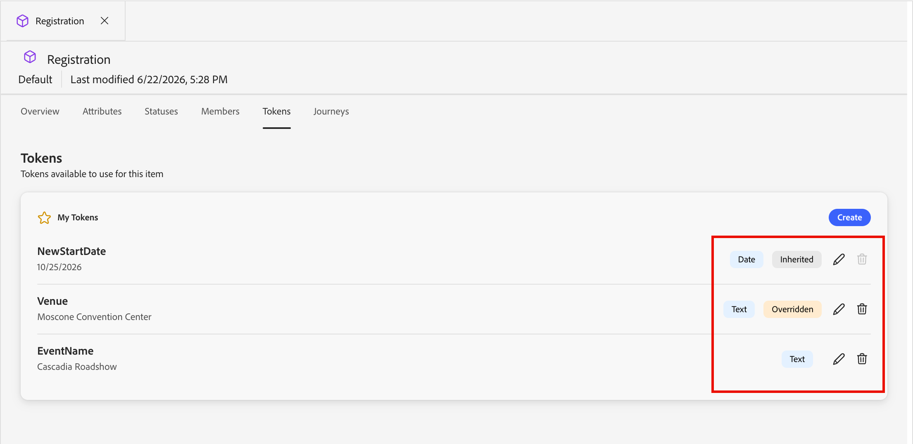

# Token personalizzati per la personalizzazione

La personalizzazione del contenuto utilizza i token come segnaposto o variabili che vengono compilate al momento della generazione dell’artefatto di contenuto. I token di personalizzazione standard sono disponibili per e-mail, pagine di destinazione, frammenti e modelli. Puoi anche definire un set di token personalizzati con valori specifici per il programma o la cartella. Questo set di token personalizzati si chiama _I miei token_ e uno qualsiasi di questi token personalizzati è destinato alla personalizzazione.

Quando aggiungi un token personalizzato a un&#39;e-mail, questo viene visualizzato come `{{my.TokenName}}`. Ad esempio, potresti avere `{{my.EventDate}}` o `{{my.WebinarSpeaker}}` token creati per gestire il contenuto delle e-mail relative ai prossimi webinar.

Oltre a _I miei token_, specifici del programma o della cartella, puoi utilizzare qualsiasi token standard (incorporato) per la personalizzazione.

## Token di accesso

1. Nella barra di navigazione a sinistra, espandere **[!UICONTROL Gestione marketing]**.

1. Sulla destra dell&#39;elenco delle risorse **[!UICONTROL Marketing]**, selezionare **[!UICONTROL Programmi]**.

1. Nella struttura ad albero, selezionare il programma o la cartella per aprire i dettagli nell&#39;area di lavoro centrale.

1. Fai clic sulla scheda **[!UICONTROL Token]**.

   {width="800" zoomable="yes"}

   Nella scheda vengono visualizzati tutti i token personalizzati definiti nella cartella o nel programma e tutti quelli definiti per le cartelle o i programmi principali.

### Tipi di token {#my-tokens}

I _Token personali_ sono variabili personalizzate create o modificate per un programma o una cartella. Questo set di token personalizzati supporta i seguenti tipi di token:

| Tipo token | Descrizione |
| ---------- | ----------- |
| Testo | Questo tipo contiene una stringa di testo standard. Il limite di dimensione per i token di testo è di 524.288 caratteri (UTF-8) o 2 MB. |
| Data | Questo tipo contiene un valore di data. La data viene visualizzata come mese-giorno-anno (ad esempio, 09-23-2026). |
| Data e ora | Questo tipo contiene un valore di data e ora. |
| Numero | Questo tipo contiene un valore intero standard. |
| E-mail | Questo tipo contiene un indirizzo e-mail valido. |
| Punteggio | Usa questo token per modificare il punteggio di un nodo azione di percorso. |
| Booleano | Questo tipo contiene un valore booleano standard, true o false. |
| Rich Text | Questo tipo contiene il testo formattato. |

### Nidificazione dei token

Quando crei un token in un programma o in una cartella, questo può essere usato come riferimento da altri oggetti secondari.

* Token locale: il token è definito nello stesso programma o cartella.
* Token ereditato: il token è definito in un programma o in una cartella principale, uno o più livelli al di sopra del programma o della cartella corrente.
* Token sostituito: il token è definito in un programma o in una cartella principale, ma in tale programma o cartella è definito un valore diverso. Lo stato del token cambia in _Ignorato_ e tutte le cartelle, i programmi e gli artefatti di marketing figlio ereditano il nuovo valore.

{width="600" zoomable="yes"}

### Creare un token

1. Nella scheda _[!UICONTROL Token]_, fai clic su **[!UICONTROL Crea]**.

1. Nella finestra di dialogo, immetti il **[!UICONTROL Nome]** per il token.

   {width="400"}

   Non è possibile utilizzare spazi o caratteri speciali nel nome del token. È possibile utilizzare _Camel Case_, ad esempio `EventType`, per utilizzare un nome composto da più parole facilmente identificabile.

1. Scegli il **[!UICONTROL Tipo]** per il token.

1. Imposta il **[!UICONTROL valore]** per il token.

1. Fai clic su **[!UICONTROL Crea]**.

### Modificare un token

Puoi modificare il valore per qualsiasi dei My Tokens definiti. Esegui questa operazione per ignorare il valore di un token ereditato.

<!-- (How does this affect live person journeys? ) -->

1. In _[!UICONTROL Token]_ , fai clic sull&#39;icona _Modifica_ accanto al nome del token.

1. Nel campo, modifica il valore in base alle esigenze.

   {width="400"}

1. Fai clic sull&#39;icona _Salva_.

### Eliminare un token

Puoi eliminare un token personalizzato dall’elenco se non è attualmente utilizzato nel contenuto dell’e-mail del percorso.

1. In _[!UICONTROL Token]_ , fai clic sull&#39;icona _Elimina_ accanto al nome del token.

1. Nella finestra di dialogo di conferma, fai clic su **[!UICONTROL Elimina]**.

<!--

## Use custom tokens in your content

When you are authoring email content for your programs, you can use any of the tokens from the _My Tokens_ list when you use the personalization tools in the visual design space.

1. Select the text component and click the _Add personalization_ (  ) icon in the toolbar.

   {width="600"}

   This action opens the _Edit Personalization_ dialog. The dialog includes a _[!UICONTROL My tokens]_ folder in the _[!UICONTROL Personalization Tokens]_ library if there are custom tokens defined for the account journey.

1. To add one of your custom tokens to the blank space, expand the **[!UICONTROL My tokens]** folder, then click **+** or **...**.

   You can add any additional static text as needed.

   {width="700" zoomable="yes"}

1. Click **[!UICONTROL Save]**.

-->
