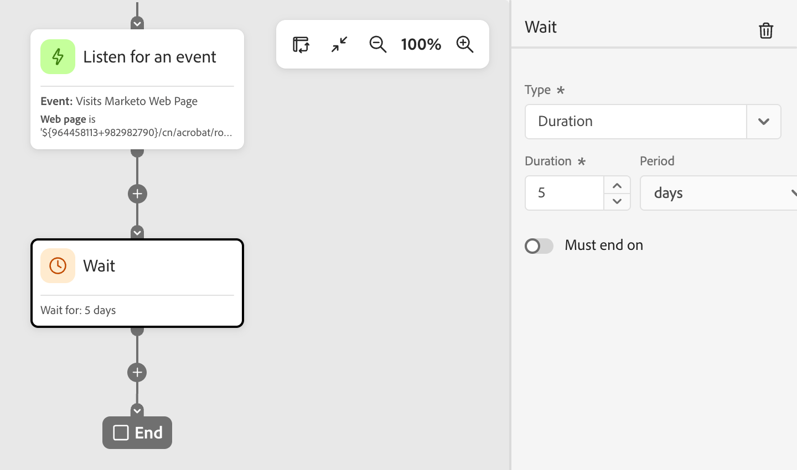
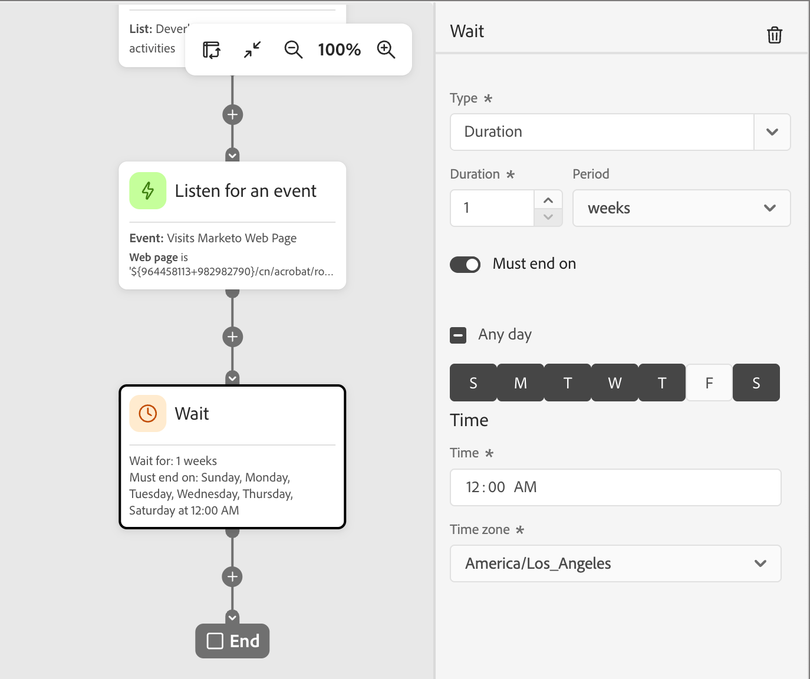

# Attendi nodo

Utilizza un nodo _Attendi_ per sospendere la progressione del percorso per una certa durata prima di passare al passaggio successivo.

Esistono due modi per definire il tempo di attesa:

* Data specifica in cui si desidera passare al nodo successivo nel percorso
* Una durata relativa (numero di minuti, ore, giorni, settimane o mesi)

## Aggiungi il nodo di attesa {#add-wait-node}

1. Passa all’area di lavoro del percorso.

1. Fai clic sull&#39;icona più ( **+** ) in un percorso e scegli **[!UICONTROL Attendi]**.

   {width="200"}

1. Per impostare il tempo di attesa prima che il percorso passi al nodo successivo nel percorso, utilizzare le proprietà del nodo a destra per impostare il tipo **[!UICONTROL Type]**.

   * **[!UICONTROL Durata]** - Definisci un numero specifico di giorni, ore o minuti tra l&#39;entrata e l&#39;uscita del nodo di attesa.
   * **[!UICONTROL Data]** - Specificare una data e un&#39;ora di uscita.

   {width="500"}

## Impostazioni di attesa avanzate {#advanced-wait-settings}

Abilita l&#39;opzione **[!UICONTROL Deve terminare il]** per configurare un _passaggio di attesa avanzato_ e assicurarsi che i messaggi raggiungano le persone e i membri dell&#39;account nel momento ottimale. Questa configurazione offre un controllo preciso su quando una persona o un account esce da un passaggio di attesa e procede al nodo successivo nel percorso. Invece di un numero fisso di ore o giorni dall&#39;entrata all&#39;uscita, puoi pianificare azioni che si verificano in orari specifici e in giorni specifici della settimana.

Con un _passaggio di attesa avanzato_, puoi definire **_quando_** la persona o l&#39;account esce, non semplicemente per quanto tempo devono attendere.

{width="500"}

### Tipi di attesa {#wait-types}

| Tipo di attesa | Descrizione | Configurazione |
| --------- | ----------- | ------------- |
| **Ora del giorno specifica** | Mantieni fino a un orario specifico (ad esempio 9:00 AM) | Impostare l&#39;ora (ora e minuto). Esci all’occorrenza successiva dell’ora (per il fuso orario selezionato). |
| **Giorno della settimana specifico** | Mantieni fino a un giorno specifico (ad esempio martedì) | Seleziona un giorno della settimana. Se non viene specificata un&#39;ora, esce a mezzanotte (per il fuso orario selezionato) nel giorno successivo corrispondente. |
| **Intervallo di giorni o combinazione** | Mantieni fino a qualsiasi giorno compreso in un intervallo (ad esempio, dal lunedì al venerdì) o in uno qualsiasi dei giorni specificati | Seleziona i giorni di destinazione. Se non viene specificata un&#39;ora, esce a mezzanotte (per il fuso orario selezionato) nel giorno successivo corrispondente. |
| **Combinazione tempo + giorno** | Combina entrambi per una pianificazione precisa (ad esempio martedì alle ore 10:00) | Seleziona i giorni di destinazione e imposta l’ora di destinazione. Esci al giorno/ora successiva (per il fuso orario selezionato). |

### Scenari comuni {#common-scenarios}

Gli scenari seguenti illustrano come applicare esempi tipici alla configurazione dei nodi di attesa:

+++Arrivo e-mail durante l’orario di lavoro

**Scenario:** Vendi a clienti B2B che leggono e-mail durante la giornata lavorativa. Vuoi che tutte le e-mail arrivino durante l’orario di lavoro.

**Soluzione:** Configura il passaggio di attesa per rilasciare i lead alle 9:00 nei giorni feriali (dal lunedì al venerdì). Indipendentemente dal momento in cui un lead entra nel nodo di attesa, riceve l’e-mail durante l’orario di lavoro.

+++

+++Tempi di invio coerenti per il pubblico dinamico

**Scenario:** il pubblico cambia ogni giorno in base ai nuovi account o lead idonei. Desideri che tutti i lead ricevano la prima e-mail contemporaneamente, indipendentemente da quando si sono qualificati.

**Soluzione:** impostare la fine del passaggio di attesa in un momento specifico (ad esempio alle 10:00). Tutti i lead, qualificati sia a mezzanotte che a mezzogiorno, escono dal passaggio di attesa alle 00:00.

+++

+++Attività di follow-up conformi a SLA

**Scenario:** il tuo team vendite dispone di un SLA di due giorni lavorativi per seguire i lead qualificati per il marketing. I fine settimana sono esclusi.

**Soluzione:** configurare il passaggio di attesa per rilasciare i lead solo nei giorni lavorativi. Un lead qualificato venerdì viene inviato per il follow-up lunedì o martedì, non nel fine settimana.

+++

### Esempi di entrata e uscita {#entry-exit-examples}

| Attendi configurazione | Inserimenti account/lead | Uscite account/lead |
| ------------------ | ------------------- | ------------------ |
| 09:00, qualsiasi giorno:00 | Lunedì 11:00 | Martedì 9:00 AM |
| 09:00, qualsiasi giorno:00 | Lunedì 7:00 AM | Lunedì 9:00 AM |
| Martedì, non è impostato alcun orario | Venerdì 3:00 PM | Martedì 12:00 |
| 10:00, lunedì-venerdì | Sabato 2:00 PM | Lunedì 10:00 AM |
| 10:00, lunedì-venerdì | Mercoledì 8:00 | Mercoledì 10:00 |
