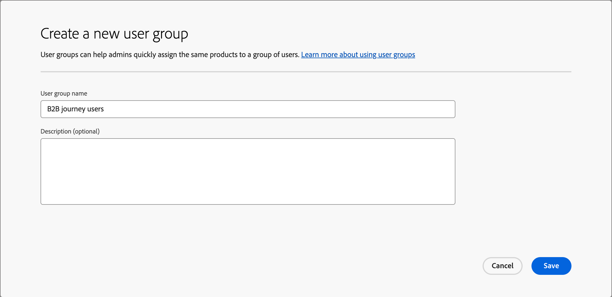
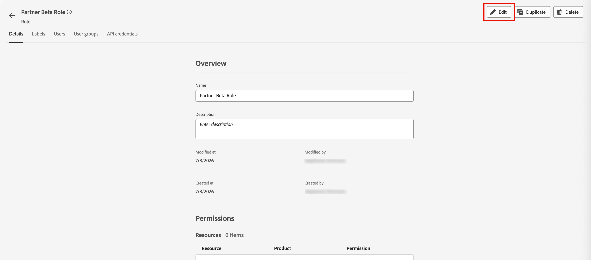
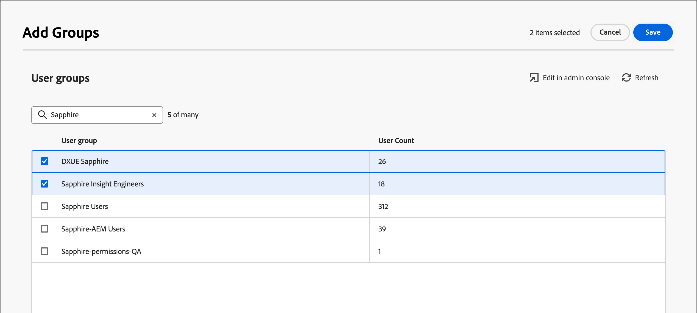

# Accesso utente e autorizzazioni

Dopo aver completato il provisioning e aver associato le sandbox, completa i passaggi seguenti per fornire l&#39;accesso [!DNL Journey Optimizer B2B Prime] al team e agli utenti.

1. [Crea un  [!DNL Journey Optimizer B2B Edition] profilo di prodotto](#create-profile) in Admin Console (solo configurazione una tantum/iniziale).
1. [Aggiungi un gruppo di utenti](#add-user-group) in Admin Console.
1. [Assegna il profilo di prodotto](#assign-profile) al gruppo di utenti in Admin Console.
1. [Aggiungi utenti al nuovo gruppo](#add-users) in Admin Console.
1. [Modifica ruoli predefiniti](#edit-role-permissions) o [crea un ruolo personalizzato](#create-a-custom-role) con autorizzazioni [!DNL Journey Optimizer B2B Edition] in Adobe Experience Platform.
1. [Aggiungi utenti](#add-users-to-a-role) o [gruppi](#add-user-groups-to-a-role) ai ruoli in Adobe Experience Platform.

## Configurare il profilo di prodotto {#config-profile}

In qualità di amministratore, puoi completare queste attività in Adobe Admin Console, che è una posizione centrale per amministrare e gestire le licenze e gli utenti dei prodotti Adobe. In Admin Console, puoi creare e gestire gli utenti in un’unica posizione invece che all’interno delle varie soluzioni individuali. Per ulteriori informazioni sulle funzioni e le funzionalità, consulta la pagina [Panoramica di Admin Console](https://helpx.adobe.com/it/enterprise/using/admin-console.html).

### Accedere ad Admin Console {#admin-console}

Prima di poter utilizzare Admin Console per amministrare gli utenti del team, è necessario assicurarsi di poter accedere ad Admin Console e di disporre delle autorizzazioni appropriate.

1. In qualità di amministratore di sistema, come parte del processo di onboarding dovresti ricevere più e-mail da Adobe.

   Cerca l’e-mail di benvenuto con le informazioni sul nome dell’organizzazione a cui hai accesso.

1. Per accedere a Admin Console, fai clic sul collegamento **[!UICONTROL Inizia]** nell&#39;e-mail di benvenuto.

   Se non riesci a trovare l&#39;e-mail, apri un browser per accedere direttamente a Admin Console all&#39;indirizzo [https://adminconsole.adobe.com](https://adminconsole.adobe.com).

1. Accedi con il tuo Adobe ID.

   Dopo aver effettuato l&#39;accesso, viene visualizzata la pagina _Panoramica_ di Adobe Admin Console.

1. Se hai accesso a più organizzazioni, assicurati di aver effettuato l’accesso all’organizzazione corretta.

   Per modificare l’organizzazione, fai clic sul nome dell’organizzazione nell’angolo in alto a destra e scegli l’organizzazione a cui desideri accedere.

1. Seleziona **[!UICONTROL Amministratori]** dalla scheda _[!UICONTROL Utenti]_ per verificare di essere un amministratore di sistema.

   {width="800" zoomable="yes"}

1. Effettua la ricerca immettendo e-mail, nome utente, nome o cognome Adobe ID.

   * Se l’accesso è configurato correttamente, la ricerca restituisce il record.

   * Se il valore nella colonna **[!UICONTROL RUOLO AMMINISTRATORE]** mostra `System`, l&#39;amministratore di sistema è tu o l&#39;utente visualizzato.

### Crea il profilo di prodotto [!DNL Journey Optimizer B2B Edition] {#create-profile}

Quando consenti l’accesso a una soluzione Adobe agli utenti, non devi necessariamente concedere loro l’accesso completo. I profili di prodotto consentono a ciascuna soluzione di disporre di un proprio set di autorizzazioni utente. Utilizza Admin Console per assegnare i profili di prodotto.

Per ulteriori informazioni sull&#39;utilizzo dei profili di prodotto per i diritti utente, consulta [_Gestire i profili di prodotto per gli utenti aziendali_](https://helpx.adobe.com/it/enterprise/using/manage-product-profiles.html){target="_blank"} nella documentazione di Admin Console.

{width="30"} Un amministratore di sistema o un amministratore di prodotto [!DNL Experience Platform] può eseguire i passaggi seguenti da [https://adminconsole.adobe.com](https://adminconsole.adobe.com).

1. Selezionare la scheda **[!UICONTROL Prodotti]**.

1. Aprire l&#39;istanza [!DNL Journey Optimizer B2B Edition] in cui si desidera aggiungere il profilo e fare clic su **[!UICONTROL Nuovo profilo]**.

   {width="600" zoomable="yes"}

1. Immettere il nome di un profilo di prodotto, ad esempio _Utenti B2B_.

1. Fai clic su **[!UICONTROL Avanti]** e quindi su **[!UICONTROL Salva]**.

### Aggiungere un gruppo di utenti {#add-user-group}

Un gruppo di utenti è una raccolta di utenti a cui viene concesso un set condiviso di autorizzazioni. Puoi aggiungere o rimuovere utenti nel gruppo di utenti. Le autorizzazioni del gruppo rimangono invariate mentre gli utenti all’interno del gruppo cambiano.

Per ulteriori informazioni sull&#39;utilizzo dei gruppi di utenti per gestire le autorizzazioni, vedere [Gestione dei gruppi di utenti](https://helpx.adobe.com/it/enterprise/using/user-groups.html){target="_blank"} nella documentazione di Admin Console.

{width="30"} Un amministratore di sistema può eseguire i seguenti passaggi da [https://adminconsole.adobe.com](https://adminconsole.adobe.com).

1. Selezionare la scheda **[!UICONTROL Utenti]**.

1. Scegliere **[!UICONTROL Gruppi utenti]** nel menu di navigazione a sinistra.

1. Fai clic su **[!UICONTROL Nuovo gruppo utenti]** in alto a destra.

1. Immettere un nome per il gruppo di utenti, ad esempio _utenti B2B_ e fare clic su **[!UICONTROL Salva]**.

   {width="600" zoomable="yes"}

### Assegnare il profilo di prodotto {#assign-profile}

{width="30"} Un amministratore di prodotto può eseguire i seguenti passaggi da [https://adminconsole.adobe.com](https://adminconsole.adobe.com).

1. Fai clic sul gruppo di utenti creato.

1. Seleziona la scheda **[!UICONTROL Profili di prodotto assegnati]** e fai clic su **[!UICONTROL Assegna profilo]**.

1. Fai clic su **+** e aggiungi ogni istanza dei seguenti prodotti:

   * [!UICONTROL Adobe Journey Optimizer B2B edition - Profilo utenti]
   * [!UICONTROL Adobe Experience Platform - AEP-Default-All-Users]
   * [!UICONTROL Raccolta dati Adobe Experience Platform - Accesso predefinito a tutti gli accessi alla raccolta dati]
   * [!UICONTROL Adobe Experience Platform - Predefinito Production All Access]

   {width="600" zoomable="yes"}

1. Fai clic su **[!UICONTROL Salva]**.

### Aggiungi utenti al nuovo gruppo {#add-users}

Per informazioni sulla gestione degli utenti, vedi [_Utenti Adobe Admin Console_](https://helpx.adobe.com/it/enterprise/using/users.html){target="_blank"} nella documentazione di Admin Console.

{width="30"} Un amministratore di sistema o un amministratore di prodotto può eseguire i seguenti passaggi da [https://adminconsole.adobe.com](https://adminconsole.adobe.com). Un amministratore di prodotto può aggiungere solo gli utenti che esistono già nella sua organizzazione.

1. Se gli utenti non sono già membri dell’organizzazione, aggiungi ogni utente:

   * In _[!UICONTROL Collegamenti rapidi]_, fare clic su **[!UICONTROL Aggiungi utenti]**.

   * Immettere l&#39;indirizzo di posta elettronica dell&#39;utente e fare clic su **[!UICONTROL Aggiungi come nuovo utente]**.

     {width="600" zoomable="yes"}

   * Immetti il nome e il cognome, quindi fai clic su **[!UICONTROL Salva]**.

1. Aggiungi ogni utente al gruppo:

   * Fai clic sul nome utente.

   * Nella pagina dei dettagli utente, scorri fino a **[!UICONTROL Gruppi utenti]**.

   * Fai clic sull&#39;icona _Altro_ ( **...** ) a sinistra e scegli **[!UICONTROL Modifica gruppi di utenti]**.

   * Fai clic sull&#39;icona _Aggiungi_ ( **+** ) sotto **[!UICONTROL Gruppi di utenti]**.

     {width="600" zoomable="yes"}

   * Selezionare il gruppo di utenti creato in precedenza e fare clic su **[!UICONTROL Applica]**.

   * Fai clic su **[!UICONTROL Salva]** per visualizzare le modifiche apportate dall&#39;utente.

## Assegnare le autorizzazioni del prodotto {#assign-product-permissions}

Le autorizzazioni sono diritti unitari che ti consentono di definire le autorizzazioni assegnate a un profilo di prodotto. Ogni autorizzazione è raggruppata in una funzionalità, ad esempio percorsi o gruppi di acquisto, che rappresenta le funzionalità in [!DNL Journey Optimizer B2B Prime].

Nell&#39;area _Autorizzazioni_ di Adobe Experience Platform gli amministratori possono definire ruoli utente e criteri di accesso per gestire le autorizzazioni di accesso per funzionalità e oggetti all&#39;interno di un&#39;applicazione di prodotto. In questa app, puoi creare e gestire i ruoli, nonché assegnare le autorizzazioni per le risorse desiderate per tali ruoli. Le autorizzazioni ti consentono inoltre di gestire le sandbox e gli utenti associati a un ruolo specifico.

Per ulteriori informazioni sulle autorizzazioni per i ruoli in Experience Platform, vedi [Gestione delle autorizzazioni per un ruolo](https://experienceleague.adobe.com/en/docs/experience-platform/access-control/abac/permissions-ui/permissions){target="_blank"} nella documentazione di Experience Platform.

1. Vai a [experience.adobe.com](https://experience.adobe.com/).

1. Nel pannello _[!UICONTROL Accesso rapido]_, seleziona **[!UICONTROL Autorizzazioni]**.

   >[!NOTE]
   >
   >Se non trovi _[!UICONTROL Autorizzazioni]_, potresti dover fare clic su **[!UICONTROL Visualizza tutto]** e selezionarlo dalle applicazioni disponibili.

   {width="700" zoomable="yes"}

<!--

### B2B product permissions {#b2b-product-permissions}

The following permissions govern access to [!DNL Journey Optimizer B2B Edition] capabilities:

| Category | Description | Permissions |
| -------- | ----------- | ---------- |
| B2B Account Lists | Configure, manage, view, and publish permissions for B2B account lists. These permissions include actions such as add, remove, import, and delete accounts from account lists. | <li>Manage B2B Account Lists |
| B2B Admin Configurations | Configure, manage, and view permissions for B2B administrative configurations. These permissions include digital asset management connections, asset repositories, and events. | <li>Manage B2B Admin Configurations |
| B2B Assets | Configure, manage, and view permissions for B2B assets. These permissions include emails, SMS, landing pages, fragments, templates, and images. | <li>Manage B2B Assets <li>Manage B2B Templates <li>Manage B2B Fragments <li>Manage B2B Emails |
| B2B Buying Groups | Configure, manage, and view permissions for B2B buying groups. These permissions include solution interests, roles templates, and buying group status. | <li>Manage B2B Buying Groups <li>Manage B2B Solution Interests <li>Manage B2B Role Templates <li>Manage B2B Stages <li>View B2B Buying Groups |
| B2B Channel Configurations | Configure, manage, and view permissions for B2B channel configurations. These permissions include settings for communication limits, API credentials, and security settings. | <li>Manage B2B Channels Configurations |
| B2B Dashboards | Configure and view permissions for B2B dashboards. These permissions include account engagement, buying group stages, surging accounts, and contact coverage. | <li>View B2B Engagement Dashboard |
| B2B Journeys | Configure, manage, view, and publish permissions for B2B journeys. These permissions include account and person actions, event listeners, and split paths. | <li>Manage B2B Account Journeys |
| Journey Optimizer Rules | Access and configure frequency rules (communication limits). These permissions should be limited to product administrators. | <li>View Frequency Rules <li>Manage Frequency Rules |

### B2B built-in roles {#b2b-built-in-roles}

When your organization has [!DNL Journey Optimizer B2B Edition] provisioned, Experience Platform includes a set of built-in (default) roles that you can use to manage access to the product capabilities:

| Role | Permissions |
| ---- | ----------- |
| B2B Journey Manager | <li>Manage B2B Journeys <li>Manage B2B Buying Groups <li>Manage B2B Account Lists <li>View B2B Engagement Dashboard <li>View B2B Insights Dashboard |
| B2B Channel Manager | <li>Manage B2B Assets <li>Manage B2B Templates <li>Manage B2B Fragments |
| B2B System Administrator | <li>Manage B2B Channels Configurations <li>Manage B2B Admin Configurations |
| B2B Sales User | <li>View B2B Engagement Dashboard <li>View B2B Buying Groups <li>Access In-CRM Insights |

-->

### Modifica autorizzazioni ruolo {#edit-role-permissions}

Per i ruoli incorporati o personalizzati, puoi decidere in qualsiasi momento di aggiungere o eliminare le autorizzazioni. La modifica di un ruolo predefinito o personalizzato ha effetto su tutti gli utenti assegnati al ruolo.

>[!IMPORTANT]
>
>Per l&#39;accesso a [!DNL Journey Optimizer B2B Prime] è necessario abilitare una sandbox specifica predisposta utilizzando la seguente convenzione di denominazione: prefisso di sottoscrizione Marketo Engage + Prime. Ad esempio, se il prefisso della sottoscrizione Marketo Engage collegata è _AcmeAssoc_, la sandbox richiesta per l&#39;accesso [!DNL Journey Optimizer B2B Prime] è _AcmeAssocPrime_.

>[!NOTE]
>
>Un amministratore di sistema Admin Console può eseguire questi passaggi.

_Per modificare le autorizzazioni per un ruolo :_

1. Seleziona **[!UICONTROL Ruoli]** nel menu di navigazione a sinistra.

1. Fare clic sul nome del ruolo **_B2B Channel Manager_**.

1. Nella pagina dei dettagli, fai clic su **[!UICONTROL Modifica]** in alto a destra.

   {width="800" zoomable="yes"}

   Nell&#39;editor dei ruoli, il menu _[!UICONTROL Risorse]_ visualizza l&#39;elenco delle risorse applicabili alle applicazioni basate su Experience Cloud - Platform.

1. Selezionare la sandbox predisposta per l&#39;accesso [!DNL Journey Optimizer B2B Prime] (`<Marketo subscription prefix>Prime`).

   {width="800" zoomable="yes"}

1. Fai clic sull&#39;icona _Aggiungi_ (**+**) per ciascuna delle risorse B2B.

   {width="700" zoomable="yes"}

1. Aggiungi le autorizzazioni specifiche per ciascuna risorsa oppure seleziona **[!UICONTROL Aggiungi tutto]**.

1. Fai clic su **[!UICONTROL Salva]**.

   <!-- {width="700" zoomable="yes"} -->

1. Fai clic su **[!UICONTROL Chiudi]** per tornare alla pagina dei dettagli.

### Aggiungere utenti a un ruolo {#add-users-to-a-role}

{width="30"} Un amministratore di sistema o un amministratore Experience Platform può eseguire i seguenti passaggi.

1. Apri i dettagli del ruolo e seleziona la scheda **[!UICONTROL Utenti]**.

   Questa scheda visualizza un elenco di tutti gli utenti assegnati al ruolo.

1. Fare clic su **[!UICONTROL Aggiungi utenti]**.

   {width="800" zoomable="yes"}

1. Nella finestra di dialogo _[!UICONTROL Aggiungi utenti]_, individua e seleziona gli utenti che desideri aggiungere al ruolo.

   * Puoi usare lo strumento di ricerca per filtrare l’elenco degli utenti.

   * Selezionare la casella di controllo per ogni utente.

   {width="600" zoomable="yes"}

1. Dopo aver selezionato tutti gli utenti che desideri aggiungere, fai clic su **[!UICONTROL Salva]**.

### Aggiungere gruppi di utenti a un ruolo {#add-user-groups-to-a-role}

Per informazioni sulla gestione degli utenti, vedi [_Utenti Adobe Admin Console_](https://helpx.adobe.com/it/enterprise/using/users.html){target="_blank"} nella documentazione di Admin Console.

{width="30"} Un amministratore di sistema o un amministratore Experience Platform può eseguire i seguenti passaggi.

1. Apri i dettagli del ruolo e seleziona la scheda **[!UICONTROL Gruppi di utenti]**.

   Questa scheda visualizza un elenco di tutti i gruppi di utenti assegnati al ruolo.

1. Fare clic su **[!UICONTROL Aggiungi gruppi]**.

   {width="800" zoomable="yes"}

1. Nella finestra di dialogo _[!UICONTROL Aggiungi gruppi]_, individua e seleziona i gruppi da aggiungere al ruolo.

   * Puoi usare lo strumento di ricerca per filtrare l’elenco dei gruppi di utenti.

   * Seleziona la casella di controllo per ogni gruppo di utenti.

   {width="600" zoomable="yes"}

1. Dopo aver selezionato tutti i gruppi da aggiungere, fai clic su **[!UICONTROL Salva]**.

### Creare un ruolo personalizzato {#create-a-custom-role}

{width="30"} Un amministratore di sistema o un amministratore Experience Platform può eseguire i seguenti passaggi.

1. Seleziona **[!UICONTROL Ruoli]** nell&#39;area di navigazione a sinistra e seleziona **[!UICONTROL Crea ruolo]**.

1. Nella finestra di dialogo _[!UICONTROL Crea nuovo ruolo]_, immetti un nome per il ruolo, ad esempio _B2B Marketers_, e una descrizione (facoltativa).

1. Fai clic su **[!UICONTROL Conferma]**.

1. Selezionare la sandbox predisposta per l&#39;accesso [!DNL Journey Optimizer B2B Prime] (`<Marketo subscription prefix>Prime`).

   {width="800" zoomable="yes"}

1. Aggiungere autorizzazioni prodotto B2B:

   <!-- To determine which product capabilities that you want for the role, refer to the list of [B2B product permissions](#b2b-product-permissions). -->

   Nell&#39;elenco _[!UICONTROL Risorse]_ a sinistra, individuare gli elementi B2B e fare clic sull&#39;icona _Aggiungi_ (**+**) per aggiungere ogni attributo che si desidera abilitare per il ruolo.

   È possibile immettere _B2B_ nello strumento di ricerca per filtrare l&#39;elenco delle autorizzazioni per il prodotto B2B.

   {width="700" zoomable="yes"}

1. Fai clic su **[!UICONTROL Salva]** in alto a destra.

1. Vai ai dettagli del ruolo e seleziona la scheda **[!UICONTROL Gruppi di utenti]**.

1. Fare clic su **[!UICONTROL Aggiungi gruppi]**.

1. Seleziona la casella di controllo accanto al gruppo di utenti creato in precedenza nell’Admin Console.

1. Fai clic su **[!UICONTROL Salva]**.

Il ruolo personalizzato è configurato e gli utenti del gruppo assegnato possono ora accedere alle funzionalità [!DNL Journey Optimizer B2B Prime] selezionate.
