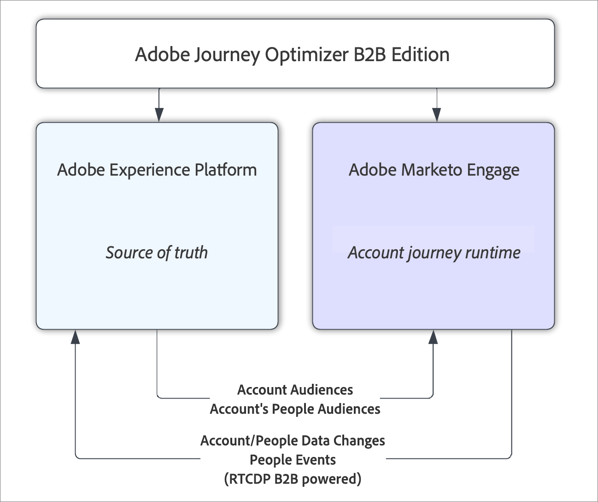

# Panoramica dell’edizione B2B di Adobe Journey Optimizer

Con Adobe Journey Optimizer B2B Edition, puoi orchestrare account e percorsi di gruppi di acquisto utilizzando l’intelligenza artificiale generativa integrata e l’automazione leader del settore per massimizzare la domanda di offerte specifiche utilizzando gruppi di acquisto qualificati per il marketing.

## Percorsi di account con gruppi di acquisto

Confrontando Adobe Journey Optimizer B2B Edition con Marketo Engage e Adobe Journey Optimizer Standard, la distinzione chiave è che i percorsi di account spostano gli account nel Percorso, non le persone. Una persona associata a un account ha molto probabilmente una progressione non lineare, in base all’avanzamento dell’account nel percorso, non basata sulle sue azioni individuali. Ad esempio, quando un account si trova nella fase iniziale del percorso di acquisto, le informazioni inviate potrebbero riguardare le funzionalità o le caratteristiche generali della soluzione. Più avanti nel processo di acquisto, il contenuto potrebbe diventare più mirato su offerte particolari o altri elementi destinati a chiudere una vendita. Dopo l’acquisto della soluzione, le informazioni potrebbero cambiare nuovamente per fornire guide pratiche, best practice o informazioni sui prossimi eventi, oppure con contenuti su ulteriori upselling. Anche se un utente non ha interagito con il contenuto della fase iniziale, desideri comunque farla avanzare alla fase corrente in base non alle proprie azioni, ma alle azioni di altre persone all’interno del proprio account o gruppo di acquisto.

## Architettura di alto livello

La versione B2B di Adobe Journey Optimizer utilizza _tipi di pubblico per account_ e _tipi di pubblico per persone_ dell&#39;account da Adobe Experience Platform per alimentare un percorso di account, eseguito all&#39;interno del Marketo Engage. L’Experience Platform è sempre la fonte di verità per questi dati, ma tutta l’esecuzione e l’elaborazione del percorso dell’account avviene all’interno dell’infrastruttura di marketing B2B di Marketo Engage. L’orchestrazione porta i dati all’Experience Platform quasi in tempo reale dal connettore di origine del Marketo Engage esistente, Adobe Real-Time CDP B2B Edition, che trasmette le modifiche dei dati da un Marketi Engage Experience Platform all’altro.

{width="600" zoomable="yes"}

### Modello di abbonamento

Una sottoscrizione Journey Optimizer B2B Edition è definita da una coppia di sandbox Experience Platform (AEP) con una sottoscrizione Marketo Engage _munchkin_. Non è possibile associare un singolo abbonamento di Marketo Engage a più sandbox di AEP. Se non si sceglie di utilizzare un abbonamento di Marketo Engage esistente con Journey Optimizer B2B Edition o non si utilizza attualmente il Marketo Engage, viene effettuato il provisioning con un nuovo abbonamento di Marketo Engage vuoto da utilizzare con Journey Optimizer B2B Edition.

Lo scopo di questo Experience Platform è quello di fornire una vista unificata dei dati provenienti dalle istanze del Marketo Engage (e da tutti i sistemi CRM collegati), e quindi di poter intervenire sui dati unificati utilizzando un percorso di account.

### Operazioni del percorso di conti

I percorsi di account vengono creati in Journey Optimizer B2B Edition e memorizzati nell’istanza di Marketo Engage associata all’abbonamento. Sebbene sia memorizzato nell’archivio dati del Marketo Engage, non è visibile dall’interfaccia utente del Marketo Engage ed è utilizzabile solo dalla Journey Optimizer B2B Edition.

Un percorso di account inizia sempre con la selezione di un segmento di account da utilizzare come pubblico di account per il percorso. La selezione del pubblico utilizza il componente standard del selettore del pubblico di Experience Platform. Gli addetti al marketing possono quindi implementare il percorso di account suddividendo i percorsi del percorso in base ai propri criteri, che possono includere criteri di account, persone o gruppi di acquisto. In ogni ramo è possibile eseguire azioni per implementare il percorso, ad esempio inviare un messaggio e-mail o attendere che si verifichi un evento.

Dopo la creazione, il percorso di account deve essere pubblicato. Al momento della pubblicazione, il percorso di account viene convalidato e convertito in una serie di campagne di Marketo Engage che implementano l’esperienza di percorso e Data Integration Services viene contattato per avviare il flusso di dati che, a sua volta, avvia le operazioni del percorso di account. Il primo passaggio consiste nel creare i segmenti per le persone dell’account.

### Flusso di dati

La versione B2B di Journey Optimizer utilizza la segmentazione dell’account di Real-Time CDP sia per la definizione che per l’esecuzione dei segmenti dell’account e dei segmenti della persona dell’account correlati richiesti dai percorsi. Quando viene eseguito un percorso pubblicato, i dati sulle persone e sugli account possono cambiare e i dati vengono raccolti sulle persone che interagiscono con il percorso. Journey Optimizer B2B Edition si basa sul connettore di origine del Marketo Engage per Real-Time CDP B2B Edition per riportare le modifiche dei dati alla sandbox Experience Platform, che è la sorgente di verità.  Questi dati vengono consegnati ad AEP quasi in tempo reale.

Solo i tipi di dati esistenti supportati dal connettore di origine del Marketo Engage (account, persone e opportunità) tornano in Real-Time CDP. Ciò significa che i dati del gruppo di acquisto non fluiscono in AEP e risiedono invece nell’istanza di Marketo Engage utilizzata dall’abbonamento Journey Optimizer B2B Edition.

