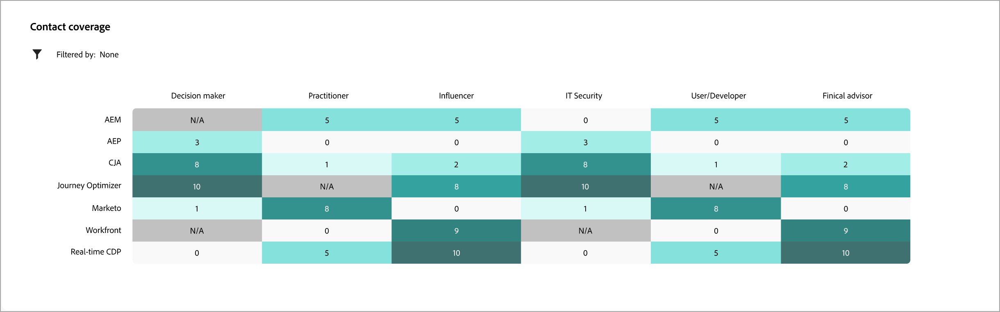

# Dettagli dell’account

Quando si fa clic sul nome di un account in un punto qualsiasi di Journey Optimizer B2B edition, vengono visualizzati i relativi dettagli. Queste informazioni forniscono informazioni utili sull’account, inclusi i riepiloghi generativi di IA.

{width="700" zoomable="yes"}

{{intent-data-note}}

La pagina dei dettagli dell’account è composta da tre sezioni principali:

## Panoramica dell’account

{zoomable="yes"}

La sezione Panoramica account include le seguenti informazioni sull&#39;account:

* Nome account
* Numero di persone nell’account
* Settore
* Opportunità aperte
* I tre percorsi di account più recenti in cui l’account è attualmente in uso (fai clic sul nome per aprire i dettagli del percorso)
* Riepilogo IA generativo dell’account, che include informazioni sui principali gruppi di acquisto coinvolti.

## Copertura contatti

{width="800" zoomable="yes"}

Nella sezione _[!UICONTROL Copertura dei contatti]_ viene visualizzato il numero di contatti dell&#39;account con un ruolo specifico associato a un interesse della soluzione. L’assegnazione del ruolo e dell’interesse nella soluzione si basa sul modello dei ruoli del gruppo di acquisto. Fare clic su una cella per visualizzare informazioni dettagliate:

* Descrizione, nel formato seguente: _x persone hanno il ruolo y per l&#39;interesse della soluzione z_
* Colonne
* Nome
* Account
* Qualifica
* Gruppo acquisti
* Punteggio di coinvolgimento della persona
* Ultima attività
* Dettagli

Fai clic sull&#39;icona _Filtro_ (  ) in alto a sinistra per filtrare la visualizzazione dei dati utilizzando uno dei seguenti attributi:

* Interesse della soluzione
* Periodo temporale

## Sovrapposizione contatti

{width="800" zoomable="yes"}

Nella sezione _[!UICONTROL Sovrapposizione contatti]_ vengono visualizzati i contatti dell&#39;account che fanno parte di più gruppi di acquisto in seguito all&#39;associazione a diversi interessi della soluzione. Queste informazioni sono sotto forma di una tabella con le seguenti colonne:

* Nome
* Qualifica
* Account
* Interesse della soluzione

Fai clic su _Informazioni_ (  ) accanto al nome del contatto per visualizzare una tabella con i dettagli seguenti:

* Gruppo di acquisto (fare clic sul nome per aprire i dettagli del gruppo di acquisto)
* Ruolo
* Interesse della soluzione
* Intento prodotto (se configurato)
* Prodotto

Fai clic sull&#39;icona _Filtro_ (  ) in alto a sinistra per filtrare la visualizzazione dei dati utilizzando uno dei seguenti attributi:

* Interesse della soluzione
* Ruoli
