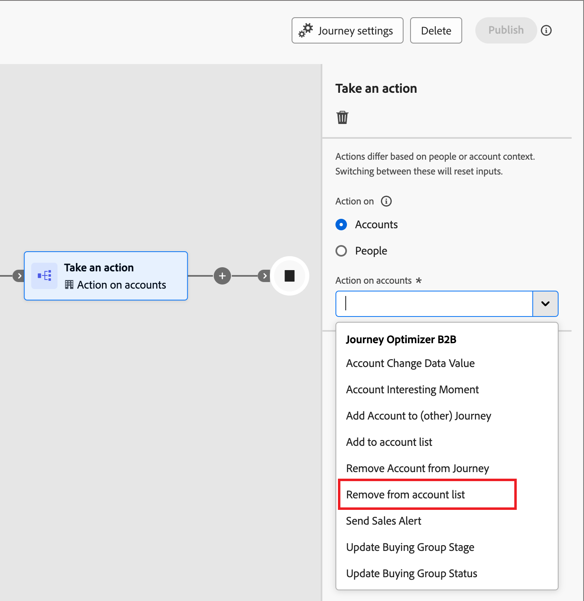

# Utilizzare gli elenchi di account nei percorsi

Esistono diversi modi per incorporare gli elenchi di account live (pubblicati) nei percorsi di account.

## Nodo pubblico account

Tutti i percorsi di account iniziano con un nodo [_Pubblico account_](../journeys/account-audience-nodes.md). Quando si imposta questo nodo per l&#39;utilizzo di un elenco di account, gli account membro si spostano nel percorso quando diventa attivo (pubblicato).

1. Selezionare l&#39;opzione **[!UICONTROL Elenco account]** per il nodo _Pubblico account_ iniziale.

   {width="500"}

1. Fare clic su **[!UICONTROL Aggiungi elenco account]**.

1. Selezionare la casella di controllo per l&#39;elenco degli account e fare clic su **[!UICONTROL Salva]**.

   {width="600" zoomable="yes"}

## Prendi un nodo azione - Aggiungi all’account

**_Solo elenchi account statici_**

All&#39;interno di un percorso di account, aggiungi account a un elenco di account statico utilizzando [a _Esegui un&#39;azione_ nodo](../journeys/action-nodes.md).

Ad esempio, disponi di un percorso di percorso in cui invii un’e-mail e alcuni account eseguono varie azioni come risposta. Consideri questa attività come un punto di qualificazione nel percorso. Con la qualifica, desideri aggiungerli a un elenco di account utilizzato come pubblico per un altro percorso con un flusso diverso per gli account idonei.

>[!NOTE]
>
>Se durante l’esecuzione del nodo è già presente un account nell’elenco, l’azione viene ignorata.

1. Selezionare l&#39;opzione _[!UICONTROL Azione su]_ **[!UICONTROL Account]**.

1. Per _[!UICONTROL Azione sugli account]_, scegli **[!UICONTROL Aggiungi all&#39;elenco degli account]**.

   {width="500"}

1. Per **[!UICONTROL Selezionare l&#39;elenco di account statici attivi]**, scegliere l&#39;elenco di account in cui si desidera aggiungere gli account.

   {width="500"}

## Crea un nodo di azione - Rimuovi dall’account

**_Solo elenchi account statici_**

All&#39;interno di un percorso di account, rimuovere gli account da un elenco di account statici utilizzando [a _Esegui un&#39;azione_ nodo](../journeys/action-nodes.md).

Ad esempio, disponi di un percorso di percorso in cui invii un’e-mail e alcuni account eseguono varie azioni come risposta. Consideri questa attività come un punto di qualificazione nel percorso. Con questa qualifica, vuoi rimuoverli da un elenco di account. Questo elenco viene utilizzato come pubblico per un altro percorso che invia e-mail aggiuntive in modo da non duplicare le comunicazioni relative alle qualifiche.

>[!NOTE]
>
>Se un account non è presente nell&#39;elenco in cui è pianificata la rimozione, l&#39;azione viene ignorata.

1. Selezionare l&#39;opzione _[!UICONTROL Azione su]_ **[!UICONTROL Account]**.

1. Per _[!UICONTROL Azione sugli account]_, scegli **[!UICONTROL Rimuovi dall&#39;elenco degli account]**.

   {width="500"}

1. Per **[!UICONTROL Selezionare l&#39;elenco di account statici attivi]**, scegliere l&#39;elenco di account in cui si desidera rimuovere gli account.

   {width="500"}
