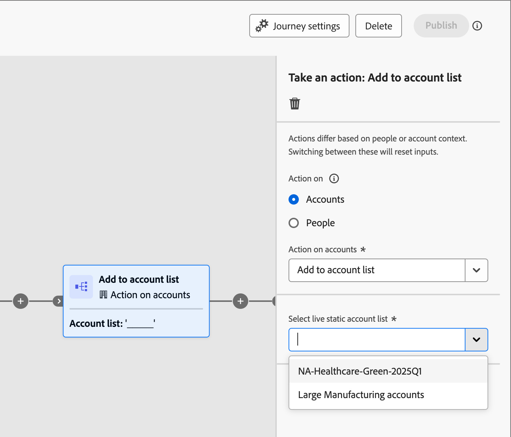

# Utilizzare gli elenchi di account in percorsi e programmi

Esistono diversi modi per incorporare gli elenchi di account live (pubblicati) nei percorsi di account.

## Nodo pubblico account

Tutti i percorsi di account iniziano con un nodo [_Pubblico account_](../journeys/account-audience-nodes.md). Quando si imposta questo nodo per l&#39;utilizzo di un elenco di account, gli account membro si spostano nel percorso quando diventa attivo (pubblicato).

1. Selezionare l&#39;opzione **[!UICONTROL Elenco account]** per il nodo _Pubblico account_ iniziale.

   {width="500"}

1. Fare clic su **[!UICONTROL Aggiungi elenco account]**.

1. Selezionare la casella di controllo per l&#39;elenco degli account e fare clic su **[!UICONTROL Salva]**.

   {width="600" zoomable="yes"}

## Prendi un nodo azione - Aggiungi all’account

**_Solo elenchi account statici_**

All&#39;interno di un percorso di account, aggiungi account a un elenco di account statico utilizzando [a _Esegui un&#39;azione_ nodo](../journeys/action-nodes.md).

Ad esempio, potresti avere un percorso di percorso in cui invii un’e-mail e alcuni account eseguono varie azioni come azioni di risposta. Consideri questa attività come un punto di qualificazione nel percorso e vuoi aggiungerla a un elenco di account utilizzato come pubblico per un altro percorso con un flusso diverso per gli account qualificati.

>[!NOTE]
>
>Se durante l’esecuzione del nodo è già presente un account nell’elenco, l’azione viene ignorata.

1. Selezionare l&#39;opzione _[!UICONTROL Azione su]_ **[!UICONTROL Account]**.

1. Per _[!UICONTROL Azione sugli account]_, scegli **[!UICONTROL Aggiungi all&#39;elenco degli account]**.

   {width="500"}

1. Per **[!UICONTROL Selezionare l&#39;elenco di account statici attivi]**, scegliere l&#39;elenco di account in cui si desidera aggiungere gli account.

   {width="500"}

## Crea un nodo di azione - Rimuovi dall’account

**_Solo elenchi account statici_**

All&#39;interno di un percorso di account, rimuovere gli account da un elenco di account statici utilizzando [a _Esegui un&#39;azione_ nodo](../journeys/action-nodes.md).

Ad esempio, potresti avere un percorso di percorso in cui invii un’e-mail e alcuni account eseguono varie azioni come azioni di risposta. Consideri questa attività come un punto di qualificazione nel percorso e vuoi rimuoverla da un elenco di account utilizzato come pubblico per un altro percorso che invia e-mail aggiuntive in modo da non duplicare le comunicazioni di qualificazione.

>[!NOTE]
>
>Se un account non è presente nell&#39;elenco in cui è pianificata la rimozione, l&#39;azione viene ignorata.

1. Selezionare l&#39;opzione _[!UICONTROL Azione su]_ **[!UICONTROL Account]**.

1. Per _[!UICONTROL Azione sugli account]_, scegli **[!UICONTROL Rimuovi dall&#39;elenco degli account]**.

   {width="500"}

1. Per **[!UICONTROL Selezionare l&#39;elenco di account statici attivi]**, scegliere l&#39;elenco di account in cui si desidera rimuovere gli account.

   {width="500"}

## Programma Marketo Engage - Elenco membri dell&#39;account

In qualità di addetto al marketing, potresti voler eliminare i programmi in Marketo Engage per le persone che fanno parte degli elenchi di account in Journey Optimizer B2B edition.

Nell&#39;istanza di Marketo Engage connessa a Journey Optimizer B2B edition, è possibile utilizzare il filtro _[!UICONTROL Membro dell&#39;elenco account]_ negli elenchi smart per identificare questi lead in base alla strategia della campagna. Per ulteriori informazioni sugli elenchi avanzati, consulta la [documentazione di Marketo Engage](https://experienceleague.adobe.com/en/docs/marketo/using/product-docs/core-marketo-concepts/smart-lists-and-static-lists/understanding-smart-lists){target="_blank"}.

### Aggiungere il filtro a un elenco avanzato

1. In Marketo Engage, seleziona una campagna e fai clic sulla scheda **[!UICONTROL Elenco avanzato]**.

1. Nell&#39;elenco filtri visualizzato a destra, immettere `Member` e individuare il filtro **[!UICONTROL Membro dell&#39;elenco account]**.

1. Trascinare il filtro nell&#39;area di lavoro Elenco avanzato.

1. Nell&#39;area di lavoro Elenco avanzato impostare il valore dell&#39;elenco **[!UICONTROL Membro dell&#39;account]**.

   Fare clic sulla freccia rivolta verso il basso per visualizzare tutti gli elenchi dei conti oppure immettere parte del nome dell&#39;elenco dei conti per individuare l&#39;elenco dei conti desiderato.

   {width="800" zoomable="yes"}

1. Nel flusso della campagna, aggiungi il passaggio **[!UICONTROL Aggiungi all&#39;elenco]** e scegli l&#39;elenco in cui desideri popolare le persone dall&#39;elenco degli account di Journey Optimizer B2B edition.

   Per informazioni dettagliate sull&#39;aggiunta di passaggi a un flusso, consulta _[Aggiungere un passaggio di flusso a una campagna avanzata](https://experienceleague.adobe.com/en/docs/marketo/using/product-docs/core-marketo-concepts/smart-campaigns/flow-actions/add-a-flow-step-to-a-smart-campaign){target="_blank"}_ nella documentazione di Marketo Engage.

### Esamina i membri

Dopo l’esecuzione del flusso, puoi visualizzare l’elenco delle persone popolate nell’elenco. Aprire l&#39;elenco e selezionare la scheda Persone.

{width="800" zoomable="yes"}

