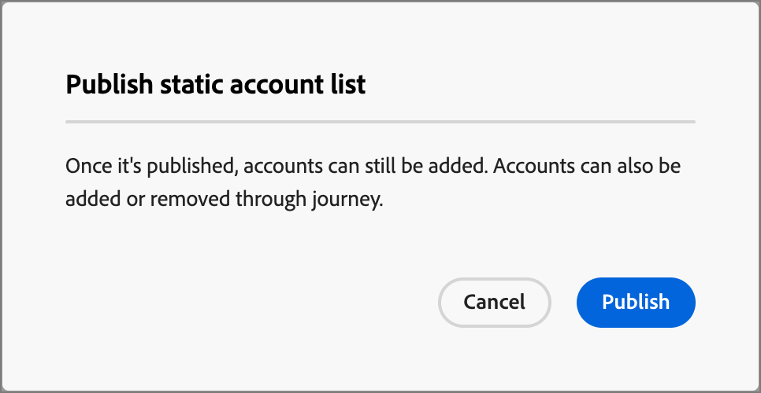
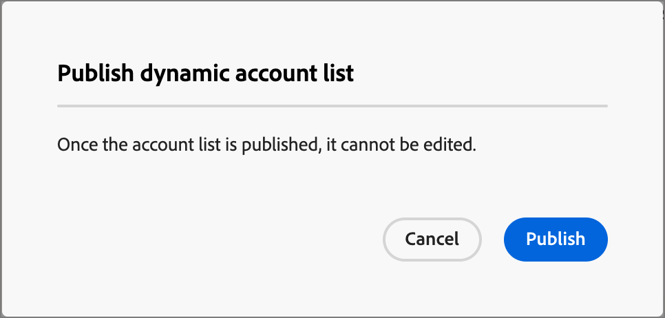
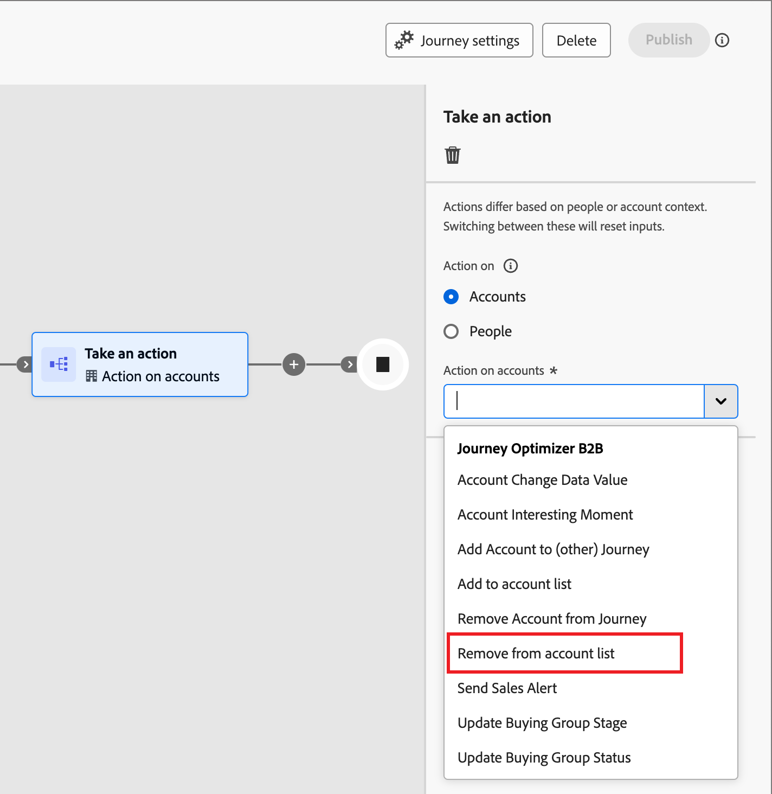

# Elenchi account

Un elenco di account è una raccolta di account denominati che gli addetti al marketing possono utilizzare per l’orchestrazione del percorso di destinazione. Un elenco di conti può eseguire il targeting dei conti denominati in base a criteri definiti, ad esempio settore, posizione o dimensioni dell’azienda. Esistono due tipi di elenchi di account:

* **Statico** - Con un elenco di account statico, l&#39;elenco cambia solo quando si aggiungono gli account. È possibile aggiungere manualmente account applicando un set di filtri per compilare l&#39;elenco in base ai dati del conto corrente oppure aggiungere e rimuovere account tramite un percorso di account.
* **Dinamico** - Con un elenco account dinamico, si definisce un set di filtri per la cura automatica dell&#39;elenco. Il sistema utilizza questo set di filtri per aggiungere e rimuovere account in base alle modifiche apportate alle informazioni sull&#39;account. Questa gestione degli elenchi è simile alla [segmentazione del pubblico in Real-time Customer Data Platform](https://experienceleague.adobe.com/en/docs/experience-platform/rtcdp/segmentation/b2b).

Quando un elenco account è nello stato _Live_ (pubblicato), è disponibile per l&#39;utilizzo in percorsi di account.

## Accedere e sfogliare gli elenchi di account

Nel menu di navigazione sinistro, espandere **[!UICONTROL Account]** e fare clic su **[!UICONTROL Elenchi account]**.

{width="800" zoomable="yes"}

La pagina _[!UICONTROL Elenchi account]_ visualizzata include le colonne seguenti:

* [!UICONTROL Nome] (fare clic sul nome dell&#39;elenco account per visualizzare i dettagli)
* [!UICONTROL Stato]
* [!UICONTROL Tipo]
* [!UICONTROL Ultimo aggiornamento:]
* [!UICONTROL Ultimo aggiornamento effettuato da]
* [!UICONTROL Data di creazione]
* [!UICONTROL Creato da]

Questa tabella include la possibilità di eseguire ricerche per nome. La funzione di ordinamento non è attualmente disponibile.

Puoi personalizzare la tabella visualizzata facendo clic sull&#39;icona _Impostazioni colonna_ (  ) nell&#39;angolo in alto a destra e selezionando o deselezionando le caselle di controllo.

{width="300"}

Per visualizzare la descrizione di un elenco di account, fai clic sull&#39;icona _Informazioni_ (  ) accanto al nome.

## Creare un elenco di account

Quando crei un elenco di conti, definisci un set di filtri per generare l’elenco. Ad esempio, puoi utilizzarlo per generare un elenco di account in cui il settore sanitario e i ricavi sono superiori a 100 milioni di dollari.

1. Nella pagina _[!UICONTROL Elenchi account]_, fai clic su **[!UICONTROL Crea elenco account]** in alto a destra nella pagina.

   {width="700" zoomable="yes"}

1. Nella finestra di dialogo _[!UICONTROL Crea elenco account]_, immetti un **[!UICONTROL Nome]** univoco (obbligatorio) e una **[!UICONTROL Descrizione]** (facoltativo).

1. Scegli il _[!UICONTROL Tipo]_ per l&#39;elenco account, **[!UICONTROL Statico]** o **[!UICONTROL Dinamico]**.

   {width="380"}

1. Fai clic su **[!UICONTROL Crea]**.

   Viene aperto un nuovo elenco di account statici con un elenco di account vuoto. Verrà aperto un nuovo elenco di account dinamici con il pannello _[!UICONTROL Aggiungi account per filtro]_ nella pagina.

## Aggiungi account all&#39;elenco degli account

Per un elenco statico, puoi procedere alla pubblicazione dell’elenco degli account vuoto e aggiungere account tramite un percorso di account. Puoi anche aggiungere manualmente gli account applicando un set di filtri prima di pubblicarlo.

Per un elenco di account dinamici, è necessario aggiungere il set di filtri che si desidera utilizzare per gestire l’elenco automaticamente prima di pubblicarlo.

>[!BEGINTABS]

>[!TAB Elenco account statico]

Dopo aver creato l’elenco degli account statici, puoi compilarlo applicando un set di filtri. Puoi anche applicare un set di filtri per aggiungere account a un elenco di account statici dopo la pubblicazione (_Live_).

>[!NOTE]
>
>Se desideri che l’elenco degli account inizi come vuoto, non selezionare alcun filtro e pubblica semplicemente l’elenco degli account. È utile iniziare con un elenco vuoto quando si prevede di aggiungere membri tramite un&#39;azione di percorso dell&#39;account (vedere [Eseguire un&#39;azione - Aggiungi all&#39;account](#take-an-action-node---add-to-account)).

1. Selezionare **[!UICONTROL Aggiungi account]**.

   {width="700" zoomable="yes"}

   Puoi accedere a questa funzione nella pagina dell’elenco vuota o in alto a destra.

1. Nella finestra di dialogo _[!UICONTROL Aggiungi account per filtro]_, utilizza il menu **[!UICONTROL Filtri account]** per aggiungere gli attributi e le attività che desideri utilizzare per creare il set di filtri:

   I filtri sono nidificati in cartelle di categorie. Puoi espandere ogni cartella e scorrere gli elenchi dei filtri disponibili. In alternativa, utilizza lo strumento _Ricerca_ nella parte superiore per individuare il filtro necessario.

   * Trascina e rilascia il filtro dal menu a sinistra fino allo spazio di definizione del filtro.
   * Completa la definizione della valutazione della corrispondenza.
   * Ripetere queste operazioni per ogni filtro che si desidera includere.

     {width="700" zoomable="yes"}

   * Puoi ottimizzare le condizioni applicando la **[!UICONTROL logica di filtro]** nella parte superiore. Puoi scegliere di soddisfare tutte le condizioni dell’attributo o qualsiasi condizione.

     {width="450"}

1. Al termine del set di filtri e della logica, fare clic su **[!UICONTROL Popola account]**.

   Il processo di popolamento potrebbe richiedere un po’ di tempo, a seconda del numero di account da valutare e popolare (le dimensioni del database e i criteri di filtro selezionati). La compilazione degli account nell’elenco può richiedere fino a due ore.

Puoi procedere alla pubblicazione dell’elenco per renderlo disponibile per le azioni di aggiunta e rimozione in un percorso di account.

>[!TAB Elenco account dinamico]

Dopo aver creato un elenco di account dinamici, puoi definire il set di filtri utilizzato per gestire l&#39;elenco (aggiungere/rimuovere account) quando è _Live_ (pubblicato). Non è possibile aggiungere/rimuovere account tramite percorsi di account, ma è disponibile un elenco di account dinamici pubblicato per il nodo di pubblico dell’account iniziale.

1. Fare clic su **[!UICONTROL Seleziona filtri]**.

   {width="700" zoomable="yes"}

1. Nella finestra di dialogo _[!UICONTROL Aggiungi account per filtro]_, utilizza il menu **[!UICONTROL Filtri account]** per aggiungere gli attributi e i filtri speciali che desideri utilizzare per creare il set di filtri:

   I filtri sono nidificati in cartelle di categorie. Puoi espandere ogni cartella e scorrere gli elenchi dei filtri disponibili. In alternativa, utilizza lo strumento _Ricerca_ nella parte superiore per individuare il filtro necessario.

   * Trascina e rilascia il filtro dal menu a sinistra fino allo spazio di definizione del filtro.
   * Completa la definizione della valutazione della corrispondenza.
   * Ripetere queste operazioni per ogni filtro che si desidera includere.

     {width="700" zoomable="yes"}

   * Puoi ottimizzare le condizioni applicando la **[!UICONTROL logica di filtro]** nella parte superiore. Puoi scegliere di soddisfare tutte le condizioni dell’attributo o qualsiasi condizione.

     {width="450"}

1. Al termine del set di filtri e della logica, fare clic su **[!UICONTROL Fine]**.

   Se si è soddisfatti del set di filtri, è possibile procedere alla [pubblicazione dell&#39;elenco](#publish-an-account-list) per renderlo disponibile per il [nodo di pubblico dell&#39;account](#account-audience-node) iniziale in un percorso di account.

   >[!NOTE]
   >
   >Non puoi aggiornare i filtri per un elenco di account dinamici dopo la pubblicazione dell’elenco.

   Il processo di popolamento potrebbe richiedere un po’ di tempo, a seconda del numero di account da valutare e popolare (le dimensioni del database e i criteri di filtro selezionati). La compilazione degli account nell’elenco può richiedere fino a due ore.

>[!ENDTABS]

## Pubblicare un elenco di account

Puoi procedere alla pubblicazione di un elenco di account non appena il set di filtri è completo.

>[!BEGINTABS]

>[!TAB Elenco account statico]

1. Fai clic su **[!UICONTROL Pubblica]** in alto a destra.

   {width="700" zoomable="yes"}

1. Nella finestra di dialogo _[!UICONTROL Pubblica elenco account statico]_, fai clic su **[!UICONTROL Pubblica]** per confermare.

   {width="400"}

Lo stato dell&#39;elenco account statico diventa _[!UICONTROL Live]_ ed è disponibile per [l&#39;utilizzo in un percorso di account](#account-list-usage-in-account-journeys).

>[!TAB Elenco account dinamico]

Puoi procedere alla pubblicazione di un elenco di account dinamici non appena il set di filtri è completo. Una volta che l’elenco degli account è nello stato Live, è disponibile per la selezione in un nodo percorso di tipi di pubblico Account.

1. Fai clic su **[!UICONTROL Pubblica]** in alto a destra.

   {width="700" zoomable="yes"}

1. Nella finestra di dialogo _[!UICONTROL Pubblica elenco account dinamici]_, fai clic su **[!UICONTROL Pubblica]** per confermare.

   {width="400"}

Lo stato dell&#39;elenco degli account dinamici cambia in _[!UICONTROL Live]_ ed è disponibile per [l&#39;utilizzo in un percorso di account](#account-list-usage-in-account-journeys).

>[!ENDTABS]

## Utilizzo dell’elenco account nei percorsi di account

Esistono tre modi per incorporare gli elenchi di account live (pubblicati) nei percorsi di account:

### Nodo pubblico account

1. Selezionare **[!UICONTROL Elenco account]** per il nodo _Pubblico account_ iniziale.

   {width="500"}

1. Fare clic su **[!UICONTROL Aggiungi elenco account]**.

1. Selezionare la casella di controllo per l&#39;elenco degli account e fare clic su **[!UICONTROL Salva]**.

   {width="600" zoomable="yes"}

Gli account nell’elenco vengono spostati nel percorso quando è attivo (pubblicato).

### Prendi un nodo azione - Aggiungi all’account

**_Solo elenchi account statici_**

Aggiungi account a un elenco di account statici utilizzando [a _Esegui un&#39;azione_ nodo](../journeys/action-nodes.md).

Ad esempio, potresti avere un percorso di percorso in cui invii un’e-mail e alcuni account eseguono varie azioni come azioni di risposta. Consideri questa attività come un punto di qualificazione nel percorso e vuoi aggiungerla a un elenco di account utilizzato come pubblico per un altro percorso con un flusso diverso per gli account qualificati.

>[!NOTE]
>
>Se durante l’esecuzione del nodo è già presente un account nell’elenco, l’azione viene ignorata.

1. Selezionare l&#39;opzione _[!UICONTROL Azione su]_ **[!UICONTROL Account]**.

1. Per _[!UICONTROL Azione sugli account]_, scegli **[!UICONTROL Aggiungi all&#39;elenco degli account]**.

   {width="500"}

1. Per **[!UICONTROL Selezionare l&#39;elenco di account statici attivi]**, scegliere l&#39;elenco di account in cui si desidera aggiungere gli account.

   {width="500"}

### Crea un nodo di azione - Rimuovi dall’account

**_Solo elenchi account statici_**

Rimuovere account da un elenco di account statici utilizzando [a _Esegui un&#39;azione_ nodo](../journeys/action-nodes.md).

Ad esempio, potresti avere un percorso di percorso in cui invii un’e-mail e alcuni account eseguono varie azioni come azioni di risposta. Consideri questa attività come un punto di qualificazione nel percorso e vuoi rimuoverla da un elenco di account utilizzato come pubblico per un altro percorso che invia e-mail aggiuntive in modo da non duplicare le comunicazioni di qualificazione.

>[!NOTE]
>
>Se un account non è presente nell&#39;elenco in cui è pianificata la rimozione, l&#39;azione viene ignorata.

1. Selezionare l&#39;opzione _[!UICONTROL Azione su]_ **[!UICONTROL Account]**.

1. Per _[!UICONTROL Azione sugli account]_, scegli **[!UICONTROL Rimuovi dall&#39;elenco degli account]**.

   {width="500"}

1. Per **[!UICONTROL Selezionare l&#39;elenco di account statici attivi]**, scegliere l&#39;elenco di account in cui si desidera rimuovere gli account.

   {width="500"}
