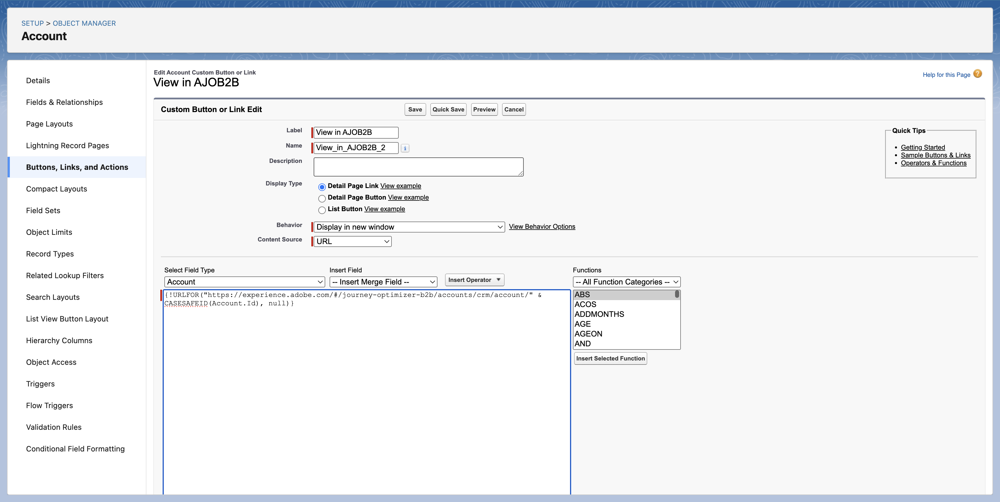
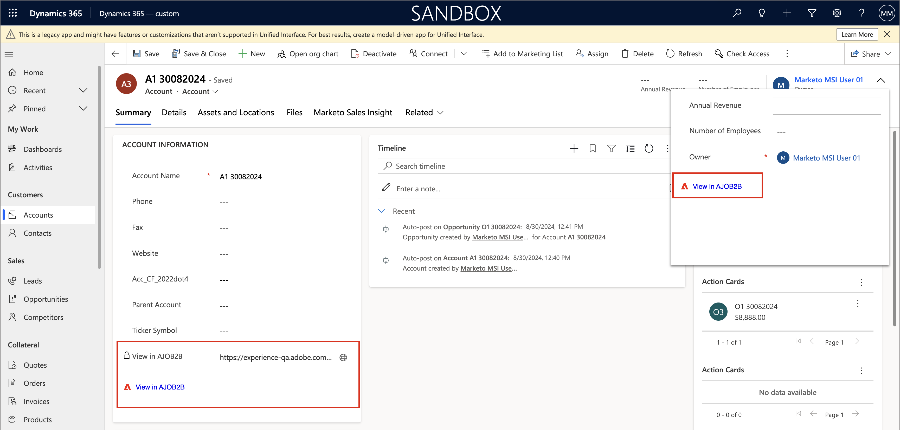
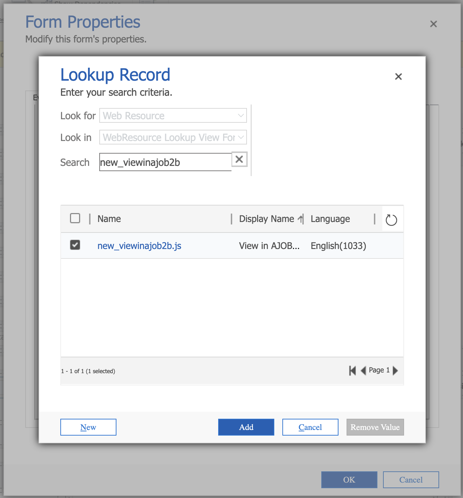
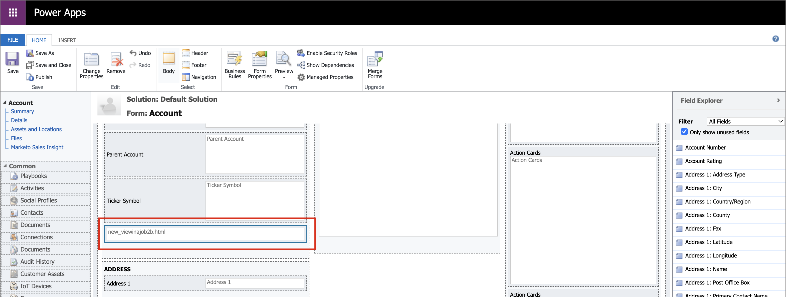

# Accesso in-CRM alle pagine dei dettagli

Adobe Journey Optimizer B2B edition consente ai membri del team vendite e ai responsabili dell&#39;account di accedere a pagine dettagliate per informazioni sull&#39;account e sul gruppo di acquisto direttamente dallo strumento CRM (Customer Relationship Management), ad esempio Salesforce o Microsoft Dynamics. Grazie a questa integrazione, i rappresentanti commerciali possono accedere rapidamente agli account in tempo reale e a informazioni approfondite sul gruppo di acquisto, come la cronologia del coinvolgimento, i segnali di intento e i consigli generati dall’intelligenza artificiale. Questa funzionalità consente al team di vendita di raggiungere più rapidamente i clienti, definire le priorità in modo più intelligente e allinearsi meglio al reparto marketing.

Per consentire ai membri del team vendite di visualizzare [dettagli account](account-details.md) e [dettagli persona](person-details.md) pagine in Journey Optimizer B2B edition dal CRM, l&#39;amministratore di Salesforce o Dynamics può aggiungere un collegamento Journey Optimizer B2B edition dalla visualizzazione account, contatto o lead.

Quando un membro del team vendite utilizza il collegamento dell&#39;istanza di gestione delle relazioni con i clienti, la sandbox deve essere _Prod_ e l&#39;organizzazione IMS è determinata in base alla seguente logica ordinata:

1. L’organizzazione più recente a cui l’utente ha effettuato l’accesso
1. Il primo nell’elenco con un ordinamento alfabetico
1. L’organizzazione selezionata nelle preferenze

## Collegamenti Salesforce

Un amministratore di Salesforce con l&#39;autorizzazione _Personalizza applicazione_ può configurare il collegamento nel layout Account, Contatto o Lead. I collegamenti configurati consentono agli utenti Vendite di accedere alla pagina dei dettagli dell’account o della persona corrispondente in Adobe Journey Optimizer B2B edition.

In Salesforce, aggiungi il collegamento personalizzato come pulsante, collegamento ipertestuale o icona collegata e personalizzalo in base alle preferenze del tuo team.

{width="800" zoomable="yes"}

Per informazioni dettagliate sull&#39;aggiunta di un collegamento personalizzato in Salesforce, fare riferimento a [Definire pulsanti e collegamenti personalizzati](https://help.salesforce.com/s/articleView?id=platform.defining_custom_links.htm&type=5) nella documentazione di Salesforce.

Quando definisci l’URL di destinazione del collegamento, puoi utilizzare il layout dell’account, del contatto o del lead e collegarlo alla pagina dei dettagli corrispondente in Journey Optimizer B2B edition:

* **Account** - `https://experience.adobe.com/#/journey-optimizer-b2b/accounts/crm/account/[18-character ID of account]`

* **Contatto** - `https://experience.adobe.com/#/journey-optimizer-b2b/accounts/crm/contact/[18-character ID of contact]`

* **Lead** - `https://experience.adobe.com/#/journey-optimizer-b2b/accounts/crm/lead/[18-character ID of lead]`

Utilizzare l&#39;oggetto `Account` per recuperare l&#39;ID di 18 caratteri dell&#39;account, ad esempio `CASESAFEID(Account.Id)` o `CASESAFEID(Id)`.

**_Esempi:_**

+++Collegamento campo

1. In Salesforce, vai a **[!UICONTROL Configurazione]** > **[!UICONTROL Gestione oggetti]** > **[!UICONTROL Account]**/**[!UICONTROL Contatto]**/**[!UICONTROL Lead]** > **[!UICONTROL Campi e relazioni]**.
1. Fai clic su **[!UICONTROL Nuovo]** per creare un campo formula (testo) e aggiungerlo a un layout _Account_, _Contatto_ o _Lead_.

   Per la formula, utilizzare gli esempi seguenti come guida.

   Collegamento ipertestuale **_Text:_**

   * Account - `HYPERLINK("https://experience.adobe.com/#/journey-optimizer-b2b/accounts/crm/account/" & CASESAFEID(Id), "View in AJO B2B")`
   * Contatto - `HYPERLINK("https://experience.adobe.com/#/journey-optimizer-b2b/accounts/crm/contact/" & CASESAFEID(Id), "View in AJO B2B")`
   * Lead - `HYPERLINK("https://experience.adobe.com/#/journey-optimizer-b2b/accounts/crm/lead/" & CASESAFEID(Id), "View in AJO B2B")`

   Collegamento ipertestuale **_Icona:_**

   * Account - `HYPERLINK("https://experience.adobe.com/#/journey-optimizer-b2b/accounts/crm/account/" & CASESAFEID(Id), IMAGE("https://cdn.experience.adobe.net/assets/HeroIcons.6620f5dc.svg#AdobeExperienceSubCloud", "View in AJO B2B", 24, 24))`
   * Contatto - `HYPERLINK("https://experience.adobe.com/#/journey-optimizer-b2b/accounts/crm/contact/" & CASESAFEID(Id), IMAGE("https://cdn.experience.adobe.net/assets/HeroIcons.6620f5dc.svg#AdobeExperienceSubCloud", "View in AJO B2B", 24, 24))`
   * Contatto - `HYPERLINK("https://experience.adobe.com/#/journey-optimizer-b2b/accounts/crm/lead/" & CASESAFEID(Id), IMAGE("https://cdn.experience.adobe.net/assets/HeroIcons.6620f5dc.svg#AdobeExperienceSubCloud", "View in AJO B2B", 24, 24))`

   {width="800" zoomable="yes"}

1. Aggiorna la pagina per visualizzare le modifiche al layout. Vai a **[!UICONTROL Profilo]** e seleziona un&#39;altra opzione in **[!UICONTROL DENSITÀ VISUALIZZAZIONE]**.

   {width="450" zoomable="yes"}

+++

+++Collegamento pagina dettagli

1. In Salesforce, vai a **[!UICONTROL Configurazione]** > **[!UICONTROL Gestione oggetti]** > **[!UICONTROL Account]**/**[!UICONTROL Contatto]**/**[!UICONTROL Lead]** > **[!UICONTROL Pulsanti, collegamenti e azioni]**.
1. Fai clic su **[!UICONTROL Nuovo pulsante o collegamento]** nell&#39;angolo in alto a destra e crea il collegamento alla pagina dei dettagli.

   Per la formula, utilizzare gli esempi seguenti come guida.

   * Account - `{!URLFOR("https://experience.adobe.com/#/journey-optimizer-b2b/accounts/crm/account/" & CASESAFEID(Account.Id), null)}`
   * Contatto - `{!URLFOR("https://experience.adobe.com/#/journey-optimizer-b2b/accounts/crm/contact/" & CASESAFEID(Contact.Id), null)}`
   * Lead - `{!URLFOR("https://experience.adobe.com/#/journey-optimizer-b2b/accounts/crm/lead/" & CASESAFEID(Lead.Id), null)}`

   {width="800" zoomable="yes"}

1. Vai a **[!UICONTROL Layout di pagina]** nel menu di navigazione a sinistra.

1. Trascina il collegamento da **[!UICONTROL Collegamenti personalizzati]** e rilascialo nella sezione _Collegamenti personalizzati_ nel layout.

+++

+++Pulsante pagina dettagli

1. In Salesforce, vai a **[!UICONTROL Configurazione]** > **[!UICONTROL Gestione oggetti]** > **[!UICONTROL Account]**/**[!UICONTROL Contatto]**/**[!UICONTROL Lead]** > **[!UICONTROL Pulsanti, collegamenti e azioni]**.
1. Fai clic su **[!UICONTROL Nuovo pulsante o collegamento]** nell&#39;angolo in alto a destra e crea il pulsante della pagina dei dettagli.

   Per il **[!UICONTROL Tipo di visualizzazione]**, scegliere **[!UICONTROL Collegamento pagina dettagli]**.

   Per la formula, utilizzare gli esempi seguenti come guida.

   * Account - `{!URLFOR("https://experience.adobe.com/#/journey-optimizer-b2b/accounts/crm/account/" & CASESAFEID(Account.Id), null)}`
   * Contatto - `{!URLFOR("https://experience.adobe.com/#/journey-optimizer-b2b/accounts/crm/contact/" & CASESAFEID(Contact.Id), null)}`
   * Lead - `{!URLFOR("https://experience.adobe.com/#/journey-optimizer-b2b/accounts/crm/lead/" & CASESAFEID(Lead.Id), null)}`

   {width="800" zoomable="yes"}

1. Vai a **[!UICONTROL Layout di pagina]** nel menu di navigazione a sinistra.

1. Trascina il pulsante da **[!UICONTROL Azioni per dispositivi mobili e fulmini]** e rilascialo nella sezione **[!UICONTROL Azioni per dispositivi mobili e fulmini di Salesforce]** nel layout.

   {width="800" zoomable="yes"}

+++

## Collegamenti Microsoft Dynamics

Uno sviluppatore Dynamics può estendere l’entità Account, Contatto o Lead per aggiungere un campo collegamento. I collegamenti configurati consentono agli utenti Vendite di accedere alla pagina dei dettagli dell’account o della persona corrispondente in Adobe Journey Optimizer B2B edition.

Aggiungere il collegamento personalizzato come pulsante, collegamento ipertestuale o collegamento a un&#39;icona e personalizzarlo in base alle preferenze del team.

{width="800" zoomable="yes"}

Utilizzare le applicazioni avanzate per personalizzare le app basate su modelli di Microsoft, ad esempio i componenti Dynamics. Per informazioni dettagliate sull&#39;utilizzo di Power Apps per aggiungere un collegamento personalizzato in Dynamics, consulta la [documentazione di PowerApps](https://learn.microsoft.com/en-us/power-apps/maker/model-driven-apps/create-edit-web-resources).

Quando definisci l’URL di destinazione del collegamento, puoi utilizzare la visualizzazione account, contatto o lead e collegarlo alla pagina dei dettagli corrispondente in Journey Optimizer B2B edition:

* **Account** - `https://experience.adobe.com/#/journey-optimizer-b2b/accounts/crm/account/[Account ID]`

* **Contatto** - `https://experience.adobe.com/#/journey-optimizer-b2b/accounts/crm/contact/[Contact ID]`

* **Lead** - `https://experience.adobe.com/#/journey-optimizer-b2b/accounts/crm/lead/[Lead ID]`

**_Esempi:_**

+++Campo URL

Per aggiungere il collegamento personalizzato come campo URL, segui la sequenza di attività riportata di seguito:

**1 - Configura il campo della soluzione**

1. Vai a **[!UICONTROL Impostazioni avanzate]** > **[!UICONTROL Personalizza il sistema]** e seleziona la scheda **[!UICONTROL Soluzione]**.
1. Seleziona **[!UICONTROL Entità]** > **[!UICONTROL Account]**/**[!UICONTROL Contatto]**/**[!UICONTROL Lead]** > **[!UICONTROL Campi]**.
1. Fai clic su **[!UICONTROL Nuovo]** e configura il nuovo campo.

   {width="800" zoomable="yes"}

1. Salva la configurazione del campo.
1. Dalla scheda _[!UICONTROL Soluzione]_, seleziona **[!UICONTROL Risorse Web]**.
1. Fai clic su **[!UICONTROL Nuovo]** e configura la seguente risorsa Web Script (JScript):

   ```js
   function setViewInAjoB2b(executionContext) {
    var url = "https://experience.adobe.com/#/journey-optimizer-b2b/accounts/crm";
   
    var formContext = executionContext.getFormContext();
   
    // Get the entity ID (GUID)
    var id = formContext.data.entity.getId();
   
    // Get the entity type (account, lead, contact)
    var type = formContext.data.entity.getEntityName().toLowerCase();
   
    if (id && type) {
        // Remove curly braces
        id = id.replace(/[{}]/g, "").toLowerCase();
   
        // Set the value in the custom field (Ensure this field exists on the form)
        formContext.getAttribute("new_viewinajob2b").setValue(url + "/" + type + "/" + id);
       }
   }
   ```

   {width="800" zoomable="yes"}

1. Nella parte superiore della pagina, fai clic su **[!UICONTROL SALVA]** e quindi su **[!UICONTROL PUBBLICA]**.

**2 - Configura il modulo**

1. Nella scheda _Soluzione_, seleziona **[!UICONTROL Entità]** > **[!UICONTROL Account]**/**[!UICONTROL Contatto]**/**[!UICONTROL Lead]** > **[!UICONTROL Forms]** > **[!UICONTROL Account]**/**[!UICONTROL Contatto]**/**[!UICONTROL Lead]**.
1. Trascina il nuovo campo creato nella prima attività da **[!UICONTROL Esplora campi]** nella sezione **[!UICONTROL Riepilogo]**.

   {width="800" zoomable="yes"}

1. Fare doppio clic sul campo nella sezione _Riepilogo_ e configurarne le proprietà.

   {width="800" zoomable="yes"}

   Al termine della configurazione della proprietà, fare clic su **[!UICONTROL OK]**.

1. Nella barra multifunzione nella parte superiore della pagina, fai clic su **[!UICONTROL Salva]** e quindi su **[!UICONTROL Pubblica]**.

**3 - Aggiungi la risorsa Web JS alle raccolte moduli**

1. Nella scheda _[!UICONTROL Home]_ in alto, fai clic su **[!UICONTROL Proprietà modulo]**.
1. Fai clic su **[!UICONTROL Aggiungi]**.

   {width="500" zoomable="yes"}

1. Individuare la risorsa, selezionarla e fare clic su **[!UICONTROL Aggiungi]**.

   {width="500" zoomable="yes"}

1. Con la risorsa aggiunta selezionata, fai clic su **[!UICONTROL Aggiungi]** in _[!UICONTROL Gestori eventi]_.
1. Aggiungere la funzione `setViewInAjoB2b` in **[!UICONTROL Gestori eventi]**.
1. Con la funzione selezionata nell&#39;elenco _[!UICONTROL Gestori eventi]_, impostare **[!UICONTROL Controllo]** su `Form` e **[!UICONTROL Evento]** su `OnLoad`.

   {width="500" zoomable="yes"}

1. Fai clic su **[!UICONTROL OK]**.

1. Nella scheda _[!UICONTROL Home]_ in alto, fai clic su **[!UICONTROL Salva]** e quindi su **[!UICONTROL Pubblica]**.

**4 - Verifica il collegamento**

Per verificare il collegamento, seleziona la vista Account, Contatto o Lead in Dynamics.

{width="500" zoomable="yes"}

Se il collegamento non viene visualizzato, provare ad accedere ad Account, Contatti o Lead in **[!UICONTROL Clienti]** nella home page di Dynamics. Quindi torna all’account, al contatto o alla visualizzazione del lead specifici. Puoi anche provare a disconnetterti e ad accedere di nuovo.

+++

+++Risorsa Web HTML

Per aggiungere il collegamento personalizzato come risorsa Web HTML, segui la sequenza di attività riportata di seguito:

>[!NOTE]
>
>Questo esempio dipende dal modo in cui Dynamics utilizza le risorse Web della pagina Web.

**1 - Configura le risorse Web della soluzione**

1. Vai a **[!UICONTROL Impostazioni avanzate]** > **[!UICONTROL Personalizza il sistema]** e seleziona la scheda **[!UICONTROL Soluzione]**.

1. Nella scheda _[!UICONTROL Soluzione]_, seleziona **[!UICONTROL Risorse Web]**.

1. Fare clic su **[!UICONTROL Nuovo]** e configurare la seguente risorsa Web Script (JScript) utilizzando la funzione seguente:

   ```js
   function getFormContext(executionContext) {
       window.top["formContext"] = executionContext.getFormContext();
   }
   ```

   {width="800" zoomable="yes"}

1. Fai clic su **[!UICONTROL Nuovo]** per creare un&#39;altra risorsa Web e configurare una risorsa Web di pagina Web (HTML) utilizzando il seguente HTML:

   ```html
   <html>
   <head>
       <script>
       function onLoad(){
           // Adobe URL
           var url = "https://experience.adobe.com/#/journey-optimizer-b2b/accounts/crm";
   
           // Get the entity ID (GUID)
           var id = window.top.formContext.data.entity.getId();
   
           // Get the entity type (account, lead, contact)
           var type = window.top.formContext.data.entity.getEntityName().toLowerCase();
   
           if (id && type) {
               // Remove curly braces
               id = id.replace(/[{}]/g, "").toLowerCase();
               var url = url + "/" + type + "/" + id;
   
               // Find the hyperlink and set the href value
               var link = document.getElementById("link");
               link.href = url;
           }
       }
       </script>
   </head>
   <body onload="onLoad()" style="margin-left: 0;">
       <a id="link" style="text-decoration: none; font-family: sans-serif; font-size: 13px;" target="_blank">
           
           <span style="vertical-align: middle;">View in AJOB2B</span>
       </a>
   </body>
   </html>
   ```

1. Nella parte superiore della pagina, fai clic su **[!UICONTROL SALVA]** e quindi su **[!UICONTROL PUBBLICA]**.

**2 - Aggiungere le risorse Web JS alle raccolte moduli**

1. Nella scheda _Soluzione_, seleziona **[!UICONTROL Entità]** > **[!UICONTROL Account]**/**[!UICONTROL Contatto]**/**[!UICONTROL Lead]** > **[!UICONTROL Forms]** > **[!UICONTROL Account]**/**[!UICONTROL Contatto]**/**[!UICONTROL Lead]**.

1. Nella scheda _Home_ in alto, fai clic su **[!UICONTROL Proprietà modulo]**.

1. Fai clic su **[!UICONTROL Aggiungi]**.

1. Individuare la risorsa Web JScript (`new_getFormContext`) creata, selezionarla e fare clic su **[!UICONTROL Aggiungi]**.

   {width="500" zoomable="yes"}

1. Con la risorsa aggiunta selezionata, fai clic su **[!UICONTROL Aggiungi]** in _[!UICONTROL Gestori eventi]_.
1. Aggiungere la funzione `getFormContext` in **[!UICONTROL Gestori eventi]**.
1. Con la funzione selezionata nell&#39;elenco _[!UICONTROL Gestori eventi]_, impostare **[!UICONTROL Controllo]** su `Form` e **[!UICONTROL Evento]** su `OnLoad`.

   {width="500" zoomable="yes"}

1. Fai clic su **[!UICONTROL OK]**.

1. Nella scheda _[!UICONTROL Home]_ in alto, fai clic su **[!UICONTROL Salva]** e quindi su **[!UICONTROL Pubblica]**.

**3 - Configura il modulo**

1. Nella scheda **[!UICONTROL HOME]** del modulo Account, Contatto o Lead, seleziona **[!UICONTROL Corpo]** (per creare la risorsa collegata nella sezione _Riepilogo_) o **[!UICONTROL Intestazione]** (per crearla nel menu intestazione).

   {width="500" zoomable="yes"}

1. Seleziona la scheda **[!UICONTROL INSERISCI]** in alto e fai clic su **[!UICONTROL Risorsa Web]**.

1. Inserisci la risorsa web creata e configura le proprietà.

   {width="500" zoomable="yes"}

   Per informazioni dettagliate sulle proprietà e sulla formattazione delle risorse Web, consultare la [documentazione sulle app per il risparmio di energia](https://learn.microsoft.com/en-us/power-apps/maker/model-driven-apps/web-resource-properties-legacy).

1. Fai clic su **[!UICONTROL OK]**.

   Se hai scelto un posizionamento Corpo/Riepilogo per la risorsa web, questo viene visualizzato nel layout del modulo.

   {width="800" zoomable="yes"}

1. Nella scheda _[!UICONTROL Home]_ in alto, fai clic su **[!UICONTROL Salva]** e quindi su **[!UICONTROL Pubblica]**.

**4 - Verifica il collegamento**

Per verificare il collegamento, seleziona la vista Account, Contatto o Lead in Dynamics.

{width="500" zoomable="yes"}

Se il collegamento non viene visualizzato, provare ad accedere ad Account, Contatti o Lead in **[!UICONTROL Clienti]** nella home page di Dynamics. Quindi torna all’account, al contatto o alla visualizzazione del lead specifici. Puoi anche provare a disconnetterti e ad accedere di nuovo.

+++
