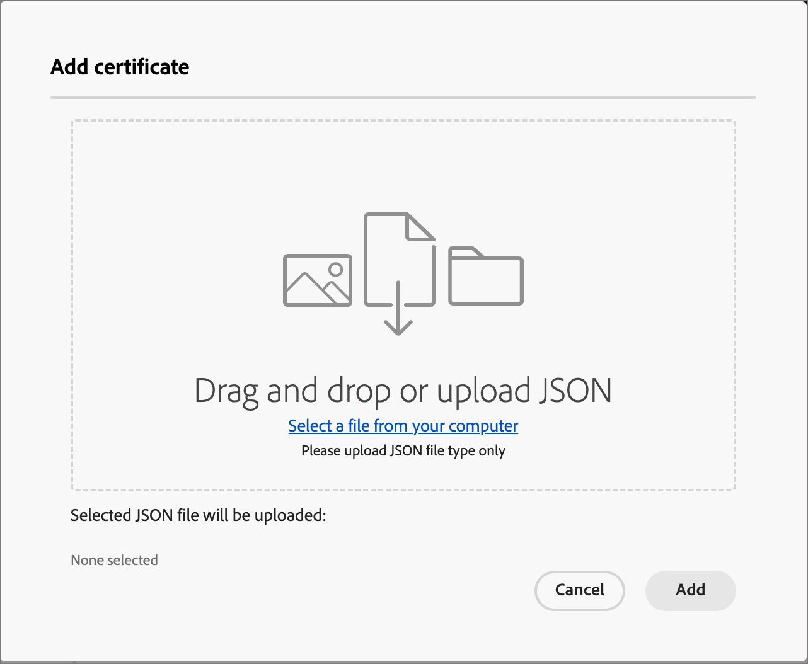

# Configurare gli archivi di risorse di Experience Manager

Adobe Journey Optimizer B2B edition si integra con Adobe Experience Manager Assets as a Cloud Service e consente di utilizzare risorse più che semplici risorse, come le e-mail, all’interno di un percorso di account. Garantisce la trasparenza scambiando informazioni con Experience Manager Assets. Configura la connessione ad Adobe Experience Assets per abilitare questa funzionalità.

Adobe Experience Manager Cloud Manager è organizzato in programmi e ogni programma dispone di più ambienti e archivi ([Ulteriori informazioni](https://experienceleague.adobe.com/en/docs/experience-manager-cloud-service/content/implementing/using-cloud-manager/programs/program-types){target="_blank"}). Quando configuri Adobe Experience Manager Assets in Adobe Journey Optimizer B2B edition, puoi impostare connessioni a ogni archivio che desideri utilizzare per accedere alle risorse digitali.

{{aem-assets-licensing-note}}

## Prerequisiti

* Genera le credenziali del servizio per l&#39;ambiente desiderato in AEM Headless Developer Console ([Ulteriori informazioni](https://experienceleague.adobe.com/en/docs/experience-manager-learn/getting-started-with-aem-headless/authentication/service-credentials#generate-service-credentials){target="_blank"}).
* Ottenere i certificati necessari per la connessione. Come best practice, assicurati che i certificati rimangano almeno sei mesi prima della scadenza. I certificati scadono ogni 365 giorni.
* Adobe Journey Optimizer B2B edition supporta l’accesso a un’origine per la gestione delle risorse digitali alla volta. Prima di cambiare, assicurati che le risorse richieste siano disponibili in Adobe Experience Manager.

>[!IMPORTANT]
>
>Le credenziali del servizio sono autentiche e contengono una chiave privata. Queste credenziali devono essere archiviate, gestite e accessibili in base ai criteri IT e di sicurezza dell&#39;organizzazione.

## Aggiungere una connessione all’archivio

1. Nel menu di navigazione a sinistra, scegli **[!UICONTROL Amministrazione]** > **[!UICONTROL Configurazione]**.

1. Fai clic su **[!UICONTROL Assets]** nel pannello intermedio.

   {width="700" zoomable="yes"}

<!--   The default digital asset management option is configured as `Adobe Marketo Engage`.
-->
Da qui puoi configurare una alla volta le connessioni a ciascun archivio dell’ambiente AEM.

1. Nella casella _[!UICONTROL Adobe Experience Manager Assets]_ fare clic sulla freccia accanto a **[!UICONTROL Configura un repository]** e scegliere il repository.

   {width="500"}

1. Fai clic su **[!UICONTROL Aggiungi un certificato]** e utilizza gli strumenti di dialogo per caricare il file.

   Puoi caricare un file .json trascinandolo nella finestra di dialogo o facendo clic sul collegamento per individuare e selezionare un file dal sistema (assicurati che il file sia di tipo JSON valido).

   {width="500"}

   Dopo il caricamento, il certificato viene visualizzato nella parte inferiore.

   >[!NOTE]
   >
   >Se viene utilizzato un file non valido, nella finestra di dialogo viene visualizzato un errore nella parte inferiore.

   Fai clic su **[!UICONTROL Aggiungi]** per completare il certificato.

1. Fai clic sulla freccia indietro (←) per tornare alla pagina di configurazione principale.

   L’archivio configurato viene visualizzato nella tabella sotto il pannello di selezione. È possibile aggiungere un altro archivio ripetendo i passaggi 3-4.

   {width="600" zoomable="yes"}

Al termine della configurazione degli archivi, i membri del gruppo possono selezionare l’Adobe Experience Manager Assets durante l’authoring dei contenuti.

>[!NOTE]
>
>Adobe Journey Optimizer B2B edition supporta l’accesso a un’origine per la gestione delle risorse digitali alla volta durante l’authoring dei contenuti. 

## Sostituire un certificato

I certificati scadono ogni 365 giorni dalla data di creazione. Sostituiscilo prima della scadenza per garantire che il team possa continuare ad accedere alle risorse.

>[!NOTE]
>
>Adobe Journey Optimizer B2B edition comunica con le risorse di Experience Manager per informazioni sull’utilizzo. La connessione deve rimanere attiva per un utilizzo affidabile della sincronizzazione dei dati e per evitare discrepanze di dati. Gli utenti amministratori ricevono notifiche sulla scadenza dei certificati tramite notifiche in-app. Possono anche prendere nota delle date di scadenza nella sottosezione Assets - Gestione delle risorse digitali nell’area Amministratore.

1. Nella pagina di gestione delle risorse digitali, individua l’elenco degli archivi configurati.

1. Fai clic sull’archivio desiderato per sostituire il certificato.

1. Fare clic sull&#39;icona dei puntini di sospensione (**...**) per il file di certificato per visualizzare le opzioni relative alle azioni.

   {width="600" zoomable="yes"}

1. Scegliere **[!UICONTROL Sostituisci]** per aprire la finestra di dialogo per il caricamento del file.

1. Carica un file trascinandolo nella finestra di dialogo o utilizzando il collegamento. Assicurati che il file sia di tipo json.

   {width="500"}

1. Fai clic su **[!UICONTROL Sostituisci]** per confermare il caricamento.

## Visualizzare un certificato

Puoi visualizzare il file JSON del certificato associato alla connessione all’archivio.

1. Nella pagina di gestione delle risorse digitali, individua l’elenco degli archivi configurati.

1. Fare clic sull&#39;archivio connesso.

1. Fare clic sull&#39;icona dei puntini di sospensione (**...**) per il file di certificato per visualizzare le opzioni relative alle azioni.

1. Scegliere **[!UICONTROL Visualizza]**.

   {width="600"}

1. Fare clic su **[!UICONTROL Chiudi]** per tornare alla pagina Configura repository.

## Eliminare una connessione all’archivio

L’eliminazione di un archivio rimuove l’accesso degli utenti all’ambiente Experience Manager Assets all’interno di Journey Optimizer B2B edition.

1. Nella pagina _[!UICONTROL Gestione risorse digitali]_, individua l&#39;elenco degli archivi di risorse configurati.

1. Fai clic sul nome dell’archivio desiderato per modificare la connessione.

1. Fare clic sull&#39;icona dei puntini di sospensione (**...**) per il file di certificato per visualizzare le opzioni relative alle azioni.

1. Scegliere **[!UICONTROL Elimina]**.

1. Nella finestra di dialogo di conferma, fai clic su **[!UICONTROL Elimina]**.
<!--

## Switch back to Adobe Marketo Engage Assets

Select Adobe Marketo Engage digital asset management in the Assets section.

After the confirmation, the Adobe Marketo Engage assets library is available for users.
-->
