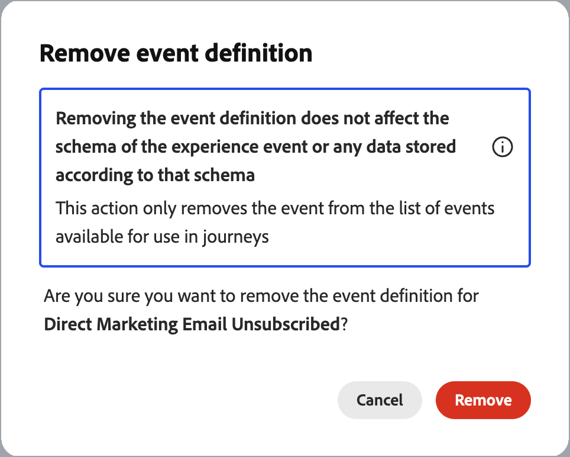

# Seleziona eventi e campi esperienza

Gli amministratori possono selezionare [Eventi esperienza](https://experienceleague.adobe.com/it/docs/experience-platform/xdm/classes/experienceevent){target="_blank"} specifici di Adobe Experience Platform (AEP) e i campi associati nello schema di unione degli eventi esperienza. Dopo la selezione, gli utenti possono configurare le regole di decisione per ascoltare tali eventi esperienza al fine di abilitare azioni di campagna dinamiche e mirate basate su dati di eventi in tempo quasi reale.

<!-- {width="30"} [Watch the video overview](#overview-video) -->

>[!PREREQUISITES]
>
>L’utilizzo dei campi e degli eventi esperienza in Journey Optimizer B2B edition richiede schemi Experience Event abilitati per il profilo. Per ulteriori informazioni, consulta [Abilitare Real-Time Customer Profiles](https://experienceleague.adobe.com/it/docs/platform-learn/getting-started-for-data-architects-and-data-engineers/enable-profiles){target="_blank"} nelle esercitazioni di Experience Platform.

L’utilizzo di AEP Experience Events in percorsi è un processo in due fasi:

1. Un amministratore [aggiunge i campi e gli eventi di esperienza AEP](#add-an-event) nelle configurazioni di Journey Optimizer B2B edition.

1. In un percorso, un addetto al marketing utilizza gli eventi configurati in uno dei due modi seguenti:

   * Aggiunge un nodo _Ascolta un evento_ e [seleziona un evento esperienza](../journeys/listen-for-event-nodes.md#listen-for-an-experience-event) per attivare la progressione del percorso in base all&#39;attività evento in tempo reale durante il percorso.
   * Aggiunge un nodo _Dividi percorsi per persone_ e configura un percorso per [filtrare su un evento](../journeys/split-merge-paths-nodes.md#experience-event-history-filtering) dalla cartella **[!UICONTROL Event history]**.

>[!BEGINSHADEBOX]

## Linee guida e limitazioni {#guidelines-and-limitations}

Quando selezioni gli eventi per soddisfare gli obiettivi organizzativi, considera quanto segue:

* Puoi selezionare fino a 50 eventi e fino a 100 campi per evento.

* I percorsi possono ascoltare gli eventi esperienza acquisiti utilizzando le funzionalità di streaming di Experience Platform, come Web SDK o API HTTP.

* I dati cronologici dell’evento esperienza iniziano a accumularsi per una persona quando l’evento esiste nel database di Journey Optimizer B2B edition. Per le persone che esistono già al momento della configurazione di un tipo di evento, la retrocompilazione inizia al momento della configurazione. Per le nuove persone, l’accumulo inizia quando la persona viene aggiunta per la prima volta (la sua storia precedente non è disponibile retroattivamente).

* Attualmente non esiste alcun meccanismo di eliminazione per la cronologia degli eventi accumulati. I criteri di conservazione a lungo termine sono soggetti a modifiche.

* Quando utilizzi un evento esperienza e pubblichi il percorso, puoi aggiungere altri campi, ma non puoi rimuovere i campi precedentemente selezionati.

* Puoi fare riferimento a un evento esperienza in più percorsi o utilizzarlo più volte nello stesso percorso.

>[!NOTE]
>
>Quando si selezionano i campi XDM per _[!UICONTROL Standard]_, _[!UICONTROL Relazionale]_ o _[!UICONTROL Eventi]_, sono supportati solo i tipi di dati di base (stringa, numero intero, doppio e booleano). Array e oggetti non consentiti.

>[!ENDSHADEBOX]

## Gestire gli eventi esperienza {#manage-experience-events}

1. Nel menu di navigazione a sinistra, scegli **[!UICONTROL Amministrazione]** > **[!UICONTROL Configurazioni]**.

1. Fai clic su **[!UICONTROL Configurazioni XDM]** nel pannello intermedio, quindi fai clic sulla scheda **[!UICONTROL Eventi]** per visualizzare l&#39;elenco degli eventi disponibili.

   {width="800" zoomable="yes"}

   L&#39;elenco viene visualizzato in base alla colonna _[!UICONTROL Ultimo aggiornamento]_, con gli eventi aggiornati più di recente nella parte superiore per impostazione predefinita.

   Da questa pagina è possibile [selezionare](#add-an-event) e [modificare](#edit-an-event) eventi da utilizzare nei percorsi.

   Per accedere ai dettagli di un evento selezionato, fai clic sul nome dell’evento.

### Filtrare l’elenco degli eventi {#filter-the-event-list}

Immetti il testo nel campo _[!UICONTROL Ricerca]_ per filtrare gli eventi visualizzati in base a una corrispondenza con il nome dell&#39;evento.

{width="600" zoomable="yes"}

### Aggiungi un evento {#add-an-event}

Per rendere disponibile un evento esperienza per un nodo _Ascolta un evento_ in un percorso, selezionare l&#39;evento e i campi supportati.

1. Fai clic su **[!UICONTROL Seleziona evento esperienza]** in alto a destra.

   Viene visualizzata la pagina dei dettagli dell’evento. Da questa pagina, puoi scegliere il tipo di evento e i campi.

   {width="700" zoomable="yes"}

1. Scegli il tipo di evento.

   * Fare clic su **[!UICONTROL Seleziona tipo di evento]**.

   * Nella finestra di dialogo, scegli il tipo di evento.

     Utilizza il campo _[!UICONTROL Ricerca]_ per filtrare l&#39;elenco visualizzato in base al nome. Utilizza il cursore **[!UICONTROL Mostra solo campi selezionati]** per rivedere le selezioni correnti.

     {width="450" zoomable="yes"}

   * Fai clic su **[!UICONTROL Seleziona]**.

1. Scegli uno o più campi per il tipo di evento.

   * Fare clic su **[!UICONTROL Seleziona campi]**.

   * Nella finestra di dialogo, seleziona i campi che desideri utilizzare come vincoli per gli eventi corrispondenti.

     Utilizza il campo _[!UICONTROL Ricerca]_ per filtrare l&#39;elenco visualizzato in base al nome. Utilizza il cursore **[!UICONTROL Mostra solo campi selezionati]** per rivedere le selezioni correnti.

     {width="450" zoomable="yes"}

   * Fai clic su **[!UICONTROL Seleziona]**.

1. Nella pagina dei dettagli dell&#39;evento, fare clic su **[!UICONTROL Salva]**.

L&#39;elenco nella scheda _[!UICONTROL Eventi]_ visualizza l&#39;evento salvato.

### Modificare un evento {#edit-an-event}

Per modificare i campi, modifica i dettagli dell’evento.

1. Fai clic sul nome dell&#39;evento oppure fai clic sull&#39;icona _Altro menu_ ( **...** ) e scegli **[!UICONTROL Modifica]**.

   {width="500" zoomable="yes"}

1. Fai clic su **[!UICONTROL Modifica campi]** per aprire la finestra di dialogo _[!UICONTROL Seleziona campi]_ e aggiungere altri campi.

   Non puoi rimuovere i campi precedentemente selezionati dopo la pubblicazione di un percorso che utilizza questo evento.

1. Fai clic su **[!UICONTROL Seleziona]** per salvare le selezioni.

### Rimuovere un evento {#remove-an-event}

Per evitare che un evento esperienza venga utilizzato in un nodo _Ascolta un evento_ all&#39;interno di un percorso, rimuovi l&#39;evento. Non puoi rimuovere un evento se è utilizzato da un percorso con stato _Pianificato_, _Live_ o _Completato_.

1. Fai clic sull&#39;icona _Altro menu_ ( **...** ) accanto al nome dell&#39;evento e scegli **[!UICONTROL Rimuovi]**.

1. Nella finestra di dialogo di conferma, fai clic su **[!UICONTROL Rimuovi]**.

   {width="500" zoomable="yes"}

## Eventi e campi {#events-and-fields}

Per [!DNL Journey Optimizer B2B Edition], alcune attività a livello di persone vengono acquisite come [!DNL Experience Platform] eventi esperienza. Questi eventi vengono memorizzati in un set di dati di sistema che utilizza lo schema XDM Experience Event e include gruppi di campi specifici per il percorso. È possibile utilizzare questi eventi in [!UICONTROL Journey Optimizer B2B edition] come qualsiasi altro evento esperienza.

Ogni evento espone un set definito di campi che possono essere utilizzati nel percorso _Ascolta un evento_ nodi (decisioning basato sugli eventi). Per determinare l’evento e i campi da utilizzare in questi nodi di percorso, controlla i tipi di evento disponibili e i relativi campi:

### E-mail inviata {#email-sent}

Questo evento tiene traccia di quando un’e-mail di marketing è stata inviata a una persona.

Tipo evento: `directMarketing.emailSent`

+++Campi

| Nome visualizzato | Percorso |
| ------------ | ---- |
| Identificatore | `_id` |
| Tipo di evento | `eventType` |
| Marca temporale | `timestamp` |
| ID persona | `personID` |
| ID sorgente della persona | `personKey.sourceID` |
| Tipo di origine della persona | `personKey.sourceType` |
| ID istanza sorgente della persona | `personKey.sourceInstanceID` |
| Chiave sorgente della persona | `personKey.sourceKey` |
| ID origine e-mail | `directMarketing.emailSent.mailingKey.sourceID` |
| Tipo di origine e-mail | `directMarketing.emailSent.mailingKey.sourceType` |
| ID istanza origine e-mail | `directMarketing.emailSent.mailingKey.sourceInstanceID` |
| Chiave sorgente e-mail | `directMarketing.emailSent.mailingKey.sourceKey` |
| Nome mailing | `directMarketing.emailSent.mailingName` |
| ID PERCORSO | `_experience.journeyOrchestration.stepEvents.journeyID` |
| ID nodo | `_experience.journeyOrchestration.stepEvents.nodeID` |

+++

### E-mail consegnata {#email-delivered}

Questo evento tiene traccia di quando un’e-mail è stata recapitata correttamente al servizio e-mail di un utente.

Tipo evento: `directMarketing.emailDelivered`

+++Campi

| Nome visualizzato | Percorso |
| ------------ | ---- |
| Identificatore | `_id` |
| Tipo di evento | `eventType` |
| Marca temporale | `timestamp` |
| ID persona | `personID` |
| ID sorgente della persona | `personKey.sourceID` |
| Tipo di origine della persona | `personKey.sourceType` |
| ID istanza sorgente della persona | `personKey.sourceInstanceID` |
| Chiave sorgente della persona | `personKey.sourceKey` |
| ID origine mailing | `directMarketing.mailingKey.sourceID` |
| Tipo di origine mailing | `directMarketing.mailingKey.sourceType` |
| ID istanza sorgente mailing | `directMarketing.mailingKey.sourceInstanceID` |
| Chiave sorgente mailing | `directMarketing.mailingKey.sourceKey` |
| Nome mailing | `directMarketing.mailingName` |
| ID PERCORSO | `_experience.journeyOrchestration.stepEvents.journeyID` |
| ID nodo | `_experience.journeyOrchestration.stepEvents.nodeID` |

+++

### E-mail aperta {#email-opened}

Questo evento tiene traccia di quando una persona ha aperto un’e-mail di marketing.

Tipo evento: `directMarketing.emailOpened`

+++Campi

| Nome visualizzato | Percorso |
| ------------ | ---- |
| Identificatore | `_id` |
| Tipo di evento | `eventType` |
| Marca temporale | `timestamp` |
| ID persona | `personID` |
| ID sorgente della persona | `personKey.sourceID` |
| Tipo di origine della persona | `personKey.sourceType` |
| ID istanza sorgente della persona | `personKey.sourceInstanceID` |
| Chiave sorgente della persona | `personKey.sourceKey` |
| ID origine mailing | `directMarketing.mailingKey.sourceID` |
| Tipo di origine mailing | `directMarketing.mailingKey.sourceType` |
| ID istanza sorgente mailing | `directMarketing.mailingKey.sourceInstanceID` |
| Chiave sorgente mailing | `directMarketing.mailingKey.sourceKey` |
| Nome mailing | `directMarketing.mailingName` |
| È un dispositivo mobile | `device.isMobileDevice` |
| Modello dispositivo | `device.model` |
| Agente utente | `environment.browserDetails.userAgent` |
| Sistema operativo | `environment.operatingSystem` |
| ID PERCORSO | `_experience.journeyOrchestration.stepEvents.journeyID` |
| ID nodo | `_experience.journeyOrchestration.stepEvents.nodeID` |

+++

### E-mail cliccata {#email-clicked}

Questo evento tiene traccia di quando una persona ha fatto clic su un collegamento in un’e-mail di marketing.

Tipo evento: `directMarketing.emailClicked`

+++Campi

| Nome visualizzato | Percorso |
| ------------ | ---- |
| Identificatore | `_id` |
| Tipo di evento | `eventType` |
| Marca temporale | `timestamp` |
| ID persona | `personID` |
| ID sorgente della persona | `personKey.sourceID` |
| Tipo di origine della persona | `personKey.sourceType` |
| ID istanza sorgente della persona | `personKey.sourceInstanceID` |
| Chiave sorgente della persona | `personKey.sourceKey` |
| ID origine mailing | `directMarketing.mailingKey.sourceID` |
| Tipo di origine mailing | `directMarketing.mailingKey.sourceType` |
| ID istanza sorgente mailing | `directMarketing.mailingKey.sourceInstanceID` |
| Chiave sorgente mailing | `directMarketing.mailingKey.sourceKey` |
| Nome mailing | `directMarketing.mailingName` |
| URL collegamento | `directMarketing.linkURL` |
| È un dispositivo mobile | `device.isMobileDevice` |
| Modello | `device.model` |
| Agente utente | `environment.browserDetails.userAgent` |
| Sistema operativo | `environment.operatingSystem` |
| ID PERCORSO | `_experience.journeyOrchestration.stepEvents.journeyID` |
| ID nodo | `_experience.journeyOrchestration.stepEvents.nodeID` |

+++

### E-mail non recapitata {#email-bounced}

Questo evento tiene traccia di quando un’e-mail inviata a una persona non viene recapitata.

Tipo evento: `directMarketing.emailBounced`

+++Campi

| Nome visualizzato | Percorso |
| ------------ | ---- |
| Identificatore | `_id` |
| Tipo di evento | `eventType` |
| Marca temporale | `timestamp` |
| ID persona | `personID` |
| ID sorgente della persona | `personKey.sourceID` |
| Tipo di origine della persona | `personKey.sourceType` |
| ID istanza sorgente della persona | `personKey.sourceInstanceID` |
| Chiave sorgente della persona | `personKey.sourceKey` |
| ID origine mailing | `directMarketing.mailingKey.sourceID` |
| Tipo di origine mailing | `directMarketing.mailingKey.sourceType` |
| ID istanza sorgente mailing | `directMarketing.mailingKey.sourceInstanceID` |
| Chiave sorgente mailing | `directMarketing.mailingKey.sourceKey` |
| Nome mailing | `directMarketing.mailingName` |
| E-mail | `directMarketing.email` |
| Codice e-mail non recapitate | `directMarketing.emailBouncedCode` |
| Dettagli e-mail non recapitate | `directMarketing.emailBouncedDetails` |
| ID PERCORSO | `_experience.journeyOrchestration.stepEvents.journeyID` |
| ID nodo | `_experience.journeyOrchestration.stepEvents.nodeID` |

+++

### E-mail con mancato recapito non permanente {#email-bounced-soft}

Questo evento tiene traccia dei mancati recapiti non permanenti di un’e-mail a una persona.

Tipo evento: `directMarketing.emailBouncedSoft`

+++Campi

| Nome visualizzato | Percorso |
| ------------ | ---- |
| Identificatore | `_id` |
| Tipo di evento | `eventType` |
| Marca temporale | `timestamp` |
| ID persona | `personID` |
| ID sorgente della persona | `personKey.sourceID` |
| Tipo di origine della persona | `personKey.sourceType` |
| ID istanza sorgente della persona | `personKey.sourceInstanceID` |
| Chiave sorgente della persona | `personKey.sourceKey` |
| ID origine mailing | `directMarketing.mailingKey.sourceID` |
| Tipo di origine mailing | `directMarketing.mailingKey.sourceType` |
| ID istanza sorgente mailing | `directMarketing.mailingKey.sourceInstanceID` |
| Chiave sorgente mailing | `directMarketing.mailingKey.sourceKey` |
| Nome mailing | `directMarketing.mailingName` |
| E-mail | `directMarketing.email` |
| Codice e-mail non recapitate | `directMarketing.emailBouncedCode` |
| Dettagli e-mail non recapitate | `directMarketing.emailBouncedDetails` |
| ID PERCORSO | `_experience.journeyOrchestration.stepEvents.journeyID` |
| ID nodo | `_experience.journeyOrchestration.stepEvents.nodeID` |

+++

### Annullamento iscrizione e-mail {#email-unsubscribed}

Questo evento tiene traccia di quando una persona ha annullato l’abbonamento a un’e-mail di marketing.

Tipo evento: `directMarketing.emailUnsubscribed`

+++Campi

| Nome visualizzato | Percorso |
| ------------ | ---- |
| Identificatore | `_id` |
| Tipo di evento | `eventType` |
| Marca temporale | `timestamp` |
| ID persona | `personID` |
| ID sorgente della persona | `personKey.sourceID` |
| Tipo di origine della persona | `personKey.sourceType` |
| ID istanza sorgente della persona | `personKey.sourceInstanceID` |
| Chiave sorgente della persona | `personKey.sourceKey` |
| ID origine mailing | `directMarketing.mailingKey.sourceID` |
| Tipo di origine mailing | `directMarketing.mailingKey.sourceType` |
| ID istanza sorgente mailing | `directMarketing.mailingKey.sourceInstanceID` |
| Chiave sorgente mailing | `directMarketing.mailingKey.sourceKey` |
| Nome mailing | `directMarketing.mailingName` |
| ID PERCORSO | `_experience.journeyOrchestration.stepEvents.journeyID` |
| ID nodo | `_experience.journeyOrchestration.stepEvents.nodeID` |

+++

### Visita pagina web {#visit-web-page}

Questo tipo di evento è il metodo standard per contrassegnare l’hit come visualizzazione di pagina.

Tipo evento: `web.webpagedetails.pageViews`

+++Campi

| Nome visualizzato | Percorso |
| ------------ | ---- |
| Identificatore | `_id` |
| Tipo di evento | `eventType` |
| Marca temporale | `timestamp` |
| ID persona | `personID` |
| ID sorgente della persona | `personKey.sourceID` |
| Tipo di origine della persona | `personKey.sourceType` |
| ID istanza sorgente della persona | `personKey.sourceInstanceID` |
| Chiave sorgente della persona | `personKey.sourceKey` |
| ID sorgente della pagina web | `web.webPageDetails.webPageKey.sourceID` |
| Tipo di origine della pagina Web | `web.webPageDetails.webPageKey.sourceType` |
| ID istanza sorgente pagina web | `web.webPageDetails.webPageKey.sourceInstanceID` |
| Chiave sorgente della pagina web | `web.webPageDetails.webPageKey.sourceKey` |
| Nome pagina Web | `web.webPageDetails.name` |
| URL della pagina web | `web.webPageDetails.URL` |
| Parametri di query della pagina web | `web.webPageDetails.queryParameters` |
| ID pagina web | `web.webPageDetails.webPageID` |
| Agente utente | `environment.browserDetails.userAgent` |
| URL referrer | `web.webReferrer.URL` |

+++

### Modulo compilato {#form-filled-out}

Questo evento tiene traccia di quando una persona ha compilato un modulo su una pagina web.

Tipo evento: `web.formFilledOut`

+++Campi

| Nome visualizzato | Percorso |
| ------------ | ---- |
| Identificatore | `_id` |
| Tipo di evento | `eventType` |
| Marca temporale | `timestamp` |
| ID persona | `personID` |
| ID sorgente della persona | `personKey.sourceID` |
| Tipo di origine della persona | `personKey.sourceType` |
| ID istanza sorgente della persona | `personKey.sourceInstanceID` |
| Chiave sorgente della persona | `personKey.sourceKey` |
| ID origine modulo web | `web.fillOutForm.webFormKey.sourceID` |
| Tipo di origine modulo Web | `web.fillOutForm.webFormKey.sourceType` |
| ID istanza origine modulo Web | `web.fillOutForm.webFormKey.sourceInstanceID` |
| Chiave origine modulo Web | `web.fillOutForm.webFormKey.sourceKey` |
| ID modulo web | `web.fillOutForm.webFormID` |
| Nome modulo web | `web.fillOutForm.webFormName` |
| Parametri di query della pagina web | `web.webPageDetails.queryParameters` |
| ID pagina web | `web.webPageDetails.webPageID` |
| Agente utente | `environment.browserDetails.userAgent` |
| URL referrer | `web.webReferrer.URL` |

+++

### Collegamento web su cui è stato fatto clic {#web-link-clicked}

L&#39;evento segnala che il Web SDK ha registrato automaticamente un clic di collegamento.

Tipo evento: `web.webinteraction.linkClicks`

+++Campi

| Nome visualizzato | Percorso |
| ------------ | ---- |
| Identificatore | `_id` |
| Tipo di evento | `eventType` |
| Marca temporale | `timestamp` |
| ID persona | `personID` |
| ID sorgente della persona | `personKey.sourceID` |
| Tipo di origine della persona | `personKey.sourceType` |
| ID istanza sorgente della persona | `personKey.sourceInstanceID` |
| Chiave sorgente della persona | `personKey.sourceKey` |
| ID sorgente dell’interazione web | `web.webInteraction.webInteractionKey.sourceID` |
| Tipo di origine dell’interazione web | `web.webInteraction.webInteractionKey.sourceType` |
| ID dell’istanza sorgente dell’interazione web | `web.webInteraction.webInteractionKey.sourceInstanceID` |
| Chiave sorgente dell’interazione web | `web.webInteraction.webInteractionKey.sourceKey` |
| ID collegamento interazione web | `web.webInteraction.linkID` |
| URL collegamento interazione web | `web.webInteraction.linkURL` |
| Parametri di query della pagina web | `web.webPageDetails.queryParameters` |
| ID pagina web | `web.webPageDetails.webPageID` |
| Agente utente | `environment.browserDetails.userAgent` |
| URL referrer | `web.webReferrer.URL` |

+++

### Momento interessante {#interesting-moment}

Questo evento tiene traccia di quando è stato registrato un momento interessante per una persona.

Tipo evento: `leadOperation.interestingMoment`

+++Campi

| Nome visualizzato | Percorso |
| ------------ | ---- |
| Identificatore | `_id` |
| Tipo di evento | `eventType` |
| Marca temporale | `timestamp` |
| ID persona | `personID` |
| ID sorgente della persona | `personKey.sourceID` |
| Tipo di origine della persona | `personKey.sourceType` |
| ID istanza sorgente della persona | `personKey.sourceInstanceID` |
| Chiave sorgente della persona | `personKey.sourceKey` |
| Data momento | `leadOperation.interestingMoment.date` |
| Descrizione momento | `leadOperation.interestingMoment.description` |
| Sorgente momento | `leadOperation.interestingMoment.source` |
| Tipo di momento | `leadOperation.interestingMoment.type` |
| ID PERCORSO | `_experience.journeyOrchestration.stepEvents.journeyID` |
| ID nodo | `_experience.journeyOrchestration.stepEvents.nodeID` |

+++

<!--
 ## Overview video

>[!VIDEO](https://video.tv.adobe.com/v/3448637/?learn=on) 
-->