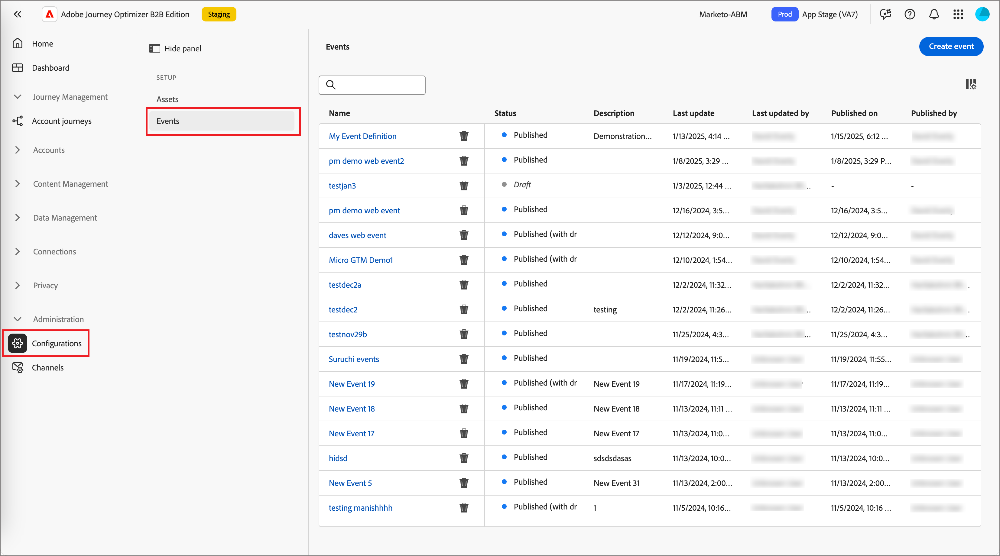

# Configurare le definizioni degli eventi di Experience Platform

Gli amministratori possono configurare definizioni di eventi basate su Adobe Experience Platform (AEP), che consentono agli addetti al marketing di creare percorsi di account che reagiscono a [eventi esperienza AEP](https://experienceleague.adobe.com/it/docs/experience-platform/xdm/classes/experienceevent).

{width="30"} [Guarda la panoramica del video](#overview-video)

L’utilizzo degli eventi di esperienza AEP nei percorsi di account è un processo in due fasi:

1. Crea e pubblica una definizione di evento AEP.

2. In un percorso di account, aggiungi un nodo _Ascolta un evento_ e [seleziona una definizione di evento AEP come evento persone](../journeys/listen-for-event-nodes.md#listen-for-an-experience-event).

Ogni definizione di evento richiede il seguente input di Experience Platform:

* **_Schema_** - Schema XDM che definisce la struttura dati di Experience Event. Deve essere basato su un evento esperienza e deve essere abilitato per il profilo.

  >[!NOTE]
  >
  >Coordina con il tuo team di progettazione per assicurarti che siano definiti gli schemi necessari. [La creazione di schemi XDM](https://experienceleague.adobe.com/it/docs/experience-platform/xdm/schema/composition) è un processo complesso eseguito da data engineer in base ai requisiti dei casi d&#39;uso all&#39;interno dell&#39;organizzazione.

* **_Tipi di evento_** - XDM ExperienceEvent eventType (massimo 20 per definizione di evento).

* **_Campi_** - Campi XDM presenti nello schema (massimo 20 per definizione evento)

* **_Nome_** - Nome univoco per la definizione dell&#39;evento.

* **_Descrizione_** - Descrizione per la definizione dell&#39;evento.

## Limitazioni e protezioni

Quando crei e gestisci le definizioni degli eventi per soddisfare gli obiettivi organizzativi, tieni presente quanto segue:

* Journey Optimizer B2B edition supporta un massimo di 50 definizioni di eventi.

* I percorsi di account possono ascoltare gli eventi AEP Experience che vengono acquisiti utilizzando le funzionalità di streaming di AEP, come Web SDK o API HTTP.

* Solo una definizione di evento di AEP può utilizzare uno schema e un set combinati di tipi di evento. Quando crei una definizione di evento utilizzando uno schema (ad esempio, `My Schema`) e un tipo di evento (ad esempio, `Web Webpagedetails Page Views`), nessun&#39;altra definizione di evento può utilizzare la combinazione di `My Schema` e `Web Webpagedetails Page Views`.

* Una definizione di evento può essere utilizzata in più percorsi di account.

* Gli eventi AEP Experience possono essere utilizzati a scopo decisionale all’interno di un percorso di account, ma non vengono mantenuti. Pertanto, in Journey Optimizer B2B edition non è possibile sfruttare alcun record storico di eventi AEP Experience.

* I vincoli per _data attività_ e _numero minimo di volte_ non sono supportati.

* Dopo la pubblicazione di una definizione di evento, non è possibile modificare lo schema e il nome. Tuttavia, puoi aggiungere tipi di evento e campi creando una versione bozza e pubblicandola nuovamente.

* Impossibile eliminare le definizioni degli eventi utilizzate nei percorsi pubblicati.

## Accedere e gestire le definizioni degli eventi

1. Nel menu di navigazione a sinistra, scegli **[!UICONTROL Amministrazione]** > **[!UICONTROL Configurazione]**.

1. Fai clic su **[!UICONTROL Eventi]** nel pannello intermedio per visualizzare l&#39;elenco delle definizioni degli eventi.

   Da questa pagina è possibile [creare](#create-an-event-definition), [pubblicare](#publish-an-event-defintion), [modificare](#publish-an-event-defintion) e [eliminare](#delete-an-event-definition) le definizioni degli eventi.

   {width="800" zoomable="yes"}

   La tabella è ordinata in base alla colonna _[!UICONTROL Modificato]_, con le definizioni aggiornate più di recente nella parte superiore per impostazione predefinita.<!-- Click the column title to change between ascending and descending.-->

1. Per accedere ai dettagli della definizione di un evento, fai clic sul nome.

### Stato e ciclo di vita della definizione dell’evento

Nell&#39;elenco _[!UICONTROL Definizioni evento]_, la colonna **[!UICONTROL Stato]** indica lo stato corrente di ciascuna definizione. Lo stato determina la disponibilità per l’utilizzo nei percorsi di account e le modifiche che è possibile apportare.

| Stato | Descrizione |
| -------------------- | ----------- |
| Bozza | Quando crei una definizione di evento, questa si trova nello stato Bozza. Rimane in questo stato fino a quando non lo pubblichi per l’utilizzo nei percorsi di account. Azioni disponibili: <ul><li>Modifica tutti i dettagli<li>Pubblica<li>Elimina |
| Pubblicato | Quando pubblichi una definizione di evento, questa diventa disponibile per l’utilizzo nei percorsi di account. Impossibile modificare i dettagli. Azioni disponibili: <ul><li>Disponibile per _Ascolta un nodo evento_ percorso<li>Crea bozza di versione<li>Elimina (se non in uso) |
| Pubblicato (con bozza) | Quando crei una bozza da una definizione di evento pubblicata, la versione pubblicata rimane disponibile per l’utilizzo nei percorsi di account e può essere modificata. Se pubblichi la versione bozza, questa sostituisce la versione pubblicata corrente e la definizione dell’evento viene aggiornata per i percorsi di account in cui non è ancora stata eseguita. Azioni disponibili: <ul><li>Modifica tutti i dettagli<li>Pubblica versione bozza<li>Elimina versione bozza<li>Elimina (se non in uso) |

{zoomable="yes"}

### Filtrare l’elenco delle definizioni degli eventi

Per cercare una definizione di evento per nome, immetti una stringa di testo nella barra di ricerca per trovare una corrispondenza.

{width="700" zoomable="yes"}

## Creare una definizione di evento

1. Nel menu di navigazione a sinistra, scegli **[!UICONTROL Amministrazione]** > **[!UICONTROL Configurazione]**.

1. Fai clic su **[!UICONTROL Eventi]** nel pannello intermedio per visualizzare l&#39;elenco delle definizioni degli eventi.

1. Fai clic su **[!UICONTROL Crea evento]** in alto a destra.

1. Immetti **[!UICONTROL Nome]** (obbligatorio) e **[!UICONTROL Descrizione]** (facoltativo).

   {width="600" zoomable="yes"}

1. Imposta lo **[!UICONTROL schema]** da utilizzare per la definizione dell&#39;evento.

   Lo schema selezionato determina i campi disponibili da aggiungere alla definizione, che sono quindi disponibili come vincoli per un nodo _Ascolta un evento_ in un percorso di account.

   * Fare clic su **[!UICONTROL Seleziona schema]**.
   * Nella finestra di dialogo, seleziona uno schema dall’elenco degli schemi basati su Experience Event.
   * Fai clic su **[!UICONTROL Seleziona]**.

   {width="600" zoomable="yes"}

1. Selezionare i **[!UICONTROL Tipi di evento]** da utilizzare per la definizione dell&#39;evento.

   I [tipi di evento](https://experienceleague.adobe.com/it/docs/experience-platform/xdm/classes/experienceevent#eventType) selezionati determinano gli eventi disponibili come vincoli per un nodo _Ascolta un evento_ in un percorso di account.

   * Fare clic su **[!UICONTROL Seleziona tipi di evento]**.
   * Nella finestra di dialogo, seleziona uno o più tipi di evento dall’elenco (massimo 20).
   * Fai clic su **[!UICONTROL Seleziona]**.

   {width="600" zoomable="yes"}

1. Selezionare i **[!UICONTROL campi]** da utilizzare per la definizione dell&#39;evento.

   I campi selezionati determinano i vincoli disponibili quando l&#39;evento viene utilizzato per un nodo _Ascolta un evento_ in un percorso di account.

   >[!NOTE]
   >
   >Il campo `eventType` è obbligatorio e selezionato automaticamente.

   * Fare clic su **[!UICONTROL Seleziona campi]**.
   * Nella finestra di dialogo, seleziona uno o più campi dall’elenco (massimo 20).
   * Fai clic su **[!UICONTROL Seleziona]**.

   {width="600" zoomable="yes"}

1. Al termine dello schema, dei tipi di evento e dei campi, fare clic su **[!UICONTROL Crea]**.

   Al momento della creazione, la pagina dell&#39;elenco viene visualizzata e il nuovo evento si trova nella parte superiore dell&#39;elenco con lo stato _Bozza_.

   {width="700" zoomable="yes"}

## Pubblicare una definizione di evento

Una volta verificato che la definizione dell’evento bozza è completa e corretta per le tue esigenze, puoi pubblicarla per renderla disponibile per l’utilizzo nei percorsi di account. Dopo la pubblicazione della definizione dell’evento, puoi creare una versione bozza, se devi apportarvi modifiche. Tuttavia, non è possibile modificare lo schema e aggiungere solo tipi di evento e campi (non è possibile eliminarli).

1. Nel menu di navigazione a sinistra, scegli **[!UICONTROL Amministrazione]** > **[!UICONTROL Configurazione]**.

1. Fai clic su **[!UICONTROL Eventi]** nel pannello intermedio per visualizzare l&#39;elenco delle definizioni degli eventi.

1. Nell&#39;elenco _[!UICONTROL Definizioni evento]_ fare clic sul nome della bozza della definizione dell&#39;evento per aprire la pagina dei dettagli.

   {width="600" zoomable="yes"}

   Se necessario, rivedi le impostazioni prima di pubblicare. Puoi [modificare la bozza](#edit-an-event-definition) se non soddisfa i tuoi requisiti.

1. Fai clic su **[!UICONTROL Pubblica]** in alto a destra.

1. Nella finestra di dialogo di conferma, fai clic su **[!UICONTROL Pubblica]**.

   {width="300"}

   Lo stato della definizione dell&#39;evento cambia in _Pubblicato_ ed è ora [disponibile per l&#39;utilizzo in percorsi di account](../journeys/listen-for-event-nodes.md#listen-for-an-experience-event).

   {width="700" zoomable="yes"}

## Modificare una definizione di evento

1. Nel menu di navigazione a sinistra, scegli **[!UICONTROL Amministrazione]** > **[!UICONTROL Configurazione]**.

1. Fai clic su **[!UICONTROL Eventi]** nel pannello intermedio per visualizzare l&#39;elenco delle definizioni degli eventi.

   Le modifiche apportate a una definizione di evento dipendono dal suo stato corrente:

   * Quando la definizione di un evento è nello stato _Bozza_, è possibile modificarne i dettagli.
   * Quando la definizione di un evento è nello stato _Pubblicato_, non è possibile modificarla. È possibile creare una bozza di versione modificabile e quindi sostituire la versione pubblicata.
   * Quando una definizione di evento è nello stato _Pubblicato (con bozza)_, puoi modificare la bozza della versione (modificare la descrizione e aggiungere tipi di evento e campi).

   {width="700" zoomable="yes"}

1. Nella pagina di elenco _[!UICONTROL Definizioni evento]_, fare clic sul nome della definizione dell&#39;evento per aprirla.

Segui i passaggi in base allo stato:

>[!BEGINTABS]

>[!TAB Bozza]

1. Modifica uno dei dettagli di definizione dell’evento in base alle esigenze.

   {width="600" zoomable="yes"}

   Segui le stesse linee guida utilizzate per [creare una definizione di evento](#create-an-event-definition).

   Le modifiche vengono salvate automaticamente nella bozza.

1. Quando la definizione dell&#39;evento soddisfa i criteri e desideri renderla disponibile per i percorsi di account di utilizzo, fai clic su **[!UICONTROL Pubblica]**.

1. Nella finestra di dialogo di conferma, fai clic su **[!UICONTROL Pubblica]**.

   Lo stato della definizione dell&#39;evento cambia in _Pubblicato_ ed è ora disponibile per l&#39;utilizzo in percorsi di account.

>[!TAB Pubblicato]

1. Per aggiornare la definizione dell&#39;evento, fare clic su **[!UICONTROL Crea bozza versione]** in alto a destra.

   {width="600" zoomable="yes"}

1. Nella finestra di dialogo di conferma, fai clic su **[!UICONTROL Crea bozza]** per aprire la versione bozza.

   {width="300"}

   Questa azione crea la bozza della versione e torna alla pagina dell&#39;elenco, dove la definizione dell&#39;evento è ora nello stato _Pubblicato (con bozza)_.

1. Fai clic sul nome della definizione dell’evento per aprirlo.

   Per la definizione di un evento _Pubblicato (con bozza)_, la scheda della versione _[!UICONTROL Pubblicato]_ è selezionata per impostazione predefinita.

1. Selezionare la scheda della versione **[!UICONTROL Bozza]**.

   {width="600" zoomable="yes"}

1. Modificare i dettagli modificabili (**[!UICONTROL Descrizione]**, **[!UICONTROL Tipi di evento]** e **[!UICONTROL Campi]**) in base alle esigenze.

   Segui le stesse linee guida utilizzate per [creare una definizione di evento](#create-an-event-definition).

   Le modifiche vengono salvate automaticamente nella bozza.

1. Quando la bozza della definizione dell&#39;evento soddisfa i criteri e si desidera sostituire la versione pubblicata corrente da utilizzare nei percorsi di account, fare clic su **[!UICONTROL Pubblica bozza]**.

1. Nella finestra di dialogo di conferma, fai clic su **[!UICONTROL Pubblica]**.

   {width="300"}

   Quando pubblichi la versione bozza, questa sostituisce la versione pubblicata corrente e la definizione dell’evento viene aggiornata per i percorsi di account in cui è già in uso ma non ancora eseguita.

>[!TAB Pubblicato (con bozza)]

Quando apri una definizione dell&#39;evento _Pubblicato (con bozza)_, la scheda della versione _[!UICONTROL Pubblicato]_ è selezionata per impostazione predefinita.

1. Selezionare la scheda della versione **[!UICONTROL Bozza]**.

   {width="600" zoomable="yes"}

1. Modificare i dettagli modificabili (**[!UICONTROL Descrizione]**, **[!UICONTROL Tipi di evento]** e **[!UICONTROL Campi]**) in base alle esigenze.

   Segui le stesse linee guida utilizzate per [creare una definizione di evento](#create-an-event-definition).

   Le modifiche vengono salvate automaticamente nella bozza.

1. Quando la bozza della definizione dell&#39;evento soddisfa i criteri e si desidera sostituire la versione pubblicata corrente da utilizzare nei percorsi di account, fare clic su **[!UICONTROL Pubblica bozza]**.

1. Nella finestra di dialogo di conferma, fai clic su **[!UICONTROL Pubblica]**.

   {width="300"}

   Quando pubblichi la versione bozza, questa sostituisce la versione pubblicata corrente e la definizione dell’evento viene aggiornata per i percorsi di account in cui è già in uso ma non ancora eseguita.

>[!ENDTABS]

## Eliminare una definizione di evento

Puoi eliminare una definizione di evento se non è utilizzata da un percorso di account pubblicato.

>[!CAUTION]
>
>Utilizza questa azione con cautela. La rimozione di una definizione di evento non può essere annullata.

1. Nel menu di navigazione a sinistra, scegli **[!UICONTROL Amministrazione]** > **[!UICONTROL Configurazione]**.

1. Fai clic su **[!UICONTROL Eventi]** nel pannello intermedio per visualizzare l&#39;elenco delle definizioni degli eventi.

1. Individua la definizione dell&#39;evento nell&#39;elenco e fai clic sull&#39;icona _Elimina_ (  ) a destra del nome.

1. Nella finestra di dialogo di conferma, fai clic su **[!UICONTROL Elimina]**.

   {width="300"}

## Video introduttivo

>[!VIDEO](https://video.tv.adobe.com/v/3448637/?learn=on)