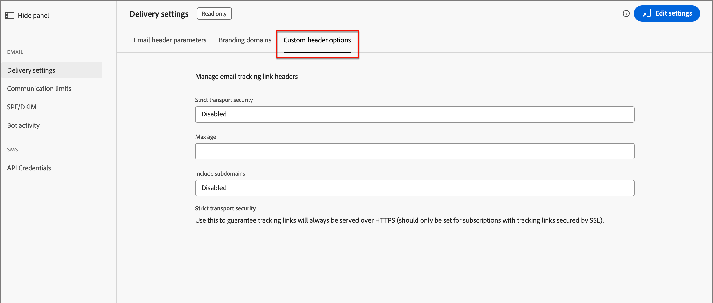
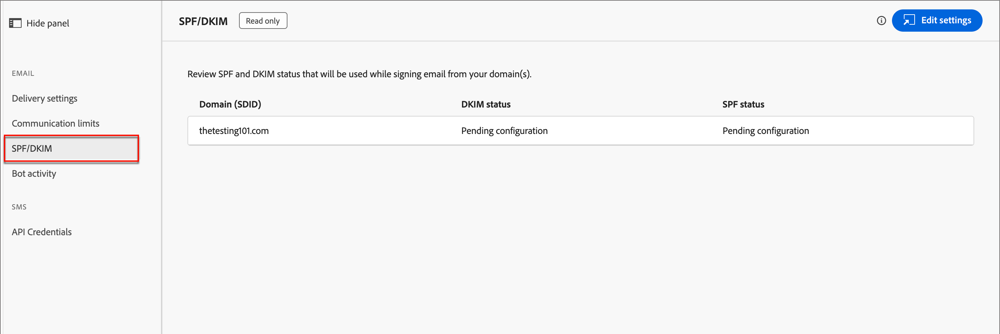

# Configurazioni e-mail

Adobe Journey Optimizer B2B edition sfrutta le funzioni di canale e il tracciamento degli eventi in Marketo Engage. Gli amministratori devono assicurarsi che le configurazioni di consegna e tracciamento siano attive per consentire la distribuzione dei canali agli addetti al marketing. Per informazioni sui protocolli necessari per la consegna e il tracciamento delle e-mail tramite Marketo Engage, vedere [Protocolli per il tracciamento e la consegna delle e-mail](../start/email-protocols.md).

## Impostazioni di consegna

Le impostazioni e-mail predefinite vengono utilizzate quando gli addetti al marketing creano un messaggio e-mail in un percorso di account. Per rivedere le impostazioni di consegna e-mail, vai a **[!UICONTROL Amministrazione]** > **[!UICONTROL Canali]**. In _[!UICONTROL E-mail]_ nel pannello di navigazione, seleziona **[!UICONTROL Impostazioni di consegna]**.

{width="800" zoomable="yes"}

Le impostazioni sono di sola lettura in Journey Optimizer B2B edition. Fai clic su **[!UICONTROL Modifica impostazioni]** in alto a destra per accedere alle opzioni di configurazione nell&#39;istanza di Marketo Engage connessa.

>[!NOTE]
>
>Per accedere e modificare queste impostazioni in Adobe Marketo Engage, è necessario disporre delle autorizzazioni di amministratore di prodotto.

Selezionare ciascuna delle seguenti schede per rivedere le impostazioni correnti.

### [!UICONTROL Parametri di intestazione e-mail] {#email-header}

I parametri dell’intestazione e-mail definiscono i valori predefiniti per i seguenti elementi:

* **[!UICONTROL Da e-mail]** - L&#39;indirizzo e-mail elencato nel campo _Da_ nell&#39;intestazione e-mail.

* **[!UICONTROL Da etichetta]** - Nome visualizzato per l&#39;indirizzo del mittente dell&#39;e-mail.

* **[!UICONTROL Annulla abbonamento a HTML]**: HTML (per i client e-mail supportati) visualizzato nelle e-mail non operative per spiegare al destinatario le azioni di annullamento dell&#39;abbonamento. Il testo e i collegamenti vengono aggiunti in basso.

* **[!UICONTROL Testo per annullamento sottoscrizione]**: il testo normale visualizzato nelle e-mail non operative per spiegare al destinatario le azioni di annullamento dell&#39;iscrizione. Il testo e i collegamenti vengono aggiunti in basso.

* **[!UICONTROL Visualizza come pagina Web HTML]**: il HTML (per i client di posta elettronica supportati) utilizzato per _Visualizza come pagina Web_, che fornisce un collegamento per visualizzare un&#39;e-mail in un browser.

* **[!UICONTROL Visualizza come testo pagina Web]** - Testo normale utilizzato per _Visualizza come pagina Web_, che fornisce un collegamento per visualizzare un&#39;e-mail in un browser.

### [!UICONTROL Domini di branding] {#branding-domains}

Per esaminare i domini di branding, fare clic sulla scheda **[!UICONTROL Domini di branding]**.

{width="700" zoomable="yes"}

Questa impostazione definisce il dominio principale per una o più aree di lavoro di Marketo Engage. Le nuove e-mail utilizzano questo dominio come impostazione predefinita, ma gli esperti di marketing possono sostituirlo per ogni e-mail. Per ulteriori informazioni, consulta la [documentazione di Marketo Engage](https://experienceleague.adobe.com/it/docs/marketo/using/product-docs/administration/email-setup/add-multiple-branding-domains/edit-your-default-branding-domain){target="_blank"}.

>[!NOTE]
>
>Se stai commercializzando più marchi da Journey Optimizer B2B edition e dall’istanza Marketo Engage connessa e desideri che ciascuno di essi abbia i propri collegamenti di tracciamento del marchio, puoi aggiungere un ulteriore dominio di branding. Per ulteriori informazioni, consulta la [documentazione di Marketo Engage](https://experienceleague.adobe.com/it/docs/marketo/using/product-docs/administration/email-setup/add-multiple-branding-domains/add-an-additional-branding-domain){target="_blank"}.

### [!UICONTROL Opzioni intestazione personalizzate] {#custom-header-options}

Per esaminare le opzioni di intestazione personalizzate, fare clic sulla scheda **[!UICONTROL Opzioni di intestazione personalizzate]**.

{width="700" zoomable="yes"}

Quando _[!UICONTROL Strict Transport Security]_ è abilitato, garantisce che i collegamenti di tracciamento vengano serviti tramite HTTPS (solo per le sottoscrizioni con collegamenti di tracciamento protetti da SSL).

## Limiti di comunicazione

I limiti di comunicazione controllano la quantità di e-mail inviate dalla tua organizzazione. È consigliabile impostare limiti in modo da non travolgere i destinatari con troppe e-mail dall’organizzazione.

Per rivedere le impostazioni correnti, passare a **[!UICONTROL Amministrazione]** > **[!UICONTROL Canali]**. In _[!UICONTROL E-mail]_ nel pannello di navigazione, seleziona **[!UICONTROL Limiti di comunicazione]**.

{width="700" zoomable="yes"}

Le impostazioni sono di sola lettura in Journey Optimizer B2B edition. Fai clic su **[!UICONTROL Modifica impostazioni]** in alto a destra per accedere alle opzioni di configurazione nell&#39;istanza di Marketo Engage connessa.

>[!NOTE]
>
>Per accedere e modificare queste impostazioni in Adobe Marketo Engage, è necessario disporre delle autorizzazioni di amministratore di prodotto.

Per ulteriori informazioni sulla configurazione dei limiti di comunicazione, consulta la [documentazione di Marketo Engage](https://experienceleague.adobe.com/it/docs/marketo/using/product-docs/administration/email-setup/enable-communication-limits){target="_blank"}.

## SPF/DKIM

Migliora le percentuali di consegna delle e-mail incorporando SPF (Sender Policy Framework) e DKIM (Domain Keys Identified Mail) nelle impostazioni DNS. Queste tecnologie garantiscono ai destinatari che le e-mail non vengano inviate come spam. Per evitare che i filtri anti-spam dei destinatari rifiutino le e-mail, assicurati che SPF e DKIM siano configurati per i tuoi domini.

Per rivedere le impostazioni correnti, passare a **[!UICONTROL Amministrazione]** > **[!UICONTROL Canali]**. In _[!UICONTROL E-mail]_ nel pannello di navigazione, seleziona **[!UICONTROL SPF/DKIM]**.

{width="700" zoomable="yes"}

Le impostazioni sono di sola lettura in Journey Optimizer B2B edition. Fai clic su **[!UICONTROL Modifica impostazioni]** in alto a destra per accedere alle opzioni di configurazione nell&#39;istanza di Marketo Engage connessa.

>[!NOTE]
>
>Per accedere e modificare queste impostazioni in Adobe Marketo Engage, è necessario disporre delle autorizzazioni di amministratore di prodotto.

### Configurazione SPF

L&#39;amministratore di rete deve aggiungere la seguente riga alle voci DNS:

`[domain] IN TXT v=spf1 mx ip4:[corpIP] include:mktomail.com ~all`

In questa voce sostituire `[domain]` con il dominio principale del sito Web (ad esempio `company.com`) e `[corpIP]` con l&#39;indirizzo IP del server di posta elettronica aziendale (ad esempio `255.255.255.255`). Se invii e-mail da più domini tramite Marketo Engage, aggiungi questa voce per ciascun dominio su una singola riga.

Se nella voce DNS è già presente un record SPF, aggiungervi quanto segue:

`include:mktomail.com`

### Configurazione DKIM

DKIM è un protocollo di autenticazione utilizzato dai destinatari e-mail per convalidare il mittente del messaggio e-mail. Spesso migliora il recapito delle e-mail alla casella in entrata, perché il destinatario può essere certo che il messaggio non sia un falso.

Con la chiave pubblica nel record DNS e il dominio di invio attivato nell’istanza di Marketo Engage connessa, per i messaggi in uscita viene utilizzata la firma DKIM personalizzata. La firma DKIM personalizzata include una firma digitale crittografata con ogni e-mail inviata. I riceventi sono quindi in grado di decrittografare la firma digitale cercando la _chiave pubblica_ nel DNS del dominio di invio. Se la chiave nell’e-mail corrisponde a quella nel record DNS, è più probabile che il server di posta ricevente accetti l’e-mail inviata tramite Marketo Engage.

Per ulteriori informazioni sulla configurazione di una firma DKIM personalizzata per la consegna di e-mail, consulta la [documentazione di Marketo Engage](https://experienceleague.adobe.com/it/docs/marketo/using/product-docs/email-marketing/deliverability/set-up-a-custom-dkim-signature){target="_blank"}.

## Attività bot

L’attività di bot su e-mail può erroneamente gonfiare l’apertura dell’e-mail e i dati sui clic.

Marketo Engage utilizza due metodi per confermare l’attività bot:

* **Corrispondenza con l&#39;elenco Interactive Advertising Bureau (IAB)** - Le attività che corrispondono a qualcosa nell&#39;elenco IAB UA/IP (agente utente/indirizzo IP) sono contrassegnate come bot.

* **Corrispondenza con pattern di prossimità** - Quando due o più attività si verificano contemporaneamente (entro un secondo), vengono identificate come bot. Questo metodo considera i seguenti attributi per il confronto:

   * ID lead (deve essere lo stesso)
   * Risorsa e-mail (deve essere la stessa)
   * Clic collegamento o apertura e-mail
   * Differenza di tempo (deve essere inferiore a un secondo)

Per le attività di clic e apertura dei collegamenti e-mail, i nuovi attributi vengono compilati con i seguenti valori:

* Le attività identificate come bot hanno _Attività bot_ come `True` e _Pattern attività bot_ come modello/metodo identificato.
* Le attività identificate come non bot hanno _Attività bot_ come `False` e _Pattern attività bot_ come `N/A`.
* Le attività che si verificano prima dell&#39;introduzione degli attributi hanno _Attività bot_ vuota (null) e _Pattern attività bot_ vuota (null)

Per rivedere le impostazioni correnti, passare a **[!UICONTROL Amministrazione]** > **[!UICONTROL Canali]**. In _[!UICONTROL E-mail]_ nel pannello di navigazione, seleziona **[!UICONTROL Attività bot]**.

{width="700" zoomable="yes"}

Le impostazioni sono di sola lettura in Journey Optimizer B2B edition. Fai clic su **[!UICONTROL Modifica impostazioni]** in alto a destra per accedere alle opzioni di configurazione nell&#39;istanza di Marketo Engage connessa.

>[!NOTE]
>
>Per accedere e modificare queste impostazioni in Adobe Marketo Engage, è necessario disporre delle autorizzazioni di amministratore di prodotto.

Per ulteriori informazioni sulla configurazione delle opzioni di attività bot, consulta la [documentazione di Marketo Engage](https://experienceleague.adobe.com/it/docs/marketo/using/product-docs/administration/email-setup/filtering-email-bot-activity#select-filter-type){target="_blank"}.
