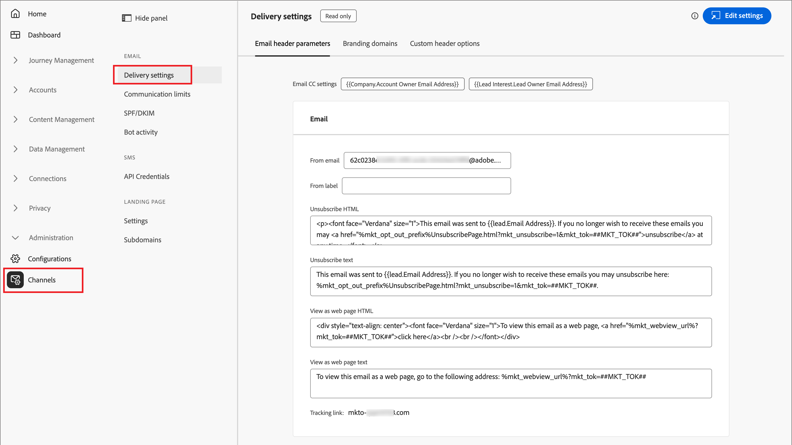

# Configurazioni del canale e-mail

Adobe Journey Optimizer B2B edition sfrutta le funzioni di canale e il tracciamento degli eventi in Marketo Engage. Gli amministratori devono assicurarsi che le configurazioni di consegna e tracciamento siano attive per consentire la distribuzione dei canali agli addetti al marketing. Per informazioni sui protocolli necessari per la consegna e il tracciamento delle e-mail tramite Marketo Engage, vedere [Protocolli per il tracciamento e la consegna delle e-mail](../start/email-protocols.md).

## Impostazioni di consegna

Le impostazioni e-mail predefinite vengono utilizzate quando gli addetti al marketing creano un messaggio e-mail in un percorso di account. Per rivedere le impostazioni di consegna e-mail, vai a **[!UICONTROL Amministrazione]** > **[!UICONTROL Canali]**. In _[!UICONTROL E-mail]_ nel pannello di navigazione, seleziona **[!UICONTROL Impostazioni di consegna]**.

{width="800" zoomable="yes"}

Le impostazioni sono di sola lettura in Journey Optimizer B2B edition. Fai clic su **[!UICONTROL Modifica impostazioni]** in alto a destra per accedere alle opzioni di configurazione nell&#39;istanza di Marketo Engage connessa.

>[!NOTE]
>
>Per accedere e modificare queste impostazioni in Adobe Marketo Engage, è necessario disporre delle autorizzazioni di amministratore di prodotto.

Selezionare ciascuna delle seguenti schede per rivedere le impostazioni correnti.

### [!UICONTROL Parametri di intestazione e-mail] {#email-header}

I parametri dell’intestazione e-mail definiscono i valori predefiniti per i seguenti elementi:

* **[!UICONTROL Da e-mail]** - L&#39;indirizzo e-mail elencato nel campo _Da_ nell&#39;intestazione e-mail.

* **[!UICONTROL Da etichetta]** - Nome visualizzato per l&#39;indirizzo del mittente dell&#39;e-mail.

* **[!UICONTROL Annulla abbonamento a HTML]**: HTML (per i client e-mail supportati) visualizzato nelle e-mail non operative per spiegare al destinatario le azioni di annullamento dell&#39;abbonamento. Il testo e i collegamenti vengono aggiunti in basso.

* **[!UICONTROL Testo per annullamento sottoscrizione]**: il testo normale visualizzato nelle e-mail non operative per spiegare al destinatario le azioni di annullamento dell&#39;iscrizione. Il testo e i collegamenti vengono aggiunti in basso.

* **[!UICONTROL Visualizza come pagina Web HTML]**: il HTML (per i client di posta elettronica supportati) utilizzato per _Visualizza come pagina Web_, che fornisce un collegamento per visualizzare un&#39;e-mail in un browser.

* **[!UICONTROL Visualizza come testo pagina Web]** - Testo normale utilizzato per _Visualizza come pagina Web_, che fornisce un collegamento per visualizzare un&#39;e-mail in un browser.

### [!UICONTROL Domini di branding] {#branding-domains}

Per esaminare i domini di branding, fare clic sulla scheda **[!UICONTROL Domini di branding]**.

{width="700" zoomable="yes"}

Questa impostazione definisce il dominio principale per una o più aree di lavoro nell’istanza Marketo Engage connessa. Le nuove e-mail utilizzano questo dominio come predefinito, ma gli addetti al marketing possono [ignorarlo per ogni e-mail](../content/add-email.md#define-the-email-settings). Per ulteriori informazioni sulla definizione del dominio di branding predefinito, consulta la [documentazione di Marketo Engage](https://experienceleague.adobe.com/en/docs/marketo/using/product-docs/administration/email-setup/add-multiple-branding-domains/edit-your-default-branding-domain){target="_blank"}.

>[!NOTE]
>
>Se stai commercializzando più marchi e desideri che ciascuno di essi abbia i propri collegamenti di tracciamento del marchio, puoi aggiungere un ulteriore dominio di branding. Per ulteriori informazioni sull&#39;aggiunta di più domini di branding, consulta la [documentazione di Marketo Engage](https://experienceleague.adobe.com/en/docs/marketo/using/product-docs/administration/email-setup/add-multiple-branding-domains/add-an-additional-branding-domain){target="_blank"}.

### [!UICONTROL Opzioni intestazione personalizzate] {#custom-header-options}

Per esaminare le opzioni di intestazione personalizzate, fare clic sulla scheda **[!UICONTROL Opzioni di intestazione personalizzate]**.

{width="700" zoomable="yes"}

Quando _[!UICONTROL Strict Transport Security]_ è abilitato, garantisce che i collegamenti di tracciamento vengano serviti tramite HTTPS (solo per le sottoscrizioni con collegamenti di tracciamento protetti da SSL).

## Limiti di comunicazione

I limiti di comunicazione controllano il numero di e-mail che un contatto riceve dalla tua organizzazione. I limiti impostati vengono condivisi tra Journey Optimizer B2B edition e l&#39;istanza di Marketo Engage connessa. L’impostazione di questi limiti garantisce che un lead non riceva più di un numero massimo di e-mail in un determinato periodo di tempo.

>[!AVAILABILITY]
>
>I limiti di comunicazione sono disponibili per gli ambienti B2B edition di Journey Optimizer per i quali è stato eseguito il provisioning nell&#39;[architettura semplificata](../simplified-architecture.md).

Ad esempio, con un limite definito di cinque e-mail al giorno, il sistema garantisce che un contatto non riceva una sesta e-mail in un giorno eliminando la sesta e-mail. Con i limiti di comunicazione condivisi tra Journey Optimizer B2B edition e Marketo Engage, le regole dei limiti di comunicazione sono definite in un’unica posizione. La sesta e-mail viene soppressa, indipendentemente dall’azione di invio proveniente da Journey Optimizer B2B edition o Marketo Engage.

Per impostazione predefinita, in tutte le istanze di produzione di Marketo Engage sono definiti limiti di comunicazione (per ulteriori informazioni, consulta la [documentazione di Marketo Engage](https://experienceleague.adobe.com/en/docs/marketo/using/product-docs/administration/email-setup/enable-communication-limits){target="_blank"}). Per utilizzare i limiti di comunicazione condivisi, definisci le regole in Journey Optimizer B2B edition ed estendi la condivisione di tali limiti ai codici Munchkin di Marketo.

>[!IMPORTANT]
>
>Per estendere il set di regole di comunicazione ai codici Munchkin di Marketo, rivolgiti al team di gestione dell’account Adobe. Questa configurazione fa generalmente parte del processo di onboarding.

Per rivedere o impostare le regole del limite di comunicazione, vai a **[!UICONTROL Amministrazione]** > **[!UICONTROL Canali]**. In _[!UICONTROL E-mail]_ nel pannello di navigazione e seleziona **[!UICONTROL Limiti di comunicazione]**.

{width="700" zoomable="yes"}

Per impostazione predefinita, esiste un set di regole globale in cui puoi definire, attivare e disattivare più regole in base alle tue esigenze. Fare clic sul nome del set di regole per visualizzare l&#39;elenco delle regole.

### Creare una regola

1. Fai clic su **[!UICONTROL Crea regola]** in alto a destra.

   {width="600" zoomable="yes"}

1. Immetti il **[!UICONTROL nome regola]**.

1. Imposta l&#39;**[!UICONTROL importo limite]**.

   Inserisci il valore oppure fai clic sulla freccia _Su_ o _Giù_ a destra per aumentare o decreare il valore.

1. Scegli il valore **[!UICONTROL Reimposta frequenza limite]** in base alla modalità di definizione del periodo di tempo per il limite.

   Puoi scegliere _[!UICONTROL Ogni ora]_, _[!UICONTROL Ogni giorno]_, _[!UICONTROL Ogni settimana]_ o _[!UICONTROL Ogni mese]_.

   {width="600" zoomable="yes"}

1. Imposta il valore **[!UICONTROL Ogni]** in base al numero di unità di frequenza da includere nel periodo.

   Ad esempio, se utilizzi _Giornaliero_ come frequenza e imposti questo valore su `3`, il periodo è definito come tre giorni.

1. Fai clic su **[!UICONTROL Crea regola]** in alto a destra.

La nuova regola è nello stato _Bozza_ e non viene applicata ai limiti di comunicazione fino a quando non si sceglie di attivarla.

### Gestisci regole

Se una regola è nello stato _Bozza_, puoi modificare la definizione o eliminare la regola. Se desideri applicare la regola, puoi attivarla. Fai clic sull&#39;icona _Altro menu_ (***...***) accanto al nome della regola bozza nell&#39;elenco e scegli **[!UICONTROL Attiva]**.

{width="400" zoomable="yes"}

Quindi, fai clic su **[!UICONTROL Attiva]** nella finestra di dialogo di conferma.

Una regola attiva non può essere modificata o eliminata, può solo essere disattivata. Per una regola attiva da rimuovere dai limiti di comunicazione applicati, fare clic sull&#39;icona _Disattiva_ (  ) accanto al nome della regola attiva.

{width="400" zoomable="yes"}

Quindi fare clic su **[!UICONTROL Disattiva]** nella finestra di dialogo di conferma.

La regola viene visualizzata con lo stato _Inattivo_. È simile a una regola bozza e puoi modificarla, eliminarla o attivarla quando necessario.

## SPF/DKIM

Migliora le percentuali di consegna delle e-mail incorporando SPF (Sender Policy Framework) e DKIM (Domain Keys Identified Mail) nelle impostazioni DNS. Queste tecnologie garantiscono ai destinatari che le e-mail non vengano inviate come spam. Per evitare che i filtri anti-spam dei destinatari rifiutino le e-mail, assicurati che SPF e DKIM siano configurati per i tuoi domini.

Per rivedere le impostazioni correnti, passare a **[!UICONTROL Amministrazione]** > **[!UICONTROL Canali]**. In _[!UICONTROL E-mail]_ nel pannello di navigazione, seleziona **[!UICONTROL SPF/DKIM]**.

{width="700" zoomable="yes"}

Le impostazioni sono di sola lettura in Journey Optimizer B2B edition. Fai clic su **[!UICONTROL Modifica impostazioni]** in alto a destra per accedere alle opzioni di configurazione nell&#39;istanza di Marketo Engage connessa.

>[!NOTE]
>
>Per accedere e modificare queste impostazioni in Adobe Marketo Engage, è necessario disporre delle autorizzazioni di amministratore di prodotto.

### Configurazione SPF

L&#39;amministratore di rete deve aggiungere la seguente riga alle voci DNS:

`[domain] IN TXT v=spf1 mx ip4:[corpIP] include:mktomail.com ~all`

In questa voce sostituire `[domain]` con il dominio principale del sito Web (ad esempio `company.com`) e `[corpIP]` con l&#39;indirizzo IP del server di posta elettronica aziendale (ad esempio `255.255.255.255`). Se invii e-mail da più domini tramite Marketo Engage, aggiungi questa voce per ciascun dominio su una singola riga.

Se nella voce DNS è già presente un record SPF, aggiungervi quanto segue:

`include:mktomail.com`

### Configurazione DKIM

DKIM è un protocollo di autenticazione utilizzato dai destinatari e-mail per convalidare il mittente del messaggio e-mail. Spesso migliora il recapito delle e-mail alla casella in entrata, perché il destinatario può essere certo che il messaggio non sia un falso.

Se la chiave pubblica è nel record DNS e il dominio di invio è attivato nell’istanza di Marketo Engage connessa, per i messaggi in uscita viene utilizzata la firma DKIM personalizzata. La firma DKIM personalizzata include una firma digitale crittografata con ogni e-mail inviata. I riceventi sono quindi in grado di decrittografare la firma digitale cercando la _chiave pubblica_ nel DNS del dominio di invio. Se la chiave nell’e-mail corrisponde a quella nel record DNS, è più probabile che il server di posta ricevente accetti l’e-mail inviata tramite Marketo Engage.

Per ulteriori informazioni sulla configurazione di una firma DKIM personalizzata per la consegna di e-mail, consulta la [documentazione di Marketo Engage](https://experienceleague.adobe.com/it/docs/marketo/using/product-docs/email-marketing/deliverability/set-up-a-custom-dkim-signature){target="_blank"}.

## Attività bot

L’attività di bot su e-mail può erroneamente gonfiare l’apertura dell’e-mail e i dati sui clic.

Marketo Engage utilizza due metodi per confermare l’attività bot:

* **Corrispondenza con l&#39;elenco Interactive Advertising Bureau (IAB)** - Le attività che corrispondono a qualcosa nell&#39;elenco IAB UA/IP (agente utente/indirizzo IP) sono contrassegnate come bot.

* **Corrispondenza con pattern di prossimità** - Quando due o più attività si verificano contemporaneamente (entro un secondo), vengono identificate come bot. Questo metodo considera i seguenti attributi per il confronto:

   * ID lead (deve essere lo stesso)
   * Risorsa e-mail (deve essere la stessa)
   * Clic collegamento o apertura e-mail
   * Differenza di tempo (deve essere inferiore a un secondo)

Per le attività di clic e apertura dei collegamenti e-mail, i nuovi attributi vengono compilati con i seguenti valori:

* Le attività identificate come bot hanno _Attività bot_ come `True` e _Pattern attività bot_ come modello/metodo identificato.
* Le attività identificate come non bot hanno _Attività bot_ come `False` e _Pattern attività bot_ come `N/A`.
* Le attività che si verificano prima dell&#39;introduzione degli attributi hanno _Attività bot_ vuota (null) e _Pattern attività bot_ vuota (null)

Per rivedere le impostazioni correnti, passare a **[!UICONTROL Amministrazione]** > **[!UICONTROL Canali]**. In _[!UICONTROL E-mail]_ nel pannello di navigazione, seleziona **[!UICONTROL Attività bot]**.

{width="700" zoomable="yes"}

Le impostazioni sono di sola lettura in Journey Optimizer B2B edition. Fai clic su **[!UICONTROL Modifica impostazioni]** in alto a destra per accedere alle opzioni di configurazione nell&#39;istanza di Marketo Engage connessa.

>[!NOTE]
>
>Per accedere e modificare queste impostazioni in Adobe Marketo Engage, è necessario disporre delle autorizzazioni di amministratore di prodotto.

Per ulteriori informazioni sulla configurazione delle opzioni di attività bot, consulta la [documentazione di Marketo Engage](https://experienceleague.adobe.com/en/docs/marketo/using/product-docs/administration/email-setup/filtering-email-bot-activity#select-filter-type){target="_blank"}.
