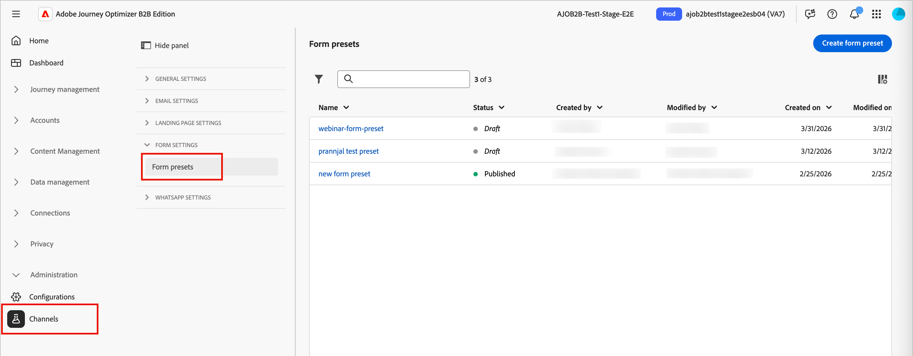

# Configurazioni Forms

Prima che gli addetti al marketing possano [creare e pubblicare moduli](../content/forms.md) da utilizzare nelle pagine di destinazione, un amministratore di prodotto deve creare uno o più predefiniti dedicati. Ogni predefinito definisce l’endpoint di connessione utilizzato per inviare i dati di invio del modulo e il set di dati utilizzato per memorizzare i dati acquisiti.

Quando i dati arrivano sull’endpoint di streaming, sono collegati alle informazioni del set di dati. Utilizzando le connessioni di origine/destinazione generate e il flusso di origine, i dati vengono quindi inviati al set di dati.

>[!BEGINSHADEBOX]

## Prerequisiti

Per utilizzare i moduli Web, è necessario che in Adobe Experience Platform siano definite una o più _**connessioni di streaming API HTTP**_. Verificare che ogni connessione che si desidera utilizzare soddisfi i seguenti requisiti:

* Il tipo di dati deve essere impostato su XDM (non su dati non elaborati)
* L&#39;autenticazione deve essere disabilitata (connessione non autenticata)

Per informazioni dettagliate sulla creazione di connessioni a origini di streaming, consulta la [_documentazione di Experience Platform_](https://experienceleague.adobe.com/it/docs/experience-platform/sources/ui-tutorials/create/streaming/http).

La configurazione del canale Forms in Journey Optimizer B2B edition richiede le [autorizzazioni](../admin/user-management.md#b2b-product-permissions) seguenti:

* _[!UICONTROL Configurazioni canale B2B]_ > _[!UICONTROL Visualizza predefiniti Forms]_ - Necessario per visualizzare le configurazioni dei predefiniti per i moduli.
* _[!UICONTROL Configurazioni canale B2B]_ > _[!UICONTROL Gestisci predefiniti Forms]_ - Necessario per creare, aggiornare ed eliminare configurazioni predefiniti per moduli.
* _[!UICONTROL Configurazioni canale B2B]_ > _[!UICONTROL Pubblica predefiniti Forms]_ - Necessario per pubblicare le configurazioni dei predefiniti per moduli.

>[!ENDSHADEBOX]

## Linee guida per la configurazione dei predefiniti per moduli

Durante la creazione di un predefinito:

* Puoi impostare più predefiniti utilizzando diverse combinazioni di set di dati e connessioni in streaming.

* Puoi riutilizzare lo stesso set di dati o la stessa connessione in streaming su più predefiniti.

* Ogni connessione in streaming genera automaticamente risorse quali:

   * _Connessione Source_ - origine dei dati.
   * _Connessione di destinazione_ - in cui i dati vengono archiviati o utilizzati.
   * _Flusso Source_: la pipeline che sposta i dati dalla connessione di origine in Experience Platform. Gestisce la mappatura, la trasformazione e la convalida.

## Creare un predefinito di modulo

1. Nel menu di navigazione a sinistra, vai a **[!UICONTROL Amministrazione]** > **[!UICONTROL Canali]**.

1. In _[!UICONTROL Impostazioni modulo]_ nel pannello di navigazione, selezionare **[!UICONTROL Predefiniti modulo]**.

   {width="800" zoomable="yes"}

1. Fare clic su **[!UICONTROL Crea predefinito modulo]**.

1. Immetti un **[!UICONTROL Nome]** univoco (obbligatorio) e una **[!UICONTROL Descrizione]** (facoltativo) per la configurazione.

   >[!NOTE]
   >
   >I nomi devono iniziare con una lettera (A-Z) e possono contenere solo caratteri alfanumerici. È inoltre possibile utilizzare il carattere di sottolineatura `_`, il punto `.` e il trattino `-`.

1. Selezionare la **[!UICONTROL connessione in streaming]**.

   Questa connessione è l’endpoint di streaming utilizzato per inviare i dati quando un visualizzatore web invia un modulo. Se la connessione in streaming necessaria non viene visualizzata nell’elenco, verifica che i requisiti siano soddisfatti.

1. Fai clic sull&#39;icona _Seleziona set di dati_ (  ) per collegare un set di dati al modulo.

   Il set di dati è il luogo in cui vengono memorizzate e riflesse le risposte del modulo. Puoi immettere una stringa di testo per cercare un set di dati specifico o selezionarlo dall’elenco.

   {width="500" zoomable="yes"}

   >[!NOTE]
   >
   >Al momento sono disponibili per la selezione solo [set di dati di Adobe Experience Platform](https://experienceleague.adobe.com/en/docs/experience-platform/catalog/datasets/overview) abilitati e non abilitati per il profilo. È possibile selezionare un set di dati alla volta. I set di dati di sistema non possono essere utilizzati per salvare i dati del modulo.

   Selezionare la casella di controllo per il set di dati e fare clic su **[!UICONTROL Seleziona]**.

1. Fai clic su **[!UICONTROL Salva come bozza]**.

## Pubblicare un predefinito per moduli

1. Fai clic sul nome del predefinito per moduli per aprire la pagina di configurazione.

   Se necessario, potete apportare qualsiasi modifica alla bozza.

1. Fai clic su **[!UICONTROL Pubblica]**.

   Quando il predefinito per moduli è elencato con lo stato _Pubblicato_, è disponibile per la creazione di moduli.
