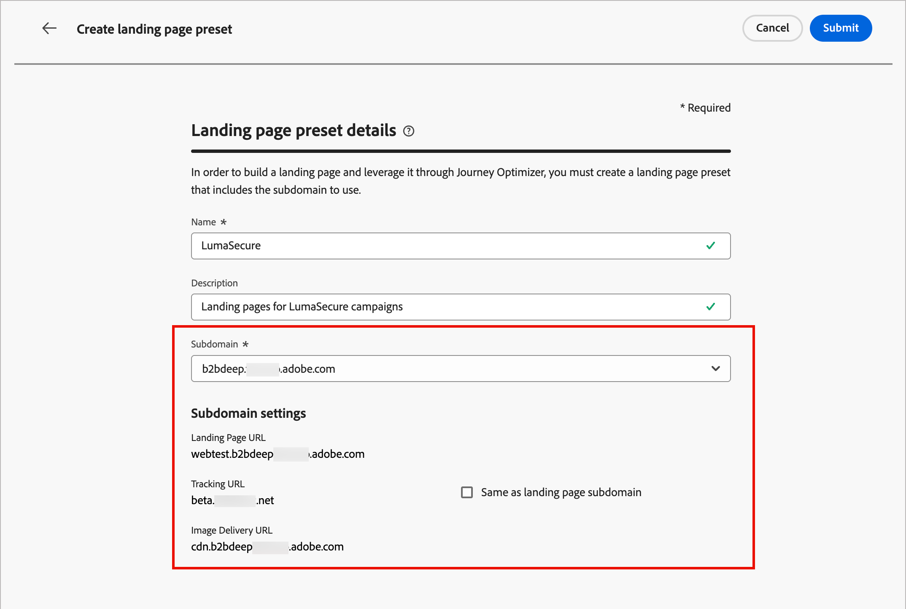

# Configurazione della pagina di destinazione

Gli amministratori devono verificare che le configurazioni della pagina di destinazione siano attive per gli esperti di marketing che creano e pubblicano tali pagine. Esistono due tipi di configurazione necessari per creare pagine di destinazione che riflettono in modo efficace un brand e tracciare il coinvolgimento:

* **_Sottodomini_**: configurare la posizione in cui sono ospitate le pagine di destinazione. Gestisci i sottodomini della pagina di destinazione per delegare, configurare o annullare la delega delle impostazioni di dominio.
* **_Predefiniti_** — Definisci configurazioni riutilizzabili (inclusi sottodominio e altre impostazioni di canale) in modo che gli addetti al marketing possano creare e gestire le pagine di destinazione in modo coerente.

## Sottodomini {#lp-subdomains}

>[!CONTEXTUALHELP]
>id="ajo-b2b_admin_subdomain_lp_header"
>title="Delegare un sottodominio della pagina di destinazione"
>abstract="Imposta un sottodominio per l’utilizzo di una pagina di destinazione. Puoi utilizzare un sottodominio già delegato ad Adobe o configurarne un altro."

>[!CONTEXTUALHELP]
>id="ajo-b2b_admin_subdomain_lp"
>title="Delegare un sottodominio della pagina di destinazione"
>abstract="Devi configurare un sottodominio della pagina di destinazione prima di creare un predefinito per la pagina di destinazione. Puoi utilizzare un sottodominio già delegato ad Adobe o configurarne uno nuovo."

>[!CONTEXTUALHELP]
>id="ajo-b2b_admin_config_lp_subdomain"
>title="Creare un predefinito per la pagina di destinazione"
>abstract="Per creare un predefinito per pagina di destinazione, accertati di disporre di almeno un sottodominio della pagina di destinazione configurato per la scelta dall’elenco Nome sottodominio."

Per esaminare i sottodomini configurati per la pagina di destinazione, passa a **[!UICONTROL Amministrazione]** > **[!UICONTROL Canali]**. In _[!UICONTROL Pagine di destinazione]_ nel riquadro di navigazione, seleziona **[!UICONTROL Sottodomini pagina di destinazione]**.

{width="800" zoomable="yes"}

La colonna **Stato** fornisce informazioni sul processo di creazione e delega del sottodominio:

* _[!UICONTROL Bozza]_: la delega del sottodominio viene salvata come bozza. Fai clic sul nome del sottodominio per riprendere il processo di creazione.
* _[!UICONTROL Elaborazione]_: il sottodominio è in corso attraverso diversi controlli di configurazione, necessari prima che possa essere utilizzato.
* _[!UICONTROL Operazione completata]_: il sottodominio passato attraverso i controlli è stato correttamente e può essere utilizzato per recapitare i messaggi.
* _[!UICONTROL Non riuscito]_: uno o più controlli non sono riusciti dopo l&#39;invio della delega del sottodominio.

>[!NOTE]
>
>Prima di poter [creare i predefiniti per le pagine di destinazione](#lp-presets), è necessario impostare i sottodomini da utilizzare per le pagine di destinazione. Puoi utilizzare un sottodominio già delegato ad Adobe oppure configurare un altro sottodominio.

La configurazione di un sottodominio della pagina di destinazione è **comune a tutti gli ambienti**. Pertanto:

* Per accedere e modificare i sottodomini della pagina di destinazione, devi disporre dell&#39;autorizzazione **[!UICONTROL Gestisci sottodomini pagina di destinazione]** nella sandbox di produzione.

* Qualsiasi modifica apportata a un sottodominio della pagina di destinazione influisce anche sulle sandbox di produzione.

<!-- 
### Use an existing subdomain {#lp-existing-subdomain}

To use a subdomain that is already delegated to Adobe:

1. Click **[!UICONTROL Set up landing page subdomain]**.

    

1. For _[!UICONTROL Configuration type]_, choose **[!UICONTROL Use delegated domain]**.

    

1. Enter the prefix that you want to display in the landing page URL.

    Only alpha-numeric characters and hyphens are allowed.

    >[!CAUTION]
    >
    >Do not use `cdn` or `data` prefixes as these are reserved for internal use. You should also avoid other restricted or reserved prefixes, such as `dmarc` or `spf`.

1. Select a delegated subdomain from the list.

    You cannot select a subdomain that is already used as landing page subdomain.
    
    

    You cannot use multiple delegated subdomains of the same parent domain. For example, if 'marketing1.yourcompany.com' is already delegated to Adobe for your landing pages, you cannot use 'marketing2.yourcompany.com'. However, when multi-level subdomains are supported for landing pages, you may proceed using a subdomain of 'marketing1.yourcompany.com' (such as 'email.marketing1.yourcompany.com'), or a different parent domain.

    >[!CAUTION]
    >
    >If you select a domain that was delegated to Adobe using the [CNAME method](../configuration/delegate-subdomain.md#cname-subdomain-setup), you must create the DNS record on your hosting platform. To generate the DNS record, the process is the same as when you configure a new landing page subdomain.

1. Click **[!UICONTROL Submit]**.

   The subdomain is displayed in the list with the _[!UICONTROL Processing]_ status. For more on subdomains' statuses, see TBD.

    

   >[!IMPORTANT]
   >
   >The subdomain is not ready for use until Adobe performs the required checks, which can take **_up to 4 hours_**.

   When the checks are successful, the subdomain is listed with the _[!UICONTROL Success]_ status and it is ready to use for creating landing page presets.
-->

### Configurare un nuovo sottodominio {#lp-new-subdomain}

>[!CONTEXTUALHELP]
>id="ajo-b2b_admin_lp_subdomain_dns"
>title="Generare il record DNS corrispondente"
>abstract="Per configurare un nuovo sottodominio della pagina di destinazione, devi copiare le informazioni del server dei nomi Adobe visualizzate nell’interfaccia B2B di Journey Optimizer e incollarle nella soluzione di hosting del dominio per generare il record DNS corrispondente. Quando i controlli hanno esito positivo, il sottodominio è pronto per essere utilizzato per creare predefiniti per pagine di destinazione."

1. Fai clic su **[!UICONTROL Configura sottodominio della pagina di destinazione]**.

1. Per _[!UICONTROL Tipo di configurazione]_, scegli **[!UICONTROL Aggiungi il tuo dominio]**.

1. Specifica il sottodominio da delegare.

   >[!IMPORTANT]
   >
   >* Non puoi utilizzare un sottodominio della pagina di destinazione esistente.
   >
   >* Nei sottodomini non sono consentite lettere maiuscole.

   {width="500" zoomable="yes"}

   Non è consentito delegare un sottodominio non valido ad Adobe. Assicurati di immettere un sottodominio valido di proprietà della tua organizzazione, ad esempio marketing.yourcompany.com.

   Per le pagine di destinazione, sono supportati i sottodomini a più livelli. Ad esempio, puoi utilizzare `email.marketing.yourcompany.com`.

1. Copia il record visualizzato o scarica un file CSV, quindi accedi alla soluzione di hosting del dominio per generare il record DNS corrispondente.

   Viene visualizzato il record da inserire nei server DNS.

1. Assicurati che il record DNS sia stato generato nella soluzione di hosting del dominio.

   Se tutto è configurato correttamente, seleziona la casella di controllo di conferma e fai clic su **[!UICONTROL Invia]**.

   {width="500" zoomable="yes"}

   Quando configuri un nuovo sottodominio della pagina di destinazione, questo punta sempre a un record CNAME.

   Quando la delega del sottodominio viene inviata, il sottodominio viene visualizzato nell&#39;elenco con lo stato _[!UICONTROL Elaborazione]_.

   >[!IMPORTANT]
   >
   >Il sottodominio non è pronto per l&#39;uso finché Adobe non esegue i controlli richiesti, che possono richiedere **_fino a 4 ore_**.

   Quando i controlli hanno esito positivo, il sottodominio viene elencato con lo stato _[!UICONTROL Operazione riuscita]_ ed è pronto per l&#39;utilizzo per la creazione di predefiniti per pagine di destinazione.

   Il sottodominio è contrassegnato come _[!UICONTROL Non riuscito]_ se non hai creato il record di convalida nella soluzione di hosting.

### Annullare la delega di un sottodominio {#undelegate-subdomain}

1. In [!DNL Journey Optimizer], annulla la pubblicazione di tutte le pagine di destinazione associate al sottodominio.

1. Se il sottodominio della pagina di destinazione punta a un record CNAME, elimina il record CNAME dalla soluzione di hosting (non eliminare il sottodominio e-mail originale, se presente).

   <!--
    >[!NOTE]
    >
    >A landing page subdomain can point to a CNAME record because it was either an [existing subdomain](#lp-use-existing-subdomain) delegated to Adobe using the [CNAME method](../configuration/delegate-subdomain.md#cname-subdomain-setup), or a [new landing page subdomain](#lp-configure-new-subdomain) that you configured. 
    -->

1. Contatta il rappresentante Adobe con il sottodominio da annullare la delega.

Dopo che Adobe ha gestito la richiesta, nella pagina di inventario del sottodominio non viene più visualizzato il dominio non delegato.

<!-- 
old marketo way for Prime?

A landing page subdomain should help to identify the content type, product name, or campaign, and reinforce the page authenticity. Before you configure the subdomains, define one or more CNAMEs to use for your landing pages. For example:

* **product**.[CompanyDomain].com
* **go**.[CompanyDomain].com
* **signup**.[CompanyDomain].com

In these examples, the first part (in bold) is the `LandingPageCNAME`.

Add a new subdomain for each unique brand URL that you want to host on Adobe Journey Optimizer B2B Edition. You can add a maximum number of 50 subdomains.

>[!IMPORTANT]
>
>Delegating an invalid subdomain to Adobe is not allowed. Make sure you enter a valid subdomain that your organization owns, such as _marketing.yourcompany.com_.

To review your subdomains and add new ones, go to **[!UICONTROL Administration]** > **[!UICONTROL Channels]**. Under _[!UICONTROL Landing Pages]_ in the navigation panel, select **[!UICONTROL Subdomains]**.

{width="800" zoomable="yes"}

_To add a landing page subdomain:_

1. Click **[!UICONTROL Add subdomain]** at the top right.

1. In the _[!UICONTROL Subdomain details]_, enter the subdomain information:

   * **[!UICONTROL Subdomain]** - The subdomain URL to use, such as `marketing.yourcompany.com`
   * **[!UICONTROL Default page]** - The URL for the default subdomain page, such as `marketing.yourcompany.com/products`
   * **[!UICONTROL Fallback page]** - The URL for the fallback page to be used if a landing page on the subdomain is not active, such as `marketing.yourcompany.com/expired`

   {width="700" zoomable="yes"}

1. Click **[!UICONTROL Save]**.

-->

## Predefiniti {#lp-presets}

>[!CONTEXTUALHELP]
>id="ajo-b2b_admin_config_lp_subdomain_header"
>title="Creare un predefinito per la pagina di destinazione"
>abstract="Per creare una pagina di destinazione e sfruttarla tramite Journey Optimizer B2B edition, è necessario creare un predefinito per pagina di destinazione che includa il sottodominio da utilizzare."

Quando gli addetti al marketing [creano una pagina di destinazione](../content/landing-pages-create-publish.md#create-landing-page), devono selezionare un predefinito per la pagina di destinazione per poterla creare e sfruttarla tramite [!DNL Journey Optimizer B2B Edition]. Il predefinito include il sottodominio da utilizzare per la pagina di destinazione.

Prima di configurare un predefinito, accertati che sia presente almeno un sottodominio della pagina di destinazione configurato con lo stato _[!UICONTROL Operazione riuscita]_.

Per rivedere i predefiniti configurati per la pagina di destinazione, passa a **[!UICONTROL Amministrazione]** > **[!UICONTROL Canali]**. In _[!UICONTROL Pagine di destinazione]_ nel riquadro di navigazione, selezionare **[!UICONTROL Predefiniti pagina di destinazione]**.

{width="800" zoomable="yes"}

Fai clic sul nome di un predefinito per accedere ai dettagli del predefinito per pagina di destinazione.

### Creare un predefinito per la pagina di destinazione {#lp-create-preset}

1. Fai clic su **[!UICONTROL Crea predefinito per pagina di destinazione]**.

1. Immettete un nome e una descrizione per il predefinito.

   I nomi devono iniziare con una lettera (A-Z) e contenere solo caratteri alfanumerici, il carattere di sottolineatura `_`, il punto`.` e il trattino `-`.

1. Seleziona un sottodominio della pagina di destinazione.

   {width="500" zoomable="yes"}

   >[!NOTE]
   >
   >Per poter selezionare un sottodominio, accertati di aver configurato in precedenza almeno un sottodominio della pagina di destinazione.

   Vengono visualizzate le impostazioni corrispondenti al sottodominio selezionato.

1. È possibile selezionare il sottodominio della pagina di destinazione per l&#39;**[!UICONTROL URL di tracciamento]** selezionando l&#39;opzione **[!UICONTROL Uguale al sottodominio della pagina di destinazione]**.<!-- [Learn more about tracking](../email/message-tracking.md) -->

   {width="500" zoomable="yes"}

   Ad esempio, se l&#39;URL della pagina di destinazione è `pages.mail.luma.com` e l&#39;URL di tracciamento è `data.mail.luma.com`, puoi scegliere `pages.mail.luma.com` da utilizzare come sottodominio di tracciamento.

   <!-- 
    >[!CAUTION]
    >
    >The selected landing page subdomain is used to specify the **[!UICONTROL Tracking URL]**and **[!UICONTROL Image Delivery URL]** if that subdomain was created using an [existing subdomain](#use-an-existing-subdomain).
    >
    >If the subdomain was created using the [Add your own domain](#configure-a-new-subdomain) option, the primary subdomain (such as the first delegated subdomain) is used instead. We don't have the existing option right now.
    -->

1. Fai clic su **[!UICONTROL Invia]** per confermare la creazione del predefinito per pagina di destinazione.

   <!--You can also save the preset as draft and resume its configuration later on.-->

   Quando viene creato il predefinito per la pagina di destinazione, questo viene visualizzato nell&#39;elenco con lo stato _[!UICONTROL Attivo]_ ed è pronto per l&#39;utilizzo per [la creazione di pagine di destinazione](../content/landing-pages-create-publish.md#create-landing-page).
