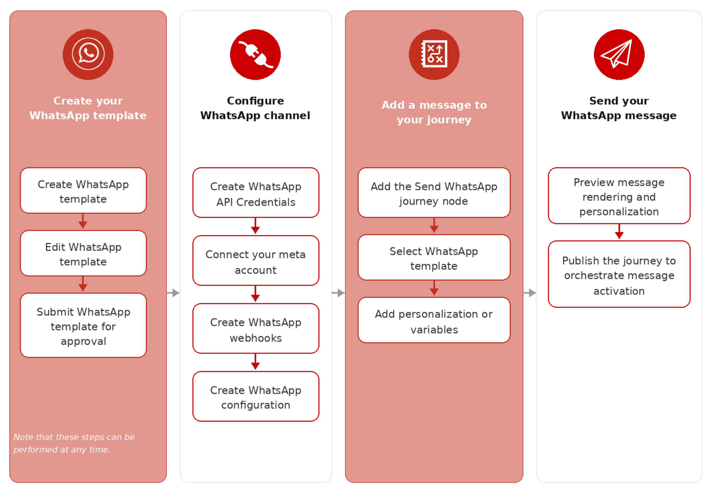
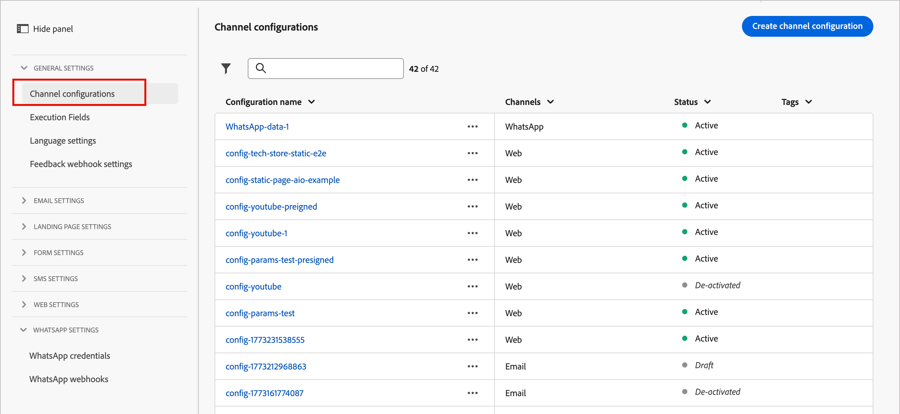

# Configurazione canale WhatsApp

Adobe Journey Optimizer B2B edition invia messaggi WhatsApp tramite API Cloud di Meta. Prima che gli addetti al marketing possano creare messaggi WhatsApp per percorsi di account, un amministratore di prodotto deve configurare un canale WhatsApp.

## Prerequisiti

Prima di configurare il canale WhatsApp, assicurati di disporre dei seguenti elementi:

* [Un account Meta Business Manager](https://business.facebook.com/)
* [Un account WhatsApp Business con un nome mittente e un numero di telefono verificati](https://developers.facebook.com/docs/whatsapp/overview/business-accounts/)
* [Un token di autorizzazione utente di Meta con le autorizzazioni appropriate](https://developers.facebook.com/blog/post/2022/12/05/auth-tokens/)
* [Modelli di messaggio approvati nell’account aziendale WhatsApp](https://developers.facebook.com/docs/whatsapp/message-templates/guidelines/)

>[!IMPORTANT]
>
>L&#39;utilizzo dei servizi di messaggistica WhatsApp è soggetto ai termini e alle condizioni di Meta. Accedendo alla messaggistica WhatsApp tramite Journey Optimizer B2B edition, l&#39;utente conferma di aver rivisto e accetta di rispettare [i criteri aziendali Meta WhatsApp](https://www.whatsapp.com/legal/business-policy/).

## Limitazioni {#limitations}

Al canale WhatsApp vengono applicate le seguenti limitazioni:

* Adobe Journey Optimizer B2B edition **non è compatibile con HIPAA e non è compatibile con HIPAA**. Inoltre, i fornitori di terze parti non sono coperti dalla BAA di Adobe. La clientela è responsabile della propria conformità e della convalida dei fornitori.

* I messaggi di risposta automatizzati o predefiniti non sono ancora supportati.

* A partire da aprile 2025, Meta ha temporaneamente sospeso la consegna di tutti i messaggi dei modelli di marketing agli utenti WhatsApp che hanno un numero di telefono degli Stati Uniti (un numero composto da un codice di chiamata +1 e un indicativo di località degli Stati Uniti). [Ulteriori informazioni nella documentazione di Meta](https://developers.facebook.com/documentation/business-messaging/whatsapp/templates/marketing-templates/per-user-limits/)

* La funzionalità di integrazione nativa non consente l’integrazione con fornitori di servizi aziendali (BSP) di terze parti.

## Completare la configurazione del canale

Prima di inviare il messaggio WhatsApp, devi configurare l’ambiente B2B edition di Journey Optimizer e collegarlo all’account WhatsApp.

Completa le seguenti attività:

1. [Creare le credenziali API WhatsApp](#create-whatsapp-api-credentials)
1. [Aggiungere i webhook WhatsApp](#configure-webhooks)
1. [Creare la configurazione del canale WhatsApp](#create-channel-configuration)

### Creare le credenziali API WhatsApp

>[!NOTE]
>
>Le impostazioni descritte sono accessibili solo agli utenti con privilegi di amministratore.

1. Nel menu di navigazione sinistro, espandere la sezione **[!UICONTROL Amministrazione]** e fare clic su **[!UICONTROL Canali]**.

1. Nel pannello, espandi **[!UICONTROL Impostazioni WhatsApp]** e seleziona **[!UICONTROL Credenziali API]**.

   {width="800" zoomable="yes"}

1. Fai clic su **[!UICONTROL Crea nuove credenziali API]** in alto a destra.

1. Configura le credenziali API come descritto di seguito:

   * **[!UICONTROL Nome]** - Immettere un nome univoco per le credenziali
   * **[!UICONTROL Token API]** - Immetti il token API. Per informazioni, consultare la [documentazione di Meta](https://developers.facebook.com/blog/post/2022/12/05/auth-tokens/).
   * **[!UICONTROL ID account aziendale]** - Inserisci il numero univoco relativo al tuo portfolio aziendale. Per informazioni, consultare la [documentazione di Meta](https://www.facebook.com/business/help/1181250022022158?id=180505742745347).

   {width="500" zoomable="yes"}

1. Fai clic su **[!UICONTROL Continua]**.

1. Scegli l&#39;**[!UICONTROL account aziendale WhatsApp]** che desideri connettere alle credenziali API WhatsApp.

   {width="500" zoomable="yes"}

1. Seleziona **[!UICONTROL Nome mittente]** da utilizzare per l&#39;invio di messaggi WhatsApp.

   Le impostazioni del numero di telefono vengono compilate automaticamente:

   * **Valutazione qualità**: riflette il feedback del cliente per i messaggi inviati nelle ultime 24 ore.
      * Verde: alta qualità
      * Giallo: qualità Medium
      * Rosso: bassa qualità

     Per ulteriori informazioni, vedi [_Valutazione della qualità_](https://www.facebook.com/business/help/766346674749731#) nella documentazione di Meta.

   * **Velocità effettiva**: indica la velocità con cui il numero di telefono può inviare messaggi.

1. Fai clic su **[!UICONTROL Invia]** al termine della configurazione delle credenziali API.

Quando fai clic su _[!UICONTROL Invia]_, le credenziali vengono immediatamente convalidate e salvate, reindirizzandoti alla pagina dell&#39;elenco delle _[!UICONTROL credenziali API]_.

Se le credenziali inviate non sono valide, viene visualizzato un messaggio di errore HTTP 500. In questo caso, puoi scegliere di annullare la configurazione o di aggiornarla e inviarla nuovamente.

+++Risoluzione dei problemi di errore HTTP 500

Se riscontri un errore HTTP 500 durante la configurazione delle credenziali API WhatsApp, segui questi passaggi per la risoluzione dei problemi:

1. Verifica i tuoi diritti Adobe - Conferma che nella tua organizzazione sia stato eseguito il provisioning dell&#39;_cjm_ whatsapp_. Senza questo diritto, il canale WhatsApp non può essere configurato.

1. Convalidare i campi dell’account aziendale: verifica che tutti i campi obbligatori siano corretti:

   * Token API - Deve essere un token di accesso Meta [valido con le autorizzazioni appropriate](https://developers.facebook.com/blog/post/2022/12/05/auth-tokens/).
   * ID account aziendale - Deve corrispondere esattamente all&#39;[ID account aziendale Meta](https://www.facebook.com/business/help/1181250022022158?id=180505742745347).

1. Verifica le credenziali esternamente: verifica le credenziali direttamente con l’API di Meta per verificare se il problema si verifica con le credenziali o con la gestione delle credenziali di Journey Optimizer B2B edition.

<!-- 1. Enable advanced logging - To identify internal server or authentication misconfigurations, enable advanced logs in your Journey Optimizer B2B Edition environment to provide detailed information about the API call failures. 
do we have advanced logs? How are they enabled?-->

1. Contatta Adobe - Se l’ambiente e le adesioni sono confermate valide, ma l’errore HTTP 500 persiste, contatta il rappresentante Adobe.

+++

### Aggiungere i webhook WhatsApp {#configure-webhooks}

>[!CONTEXTUALHELP]
>id="ajo_b2b_admin-whatsapp-webhook-inbound-keyword-category"
>title="Categoria parole chiave in entrata"
>abstract="<b>Consenso</b>: invia la risposta automatica definita quando un utente si iscrive.  <b>Rinuncia</b>: invia la risposta automatica definita quando un utente annulla l’iscrizione.  <b>Aiuto</b>: invia la risposta automatica definita quando un utente richiede aiuto o assistenza.  <b>Predefinito</b>: invia la risposta automatica di fallback quando nessuna parola chiave corrisponde."

>[!CONTEXTUALHELP]
>id="ajo_b2b_admin_whatsapp-webhook-inbound-keyword"
>title="Immettere le parole chiave"
>abstract="Puoi definire parole chiave per attivare risposte automatiche specifiche in base al testo digitato dagli utenti. Le parole chiave non fanno distinzione tra maiuscole e minuscole (stop e STOP vengono trattati allo stesso modo)."

>[!CONTEXTUALHELP]
>id="ajo_b2b_admin-whatsapp-webhook-webhook-url"
>title="URL di callback"
>abstract="La richiesta di convalida e le notifiche webhook per questo oggetto vengono inviate all’URL specificato."

>[!CONTEXTUALHELP]
>id="ajo_b2b_admin-whatsapp-webhook-verify-token"
>title="Verifica token"
>abstract="Token restituito da Meta per confermare e verificare l’URL di callback durante il processo di verifica."

I webhook consentono a Journey Optimizer B2B edition di ricevere messaggi in entrata, risposte di consenso e notifiche di consegna dall’account aziendale WhatsApp. Configura i webhook per garantire la corretta gestione del consenso e il tracciamento dei messaggi.

>[!NOTE]
>
>Senza le parole chiave di consenso o rinuncia specificate, i messaggi di consenso standard non sono abilitati.

Una volta create correttamente le credenziali API WhatsApp, puoi configurare i webhook.

1. Nel pannello di navigazione, seleziona **[!UICONTROL Webhook WhatsApp]**.

1. Fare clic su **[!UICONTROL Crea webhook]**.

1. Immetti un **[!UICONTROL Nome]** per la configurazione del webhook.

1. Per **[!UICONTROL Configurazione]**, selezionare le credenziali API (create nell&#39;attività precedente) da associare al webhook.

1. Per la **[!UICONTROL categoria di parole chiave in entrata]**, scegliere una categoria per definire le parole chiave e il messaggio di risposta:

   * **[!UICONTROL Opt-in]** - Gli utenti devono accettare attivamente di ricevere messaggi WhatsApp, spesso gestiti tramite moduli sul sito Web o sull&#39;app.
   * **[!UICONTROL Rinuncia]** - Configura il webhook per l&#39;ascolto di frasi come `Stop` o `No Message` in modo da contrassegnare automaticamente gli utenti come esclusi.
   * **[!UICONTROL Guida]** - Consenti ai sistemi automatizzati di rilevare quando un utente invia `HELP` (o parole chiave simili come `Unknown`) e rispondere automaticamente con informazioni specifiche, ad esempio le istruzioni del servizio.
   * **[!UICONTROL Predefinito]** - Gestisce i messaggi in arrivo che non corrispondono a parole chiave definite in modo specifico. Funge da categoria di fallback per abilitare gli eventi di tracciamento (come i rapporti di apertura e di consegna) nei set di dati di Adobe Experience Platform.

   Quando si seleziona la categoria di parole chiave, le parole chiave predefinite vengono compilate.

1. Per **[!UICONTROL Immettere una parola chiave]**, è possibile immettere una parola chiave personalizzata e fare clic su _Aggiungi_ ( **+** ).

   È possibile aggiungere più parole chiave per categoria.

   >[!NOTE]
   >
   >Le parole chiave non fanno distinzione tra maiuscole e minuscole (`stop` e `STOP` sono trattati allo stesso modo).

1. Immetti il **[!UICONTROL messaggio di risposta]** da inviare automaticamente quando un messaggio ricevuto corrisponde a una parola chiave in questa categoria.

   {width="500" zoomable="yes"}

1. Per ogni categoria di parole chiave aggiuntiva da configurare, fai clic su _Aggiungi_ (**+**) nell&#39;angolo in alto a destra e ripeti i passaggi 5-7.

1. Fai clic su **[!UICONTROL Invia]** per salvare la configurazione del webhook.

### Copia il token e l’URL

Dopo l’invio del webhook, puoi recuperare i valori del token e dell’URL e quindi registrarlo in Meta.

1. Nell&#39;elenco **[!UICONTROL Webhook WhatsApp]** fare clic sull&#39;icona di modifica (  ) per il webhook creato.

1. Copiare i valori **[!UICONTROL Verify Token]** e **[!UICONTROL Webhook URL]**.

   {width="500" zoomable="yes"}

1. Nel portale [Meta for Developers](https://developers.facebook.com/), accedi alle impostazioni dell&#39;applicazione WhatsApp e configura il webhook utilizzando i valori copiati.

### Creare la configurazione del canale {#create-channel-configuration}

Una configurazione del canale definisce le impostazioni di consegna utilizzate per inviare messaggi WhatsApp da un nodo di azione del percorso.

1. Nel pannello di navigazione, in _[!UICONTROL Impostazioni generali]_, seleziona **[!UICONTROL Configurazioni canale]**.

   {width="600" zoomable="yes"}

1. Fai clic su **[!UICONTROL Crea configurazione canale]** in alto a destra.

1. Immetti **[!UICONTROL Nome]** e **[!UICONTROL Descrizione]** (facoltativo) per la configurazione.

   >[!NOTE]
   >
   >Il nome deve iniziare con una lettera (A-Z) e può contenere solo caratteri alfanumerici, trattini bassi (`_`), punti (`.`) e trattini (`-`).

1. Per **[!UICONTROL Selezionare il canale]**, scegliere `WhatsApp`.

   <!-- 1. For **[!UICONTROL Marketing action]**, select one or more marketing actions to associate consent policies with this configuration. -->

   <!-- Make sure to include all applicable marketing actions to ensure compliance with customer preferences. -->

   <!-- All consent policies associated with a selected marketing action are automatically leveraged in order to respect the preferences of your customers. For example, any WhatsApp message using that configuration in a journey is only sent to the profiles who have consented to receive WhatsApp messages from you. Profiles who have not consented to receive these communications are excluded. -->

1. In _[!UICONTROL Impostazioni WhatsApp]_, seleziona la **[!UICONTROL Configurazione WhatsApp]** (credenziali API) creata nell&#39;attività precedente.

1. Immettere il **[!UICONTROL numero di telefono del mittente]** da utilizzare per la consegna dei messaggi.

   {width="500" zoomable="yes"}

1. (Attualmente non applicabile per Journey Optimizer B2B edition) Per il campo di esecuzione **[!UICONTROL WhatsApp]**, selezionare l&#39;attributo di profilo da utilizzare come numero di telefono prioritario quando sono disponibili più numeri di telefono per un destinatario.

1. Fai clic su **[!UICONTROL Invia]** per salvare o su **[!UICONTROL Salva come bozza]** per completare e inviare la configurazione in un secondo momento.

La configurazione viene inizialmente visualizzata con lo stato _Elaborazione_ durante l&#39;esecuzione dei controlli di convalida. Al termine di tutti i controlli, lo stato diventa **_Attivo_** e la configurazione è pronta per essere selezionata quando gli addetti al marketing creano messaggi WhatsApp nelle azioni di percorso.
