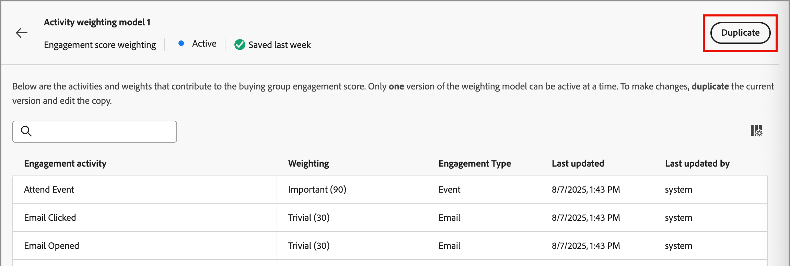

# Configurare la ponderazione del punteggio di coinvolgimento personalizzato

Un punteggio di coinvolgimento di un gruppo di acquisto riflette il livello di coinvolgimento valutando le varie attività registrate per i membri del gruppo di acquisto. Con la ponderazione dei punteggi personalizzata, i team delle operazioni di marketing hanno la flessibilità di definire i propri modelli per la ponderazione delle attività più significative per il coinvolgimento. Un modello di punteggio personalizzato produce un riflesso più accurato della pipeline dando priorità ai comportamenti che segnalano più accuratamente l’intento di acquisto nel processo di vendita.

In qualità di amministratore, puoi definire più modelli di punteggio di coinvolgimento per la tua organizzazione, ma può essere attivo un solo modello alla volta. Puoi definire un modello di punteggio in base alle attività da includere e al peso applicato a ciascuna attività.

## Accedere ai modelli di ponderazione dei punteggi di coinvolgimento

1. Nel menu di navigazione a sinistra, scegli **[!UICONTROL Amministrazione]** > **[!UICONTROL Configurazioni]**.

1. Fare clic su **[!UICONTROL Ponderazione punteggio coinvolgimento]** nel pannello intermedio per visualizzare l&#39;elenco dei modelli di punteggio.

   Da questa pagina è possibile [creare (duplicare)](#create-an-engagement-score-model), [attivare](#activate-a-score-model) e [modificare](#change-the-engagement-weighting-settings) i modelli di punteggio di coinvolgimento.

   {width="800" zoomable="yes"}

   La tabella è ordinata in base alla colonna _[!UICONTROL Ultimo aggiornamento]_, con i modelli aggiornati più di recente nella parte superiore per impostazione predefinita e include la possibilità di eseguire ricerche per _[!UICONTROL Nome]_. Puoi personalizzare la tabella visualizzata facendo clic sull&#39;icona _Impostazioni colonna_ (  ) nell&#39;angolo in alto a destra e selezionando o deselezionando le caselle di controllo della colonna.

{width="300"}

1. Per accedere ai dettagli di un modello di punteggio di coinvolgimento, fai clic sul nome.

### Modello punteggio predefinito

Il sistema crea un modello di punteggio di coinvolgimento iniziale denominato _Modello di ponderazione attività 1_, che è il modello attivo fino a quando non si crea un modello personalizzato e lo si attiva. Quando attivi il modello personalizzato, lo stato del modello predefinito diventa _Archiviato_. Puoi duplicarlo se decidi di ripristinare il modello di punteggio di coinvolgimento predefinito o di utilizzarlo come punto di partenza per un altro modello personalizzato.

{width="600" zoomable="yes"}

### Eliminare un modello 2D

È possibile eliminare una bozza di modello di punteggio di coinvolgimento se si decide di non attivarlo in futuro. Fai clic sull&#39;icona _Altro menu_ (***...***) accanto al nome del modello di punteggio bozza nell&#39;elenco e scegli **[!UICONTROL Elimina]**.

{width="350"}

Nella finestra di dialogo di conferma, fai clic su **[!UICONTROL Elimina]**.

## Creare un modello di punteggio di coinvolgimento personalizzato

Per creare un modello di punteggio di coinvolgimento personalizzato, duplica il modello predefinito o un altro modello personalizzato già creato. Puoi duplicare il modello _Attivo_ corrente, un modello _Bozza_ o un modello _Archiviato_. Quindi, modifica il modello duplicato in base alle tue esigenze.

1. Fai clic sul nome del modello per aprire la pagina dei dettagli del modello e fai clic su **[!UICONTROL Duplica]** in alto a destra.

   {width="600" zoomable="yes"}

   Puoi anche fare clic sull&#39;icona _Altro menu_ (***...***) accanto al nome del modello di punteggio nell&#39;elenco e scegliere **[!UICONTROL Duplica]**.

   {width="325"}

1. Nella finestra di dialogo _Duplica_, immetti un nome univoco per il modello duplicato e fai clic su **[!UICONTROL Duplica]**.

   {width="500"}

   Il modello duplicato viene visualizzato nell&#39;elenco con lo stato _Bozza_. Fai clic sul nome per aprire i dettagli del modello di punteggio e apportare le modifiche.

### Modificare le impostazioni di ponderazione del coinvolgimento

Le impostazioni di spessore definiscono le bande che è possibile assegnare a ogni attività nel modello. Puoi modificare le fasce in modo che riflettano le strategie della tua organizzazione per valutare il coinvolgimento. Ad esempio, è possibile regolare la fascia di ponderazione _Normal_ a un valore di 65 se si desidera assegnare un valore più alto alle attività normali. In alternativa, è possibile aggiungere una fascia di ponderazione progettata per acquisire le attività comprese tra _Normal_ e _Importante_. In questo caso, puoi aggiungere una banda e etichettarla come _Significativa_ e assegnare un valore di fascia di peso pari a 75.

1. Nella pagina dei dettagli del modello di punteggio, fai clic su **[!UICONTROL Impostazioni peso coinvolgimento]** in alto.

   {width="600" zoomable="yes"}

1. Per ogni fascia di peso, regolare il nome o i valori in base alle proprie esigenze:

   * Modificare il nome nel campo _[!UICONTROL Fascia di ponderazione]_.
   * Immettere un nuovo valore oppure fare clic su **+** o **-** per aumentare o diminuire il valore.

   {width="500"}

1. Se necessario, aggiungere un’altra fascia di ponderazione:

   Fare clic su **[!UICONTROL + Aggiungi banda di ponderazione]** in fondo all&#39;elenco. Questa azione consente di inserire una banda di ponderazione vuota nella parte inferiore dell&#39;elenco.

   Immettere il nome e impostare il valore per la banda. Utilizza un nome e un valore univoci.

1. Se necessario, rimuovere una fascia di ponderazione, fare clic sull&#39;icona _Elimina_ (  ) per la riga della banda di ponderazione.

1. Al termine delle modifiche, fare clic su **[!UICONTROL Salva]**.

### Modificare la ponderazione delle attività

Ogni modello di punteggio include l’elenco completo delle attività di punteggio di coinvolgimento supportate:

{{engagement-activities}}

Per ogni attività nell’elenco, imposta il valore da assegnare per ogni occorrenza di attività. Fare clic sulla freccia rivolta verso il basso nel campo Ponderazione e scegliere la fascia di ponderazione definita nelle impostazioni di ponderazione del progetto.

{width="500"}

Se non desideri che il calcolo del punteggio di coinvolgimento utilizzi un’attività, imposta la ponderazione su un valore zero (0).

Le modifiche vengono salvate automaticamente.

## Attiva un modello di punteggio

Quando attivate un modello di punteggio bozza, questo sostituisce il modello attualmente attivo. Il modello attualmente attivo viene archiviato automaticamente.

1. Apri una bozza di modello di punteggio per visualizzare la pagina dei dettagli.

1. Fare clic su **[!UICONTROL Attiva]**.

1. Nella finestra di dialogo di conferma, fai clic su **[!UICONTROL Attiva]**.

   {width="400"}
