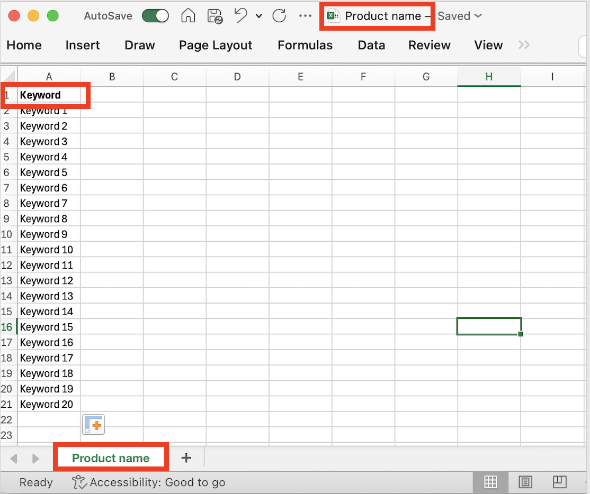

# Dati di intento

In Journey Optimizer B2B edition, il modello di rilevamento intento (Intent Detection) prevede una soluzione o un prodotto di interesse con sufficiente affidabilità in base all&#39;attività di un lead. Sfrutta anche le attività di altri membri dell’account, insieme ai contenuti con tag. L’intento di una persona può essere interpretato come la probabilità di avere interesse in un prodotto.

* Livelli di intento: disponibili a livello di lead noto, account e gruppo di acquisto.
* Tipi di segnale di intento: parole chiave, prodotto e soluzione

{width="700" zoomable="yes"}

Per attivare questa funzione, puoi inviare un elenco di parole chiave in un foglio di calcolo al tuo account manager Adobe. Queste parole chiave vengono utilizzate per l’assegnazione di tag al contenuto.

È possibile associare a un prodotto un set di parole chiave (fino a 20). Un set di prodotti (fino a 20) può essere associato a una categoria. Puoi avere un massimo di 20 categorie. L’intero modello viene ottenuto tramite un semplice foglio di calcolo che viene acquisito. Il foglio di calcolo può contenere una singola scheda correlata al nome del prodotto e una colonna correlata a un elenco di parole chiave.

{width="500" zoomable="yes"}

È possibile aggiungere più schede, ciascuna con un nome di prodotto e l’intero foglio di calcolo può essere correlato a una categoria.

{width="500" zoomable="yes"}
