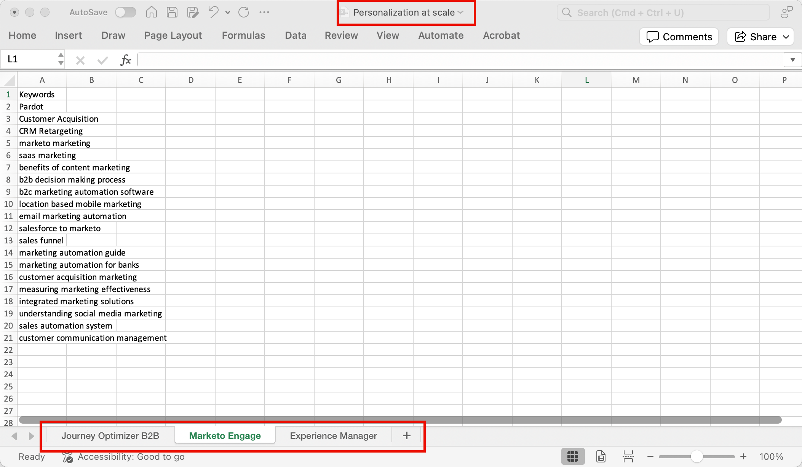

# Dati di intento

In Journey Optimizer B2B edition, il modello di rilevamento intento (Intent Detection) prevede una soluzione o un prodotto di interesse con sufficiente affidabilità in base all&#39;attività di un lead. Sfrutta anche le attività di altri membri dell’account, insieme ai contenuti con tag. L’intento di una persona può essere interpretato come la probabilità di avere interesse in un prodotto.

* Livelli di intento: disponibili a livello di lead noto, account e gruppo di acquisto.
* Tipi di segnale di intento: parole chiave, prodotto e soluzione

I dati intento vengono utilizzati in [_Intelligent Dashboard_](../dashboards/intelligent-dashboard.md), [_Account details_ page](../accounts/account-details.md), [_Buying group details_ page](../buying-groups/buying-group-details.md) e [_Person details_ page](../accounts/person-details.md).

{width="700" zoomable="yes"}

## Preparare i dati di mappatura intento

Per attivare questa funzione, creare un foglio di calcolo, ad esempio un file di Microsoft Excel, utilizzando le schede per definire la tassonomia dell&#39;intento. L’intero foglio di calcolo viene caricato come una categoria che può avere più prodotti e ogni prodotto può avere più parole chiave. Utilizzare le seguenti definizioni per il foglio di calcolo di mappatura intento per ogni categoria che si desidera definire:

* Nome del foglio di calcolo = _Nome categoria_
* Ogni scheda = il nome del prodotto
* Ogni scheda include una colonna = parole chiave del prodotto (massimo 150)

Puoi scaricare un file Excel da utilizzare come modello per la preparazione dei dati di mappatura. Per scaricare il modello:

1. Nel menu di navigazione a sinistra, scegli **[!UICONTROL Amministrazione]** > **[!UICONTROL Configurazione]**.

1. Fai clic su **[!UICONTROL Mappatura intento]** nel pannello intermedio.

1. Fare clic su **[!UICONTROL Crea categoria]**.

1. Nella finestra di dialogo, fai clic sul collegamento **[!UICONTROL Scarica modello di file]**.

   {width="500"}

1. Fare clic su **[!UICONTROL Annulla]**.

   Una volta completato, puoi tornare a caricare il file preparato.

1. Utilizza il modello per definire i dati di mappatura intento:

   * Rinomina il file in base al nome della categoria, ad esempio _Personalization in scala_.
   * Rinomina ogni scheda in base ai tuoi nomi di prodotto, ad esempio _Journey Optimizer B2B_, _Marketo Engage_ e _Experience Manager_.
   * Aggiungi le parole chiave del prodotto per ogni scheda, ad esempio _Marketing B2B_, _Riconoscimento marchio_ e _Coinvolgimento lead_.

   {width="600" zoomable="yes"}

## Carica un file di categoria

Quando il foglio di calcolo è pronto, torna alla pagina di configurazione _[!UICONTROL Mapping intento]_ e carica il file.

1. Fare clic su **[!UICONTROL Crea categoria]**.

1. Trascina e rilascia il file nella finestra di dialogo _[!UICONTROL Carica file]_ oppure fai clic su **[!UICONTROL Seleziona un file]** per individuare e selezionare il file nel sistema.

1. Fai clic su **[!UICONTROL Avanti]**.

   La pre-elaborazione viene eseguita per raccogliere parole chiave simili, migliorando il rilevamento dell’intento ed evitando la diluizione delle parole chiave. Al termine della pre-elaborazione viene visualizzata una notifica dell’impulso (fino a 15 minuti, a seconda dei dati).

   {width="500"}

   Il risultato viene visualizzato nella pagina _Mapping intento_.

   {width="600" zoomable="yes"}

## Approvare o rifiutare la categoria

Rivedi l&#39;elenco delle categorie e fai clic su **[!UICONTROL Approva]** per attivare le parole chiave da utilizzare nella pagina Dashboard intelligente, Dettagli account, Dettagli gruppo di acquisto e Dettagli persona. Fai clic su **[!UICONTROL Visualizza tutto]** per visualizzare l&#39;elenco completo di ciascun prodotto, oppure fai clic su **[!UICONTROL Scarica]** per esaminare l&#39;elenco completo come file Excel.

Se non sei soddisfatto dell&#39;elenco, puoi fare clic su **[!UICONTROL Elimina]** per rimuovere la categoria. Puoi quindi apportare modifiche al file del foglio di calcolo prima di riavviare il processo di caricamento per definire tale categoria.

>[!IMPORTANT]
>
>È necessario approvare o rifiutare (eliminare) la nuova categoria prima di aggiungerne un&#39;altra o di modificarne una.

Se si aggiunge un&#39;altra categoria e la relativa tassonomia influisce su una categoria esistente, viene visualizzato un avviso. Considera questo impatto quando decidi di approvare o rifiutare la categoria. La mappatura prodotto-parola chiave deve essere la stessa in tutte le categorie se il prodotto viene utilizzato in più di una categoria.

{width="600" zoomable="yes"}
