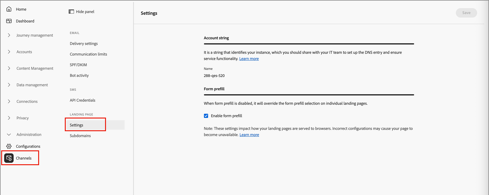

# Configurazione della pagina di destinazione

Gli amministratori devono assicurarsi che le impostazioni della pagina di destinazione siano configurate per gli addetti al marketing che creano e pubblicano tali pagine.

## Impostazioni

Per rivedere la configurazione della pagina di destinazione, vai a **[!UICONTROL Amministrazione]** > **[!UICONTROL Canali]**. In _[!UICONTROL Pagine di destinazione]_ nel riquadro di navigazione, selezionare **[!UICONTROL Impostazioni]**.

{width="800" zoomable="yes"}

### Stringa account {#account-string}

>[!CONTEXTUALHELP]
>id="ajo-b2b_landing_pages_account_string"
>title="Stringa account delle pagine di destinazione"
>abstract="La stringa dell’account identifica l’istanza di Adobe Journey Optimizer B2B edition che ospita le pagine di destinazione."

La stringa dell’account identifica l’istanza di Adobe Journey Optimizer B2B edition che ospita le pagine di destinazione. Assicurati che il team dei sistemi aggiunga e configuri la voce DNS.

### Precompilazione modulo {#form-prefill}

>[!CONTEXTUALHELP]
>id="ajo-b2b_landing_pages_form_prefill"
>title="Impostazioni di precompilazione del modulo della pagina di destinazione"
>abstract="È possibile abilitare l’opzione di precompilazione del modulo per consentire ai moduli all’interno delle pagine di destinazione di utilizzare informazioni precompilate per gli utenti noti."

Abilita l&#39;opzione **[!UICONTROL Precompila modulo]** per consentire ai moduli nelle pagine di destinazione di utilizzare informazioni precompilate per utenti noti. Se questa opzione è disattivata, gli autori delle pagine di destinazione non possono includere campi modulo precompilati.

### Stream di dati {#datastream}

>[!CONTEXTUALHELP]
>id="ajo-b2b_landing_pages_datastream"
>title="Requisito dello stream di dati"
>abstract="Lo stream di dati è necessario per raccogliere gli eventi di pagina dalle pagine di destinazione di questo dominio."

>[!CONTEXTUALHELP]
>id="ajo-b2b_landing_pages_missing_datastream"
>title="ID dello stream di dati mancante"
>abstract="Nel sottodominio manca un ID dello stream di dati, necessario per l’indirizzamento corretto. Configuralo in Impostazioni per continuare"

Imposta l&#39;opzione **[!UICONTROL Datastream]** per configurare un datastream per la raccolta eventi della pagina di destinazione.

## Sottodomini {#add-subdomain}

>[!CONTEXTUALHELP]
>id="ajo-b2b_landing_pages_add_subdomain"
>title="Aggiungere un sottodominio della pagina di destinazione"
>abstract="Puoi aggiungere fino a un massimo di 50 sottodomini. Imposta un nuovo sottodominio per ciascun URL del brand univoco che desideri ospitare su Adobe Journey Optimizer B2B edition."

>[!CONTEXTUALHELP]
>id="ajo-b2b_landing_pages_configure_subdomain"
>title="Configurare un sottodominio della pagina di destinazione"
>abstract="Per pubblicare le pagine di destinazione è necessario un sottodominio configurato. Puoi utilizzare un sottodominio già delegato ad Adobe o crearne uno nuovo."

Un sottodominio della pagina di destinazione dovrebbe aiutare a identificare il tipo di contenuto, il nome di prodotto o la campagna e a rafforzare l’autenticità della pagina. Prima di configurare i sottodomini, definisci uno o più CNAME da utilizzare per le pagine di destinazione. Ad esempio:

* **prodotto**.[DominioSocietà].com
* **vai**.[DominioSocietà].com
* **abbonamento**.[DominioSocietà].com

In questi esempi, la prima parte (in grassetto) è `LandingPageCNAME`.

Aggiungi un nuovo sottodominio per ogni URL del brand univoco che desideri ospitare su Adobe Journey Optimizer B2B edition. Puoi aggiungere un numero massimo di 50 sottodomini.

>[!IMPORTANT]
>
>Non è consentito delegare un sottodominio non valido ad Adobe. Assicurati di immettere un sottodominio valido di proprietà della tua organizzazione, ad esempio _marketing.yourcompany.com_.

Per rivedere i sottodomini e aggiungerne di nuovi, passa a **[!UICONTROL Amministrazione]** > **[!UICONTROL Canali]**. In _[!UICONTROL Pagine di destinazione]_ nel pannello di navigazione, seleziona **[!UICONTROL Sottodomini]**.

{width="800" zoomable="yes"}

_Per aggiungere un sottodominio della pagina di destinazione :_

1. Fai clic su **[!UICONTROL Aggiungi sottodominio]** in alto a destra.

1. In _[!UICONTROL Dettagli sottodominio]_, immettere le informazioni sul sottodominio:

   * **[!UICONTROL Sottodominio]** - URL del sottodominio da utilizzare, ad esempio `marketing.yourcompany.com`
   * **[!UICONTROL Pagina predefinita]** - URL della pagina del sottodominio predefinito, ad esempio `marketing.yourcompany.com/products`
   * **[!UICONTROL Pagina di fallback]**: l&#39;URL della pagina di fallback da utilizzare se una pagina di destinazione nel sottodominio non è attiva, ad esempio `marketing.yourcompany.com/expired`

   {width="700" zoomable="yes"}

1. Fai clic su **[!UICONTROL Salva]**.
