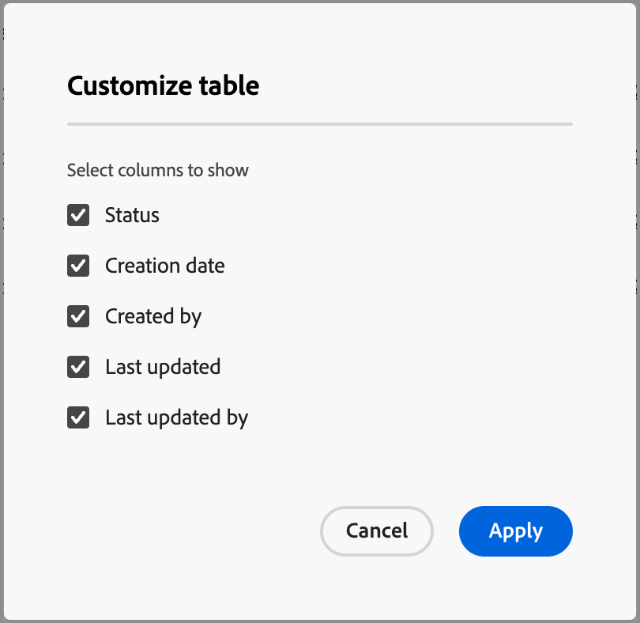

# Mappatura personale

Gli utenti tipo sono un aspetto chiave in un approccio di marketing basato sull’account (ABM) perché aiutano gli esperti di marketing ad adeguare le loro strategie alle esigenze, alle preferenze e ai punti critici specifici degli utenti all’interno degli account target. Gli addetti al marketing possono creare profili dettagliati per ogni persona, indicandone background, responsabilità, punti critici e canali di comunicazione preferiti. Con queste definizioni, gli amministratori possono configurare gli utenti tipo in base agli attributi della persona in Journey Optimizer B2B edition, in modo che i modelli di ruolo possano utilizzare condizioni di ruolo semplificate e coerenti per acquisire tali utenti tipo.

<!-- Currently there is no insight into what persona goes into what role. With buying group agent, when asked questions about, what should be the size of the buying group, what persona should be in that buying group, what role do they play, etc, then agent will analyze all the data, (opportunity data, engagement data, sales conversation, etc) and informs the user that the buying group needs 7 persona, e.g.CMO, VP of marketing, marketing leader, Marketing ops, etc. 

Then based on what agent informed, users can create a template with those personas. -->
Limitazioni di definizione e utilizzo dell’utente:

* Nell&#39;elenco _[!UICONTROL Mapping persona]_ è possibile definire fino a 20 utenti tipo.
* Ogni utente tipo può includere fino a cinque attributi nella propria definizione.
* In tutti gli utenti tipo definiti, puoi utilizzare fino a dieci attributi persona diversi.

>[!BEGINSHADEBOX]

**Caso d&#39;uso: varianti titolo processo**

Molti team di marketing e vendite utilizzano le qualifiche professionali per identificare utenti tipo diversi all’interno di un account. Tuttavia, i titoli dei contatti possono essere incoerenti e utilizzare numerose varianti per ruoli simili. Quando si creano modelli di ruoli di gruppo di acquisto, può essere necessario definire ogni possibile posizione correlata per un determinato ruolo. Puoi semplificare queste definizioni e portare persone con titoli di lavoro simili sotto un unico utente tipo dedotto, che puoi quindi sfruttare tra diversi modelli di ruoli per l’acquisto di gruppi.

Ad esempio, puoi configurare un utente tipo denominato _Product Management_ e definirlo utilizzando l&#39;attributo titolo del processo per i valori di _Product Manager_, _Sr. Product Manager_, _Senior Product Manager_, _PM_, _Sr. PM_, _PM principale_ e _Product Manager principale_. Quindi, utilizza questa persona in un modello di Ruoli in cui la condizione corrisponde in _Persona è Gestione prodotto_. Utilizzando l’utente tipo configurato, la creazione di ciascun modello di ruoli è semplificata e non richiede una condizione complicata che possa corrispondere a ogni possibile titolo di lavoro.

>[!ENDSHADEBOX]

## Accedere agli utenti tipo configurati

1. Nel menu di navigazione a sinistra, scegli **[!UICONTROL Amministrazione]** > **[!UICONTROL Configurazioni]**.

1. Fai clic su **[!UICONTROL Mappatura persona]** nel pannello intermedio per visualizzare l&#39;elenco degli utenti tipo.

   {width="800" zoomable="yes"}

   Da questa pagina è possibile [creare](#create-an-engagement-score-model), [modificare](#change-the-engagement-weighting-settings) o [eliminare](#delete-a-persona) utenti tipo.

   L’elenco di mappatura personale. è organizzato in una tabella e mostra gli utenti tipo aggiornati più di recente nella parte superiore (in ordine di _[!UICONTROL Ultimo aggiornamento]_). Puoi personalizzare la tabella visualizzata facendo clic sull&#39;icona _Impostazioni colonna_ (  ) nell&#39;angolo in alto a destra e selezionando o deselezionando le caselle di controllo della colonna.

{width="300"}

1. Per accedere ai dettagli di un utente tipo, fai clic sul nome.

### Utenti tipo predefiniti

L&#39;elenco _Mapping persona_ include cinque utenti tipo predefiniti definiti in base all&#39;attributo del titolo del processo. Puoi modificare uno di questi utenti tipo predefiniti in base alle esigenze della tua organizzazione:

| Utente tipo | Qualifiche |
| ------- | ---------- |
| CXO / EVP - CXO / vicepresidente esecutivo | CEO, CIO, CTO, CMO, CFO, Executive Vice President of Strategy |
| SVP / VP - Vicepresidente senior / Vicepresidente | SVP marketing, VP vendite, SVP operazioni, VP prodotto, VP IT |
| Direttore principale / Direttore - Direttore principale / Direttore | Direttore tecnico, Direttore senior del prodotto, Direttore delle finanze, Direttore del Customer Success |
| Senior Manager/Manager - Senior Manager/Manager | Senior Marketing Manager, IT Manager, Operations Manager, Sales Manager, HR Manager |
| Collaboratore individuale - Collaboratore individuale | Responsabile dell’account, ingegnere software, specialista di marketing, rappresentante del successo dei clienti |
| Analista - Analista | Analista aziendale, analista dati, analista ricerche di mercato, analista finanziario, analista operazioni |
| Sviluppatore - Sviluppatore | Sviluppatore front-end, sviluppatore back-end, sviluppatore full-stack, sviluppatore app mobile, ingegnere DevOps |
| Personale professionale - Personale professionale | Specialista delle risorse umane, Consulente legale, Responsabile per la conformità, Project Manager, Specialista di approvvigionamento |
| Consulente - Consulente | Consulente di gestione, consulente IT, consulente di processo aziendale, consulente di marketing |
| Altro - Altro | Specialista di settore, consulente indipendente, consulente freelance, esperto in materia |

### Filtraggio elenco

Per individuare l’utente tipo desiderato, utilizza gli strumenti di ricerca e filtro:

* Immetti una stringa di testo nella barra di ricerca che corrisponda agli utenti tipo per nome.

  {width="700" zoomable="yes"}

* Fai clic sull&#39;icona _Filtro_ (  ) in alto a sinistra per filtrare l&#39;elenco visualizzato utilizzando uno dei seguenti attributi:

   * ?
   * ?

## Creare un utente tipo

1. Nel menu di navigazione a sinistra, scegli **[!UICONTROL Amministrazione]** > **[!UICONTROL Configurazione]**.

1. Fai clic su **[!UICONTROL Mappatura personale]** nel pannello intermedio.

1. Fai clic su **[!UICONTROL Crea utente tipo]**.

1. Immetti un **[!UICONTROL Nome]** e una **[!UICONTROL Descrizione]** univoci (facoltativo) per l&#39;utente tipo.

1. Seleziona gli attributi da utilizzare per la corrispondenza con l’utente tipo.

   * Fare clic su **[!UICONTROL Seleziona attributi persona]**.

   * Nella finestra di dialogo _[!UICONTROL Seleziona attributi persona]_, seleziona la casella di controllo per ogni attributo che desideri mappare (un massimo di cinque).

     Puoi personalizzare la tabella visualizzata facendo clic sull&#39;icona _Impostazioni colonna_ (  ) nell&#39;angolo in alto a destra.

     Per filtrare l&#39;elenco di attributi in base al nome, immettere una stringa di testo nella barra di ricerca. Puoi anche fare clic sull&#39;icona _Filtro_ (  ) in alto a sinistra per filtrare l&#39;elenco visualizzato per tipo, _Standard_ o _Personalizzato_.

   * Fai clic su **[!UICONTROL Salva]**.

     Gli attributi selezionati sono inseriti nella sezione _[!UICONTROL Attributi personali]_.

1. Per ogni attributo, immettere i valori separati da virgola che si desidera associare per l&#39;attributo.

   Al posto di un valore, puoi anche aggiungere un prompt che può essere utilizzato per identificare una corrispondenza. Ad esempio, puoi immettere:

1. Fai clic su **[!UICONTROL Crea]**.

## Modificare un tipo di utente

1. Per accedere ai dettagli dell’utente tipo, fai clic sul nome.

## Eliminare un utente tipo

Se si elimina un utente tipo, questo viene rimosso dall&#39;elenco _Mapping persona_ e non è più disponibile per l&#39;utilizzo nei modelli di ruoli.

1. Nella pagina _[!UICONTROL Mapping persona]_ individuare l&#39;utente tipo che si desidera eliminare.

1. Accanto al nome fare clic sull&#39;icona dei puntini di sospensione (**...**) per e scegliere **[!UICONTROL Elimina]**.

1. Nella finestra di dialogo di conferma, fai clic su **[!UICONTROL Elimina]**.
