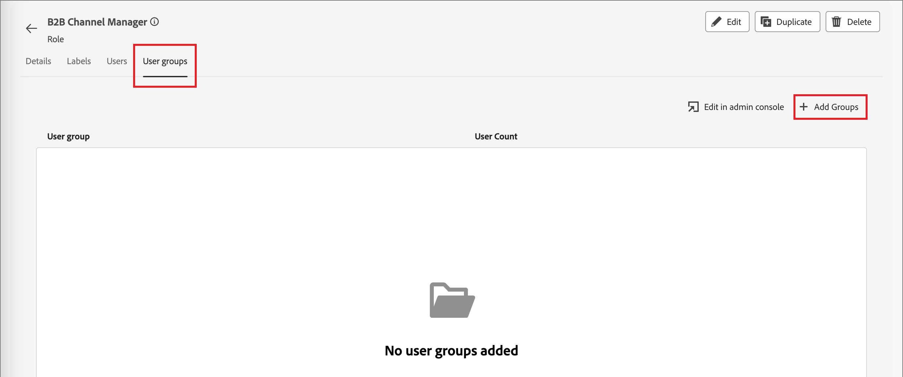

# Gestione degli utenti

Dopo aver completato il provisioning e aver associato le sandbox, completa i passaggi seguenti per fornire al team e agli utenti l’accesso a Adobe Journey Optimizer B2B edition.

1. [Crea un profilo di prodotto Marketo Engage](#marketo-engage-profile) in Admin Console (solo nuova istanza Marketo Engage).
1. [Crea un gruppo utenti](#create-user-group) in Admin Console.
<!-- 1. [Edit built-in roles](#edit-roles) or [create a custom role](#create-a-custom-role) with Journey Optimizer B2B Edition permissions. -->
1. [Aggiungi utenti](#add-users) o [gruppi](#add-user-groups-to-a-role) ai ruoli.

In qualità di amministratore, puoi completare queste attività in Adobe Admin Console, che è una posizione centrale per amministrare e gestire le licenze e gli utenti dei prodotti Adobe. In Admin Console, puoi creare e gestire gli utenti in un’unica posizione invece che all’interno delle varie soluzioni individuali. Per ulteriori informazioni sulle funzioni e le funzionalità della pagina [Panoramica di Admin Console](https://helpx.adobe.com/it/enterprise/using/admin-console.html), fai riferimento a.

## Accedere ad Admin Console

Prima di poter utilizzare Admin Console per amministrare gli utenti del team, è necessario assicurarsi di poter accedere ad Admin Console e di disporre delle autorizzazioni appropriate.

1. In qualità di amministratore di sistema, come parte del processo di onboarding dovresti ricevere più e-mail da Adobe.

   Cerca l’e-mail di benvenuto con le informazioni sul nome dell’organizzazione a cui hai accesso.

1. Per accedere a Admin Console, fai clic sul collegamento **[!UICONTROL Inizia]** nell&#39;e-mail di benvenuto.

   Se non riesci a trovare l&#39;e-mail, apri un browser per accedere direttamente a Admin Console all&#39;indirizzo [https://adminconsole.adobe.com](https://adminconsole.adobe.com).

1. Accedi con il tuo Adobe ID.

   Dopo aver effettuato l&#39;accesso, viene visualizzata la pagina _Panoramica_ di Adobe Admin Console.

1. Se hai accesso a più organizzazioni, assicurati di aver effettuato l’accesso all’organizzazione corretta.

   Per modificare l’organizzazione, fai clic sul nome dell’organizzazione nell’angolo in alto a destra e scegli l’organizzazione a cui desideri accedere.

1. Seleziona **[!UICONTROL Amministratori]** dalla scheda _[!UICONTROL Utenti]_ per verificare di essere un amministratore di sistema.

   {width="700" zoomable="yes"}

1. Effettua la ricerca immettendo e-mail, nome utente, nome o cognome Adobe ID.

   * Se l’accesso è configurato correttamente, la ricerca restituisce il record.

   * Se il valore nella colonna **[!UICONTROL RUOLO AMMINISTRATORE]** mostra `System`, l&#39;amministratore di sistema è tu o l&#39;utente visualizzato.

## Creare il profilo di prodotto Marketo Engage {#marketo-engage-profile}

Quando consenti l’accesso a una soluzione Adobe agli utenti, non devi necessariamente concedere loro l’accesso completo. I profili di prodotto consentono a ciascuna soluzione di disporre di un proprio set di autorizzazioni utente. Utilizza Admin Console per assegnare i profili di prodotto.

Per ulteriori informazioni sull&#39;utilizzo dei profili di prodotto per le adesioni utente, consulta [Gestire i profili di prodotto per gli utenti aziendali](https://helpx.adobe.com/it/enterprise/using/manage-product-profiles.html){target="_blank"} nella documentazione di Admin Console.

>[!BEGINSHADEBOX]

Quando si aggiunge un utente al profilo di prodotto Marketo Engage, questi vengono successivamente aggiunti al ruolo _Utente standard_ nell&#39;area di lavoro predefinita della sottoscrizione Marketo Engage. Questo ruolo concede loro tutte le autorizzazioni _Utente standard_ per Marketo Engage in tale area di lavoro. Attualmente, tutti gli utenti Journey Optimizer B2B edition devono essere utenti Marketo Engage. Un amministratore di Marketo Engage può limitare l&#39;accesso aggiornando le autorizzazioni per il ruolo _Utente standard_ o spostando l&#39;utente in un altro ruolo utente di Marketo Engage con autorizzazioni più restrittive.

Per ulteriori informazioni sulla gestione di queste autorizzazioni in Marketo Engage, vedi [Gestione dei ruoli utente e delle autorizzazioni](https://experienceleague.adobe.com/it/docs/marketo/using/product-docs/administration/users-and-roles/managing-user-roles-and-permissions){target="_blank"} nella documentazione di Marketo Engage.

>[!ENDSHADEBOX]

{width="30"} Un amministratore di sistema o un amministratore di prodotto Marketo Engage può eseguire i seguenti passaggi.

1. Accedi a [https://adminconsole.adobe.com](https://adminconsole.adobe.com).

1. Selezionare la scheda **[!UICONTROL Prodotti]**.

1. Apri l&#39;istanza di Marketo Engage in cui desideri aggiungere il profilo e fai clic su **[!UICONTROL Nuovo profilo]**.

   {width="700" zoomable="yes"}

1. Immettere un nome di profilo prodotto, ad esempio _Utente standard_.

1. Fai clic su **Avanti** e quindi su **Salva**.

## Creare un gruppo di utenti {#create-user-group}

Un gruppo di utenti è una raccolta di utenti a cui viene concesso un set condiviso di autorizzazioni. Puoi aggiungere o rimuovere utenti nel gruppo di utenti. Le autorizzazioni del gruppo rimangono invariate mentre gli utenti all’interno del gruppo cambiano.

Per ulteriori informazioni sull&#39;utilizzo dei gruppi di utenti per gestire le autorizzazioni, vedere [Gestione dei gruppi di utenti](https://helpx.adobe.com/it/enterprise/using/user-groups.html){target="_blank"} nella documentazione di Admin Console.

{width="30"} L&#39;amministratore di sistema può eseguire i seguenti passaggi.

1. Accedi a [https://adminconsole.adobe.com](https://adminconsole.adobe.com).

1. Selezionare la scheda **[!UICONTROL Utenti]**.

1. Scegliere **[!UICONTROL Gruppi utenti]** nel menu di navigazione a sinistra.

1. Fai clic su **[!UICONTROL Nuovo gruppo utenti]** in alto a destra.

1. Immetti un nome per il gruppo di utenti, ad esempio _Utenti standard_ e fai clic su **[!UICONTROL Salva]**.

1. Fai clic sul gruppo di utenti appena creato.

1. Seleziona la scheda **[!UICONTROL Profili di prodotto assegnati]** e fai clic su **[!UICONTROL Assegna profilo]**.

1. Fai clic su **+** e aggiungi ogni istanza dei seguenti prodotti:

   * [!UICONTROL Marketo Engage]
   * [!UICONTROL Adobe Experience Platform - AEP-Default-All-Users]
   * [!UICONTROL Raccolta dati di Adobe Experience Platform]
   * [!UICONTROL Accesso a tutti gli elementi della raccolta dati]

   {width="700" zoomable="yes"}

1. Fai clic su **[!UICONTROL Salva]**.

## Aggiungere utenti a un gruppo

Per informazioni sulla gestione degli utenti, consulta [Utenti Admin Console](https://helpx.adobe.com/it/enterprise/using/user-groups.html) nella documentazione di Admin Console.

{width="30"} Un amministratore di sistema o un amministratore di prodotto può eseguire i seguenti passaggi. Un amministratore di prodotto può aggiungere solo gli utenti che esistono già nella sua organizzazione.

1. Vai a [https://adminconsole.adobe.com](https://adminconsole.adobe.com).

1. In _[!UICONTROL Collegamenti rapidi]_, fare clic su **[!UICONTROL Aggiungi utenti]**.

1. Aggiungi ogni utente:

   * Immetti l’indirizzo e-mail, il nome e il cognome dell’utente.

     {width="600" zoomable="yes"}

   * Per **[!UICONTROL Gruppi utenti]**, fare clic su **+**.

   * Seleziona il gruppo di utenti creato in precedenza.

   * Fare clic su **[!UICONTROL Applica]**.

1. Fai clic su **[!UICONTROL Salva]**.

<!-- ## Edit roles for product permissions {#edit-roles}

Permissions are unitary rights that allow you to define the authorizations assigned to a product profile. Each permission is gathered under a capability, such as journeys or buying groups, which represents the different functionalities or objects in Journey Optimizer B2B Edition.

The _Permissions_ area of Adobe Experience Platform is where administrators can define user roles and access policies to manage access permissions for features and objects within a product application. In this app, you can create and manage roles, as well as assign the desired resource permissions for these roles. Permissions also allow you to manage the sandboxes and users associated with a specific role.

For more information about role permissions in Experience Platform, see [Manage permissions for a role](https://experienceleague.adobe.com/it/docs/experience-platform/access-control/abac/permissions-ui/permissions){target="_blank"} in the Experience Platform documentation.

### B2B product permissions

The following permissions govern access to Journey Optimizer B2B Edition capabilities:

| Category | Description | Permissions |
| -------- | ----------- | ---------- |
| B2B Account Lists | Configure, manage, view, and publish permissions for B2B account lists. These permissions include actions such as add, remove, import, and delete accounts from account lists. | <li>Manage B2B Account Lists |
| B2B Admin Configurations | Configure, manage, and view permissions for B2B administrative configurations. These permissions include digital asset management connections, asset repositories, and events. | <li>Manage B2B Admin Configurations |
| B2B Assets | Configure, manage, and view permissions for B2B assets. These permissions include emails, SMS, landing pages, fragments, templates, and images. | <li>Manage B2B Assets <li>Manage B2B Templates <li>Manage B2B Fragments|
| B2B Buying Groups | Configure, manage, and view permissions for B2B buying groups. These permissions include solution interests, roles templates, and buying group status. | <li>Manage B2B Buying Groups |
| B2B Channel Configurations | Configure, manage, and view permissions for B2B channel configurations. These permissions include settings for communication limits, API credentials, and security settings. | <li>Manage B2B Channels Configurations |
| B2B Dashboards |Configure and view permissions for B2B dashboards. These permissions include account engagement, buying group stages, surging accounts, and contact coverage. | <li>Manage B2B Dashboards |
| B2B Journeys | Configure manage, view, and publish permissions for B2B journeys. These permissions include account and person actions, event listeners, and split paths | <li>Manage B2B Journeys |

### B2B built-in roles

When your organization has the Journey Optimizer B2B Edition product provisioned, Experience Platform includes a set of built-in (default) roles that you can use to manage access to the product capabilities:

| Role | Permissions |
| ---- | ----------- |
| B2B Journey Manager | <li>Manage B2B Journeys <li>Manage B2B Buying Groups <li>Manage B2B Account Lists <li>View B2B Engagement Dashboard <li>View B2B Insights Dashboard |
| B2B Channel Manager | <li>Manage B2B Assets <li>Manage B2B Templates <li>Manage B2B Fragments |
| B2B System Administrator | <li>Manage B2B Channels Configurations <li>Manage B2B Admin Configurations |
| B2B Sales User | <li>View B2B Engagement Dashboard |

### Edit role permissions

For built-in or custom roles, you can decide at any time to add or delete permissions. If you modify a default or custom role, it impacts every user assigned to the role.

In the following example, you want to add permissions related to the B2B Journeys resource for users assigned to the B2B Channel Manager role. This change enables users for that role to manage account journeys also.

>[!NOTE]
>
>An Admin Console system administrator can perform these steps.

_To change the permissions for a role:_

1. Go to [experience.adobe.com](https://experience.adobe.com/).

1. In the _[!UICONTROL Quick access]_ panel, select **[!UICONTROL Permissions]**.

   >[!NOTE]
   >
   >If you don't see _[!UICONTROL Permissions]_, you may need to click **[!UICONTROL View all]** and select it from the available applications.

   {width="700" zoomable="yes"}

1. Select **[!UICONTROL Roles]** in the left navigation.

1. Click the **_B2B Channel Manager_** role name.

1. In the details page, click **[!UICONTROL Edit]** at the top right.

   {width="700" zoomable="yes"}

   In the role editor, the _[!UICONTROL Resources]_ menu displays the list of resources that apply to the Experience Cloud - Platform powered applications products.

   You can enter _B2B_ in the search tool to filter the list for the B2B product permissions. 
   
1. Click the _Add_ icon (**+**) for the B2B Journeys resource.

   {width="700" zoomable="yes"}

1. In the _[!UICONTROL B2B Journeys]_ permissions card, select **[!UICONTROL Manage B2B Account Journeys]**.

1. Click **[!UICONTROL Save]**.

   {width="700" zoomable="yes"}

1. Click **[!UICONTROL Close]** to return to the details page.

### Add users to a role

{width="30"} A system administrator or AEP product administrator can perform the following steps. 

1. Open the role details and select the **[!UICONTROL Users]** tab.

   This tab displays a list of all users assigned to the role.

1. Click **[!UICONTROL Add users]**.

   {width="700" zoomable="yes"}

1. In the _[!UICONTROL Add users]_ dialog, locate and select the users that you want to add to the role.

   * You can use the Search tool to filter the list of users. 

   * Select the checkbox for each user.

   {width="600" zoomable="yes"}

1. Click **[!UICONTROL Save]** when you have selected all the users that you want to add.

### Add user groups to a role

For information about user management, see [Admin Console users](https://helpx.adobe.com/it/enterprise/using/user-groups.html) in the Admin Console documentation.

{width="30"} A system administrator or AEP product administrator can perform the following steps. 

1. Open the role details and select the **[!UICONTROL User groups]** tab.

   This tab displays a list of all user groups assigned to the role. 

1. Click **[!UICONTROL Add Groups]**.

   {width="700" zoomable="yes"}

1. In the _[!UICONTROL Add groups]_ dialog, locate and select the groups that you want to add to the role.

   * You can use the Search tool to filter the list of user groups. 

   * Select the checkbox for each user group.

   {width="600" zoomable="yes"}

1. Click **[!UICONTROL Save]** when you have selected all the users that you want to add. -->

## Creare un ruolo personalizzato

{width="30"} Un amministratore di sistema o un amministratore di prodotto AEP può eseguire i seguenti passaggi.

1. Seleziona **[!UICONTROL Ruoli]** nell&#39;area di navigazione a sinistra e seleziona **[!UICONTROL Crea ruolo]**.

1. Nella finestra di dialogo _[!UICONTROL Crea nuovo ruolo]_, immetti un nome per il ruolo, ad esempio _B2B Marketers_, e una descrizione (facoltativa).

1. Fai clic su **[!UICONTROL Conferma]**.

1. Seleziona le sandbox.

   {width="700" zoomable="yes"}

1. Aggiungi le autorizzazioni profilo:

   * Nell&#39;elenco _[!UICONTROL Risorse]_ a sinistra, individuare l&#39;elemento **[!UICONTROL Gestione profili]** e fare clic sull&#39;icona _Aggiungi_ (**+**) per aggiungere l&#39;attributo.

   * Per l’attributo, aggiungi le seguenti autorizzazioni:
      * [!UICONTROL Visualizza segmenti]
      * [!UICONTROL Gestisci segmenti]
      * [!UICONTROL Visualizza profili]
      * [!UICONTROL Gestisci profili]
      * [!UICONTROL Visualizza profilo B2B]
      * [!UICONTROL Gestisci profilo B2B]

   {width="700" zoomable="yes"}

1. Aggiungere autorizzazioni prodotto B2B:

   Consulta l&#39;elenco delle [autorizzazioni prodotto B2B](#b2b-product-permissions) per determinare quali funzionalità prodotto desideri per il ruolo.

   Nell&#39;elenco _[!UICONTROL Risorse]_ a sinistra, individuare gli elementi **[!UICONTROL B2B]** e fare clic sull&#39;icona _Aggiungi_ (**+**) per aggiungere ogni attributo che si desidera abilitare per il ruolo.

   È possibile immettere _B2B_ nello strumento di ricerca per filtrare l&#39;elenco delle autorizzazioni per il prodotto B2B.

1. Fai clic su **[!UICONTROL Salva]** in alto a destra.

1. Vai ai dettagli del ruolo e seleziona la scheda **[!UICONTROL Gruppi di utenti]**.

1. Fare clic su **[!UICONTROL Aggiungi gruppi]**.

   {width="700" zoomable="yes"}

1. Seleziona la casella di controllo accanto al gruppo di utenti creato in precedenza nell’Admin Console.

1. Fai clic su **[!UICONTROL Salva]**.
