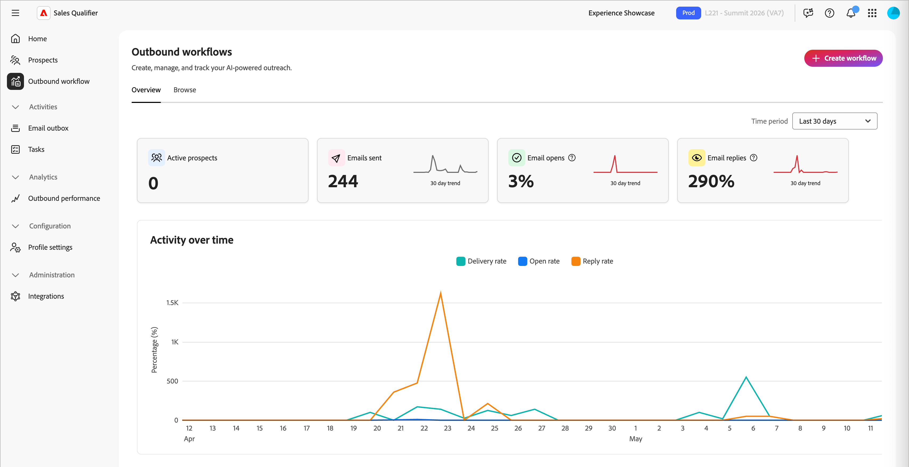
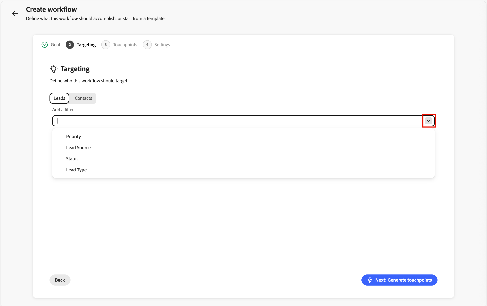

# Qualificatore di vendita

Sales Qualifier è un&#39;applicazione basata sull&#39;intelligenza artificiale che puoi utilizzare con Adobe Journey Optimizer B2B edition. Implementa Account Qualification Agent ed è progettato per semplificare i flussi di lavoro per i rappresentanti di sviluppo aziendale (BDR, Business Development Representative). Qualificatore di vendita automatizza i flussi di lavoro di qualificazione dei potenziali clienti, coinvolgimento degli acquirenti e coinvolgimento degli acquirenti su tutti i canali. Riduce il carico BDR manuale e accelera la velocità della pipeline per le aziende B2B aziendali.

I BDR possono utilizzare il browser e i plug-in e-mail per accedere alle informazioni aziendali direttamente in CRM o Outlook. Il video seguente offre una breve dimostrazione dei Sales Qualifier e di Account Qualification Agent.

>[!VIDEO](https://video.tv.adobe.com/v/3476550)

## Home dell’applicazione

Qualificatore di vendita è incluso in [!UICONTROL Journey Optimizer B2B edition], ma è un&#39;app separata all&#39;interno di Adobe Experience Platform.

{width="800" zoomable="yes"}

### Agente Account Qualification

Il Account Qualification Agent (AQA) è il cuore del qualificatore di vendita. L’AQA utilizza l’intelligenza artificiale per leggere gli account e determinare quali sono pronti per il passaggio successivo. Aiuta nella ricerca, nella redazione di e-mail e nel contesto informato sul sistema CRM quando l’organizzazione ha connesso il sistema CRM (sola lettura).

<!--
## Edit the left navigation bar

At the bottom left of the application, click the _Edit_ (  ) icon to control which elements are visible in the left navigation. You can also drag and drop them to reorder as you want.
-->

### Utilizzo di base dell’agente

Gli agenti di Adobe AI utilizzano _query in linguaggio naturale_, il che significa che utilizzano nel prompt del testo la stessa lingua utilizzata quando si parla con una persona. Più sei dettagliato, migliori saranno i risultati.

Utilizzando il linguaggio naturale, puoi chiedere all’agente di:

* `Tell me the latest financial results of Bodea`
* `Tell me more about hiring at TechNova`
* `Tell me about the new AI features in Bodea LumaSecure4`

Itera i flussi di lavoro in uscita perfezionando le richieste per ottenere i risultati necessari. Ad esempio:

* _Crea una bozza di disegno di un&#39;e-mail di follow-up dal contesto, ad esempio chiamate o rapporti sui guadagni._ Fino a 120 parole. Oggetto: Captivazione, con un tema chiave. Introduzione: hook con una citazione diretta da origini di contesto. Corpo: connettiti ai punti critici e alle proposte di valore. CTA: propone una breve chiamata per approfondire l’analisi._

* _L&#39;obiettivo di questa e-mail è quello di avviare una conversazione e creare credibilità._ Redigi un&#39;e-mail sotto 120 parole con un tono consultivo ed empatico. Assicurati di evitare un approccio troppo familiare o di vendita e non utilizzare le frasi &quot;spera di stare bene&quot;, &quot;solo check-in&quot;, o &quot;per favore&quot;._

### Accesso ai prodotti e gruppi di utenti

L&#39;accesso alle funzioni Qualificatore di vendita viene gestito tramite gruppi di utenti in Adobe Admin Console. Gli amministratori di prodotto devono impostare i gruppi di utenti appropriati prima che gli utenti possano accedere all’applicazione.

#### Amministratori di prodotto

Gli amministratori di prodotto che devono accedere alla funzionalità [Integrazioni](#integrations) devono essere membri del gruppo di utenti `Sales Qualifier Admins`.

1. In Adobe Admin Console, creare un gruppo di utenti denominato `Sales Qualifier Admins`.
1. Aggiungi gli utenti che devono configurare le connessioni CRM e le impostazioni della Knowledge Base.

#### Utenti BDR standard

Gli utenti BDR standard devono essere membri del gruppo di utenti `Sales Qualifier users` per accedere a Qualificatore vendite.

1. In Adobe Admin Console, creare un gruppo di utenti denominato `Sales Qualifier users`.
1. Assegna al gruppo il profilo AEP **Default Production All Access**.
1. Aggiungere utenti al gruppo.

>[!NOTE]
>
>I nomi dei gruppi di utenti devono corrispondere esattamente come mostrato nei passaggi precedenti.

## Potenziali clienti

Seleziona **[!UICONTROL Prospect]** nella barra di navigazione a sinistra per visualizzare un elenco di tutti i lead a cui puoi accedere. Consente di controllare rapidamente elementi quali lo stato del lead e l’ultima attività.

{width="800" zoomable="yes"}

Fai clic sull&#39;icona _Filtro_  per filtrare l&#39;elenco visualizzato in base allo stato del lead.

## Flussi di lavoro in uscita

>[!NOTE]
>
>I flussi di lavoro in uscita creati dagli amministratori di prodotto vengono condivisi con tutti gli utenti dell’organizzazione.

Un _flusso di lavoro in uscita_ è la struttura utilizzata dal qualificatore di vendita per eseguire una sequenza e-mail basata su obiettivi. Definisci un obiettivo di sensibilizzazione e criteri di targeting e l’intelligenza artificiale propone una cadenza multi-touch e scrive contenuti e-mail personalizzati per ogni potenziale cliente. Prima di attivare la sequenza, rivedi e approva ogni e-mail in modo che i messaggi vengano inviati solo durante la finestra configurata.

Un flusso di lavoro in uscita collega quattro elementi:

* **Obiettivo** - Il risultato desiderato dall&#39;estensione (ad esempio la prenotazione di una chiamata di individuazione o la registrazione di un evento guida).
* **Filtri di targeting** - Condizioni che determinano quali potenziali clienti sono idonei.
* **Cadenza dei punti di contatto** - Sequenza ordinata di passaggi, ciascuno in un giorno pianificato. I punti di contatto possono essere **e-mail**, **telefonate** o **LinkedInMails**.
* **Contenuto e-mail personalizzato** - Per ogni punto di contatto e-mail, l&#39;intelligenza artificiale crea il contenuto utilizzando il profilo del potenziale cliente, il contesto dell&#39;account, la cronologia del coinvolgimento e le notizie recenti.

L’obiettivo guida tutto a valle: l’intelligenza artificiale lo utilizza per suggerire filtri di targeting, progettare la cadenza, bozze di prompt dei punti di contatto e personalizzare la forma per ogni e-mail generata.

{width="800" zoomable="yes"}

### Concetti chiave

| Concetto | Descrizione |
| --- | --- |
| **Flusso di lavoro** | Un’attività in uscita riutilizzabile definita da un obiettivo, da filtri di targeting, cadenza e impostazioni. |
| **Obiettivo** | Cosa dovrebbe fare la sensibilizzazione. |
| **Punto di contatto** | Un passaggio della sequenza (e-mail, chiamata telefonica o LinkedInMail), pianificato in relazione all’iscrizione. |
| **Prompt punto di contatto** | Le istruzioni che l’intelligenza artificiale segue durante la generazione del corpo e dell’oggetto dell’e-mail per un potenziale cliente: tono, lunghezza, focus e call to action. |
| **Cadenza** | La sequenza completa dei punti di contatto: quanti, in quale ordine e in quali giorni. |
| **Filtro di targeting** | Condizione che limita il flusso di lavoro a un sottoinsieme di potenziali clienti. |
| **Bozza** | Un’e-mail generata pronta per la revisione ma non ancora approvata. |
| **Motivazione** | La spiegazione dell’intelligenza artificiale di come ha scritto una determinata e-mail (quali segnali e fonti di dati ha utilizzato). |
| **Iscrizione** | Approvazione delle bozze di un potenziale cliente, che attiva la cadenza e mette in coda le e-mail da inviare durante la finestra di invio del flusso di lavoro. |

Le sezioni seguenti descrivono l’intero ciclo di vita: creazione di un flusso di lavoro nella procedura guidata, revisione delle e-mail generate, approvazione di potenziali clienti e gestione dei flussi di lavoro nel tempo.

### Creare un flusso di lavoro in uscita

La creazione del flusso di lavoro è una procedura guidata in cinque passaggi: **Obiettivo**, **Targeting**, **Generare punti di contatto**, **Impostazioni** e **Aggiungere potenziali clienti**. Ogni passaggio si basa sull’ultimo; l’obiettivo iniziale forma ogni decisione successiva.

1. Nel menu di navigazione a sinistra, seleziona **[!UICONTROL Flusso di lavoro in uscita]**.

1. Nella scheda **[!UICONTROL Sfoglia]**, fai clic su **[!UICONTROL + Crea flusso di lavoro]** nell&#39;angolo superiore destro.

#### Passaggio 1: definire l’obiettivo

L’obiettivo è l’input più importante: indica all’intelligenza artificiale come si presenta il successo e ancora il targeting, la cadenza e la generazione di e-mail.

1. Scegli **[!UICONTROL Inizia da zero]** per scrivere il tuo obiettivo oppure **[!UICONTROL Inizia da modello]** per utilizzare un modello salvato.

   {width="700" zoomable="yes"}

1. Scegli uno dei **[!UICONTROL obiettivi consigliati]** come punto di partenza oppure immetti un obiettivo personalizzato.

1. Fare clic su **[!UICONTROL Avanti: Targeting]**.

Gli obiettivi funzionano meglio quando indicano un **risultato concreto**, non solo un argomento. Ad esempio, `Book a 15-minute discovery call with marketing leaders evaluating campaign automation` consente all&#39;IA di lavorare con più di `Promote campaign automation`.

#### Passaggio 2: configurare i filtri di targeting

I filtri di targeting definiscono quali potenziali clienti sono idonei. Quando si aggiungono i potenziali clienti in un secondo momento, nell&#39;elenco di selezione vengono visualizzati solo i potenziali clienti che corrispondono a questi filtri.

1. Fare clic sulla freccia rivolta verso il basso per visualizzare l&#39;elenco **[!UICONTROL Aggiungi un filtro]** e selezionare un filtro da applicare.

   {width="700" zoomable="yes"}

1. Imposta i valori per il filtro.

1. Aggiungi altri filtri per restringere il pubblico.

   {width="600" zoomable="yes"}

1. Fai clic su **[!UICONTROL Avanti: genera punti di contatto]**.

#### Passaggio 3: generare e rivedere i punti di contatto

Dopo aver impostato il targeting, l&#39;IA crea la **_cadenza_**: analizza l&#39;obiettivo e il targeting, definisce la sequenza di punti di contatto e scrive un **_prompt dei punti di contatto_** per ogni passaggio. Viene visualizzata una cadenza in più passaggi con ogni punto di contatto in un giorno specifico. La cadenza può combinare i passaggi e-mail, telefonata e LinkedInMail.

{width="700" zoomable="yes"}

Espandi un punto di contatto e-mail per leggerne il prompt. Questa istruzione guida l’intelligenza artificiale durante la scrittura dell’e-mail di ogni potenziale cliente, inclusi il tono, la lunghezza, lo stato attivo e call to action.

**Rigenerare la cadenza**

Se la cadenza non è quella desiderata, fare clic su **[!UICONTROL Rigenera]** e immettere un&#39;istruzione di ottimizzazione. Ad esempio:

* `Make it 3 touchpoints across 2 weeks`
* `Lead with an executive briefing offer in the first email`
* `Add a nurture touch focused on a relevant case study`

L’intelligenza artificiale riscrive l’intera cadenza in base alle tue istruzioni.

Per regolare un singolo punto di contatto e-mail senza rigenerare l’intera cadenza, modifica il testo del prompt direttamente nella relativa area di testo.

Quando la cadenza e i prompt sono visualizzati a destra, fare clic su **[!UICONTROL Avanti: impostazioni]**.

Affinare i prompt dei punti di contatto prima che sia importante la generazione per potenziale cliente: questi prompt sono le istruzioni principali utilizzate dall’intelligenza artificiale per ogni potenziale cliente in un secondo momento. Il tempo trascorso qui viene proporzionato in tutte le e-mail generate.

#### Passaggio 4: configurare le impostazioni del flusso di lavoro

Il passaggio **Impostazioni** controlla come viene eseguito il flusso di lavoro.

{width="700" zoomable="yes"}

1. Rivedi il **[!UICONTROL nome flusso di lavoro]** e modificalo se vuoi un&#39;etichetta più chiara.
1. In **[!UICONTROL Numero massimo di potenziali clienti per flusso di lavoro]**, confermare il limite massimo per il numero di potenziali clienti che il flusso di lavoro può gestire contemporaneamente.
1. Imposta la **[!UICONTROL finestra di invio]** per le ore in cui le e-mail in uscita possono essere inviate.
1. Conferma **[!UICONTROL Includi collegamento rinuncia]** in modo che ogni e-mail possa includere un collegamento di rinuncia.
1. Verifica che il **[!UICONTROL Fuso orario]** corrisponda al tuo pubblico.
1. Fai clic su **[!UICONTROL Salva e aggiungi potenziali]**.

#### Passaggio 5: aggiungere potenziali clienti e avviare la generazione di e-mail

Il salvataggio apre la vista di selezione del prospect, già filtrata dal targeting del passaggio 2.

{width="700" zoomable="yes"}

1. Rivedi l&#39;elenco.

   Le righe in genere includono il nome del potenziale cliente, l’account, l’e-mail, la qualifica professionale, lo stato del coinvolgimento e lo stato del potenziale cliente.

1. Regolare i filtri qui se è necessario espandere o restringere l’elenco.
1. Seleziona i potenziali clienti utilizzando le caselle di controllo.
1. Fai clic su **[!UICONTROL Avanti: controlla i punti di contatto]** per avviare la generazione di **e-mail per potenziale**.

L&#39;intelligenza artificiale genera e-mail personalizzate per ogni potenziale cliente selezionato per **ogni punto di contatto e-mail** nella cadenza. I punti di contatto Phone e LinkedInMail rimangono nella sequenza come passaggi pianificati. La generazione può essere eseguita in background. Utilizzare **[!UICONTROL Notify when ready]** se si desidera continuare il lavoro mentre viene completato.

Per ogni potenziale cliente, l’intelligenza artificiale combina ogni prompt dei punti di contatto con dati specifici del potenziale cliente (persona, account, cronologia del coinvolgimento, notizie recenti) per produrre l’oggetto e il corpo.

### Rivedere e perfezionare le e-mail generate

Al termine della generazione, nella vista dei dettagli del flusso di lavoro viene visualizzato un banner per la revisione delle bozze. La revisione è necessaria e non viene inviato nulla finché non ricevi l’approvazione.

{width="700" zoomable="yes"}

1. Nella visualizzazione dettagli flusso di lavoro, fare clic su **[!UICONTROL Rivedi bozze]** nel banner.
1. Il passaggio **[!UICONTROL Rivedi punti di contatto]** ha due schede:
   * **[!UICONTROL Pronto per la revisione]** - E-mail che hanno terminato la generazione.
   * **[!UICONTROL Generazione in corso]** - Messaggi di posta elettronica ancora in fase di scrittura.
1. Nell’elenco dei potenziali clienti a sinistra, fai clic su un nome per caricare i punti di contatto del potenziale cliente a destra.
1. Utilizzare la freccia (**>**) in un punto di contatto per espandere e leggere l&#39;oggetto e il corpo completi.

#### Leggere il ragionamento dell’intelligenza artificiale

Per ogni e-mail generata, **[!UICONTROL Reasoning]** spiega come l&#39;intelligenza artificiale ha creato il messaggio, inclusi i segnali, gli attributi e le origini che hanno modellato il contenuto e call to action. Esamina queste informazioni per convalidare la personalizzazione prima di approvare.

{width="600" zoomable="yes"}

#### Modifica direttamente le e-mail

Per le piccole modifiche (testo, tono, una singola frase):

1. Nel punto di contatto espanso, fai clic sull&#39;icona _Modifica_ per aprire l&#39;editor.
1. Modifica l&#39;oggetto o il corpo.
1. Fai clic su **[!UICONTROL Salva]**.

#### Ottimizzare le e-mail con l’intelligenza artificiale

Per modifiche più grandi (ristrutturazione, spostamento dell&#39;enfasi o riformattazione del messaggio), utilizza **[!UICONTROL Genera con IA]**. L’agente di IA riscrive l’e-mail mantenendo il contesto di personalizzazione.

1. Nell&#39;editor e-mail, fai clic su **[!UICONTROL Genera con IA]**.

   {width="600" zoomable="yes"}

1. Immettere un&#39;istruzione di cancellazione, ad esempio:
   * `Make it shorter and more direct. Keep it under 100 words.`
   * `Focus more on the prospect's role and how the solution helps them specifically.`
   * `Change the call-to-action to suggest a 15-minute introductory call instead.`
1. Rivedi la revisione e, se necessario, modificala manualmente.
1. Fai clic su **[!UICONTROL Salva]**.

>[!TIP]
>
>Modifica direttamente il testo e il tono della tuta. _[!UICONTROL Generate with AI]_ è migliore se altrimenti riscrivereste l&#39;e-mail da zero.

### Approva e iscrivi potenziali clienti

L’approvazione attiva la cadenza per un potenziale cliente. Fino a quando un potenziale cliente non viene approvato e iscritto, il sistema non invia loro e-mail.

1. Nell’elenco a sinistra dei potenziali clienti, seleziona i potenziali clienti di cui hai rivisto e-mail e che sei pronto a inviare.
1. Fai clic su **[!UICONTROL Approva e iscrivi prospect]** (in basso a destra).

{width="700" zoomable="yes"}

Le e-mail approvate vengono inviate durante il flusso di lavoro **finestra di invio** nel **fuso orario** configurato, nel giorno pianificato di ogni punto di contatto relativo all&#39;iscrizione. I potenziali clienti che non approvi rimangono in **[!UICONTROL Pronti per la revisione]** fino a quando non agisci. Dopo l’approvazione, il flusso di lavoro viene eseguito in base alla cadenza definita.

### Gestire i flussi di lavoro esistenti

Nella pagina _[!UICONTROL Flusso di lavoro in uscita]_, la scheda **[!UICONTROL Sfoglia]** elenca tutti i flussi di lavoro. Ogni scheda mostra l’obiettivo, i punti di contatto configurati e le metriche delle prestazioni. Utilizzare questa visualizzazione per monitorare i flussi di lavoro attivi, tornare alle bozze che richiedono ancora una revisione o aprire un flusso di lavoro per aggiungere altri potenziali clienti.

### Best practice per i flussi di lavoro in uscita

* **Investire nell&#39;obiettivo.** Il targeting a valle, la cadenza e le e-mail riconducono tutti all’obiettivo. Obiettivi specifici e focalizzati sui risultati superano quelli vaghi.
* **Finalizza i prompt dei punti di contatto prima della generazione per singolo prospect.**&#x200B;** Dopo la generazione in blocco, le modifiche vengono in genere apportate a un prospect alla volta.
* **Usa il ragionamento come controllo qualità.** Se viene enfatizzato il segnale sbagliato (o se ne manca uno ovvio), modifica l’e-mail o visita nuovamente il prompt del punto di contatto e rigenera la cadenza.
* **Abbina lo strumento di modifica alla modifica.**&#x200B;**&#x200B; Modifiche dirette per testo e tono; &#x200B;** [!UICONTROL Genera con IA]** per ristrutturazione o riformattazione.
* **Approva solo ciò che hai rivisto.**&#x200B;** Espandi i punti di contatto, leggi il contenuto e perfeziona se necessario prima dell&#39;iscrizione.

## Posta in uscita e-mail

Nel pannello Posta in uscita e-mail sono elencate tutte le e-mail automatizzate inviate.

<!--
## Meeting bookings

This panel displays all meetings set up through automation.

## Chat inbox

This panel displays all your chat threads.


You can interact with clients, and see summaries for the contact and the thread so that you can quickly know where you are in the thread.

-->

## Attività

L&#39;area _Attività_ in Qualificatore vendite offre ai rappresentanti per lo sviluppo aziendale uno spazio dedicato per gestire ed elaborare le azioni del flusso di lavoro in uscita. Il motore del flusso di lavoro in uscita genera automaticamente attività che rappresentano le azioni specifiche che un BDR deve intraprendere con ogni potenziale cliente: telefonate, LinkedInMails e revisioni di e-mail.

L&#39;esperienza di gestione delle attività è progettata come una **coda di elaborazione**, non solo come elenco attività. È possibile aprire un&#39;attività, eseguire un&#39;azione, contrassegnarla come completata e passare a quella successiva senza uscire dalla pagina.

Seleziona **[!UICONTROL Attività]** nella barra di navigazione a sinistra per aprire la pagina Attività completa. Questa è l&#39;area di lavoro principale per l&#39;elaborazione delle attività una alla volta.

{width="800" zoomable="yes"}

<!--
**Homepage feed** - The homepage displays a running feed of your most urgent tasks, with overdue items at the top followed by today's tasks. Each item in the feed has an "Open" button that takes you directly to that task in the Tasks page with the detail panel already loaded.
-->

### Tipi di attività

Tutte le attività sono associate ai passaggi del flusso di lavoro in uscita. Esistono tre tipi:

**Chiamata telefonica** — creata quando una sequenza del flusso di lavoro raggiunge un passaggio di chiamata telefonica. Il pannello attività mostra i punti di intonazione generati dall’agente e un campo in linea per le note della chiamata.

**LinkedIn InMail** — Creato quando una sequenza raggiunge un passaggio LinkedIn InMail. Nel pannello attività viene visualizzato il contenuto InMail suggerito che è possibile copiare e inviare all&#39;esterno del prodotto.

**Revisione e-mail** — creata una volta che il sistema termina la generazione di e-mail personalizzate per un potenziale cliente iscritto a un flusso di lavoro. Esamina e approva le e-mail prima di iniziare l’uscita per quel potenziale cliente. Ogni potenziale cliente riceve un’attività di revisione e-mail separata; se iscrivi 10 potenziali clienti in un flusso di lavoro, al termine della generazione vengono visualizzate fino a 10 attività di revisione e-mail.

### Gestione attività

La pagina Attività è divisa in due pannelli:

* **A sinistra — Elenco attività:** La coda delle attività, ordinata e filtrata in base alle impostazioni di visualizzazione e ordinamento selezionate.
* **Destra — Pannello di lavoro attività:** Dettagli per l&#39;attività selezionata, incluse informazioni sul prospect, contesto del flusso di lavoro, contenuto specifico per l&#39;attività (punti di intonazione, testo suggerito, bozze e-mail) e controlli delle azioni.

Selezionando un’attività nel pannello di sinistra, i relativi dettagli vengono caricati nel pannello di destra senza uscire dalla pagina.

#### Controlli coda

Il pannello di lavoro include i controlli **Successivo** e **Precedente** per spostarsi nella coda attività in ordine. La coda rispetta tutte le impostazioni di ordinamento e filtro applicate all&#39;elenco. Pertanto, se stai eseguendo attività di telefonata scadute ordinate in base alla data di scadenza, _Successivo_ e _Precedente_ passano esattamente attraverso questo set.

Quando contrassegni un’operazione come completata, il pannello avanza automaticamente all’operazione successiva nella coda.

#### Note

Per le attività Phone Call (Chiamata telefonica) e LinkedInMail (InMail), nel pannello di lavoro è disponibile un campo delle note in linea. Le note vengono salvate automaticamente quando si fa clic in modo da non perderle quando si passa a un&#39;altra attività prima di contrassegnare quella corrente come completata.

#### Azioni attività

Per gestire le attività, utilizzare le azioni seguenti:

* **[!UICONTROL Contrassegna come completato]** - Azione primaria. Utilizza questa azione dopo aver eseguito l’attività: effettuato la chiamata, inviato InMail o rivisto e approvato le e-mail. Al completamento, l&#39;attività viene registrata come **Completata** e la coda avanza automaticamente.

* **[!UICONTROL Salta punto di contatto]** - Disponibile dal menu di overflow nel pannello di lavoro. Utilizza questa opzione quando non riesci a completare questo passaggio, ma il prospect rimane una destinazione valida nel flusso di lavoro.
   * Il prospect avanza al passaggio successivo nella sequenza. Le attività future vengono comunque generate nei tempi previsti.
   * Seleziona un motivo: *Informazioni contatto non valide*, *Intervallo non valido*, *Contenuto non rilevante* o *Altro* (con un campo a testo libero).
   * Lo stato dell&#39;attività è impostato su **Ignorato** e registrato con il motivo e la marca temporale.
   * Se questo è stato l’ultimo passaggio del flusso di lavoro, l’esecuzione del flusso di lavoro del prospect termina. L’attività è ancora registrata come Ignorata (non rimossa).

* **[!UICONTROL Rimuovi dal flusso di lavoro]** - Disponibile dal menu di overflow nel pannello di lavoro. Utilizzalo quando il potenziale cliente non dovrebbe più essere in questo flusso di lavoro.

  Quando rimuovi un prospect da un flusso di lavoro:
   * Tutte le attività in sospeso e future per quel prospect all’interno di questo flusso di lavoro vengono annullate.
   * Lo stato di iscrizione del prospect cambia in **Rimosso da BDR**.
   * Seleziona un motivo: *Società di sinistra*, *Duplicato*, *Adattamento errato*, *Già convertito* o *Altro* (con un campo di testo).
   * Viene visualizzata una finestra di dialogo di conferma: *&quot;Questa azione annullerà tutti i punti di contatto rimanenti per [Prospect] in [Nome flusso di lavoro]. Continuare?&quot;*
   * Lo stato dell&#39;attività è impostato su **Rimosso**. Anche tutte le attività di pari livello annullate sono contrassegnate come **Rimosse**.

>[!NOTE]
>
>I dati relativi al motivo di salto e rimozione vengono utilizzati nelle analisi, inclusi il tasso di salto per canale, il tasso di rimozione per flusso di lavoro e i motivi principali. Questo consente di migliorare la qualità del flusso di lavoro e di informare l’analisi delle prestazioni nel tempo.

### Stato attività

Ogni attività si sposta nei seguenti stati:

| Stato | Descrizione |
|---|---|
| **In sospeso** | Creato, ma il passaggio precedente del flusso di lavoro non è ancora stato completato. Non visibile nell&#39;elenco delle attività. |
| **In arrivo** | Il passaggio precedente è completo, ma la data di scadenza è nel futuro. Visibile e actionable — puoi completarlo in anticipo se il momento è giusto. |
| **Open** | Scade oggi. Visibile e actionable. |
| **Scaduto** | Scaduto, non ancora completato. Visibile, actionable e contrassegnato visivamente. |
| **Completato** | Hai eseguito l’attività e l’hai contrassegnata come completata. |
| **Ignorato** | Hai saltato questo punto di contatto. Il prospect avanza nel flusso di lavoro. |
| **Rimosso** | Il prospect è stato rimosso dal flusso di lavoro. Tutte le attività di pari livello vengono annullate. |
| **Annullato** | Annullata dal sistema a causa di una modifica del flusso di lavoro o della rimozione di un potenziale cliente. |

### Visualizzazioni elenco

Utilizza le schede nella parte superiore dell’elenco delle attività per passare da una visualizzazione all’altra:

* **Oggi** *(impostazione predefinita)* — Attività in scadenza oggi che non sono state completate.

* **Scaduto** — Attività la cui data di scadenza è passata e sono ancora aperte. Risolvi prima queste attività.

* **Prossimo** — Attività con una data di scadenza futura in cui il passaggio precedente del flusso di lavoro è già stato completato. Queste attività sono visibili in anticipo, per consentirti di pianificare o agire prima al momento giusto (ad esempio, se sei già in contatto con un potenziale cliente). Viene visualizzata la data di scadenza pianificata in modo da conoscere la tempistica prevista.

* **Completato**: record di attività completate, ignorate o rimosse. Utile a scopo di revisione e audit.

### Filtraggio e ricerca

Sono disponibili diversi modi per filtrare l’elenco delle attività:

* Filtra per tipo di attività utilizzando un elenco a selezione multipla. Se si selezionano più tipi, le attività corrispondono a *any* dei tipi selezionati (ad esempio, Phone Call **or** Email Review).

* Filtra per stato attività. Se si selezionano più stati, vengono visualizzate le attività che corrispondono a uno qualsiasi degli stati selezionati.

* Filtra i gruppi utilizzando la logica **AND**. Ad esempio, `Type = Phone Call and Status = Overdue` mostra solo le attività di chiamata scadute.

Utilizzare la barra di ricerca per trovare le attività in base al nome del prospect, al nome della società o al nome del coinvolgimento. La ricerca viene applicata a fianco di qualsiasi filtro attivo. Solo corrispondenza testo: corrispondenze parziali esatte, nessuna ricerca fuzzy.

### Ordinamento

Utilizzare il controllo **Ordina per** per scegliere l&#39;ordine dell&#39;elenco attività. L&#39;ordinamento determina anche l&#39;ordine in cui i comandi Successivo e Precedente si spostano nella coda.

| Opzione di ordinamento | Comportamento |
|---|---|
| **Data scadenza (crescente)** *(predefinito)* | Prima la data di scadenza più vecchia. Le attività scadute vengono visualizzate prima delle attività odierne. |
| **Data scadenza (decrescente)** | Prima la data di scadenza più recente. |
| **Data creazione (più recente)** | Attività create più di recente. |
| **Data creazione (meno recente)** | Prima le attività create meno di recente. |
| **Tipo di attività** | Raggruppati per tipo nell&#39;ordine: → telefonata LinkedIn InMail → Email Review. All’interno di ciascun gruppo, in ordine crescente di data di scadenza. |

### Attività scadute

Un&#39;attività scade il giorno successivo alla data di scadenza se non è stata completata. Attività scadute:

* Sono visualizzati nella visualizzazione **Scaduto** e nella parte superiore del feed della home page.
* Sono contrassegnati visivamente con un contrassegno &quot;Scaduto&quot; nell’elenco delle attività.
* Rimanete completamente utilizzabili: potete completarli, saltarli o rimuoverli.

### Attività future

Le attività future vengono create nel momento in cui un potenziale cliente completa un passaggio del flusso di lavoro, anche se la scadenza del passaggio successivo è ancora nel futuro. Questa visibilità ti consente di accedere in anteprima a insight nella pipeline in modo da poter pianificare in anticipo o agire in anticipo quando si presenta l’opportunità.

Le attività future mostrano la data di scadenza pianificata, in modo da sapere sempre quando devono essere gestite. Il completamento anticipato di un&#39;attività è completamente supportato: il motore del flusso di lavoro registra la data di completamento effettiva e avanza normalmente il prospect.

### Completamento attività

Il completamento dell’attività non è limitato alla pagina Attività.

**Visualizzazione prospect coinvolti:** Le anteprime dei punti di contatto nella pagina di un prospect coinvolto includono un&#39;azione _Segna come completato_ insieme a un&#39;anteprima del contenuto e a un campo delle note facoltative. Il completamento di un’attività qui ne aggiorna immediatamente lo stato nella pagina Attività. Questa vista non attiva il comportamento di avanzamento automatico, ma è una superficie di visualizzazione e di azione, non una superficie di elaborazione della coda.

**Salesforce (plug-in CRM):** il plug-in Qualificatore vendite in Salesforce visualizza lo stato dell&#39;attività (in arrivo, in sospeso, completato, in ritardo, ignorato) nella scheda del flusso di lavoro in uscita. Nella versione corrente, la scheda CRM è **di sola lettura**. È possibile visualizzare lo stato dell&#39;attività ma è necessario completare le attività dall&#39;interno di Qualificatore vendite.

### Stati vuoti

* **Oggi senza attività:** Viene visualizzato un messaggio di _Sei stato contattato per oggi_. Se sono presenti le attività imminenti, verrà visualizzato un messaggio con il seguente messaggio: _Sono presenti [N] attività imminenti — visualizza_.
* **Attività scadute presenti:** Un prompt ti incoraggia a risolvere prima le attività scadute.

## Integrazioni

Con le integrazioni, il qualificatore di vendita può utilizzare il CRM in modo che Account Qualification Agent (AQA) e i flussi di lavoro in uscita condividano una visualizzazione coerente di lead, account, contatti, attività e proprietari in Salesforce o Microsoft Dynamics 365. Le integrazioni CRM si connettono con l&#39;accesso **di sola lettura** in modo che AQA possa recuperare i dati e le attività di vendita del CRM (ad esempio e-mail, chiamate, attività e appuntamenti) per arricchire le informazioni. I dati CRM vengono utilizzati per ottenere informazioni approfondite e migliorare l’efficienza operativa nell’app. Non viene utilizzato per modificare i record CRM tramite questa connessione.

>[!IMPORTANT]
>
>L&#39;accesso alle integrazioni in Qualificatore vendite richiede l&#39;appartenenza al gruppo di utenti `Sales Qualifier Admins`.

### Ambito di accesso CRM

La connessione CRM è **_di sola lettura_**. Le entità tipiche utilizzate includono utenti, contatti, mapping di proprietari, lead, account, opportunità e attività. L’amministratore del sistema di gestione delle relazioni con i clienti prepara l’accesso API in Salesforce o Dynamics. Quindi connetti il qualificatore vendite e mappi i campi in entrata nell’app.

### Prepara le credenziali nel CRM

Rivolgiti all’amministratore del sistema di gestione delle relazioni con i clienti prima di collegare il qualificatore vendite. Di seguito viene riepilogato ciò che in genere viene creato in ciascun sistema.

#### Microsoft Dynamics 365 (Dataverse/Power Platform)

1. In Azure Active Directory, registrare un&#39;applicazione (**[!UICONTROL Registrazioni app]**).

   Prendi nota dell&#39;**ID client** e dell&#39;**ID tenant** e crea un **Segreto client**.

1. Nel **[!UICONTROL centro di amministrazione di Power Platform]**, apri l&#39;ambiente e passa a **[!UICONTROL Impostazioni]** > **[!UICONTROL Utenti + autorizzazioni]** > **[!UICONTROL Utenti applicazioni]**.

1. Crea un utente dell’applicazione collegato a quell’app Azure AD.

1. Assegna un ruolo di sicurezza che conceda a **read** l&#39;accesso alle entità richieste da Qualificatore vendite (ad esempio lead, contatti, account, opportunità e attività).

   L’app richiede un ruolo di sicurezza con accesso in lettura ai dati.

**Informazioni da fornire durante la connessione a Dynamics:**

* ID client
* Segreto client
* ID tenant
* URL istanza Dynamics (URL organizzazione)

#### Salesforce

In Salesforce, [crea un&#39;app client esterna](https://help.salesforce.com/s/articleView?id=xcloud.create_a_local_external_client_app.htm&type=5) (o una _app connessa_) con OAuth abilitato e ambiti che consentono l&#39;accesso API a identità e dati, in base agli standard di sicurezza della tua organizzazione. L’utente che esegue l’integrazione (ad esempio quando si utilizza una configurazione di stile con credenziali client) deve avere accesso in lettura a oggetti quali lead, account, contatti, attività, eventi, opportunità e oggetti opportunità correlati. Per le attività amministrative è spesso necessario che un utente con **[!UICONTROL Gestione app collegate]** (tra le altre autorizzazioni) visualizzi una chiave consumer e un segreto dopo la creazione.

>[!PREREQUISITES]
>
>Per creare un’app client esterna, è necessario essere amministratore di sistema e verificare di aver abilitato quanto segue (dal profilo o dal set di autorizzazioni):
>
>* Personalizza applicazione
>* Visualizza configurazione e configurazione
>* Modifica tutti i dati
>* Gestire le app collegate (importante)
>
>   Se _Gestisci app collegate_ non è abilitato, è possibile che non sia possibile visualizzare l&#39;ID client e il segreto client dopo aver creato l&#39;app client esterna.

Quando crei l’app client esterna, abilita OAuth e concedi le autorizzazioni. Abilita anche le seguenti credenziali client:

* Accedere al servizio URL di identità (ID, profilo, e-mail, indirizzo, telefono)
* Gestire i dati utente tramite API (API)
* Accedere a identificatori utente univoci (openid)

Dopo aver creato l’app, abilita di nuovo il flusso delle credenziali del client e utilizza l’e-mail di contatto come nome utente.  Quando le credenziali client sono abilitate, configurare un utente per _Esegui come_.

Assicurati che l’utente configurato abbia accesso in lettura ai seguenti oggetti:

* Lead
* Account
* Contatti
* Attività
* Eventi
* Opportunità
* OpportunityContactRoles
* OpportunityLineItems

**Informazioni da fornire per la connessione a Salesforce in Qualificatore vendite:**

* ID client (chiave consumer)
* Segreto client (segreto consumer)
* URL callback (come configurato nell&#39;app connessa)
* URL istanza Salesforce

>[!IMPORTANT]
>
>Non inviare i segreti del cliente tramite e-mail. Utilizza il canale sicuro approvato della tua organizzazione per condividere le credenziali con chi le inserisce in Qualificatore vendite.

### Connettersi al CRM

1. Accedi a Qualificatore di vendita e verifica che sia selezionato l’ambiente o la sandbox corretta.

1. Nel menu di navigazione a sinistra, espandi **[!UICONTROL Amministrazione]** e seleziona **[!UICONTROL Integrazioni]**.

   Dovresti vedere le schede per Salesforce e Microsoft Dynamics.

   {width="800" zoomable="yes"}

1. Fai clic su **[!UICONTROL Connetti]** per il sistema di gestione delle relazioni con i clienti utilizzato.

1. Immetti l&#39;ID client, i segreti, i valori tenant o callback e l&#39;**URL istanza** dal tuo amministratore CRM.

1. Dopo una connessione riuscita, la scheda mostra **[!UICONTROL Connesso]**.

### Linee guida per l’URL dell’istanza

L&#39;**URL istanza** deve essere l&#39;URL di base dell&#39;ambiente utilizzato dal CRM per la configurazione dell&#39;API e dell&#39;integrazione, non un nome host di sola interfaccia utente.

**Salesforce**

1. Accedi e annota il sottodominio _Dominio personale_ dell&#39;organizzazione dalla barra degli indirizzi del browser (il valore `{{mydomain}}`).

1. Per Qualificatore di vendita, utilizzare il modulo canonico: `https://{{mydomain}}.my.salesforce.com` .

   **not** utilizza un URL `lightning.force.com` come URL istanza.

**Microsoft Dynamics 365**

1. Apri il CRM nel browser e copia l’URL di base dalla barra degli indirizzi.

   In genere è nel formato `https://{{org}}.crm.dynamics.com`.

### Mappa campi CRM (mappatura in entrata)

Una volta connesso il CRM, apri **[!UICONTROL Gestione]** sull&#39;integrazione per lavorare con **[!UICONTROL Mappatura CRM in entrata]**.

1. Fare clic su **[!UICONTROL Aggiungi sezione]** e immettere un nome, una descrizione facoltativa e un tipo di entità (ad esempio, prospect).

1. Seleziona i campi di gestione delle relazioni con i clienti da importare, visualizzare in anteprima la mappatura e salvare.

   La sezione viene visualizzata nella scheda Inbound Mapping.

1. I campi prospect mappati vengono visualizzati nella scheda **[!UICONTROL Persona]** per i prospect:
   * Campi account nella visualizzazione account.
   * Campi relativi all’opportunità nelle aree dell’opportunità dell’esperienza dell’account.

### Riferimento: parametri API di esempio

Il team di gestione delle relazioni con i clienti può utilizzare questi esempi per confermare che l’accesso in lettura restituisca i campi lead previsti.

**Dinamica (estratto in stile OData)**

```text
$select=fullname,_ownerid_value,leadid,emailaddress1,jobtitle,statuscode,createdon,modifiedon,statecode
$filter=_ownerid_value eq '<crmUserId>' [AND additional filters]
$expand=Lead_ActivityPointers(...),parentaccountid(...)
$orderby=modifiedon desc
```

**Salesforce (estratto SOQL)**

```sql
SELECT Id, Salutation, FirstName, LastName, Name, Title, Company, Email,
  LeadSource, Status, OwnerId, LastModifiedDate, LastActivityDate, CreatedDate,
  (SELECT Id, Subject, ActivityDate, Status FROM Tasks ORDER BY ActivityDate DESC LIMIT 1),
  (SELECT Id, Subject, ActivityDateTime FROM Events ORDER BY ActivityDateTime DESC LIMIT 1)
FROM Lead
WHERE OwnerId = '<crmUserId>' AND IsDeleted = false
ORDER BY LastModifiedDate DESC
```

### Centro conoscenze

Il _[!UICONTROL Centro conoscenze]_ fornisce ad AQA l&#39;accesso ai documenti dei clienti e alle conoscenze collegate, in modo che il qualificatore di vendita possa generare informazioni migliori sulla ricerca e la qualificazione utilizzando i propri materiali. Carica il contenuto e le risorse informative che desideri utilizzare per generare le e-mail.

{width="700" zoomable="yes"}

## Impostazioni profilo

Le impostazioni del profilo specificano informazioni su di te, tra cui dati personali, impostazioni di e-mail e calendario e disponibilità della chat.

### Impostazioni e-mail

Nella scheda **[!UICONTROL Impostazioni e-mail]**, configura le connessioni e-mail.


* **[!UICONTROL Connessioni e-mail]** - Fare clic su **[!UICONTROL Connetti]** e seguire la procedura di accesso di Microsoft.

* **[!UICONTROL Firma e-mail]** - Configura la firma e-mail utilizzata nelle e-mail generate automaticamente.

### Configurazione calendario

Nella scheda **[!UICONTROL Configurazione calendario]**, imposta il tuo fuso orario e la tua disponibilità.

<!-- 

-->

* **[!UICONTROL Connessione calendario]** - Fai clic su **[!UICONTROL Connetti]** e segui la procedura di accesso a Microsoft per integrare il calendario.

* **[!UICONTROL E-mail di conferma riunione]** - Quando un cliente conferma una riunione con te, riceve l&#39;e-mail di conferma come risposta. Utilizza queste impostazioni per definire l’oggetto e il corpo dell’e-mail.

* **[!UICONTROL Preferenze]** - Imposta la durata predefinita della riunione e l&#39;intervallo di tempo che desideri tra le riunioni back-to-back.

Se si disconnette il calendario:

* I collegamenti di prenotazione attivi sono effettivamente disabilitati.
* La pagina di prenotazione mostra uno stato amichevole, temporaneamente non disponibile.
* La riconnessione mantiene le impostazioni.

### Disponibilità del calendario

La disponibilità del calendario in Qualificatore di vendita si basa su due input:

* Calendario di lavoro connesso (Outlook o Gmail)
* Regole configurate per la disponibilità e il controllo orario in _Impostazioni calendario_.

Il qualificatore vendite legge lo stato di disponibilità dal calendario connesso, non dal contenuto completo dell’evento, e lo utilizza insieme alle regole configurate per decidere quali slot di prenotazione un potenziale cliente può visualizzare.

Puoi configurare:

* Ore lavorative per giorno della settimana
* Più blocchi al giorno (ad esempio: 9:00-12:00 e 1:00-5:00)
* Il tuo fuso orario
* Durata riunione
* Buffer prima/dopo le riunioni
* Avviso minimo
* Finestra di prenotazione

<!-- 
### Chat settings

In the **[!UICONTROL Chat settings]** tab, set your Timezone Live chat availability.


## Representative management

The _[!UICONTROL Representative management]_ panel displays the defined representatives and their calendar status.

## Meeting performance

This panel presents analytics around your completed meetings.
-->

<!--
 SHPHR-24341 remove section
## Set up the Chrome plugin

The AI Assistant Chrome plugin is available on the [Google Store](https://chromewebstore.google.com/detail/ai-assistant/hancbabllcmckehonngbdkhilocpdfji?authuser=0&hl=en).

When the plugin is installed in Chrome, the Adobe logo appears on the middle right when you are on an integrated site:

* Adobe web applications
* Salesforce
* Outlook
* Microsoft Dynamics and web applications
* Google applications 
-->
