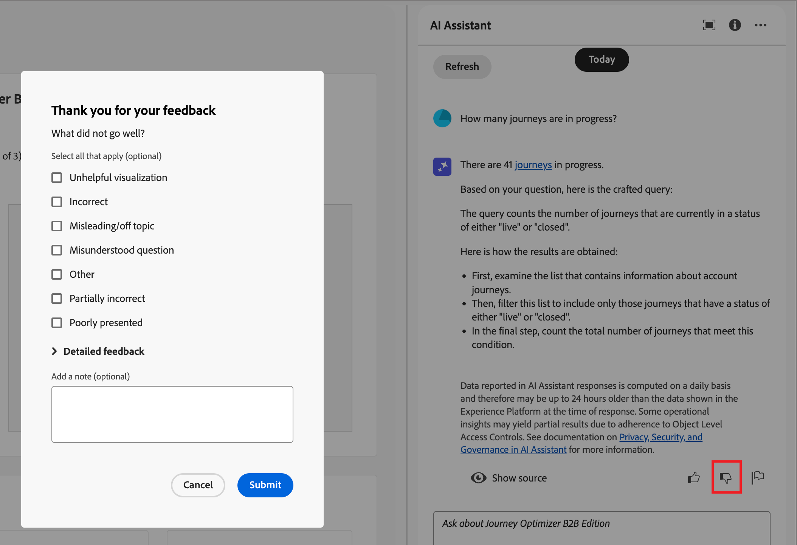

# Utilizzare l’Assistente AI in Journey Optimizer B2B edition

In Journey Optimizer B2B edition, AI Assistant è una funzione dell’interfaccia utente che consente di comprendere i concetti del prodotto, navigare rapidamente, scoprire le funzioni del prodotto e ottenere informazioni operative approfondite per il proprio ambiente. È disponibile anche in diversi prodotti di Adobe Experience Cloud.

>[!IMPORTANT]
>
>Prima di poter utilizzare l’Assistente all’intelligenza artificiale, è necessario un accordo per le linee guida utente di Adobe Experience Cloud Generative AI. Per ulteriori informazioni su questo contratto e sulle linee guida per l&#39;utilizzo, consulta le [linee guida per l&#39;utente di Adobe Experience Cloud Generative AI](https://www.adobe.com/legal/licenses-terms/adobe-dx-gen-ai-user-guidelines.html).

Per accedere a AI Assistant, fai clic sull’icona nell’intestazione. L’Assistente AI si apre in un pannello a destra.

{width="420"}

Viene visualizzata l’interfaccia di AI Assistant, che fornisce immediatamente le informazioni necessarie per iniziare. Puoi utilizzare le opzioni fornite in _Idee per iniziare_ a rispondere a domande e comandi, ad esempio:

* Quali percorsi sono stati pubblicati?
* Quali interessi sono stati creati per la soluzione?
* Descrivimi i vantaggi principali di Journey Optimizer B2B edition.

In Adobe Journey Optimizer B2B edition, l’Assistente IA supporta i seguenti casi d’uso:

## Poni le domande relative alla conoscenza del prodotto

Le domande relative alla conoscenza del prodotto riguardano i concetti e le informazioni sulle procedure di Journey Optimizer B2B edition. Alcuni esempi di domande sulla conoscenza del prodotto includono:

* Come si impostano gli account del provider SMS?
* Come posso inviare un’e-mail in un percorso?
* Come posso personalizzare il contenuto delle e-mail?

Per porre una domanda sul prodotto, immettilo nel campo nella parte inferiore del pannello e premi Invio. Ad esempio, quando devi imparare a utilizzare un gruppo di acquisto in un percorso. In questo caso, immetti _Come si utilizza un percorso di acquisto?_ Dopo l&#39;invio della domanda, l&#39;Assistente AI esegue una query sulla knowledge base e compila una risposta in pochi secondi.

{width="420"}

+++Visualizza un esempio di risposta

{width="420"}

+++

## Poni le tue domande sulle informazioni operative

Le domande sulle informazioni operative riguardano gli oggetti di percorso nella sandbox dell’organizzazione. Puoi porre domande sugli artefatti operativi, ad esempio il pubblico dell’account, il percorso di account, gli interessi della soluzione e il modello di gruppo di acquisto. Alcuni esempi di domande o prompt di approfondimenti operativi includono:

* Quanti percorsi live ho in Adobe Journey Optimizer B2B edition?
* Dammi un elenco di tutti i percorsi pianificati
* Quanti percorsi sono stati creati negli ultimi 7 giorni?

Per consentire all’Assistente AI di fornire una risposta sufficiente a una domanda sulle informazioni operative, devi trovarti in una sandbox attiva.

>[!NOTE]
>
>Gli unici oggetti di Adobe Journey Optimizer B2B edition supportati dalle domande di informazioni operative dell&#39;Assistente all&#39;intelligenza artificiale sono elencati nella [tabella di dominio di approfondimenti operativi](./ai-assistant-overview.md#operational-insights). Può accedere ai dati solo per la sandbox in cui ti trovi attualmente.

Per porre una domanda di approfondimenti operativi, inseriscila nel campo nella parte inferiore del pannello e premi Invio. Ad esempio, quando desideri conoscere i tipi di pubblico per la sandbox. In questo caso, immetti _Quanti tipi di pubblico ci sono?_.  L’Assistente AI fornisce un conteggio dei tipi di pubblico nella sandbox e una spiegazione di come ha calcolato la risposta. Nell’esempio di risposta seguente, l’Assistente AI fornisce un collegamento per accedere ai tipi di pubblico nell’interfaccia utente e illustra i passaggi necessari per identificare il numero di tipi di pubblico.

{width="420"}

Puoi seguire la tua richiesta iniziale chiedendo un elenco di artefatti, ad esempio _Elenca i primi 5 in base alle dimensioni_. L&#39;Assistente IA restituisce una tabella con i primi cinque elementi della query e gli ID corrispondenti. Fai clic sull&#39;icona _Scarica_ (  ) per scaricare la tabella come file CSV.

{width="420"}

Per visualizzare l&#39;intera tabella in Assistente IA, fare clic sull&#39;icona _Ingrandisci_ (  ). Nella visualizzazione della tabella espansa, fare clic su **[!UICONTROL Scarica CSV]** per salvare le informazioni come file CSV.

{width="600" zoomable="yes"}

## Verificare le risposte

L’Assistente per l’intelligenza artificiale include strumenti che è possibile utilizzare per verificare e convalidare le risposte.

### Sorgenti conoscenza prodotto

Dopo aver ricevuto una risposta per una domanda di prodotto, selezionare **[!UICONTROL Mostra origine]** per visualizzare le citazioni dell&#39;origine della conoscenza del prodotto utilizzate per generare la risposta dell&#39;Assistente IA.

L’Assistente AI fornisce collegamenti alla documentazione che conferma la risposta iniziale. Aggiunge inoltre note a piè di pagina alla risposta per indicare le parti specifiche della risposta che fanno riferimento alle origini della documentazione collegate.

{width="420"}

### Origini di dati operativi

Dopo aver ricevuto una risposta per una domanda di approfondimenti operativi, fare clic su **[!UICONTROL Mostra origine]** e quindi selezionare **[!UICONTROL Visualizza query di origine]**.

È possibile verificare ogni risposta relativa alle domande di approfondimenti operativi utilizzando una query SQL fornita dall’Assistente AI. Quando viene eseguita una query con una domanda di approfondimenti operativi, l’Assistente AI fornisce una query SQL che può essere utilizzata per verificare il processo necessario per calcolare la risposta. Questa query di origine è solo a scopo di verifica e non è supportata in Query Service.

{width="550" zoomable="yes"}

## Fornire feedback

Utilizza le icone _Thumb up_ (  ) o _Thumb down_ (  ) per valutare l&#39;utilità e la qualità della risposta. Completa il breve modulo del sondaggio in base alla tua esperienza e fai clic su **[!UICONTROL Invia]**. Le informazioni fornite vengono utilizzate per apportare miglioramenti all&#39;Assistente IA.

Se nella risposta si nota un elemento problematico, fare clic sull&#39;icona _Contrassegno_ (  ). Utilizza il modulo per descrivere il problema e fai clic su **[!UICONTROL Invia]** per segnalarlo.

{width="420"}

+++Visualizza moduli

>[!BEGINTABS]

>[!TAB Anteprima]

{width="600" zoomable="yes"}

>[!TAB Anteprima]

{width="600" zoomable="yes"}

>[!TAB Contrassegno]

{width="600" zoomable="yes"}

>[!ENDTABS]

+++
