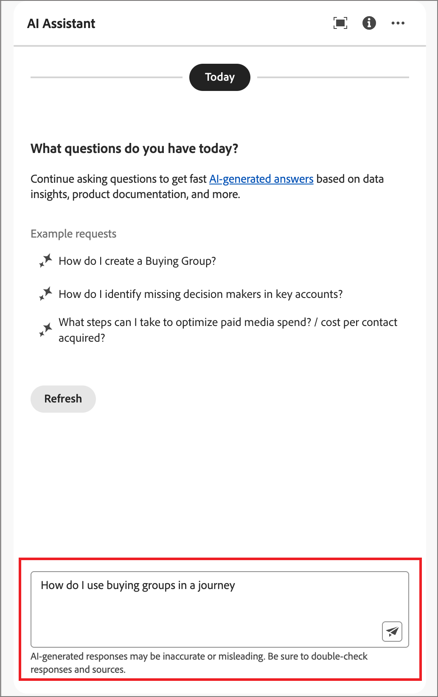

# Utilizzare l’Assistente AI in Journey Optimizer B2B edition

In Journey Optimizer B2B edition, AI Assistant è una funzione dell’interfaccia utente che consente di comprendere i concetti del prodotto, navigare rapidamente e scoprire le funzioni di Journey Optimizer B2B edition e ottenere informazioni operative per il proprio ambiente specifico. È disponibile anche in diversi prodotti di Adobe Experience Cloud.

>[!IMPORTANT]
>
>Prima di poter utilizzare l’Assistente all’intelligenza artificiale, è necessario un accordo per le linee guida utente di Adobe Experience Cloud Generative AI. Per ulteriori informazioni su questo contratto e sulle linee guida per l&#39;utilizzo, consulta le [linee guida per l&#39;utente di Adobe Experience Cloud Generative AI](https://www.adobe.com/legal/licenses-terms/adobe-dx-gen-ai-user-guidelines.html).

Per accedere a AI Assistant, fai clic sull’icona nell’intestazione. L’Assistente AI si apre in un pannello a destra.

{width="420" zoomable="yes"}

Viene visualizzata l’interfaccia di AI Assistant, che fornisce immediatamente le informazioni necessarie per iniziare. Puoi utilizzare le opzioni fornite in _Idee per iniziare_ a rispondere a domande e comandi, ad esempio:

* Quali dei miei percorsi di account sono stati pubblicati?
* Quali interessi sono stati creati per la soluzione?
* Descrivimi i vantaggi principali di Journey Optimizer B2B edition.

In Adobe Journey Optimizer B2B edition, l’Assistente IA supporta i seguenti casi d’uso:

## Conoscenza del prodotto

Domande sulla conoscenza del prodotto riguardano i concetti di Journey Optimizer B2B edition relativi ad aspetti di Adobe Journey Optimizer. Alcuni esempi di domande sulla conoscenza del prodotto includono:

* Come si impostano gli account del provider SMS?
* Come posso inviare un’e-mail in un percorso di account?
* Come posso personalizzare il contenuto delle e-mail?

Per porre una domanda sul prodotto, immettilo nel campo nella parte inferiore del pannello e premi Invio.

{width="420" zoomable="yes"}

Puoi verificare le risposte restituite dall’Assistente AI esaminando le citazioni disponibili con ogni risposta relativa alla conoscenza del prodotto.

Per visualizzare le citazioni e convalidare la risposta dell&#39;Assistente AI, selezionare **[!UICONTROL Mostra origini]**.

{width="420" zoomable="yes"}

L’Assistente IA aggiorna l’interfaccia e fornisce i collegamenti alla documentazione che corroborano la risposta iniziale. Inoltre, quando le citazioni sono abilitate, l’Assistente IA aggiorna la risposta per includere le note a piè di pagina per indicare le parti specifiche della risposta che fanno riferimento alla documentazione fornita.

Utilizza il pollice verso l’alto o il pollice verso il basso per valutare la qualità della risposta.

## Informazioni operative

Le domande operative su insight riguardano gli oggetti del percorso nella sandbox della tua organizzazione. Alcuni esempi di domande o prompt operativi su insight includono:

* Quanti percorsi live ho in Adobe Journey Optimizer B2B edition?
* Dammi un elenco di tutti i percorsi pianificati
* Quanti percorsi sono stati creati negli ultimi 7 giorni?

Per consentire all’Assistente AI di fornire una risposta sufficiente a una domanda sulle informazioni operative, devi trovarti in una sandbox attiva.

>[!NOTE]
>
>Gli unici oggetti di Adobe Journey Optimizer B2B edition supportati dalle domande di informazioni operative dell&#39;Assistente all&#39;intelligenza artificiale sono elencati nella [tabella di dominio di approfondimenti operativi](./ai-assistant-overview.md#operational-insights). Può accedere ai dati solo per la sandbox in cui ti trovi attualmente.

<!-- Select to view an example of an operational insights question.

In the following example, AI Assistant receives the following query: _Show me dataflows that were created using the Amazon S3 source._

screen

AI Assistant responds with a table list of your dataflows and their corresponding IDs. Click the _Download_ icon ( Download icon ) to download the table as a CSV file. To view the entire table, click the _Expand_ icon ( Expand icon ).

screen

An expanded view of the table appears, providing you with a more comprehensive list of dataflows based on the parameters of your query.

screen

When prompted with an operational insights question, AI Assistant provides an explanation of how it computed the answer. In the following example, AI Assistant outlines the steps it took in order to identify the dataflows that were created using the Amazon S3 source.

screen

You can also provide filters and modifications to your questions, and you can instruct AI Assistant to render its findings based on the filters that you include. For example, you can ask AI Assistant to show you a trend of the count of segment definitions in the order of their created date, remove segment definitions with zero total profiles, and use month names instead of integers when displaying the data.

### Verify operational insights responses

You can verify each response related to operational insights questions using an SQL query that AI Assistant provides.

Select to view example of verifying operational insights responses

After receiving an answer for an operational insights question, click **[!UICONTROL Show sources]** and then select **[!UICONTROL View source query]**.

screen

When queried with an operational insights question, AI Assistant provides an SQL query that you can use to verify the process that it took to compute its answer. This source query is for verification purposes only and is not supported on Query Service.

screen  

 -->
