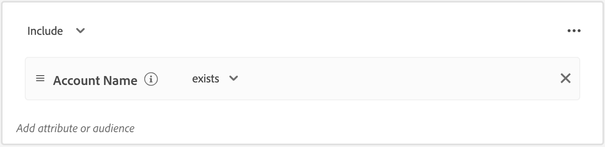

# Tipi di pubblico dell’account

Un pubblico è un insieme di persone che condividono comportamenti e/o caratteristiche simili. Journey Optimizer B2B Edition utilizza le funzionalità di segmentazione dell’account disponibili nelle edizioni B2B e B2P di Adobe Real-Time Customer Data Platform. Con la segmentazione dell’account, gli utenti possono generare tipi di pubblico per l’account sfruttando i dati provenienti da qualsiasi entità B2B all’interno del sistema. Questi tipi di pubblico servono da input per i percorsi account di Journey Optimizer B2B Edition, facilitando la funzionalità di attivazione e personalizzazione, senza interruzioni.

Ulteriori informazioni sui tipi di pubblico dell’account e su come definirli nella [documentazione del servizio di segmentazione di Adobe Experience Platform](https://experienceleague.adobe.com/it/docs/experience-platform/segmentation/types/account-audiences){target="_blank"}.

## Flusso di lavoro del pubblico dell’account

Puoi considerare Journey Optimizer B2B Edition come una destinazione Experience Platform (AEP) che non viene visualizzata nel catalogo delle destinazioni. Attiva i tipi di pubblico dell’account in Journey Optimizer B2B Edition tramite i seguenti passaggi:

1. Crea schemi per i dati in AEP.
1. Insersci i dati in AEP.
1. Crea un segmento di account per valutare i dati.
1. Attiva i dati valutati in Journey Optimizer B2B Edition.

In Journey Optimizer B2B Edition, i tipi di pubblico dell’account vengono utilizzati come input per i percorsi basati su account, consentendo di eseguire il targeting delle persone all’interno di tali account. Ad esempio, puoi utilizzare i tipi di pubblico dell’account per recuperare i record di tutti gli account che non dispongono di informazioni di contatto per le persone con il titolo di Chief Operating Officer (COO, Responsabile operativo principale) o Chief Marketing Officer (CMO, Responsabile marketing principale).

Journey Optimizer B2B Edition consente di creare tipi di pubblico per gli account Adobe Experience Platform (AEP) direttamente dal menu di navigazione a sinistra e di incorporarli nei percorsi di account.

{width="800" zoomable="yes"}

## Creare un pubblico dell’account

Definisci il pubblico dell’account creando una segmentazione dell’account. Puoi creare la segmentazione dell’account direttamente nell’applicazione Journey Optimizer B2B Edition oppure utilizzando l’[interfaccia utente Generatore di segmenti](https://experienceleague.adobe.com/it/docs/experience-platform/segmentation/ui/segment-builder){target="_blank"}. Di seguito sono riportati i passaggi che puoi utilizzare per creare una segmentazione dell’account in Journey Optimizer B2B Edition.

1. Nel menu di navigazione a sinistra, scegli **[!UICONTROL Account]** > **[!UICONTROL Tipi di pubblico]**.

1. Fai clic su **[!UICONTROL Crea pubblico]** in alto a destra.

1. Crea la definizione del segmento.

   Gli attributi dell’account e i tipi di pubblico vengono visualizzati sulla barra di navigazione a sinistra. Nella scheda _[!UICONTROL Attributi]_ puoi aggiungere gli attributi personalizzati e quelli creati da Platform. Trascina ciascun attributo per creare la logica per il segmento.

   >[!TIP]
   >
   >Quando crei un pubblico dell’account, tieni presente che gli eventi vengono elencati in _[!UICONTROL Persone]_, in quanto tali attributi sono associati a persone. 
   >
   >Nella scheda _[!UICONTROL Tipi di pubblico]_ è possibile aggiungere tipi di pubblico basati su persone creati in precedenza da cui puoi iniziare a creare il pubblico del tuo account.

   L’esempio seguente definisce il pubblico creato con `Country Code`, `Revenue Amount` e `Market segment`. La query in italiano sarebbe: “Forniscimi tutti gli account degli Stati Uniti presenti nel segmento Finanza e i cui ricavi superano 1 milione di euro.”

   {width="700" zoomable="yes"}
    

   >[!IMPORTANT]
   >
   >L’attributo `Account Name` per i record di account deve contenere un valore da includere nei percorsi di account. Se l’attributo è vuoto (null), il record dell’account viene escluso. 
   >Per assicurarti che vengano inclusi solo gli account con un nome account non vuoto, aggiungi l’attributo **[!UICONTROL Nome account]** e seleziona _[!UICONTROL esiste]_ come condizione di corrispondenza. 
   >{width="600"}
   > Se stai utilizzando un attributo personalizzato per il nome account, utilizza tale attributo al posto di _[!UICONTROL Nome account]_.

1. Fai clic su **[!UICONTROL Salva e chiudi]** in alto a destra.

Per attivare il pubblico dell’account per Journey Optimizer B2B Edition, [aggiungilo a un percorso di account](../journeys/journey-overview.md#add-the-account-audience-for-your-journey) e [pubblica il percorso](../journeys/journey-overview.md).
