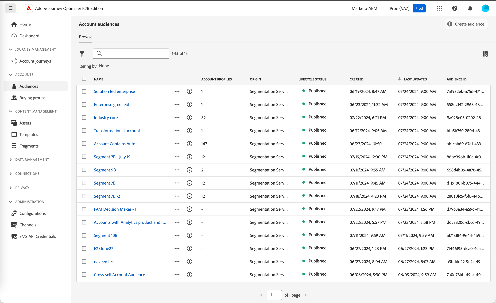

# Pubblico dell’account

Un pubblico è un insieme di persone che condividono comportamenti e/o caratteristiche simili. Journey Optimizer B2B Edition utilizza le funzionalità di segmentazione dell’account disponibili nelle edizioni B2B e B2P di Adobe Real-time Customer Data Platform. Con la segmentazione dell’account, gli utenti possono generare tipi di pubblico per l’account sfruttando i dati provenienti da qualsiasi entità B2B all’interno del sistema. Questi tipi di pubblico fungono da input per i percorsi di account Journey Optimizer B2B Edition e facilitano l’attivazione e la personalizzazione senza interruzioni.

Ulteriori informazioni sui tipi di pubblico dell&#39;account e su come definirli nella [documentazione del servizio di segmentazione di Adobe Experience Platform](https://experienceleague.adobe.com/en/docs/experience-platform/segmentation/ui/account-audiences).

## Flusso di lavoro per il pubblico dell&#39;account

Puoi considerare Journey Optimizer B2B Edition come una destinazione di Experience Platform (AEP) che non viene visualizzata nel catalogo delle destinazioni. Attiva i tipi di pubblico dell’account in Journey Optimizer B2B Edition seguendo la procedura riportata di seguito:

1. Crea schemi per i dati in AEP.
1. Acquisisci i dati in AEP.
1. Crea un segmento di account per valutare i dati.
1. Attiva i dati valutati in Journey Optimizer B2B Edition.

In Journey Optimizer B2B Edition, i tipi di pubblico dell’account vengono utilizzati come input per percorsi basati sull’account, consentendo di eseguire il targeting delle persone all’interno di tali account. Ad esempio, puoi utilizzare i tipi di pubblico dell’account per recuperare i record di tutti gli account che non dispongono di informazioni di contatto per le persone con il titolo di Chief Operating Officer (COO) (Responsabile operativo principale) o Chief Marketing Officer (CMO) (Responsabile marketing principale).

Journey Optimizer B2B Edition consente di creare tipi di pubblico per gli account Adobe Experience Platform (AEP) direttamente dalla navigazione a sinistra e di incorporarli nei percorsi di account.

{width="800" zoomable="yes"}

## Creare un pubblico di tipo account

Definisci il pubblico dell’account creando una segmentazione dell’account. È possibile creare la segmentazione dell&#39;account direttamente nell&#39;applicazione Journey Optimizer B2B Edition oppure utilizzare l&#39;[interfaccia utente Generatore di segmenti](https://experienceleague.adobe.com/en/docs/experience-platform/segmentation/ui/segment-builder). Di seguito sono riportati i passaggi da utilizzare per creare una segmentazione dell’account in Journey Optimizer B2B Edition.

1. Nel menu di navigazione a sinistra, scegli **[!UICONTROL Account]** > **[!UICONTROL Tipi di pubblico]**.

1. Fai clic su **[!UICONTROL Crea pubblico]** in alto a destra.

1. Crea la definizione del segmento.

   Gli attributi dell’account e i tipi di pubblico vengono visualizzati sulla barra di navigazione a sinistra. Nella scheda _[!UICONTROL Attributi]_ puoi aggiungere attributi personalizzati e creati da Platform. Trascina ciascun attributo per creare la logica per il segmento.

   >[!TIP]
   >
   >Quando crei un pubblico di account, tieni presente che gli eventi sono elencati in _[!UICONTROL Persone]_, perché questi attributi sono associati alle persone. 
   >
   >Nella scheda _[!UICONTROL Tipi di pubblico]_ puoi aggiungere tipi di pubblico basati sulle persone creati in precedenza da utilizzare per la creazione del pubblico del tuo account.

   L&#39;esempio seguente definisce il pubblico creato con `Country Code`, `Revenue Amount` e `Market segment`. La query in inglese sarebbe: &quot;Voglio tutti i conti negli Stati Uniti che sono nel segmento finanziario i cui ricavi superano 1 milione di dollari&quot;.

   {width="700" zoomable="yes"}

1. Fai clic su **[!UICONTROL Salva e chiudi]** in alto a destra.

Per attivare il pubblico del tuo account per Journey Optimizer B2B Edition, devi [aggiungerlo a un percorso di account](../journeys/journey-overview.md#add-the-account-audience-for-your-journey) e [pubblicare il percorso](../journeys/journey-overview.md).
