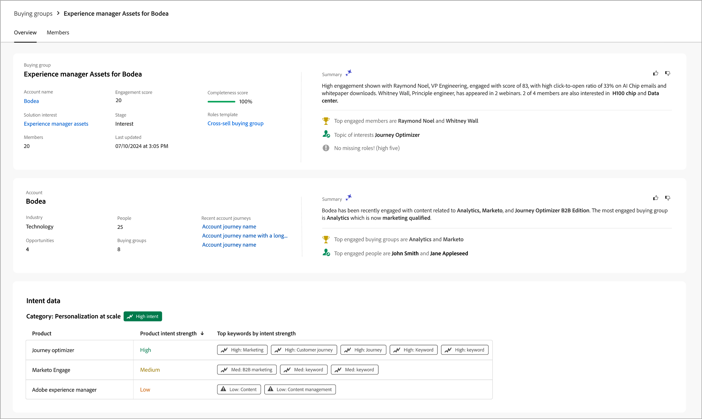

# Dettagli del gruppo acquisti

Quando si fa clic sul nome di un gruppo di acquisto in un punto qualsiasi di Journey Optimizer B2B edition, vengono visualizzati i relativi dettagli. Questa panoramica fornisce informazioni utili sul gruppo di acquisto, inclusi i riepiloghi generativi di IA. Sono inoltre disponibili [azioni](#buying-group-actions) che è possibile eseguire per i contatti associati all&#39;account.

{width="800" zoomable="yes"}

Utilizza la scheda **[!UICONTROL Panoramica]** per esaminare le informazioni sull&#39;account e la scheda **[!UICONTROL Membri]** per accedere a un elenco dei membri del gruppo di acquisto.

## Scheda Panoramica

La scheda Panoramica è composta da tre sezioni principali:

### Riepilogo gruppo acquisti

{zoomable="yes"}

La sezione di riepilogo del gruppo di acquisto include le seguenti informazioni sul gruppo di acquisto:

* Nome del gruppo acquisti
* Nome account (fare clic sul nome per aprire [dettagli account](../accounts/account-details.md))
* Numero di membri nel gruppo di acquisto
* Punteggio di coinvolgimento
* Punteggio di completezza
* Fase gruppo acquisti corrente
* Modello di ruolo (fare clic sul nome per aprire il modello di [ruoli](buying-groups-role-templates.md#access-and-browse-role-templates))
* Data ultima modifica/aggiornamento
* Riepilogo IA generativa del gruppo di acquisto

### Panoramica dell’account

{zoomable="yes"}

La sezione Panoramica account include le seguenti informazioni sull&#39;account:

* Nome account (fare clic sul nome per aprire i dettagli dell&#39;account)
* Numero di persone nell’account
* Settore
* Opportunità aperte
* Ultimi tre percorsi di account in cui l&#39;account è attualmente in uso (fare clic sul nome per aprire i dettagli del percorso)
* Riepilogo IA generativa dell’account

### Dati di intento

In Journey Optimizer B2B edition, il modello di rilevamento intento (Intent Detection) prevede una soluzione o un prodotto di interesse con sufficiente affidabilità in base all’acquisto delle attività dei membri del gruppo. L’intento di acquistare i membri del gruppo può essere interpretato come la probabilità di avere un interesse in un prodotto.

{{intent-data-note}}

{width="700" zoomable="yes"}

* Livelli di intento
* Tipi di segnale di intento: parole chiave, prodotto e soluzione

### Membri del gruppo acquisti

{width="800" zoomable="yes"}

Nella sezione _[!UICONTROL Membri del gruppo di acquisto]_ vengono visualizzate due righe che evidenziano i membri del gruppo di acquisto:

* **[!UICONTROL Responsabile delle decisioni]** - I tre principali responsabili delle decisioni in base al punteggio di coinvolgimento della persona
* **[!UICONTROL Membri principali coinvolti]** - Altri membri principali coinvolti in base al punteggio di coinvolgimento della persona

Ogni scheda membro include i dettagli seguenti:

* Nome
* Titolo
* Ruolo
* Punteggio di coinvolgimento del lead

Fare clic su **[!UICONTROL Visualizza dettagli]** per accedere alle seguenti informazioni sul membro:

* Riepilogo IA generativa
* Ultimo momento interessante
* Attività più recenti (due)
* Altri gruppi di acquisto di cui è membro il lead (limitati a tre gruppi di acquisto in base all’ultimo gruppo aggiunto).
* Indirizzo e-mail
* Numero di telefono

{width="600" zoomable="yes"}

## Scheda Membri

Selezionare la scheda **[!UICONTROL Membri]** per visualizzare un elenco di tutti i membri del gruppo di acquisto. Ogni elenco di membri include il nome, il ruolo, la qualifica, l&#39;indirizzo e-mail, il numero di telefono e l&#39;origine.

{width="700" zoomable="yes"}

È possibile eseguire più azioni dalla scheda _Membri_:

### Assegna un nuovo membro

A un account possono essere associati uno o più gruppi di acquisto e i membri del gruppo di acquisto sono in genere un sottoinsieme di contatti dell&#39;account. Puoi aggiungere manualmente qualsiasi contatto dall’account associato al gruppo di acquisto.

1. Fai clic su **[!UICONTROL Assegna nuovo membro]** in alto a destra.

1. Nella finestra di dialogo _[!UICONTROL Assegna membro]_, seleziona i lead dell&#39;account da aggiungere al gruppo di acquisto e fai clic su **[!UICONTROL Avanti]**.

   {width="700" zoomable="yes"}

1. Nella finestra di dialogo _[!UICONTROL Modifica nuovo ruolo membro]_ selezionare il ruolo da assegnare a ciascuno dei nuovi membri.

   {width="700" zoomable="yes"}

1. Fai clic su **[!UICONTROL Salva]**.

### Rimuovi un membro

È possibile rimuovere uno o più membri selezionati (fino a 50 alla volta) dal gruppo di acquisto.

1. Selezionare le caselle di controllo relative ai membri che si desidera rimuovere.

1. Nella barra di selezione nella parte inferiore fare clic su **[!UICONTROL Rimuovi membri]**.

   {width="700" zoomable="yes"}

1. Nella finestra di dialogo di conferma, fai clic su **[!UICONTROL Rimuovi]**.

### Modifica ruolo

Puoi cambiare il ruolo per uno o più membri selezionati (fino a 50 alla volta) del gruppo di acquisto.

1. Selezionare le caselle di controllo relative ai membri che si desidera modificare i ruoli.

1. Nella barra di selezione in basso, fare clic su **[!UICONTROL Modifica ruoli]**.

   {width="700" zoomable="yes"}

1. Nella finestra di dialogo _[!UICONTROL Modifica ruolo membro]_ selezionare il ruolo da assegnare a ogni membro.

   {width="700" zoomable="yes"}

1. Fai clic su **[!UICONTROL Salva]**.

### Invia e-mail

Puoi inviare un’e-mail approvata dall’addetto al marketing a uno o più membri selezionati (fino a 50 alla volta) di un gruppo di acquisto. L’elenco delle e-mail disponibili è limitato alle e-mail approvate dall’istanza di Marketo Engage connessa.

1. Selezionare le caselle di controllo relative ai membri che si desidera ricevere l&#39;e-mail.

1. In alto a destra o nella barra di selezione in basso, fai clic su **[!UICONTROL Invia e-mail]**.

   {width="700" zoomable="yes"}

1. Nella finestra di dialogo _[!UICONTROL Invia e-mail]_, seleziona l&#39;area di lavoro di Marketo Engage, quindi seleziona la casella di controllo per l&#39;e-mail che desideri inviare.

   {width="700" zoomable="yes"}

1. Fai clic su **[!UICONTROL Invia]**.
