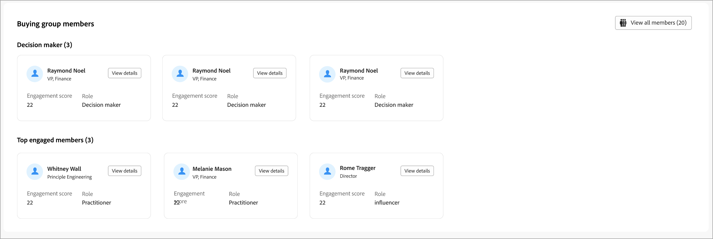

# Dettagli gruppo di acquisto

Quando si fa clic sul nome di un gruppo di acquisto in un punto qualsiasi di Journey Optimizer B2B edition, vengono visualizzati i relativi dettagli. Questa panoramica fornisce informazioni utili sul gruppo di acquisto, inclusi i riepiloghi generativi di IA.

{width="800" zoomable="yes"}

{{intent-data-note}}

La pagina dei dettagli del gruppo di acquisto è composta da tre sezioni principali:

## Panoramica del gruppo acquisti

{zoomable="yes"}

La sezione panoramica sul gruppo di acquisto include le seguenti informazioni sul gruppo di acquisto:

* Nome del gruppo acquisti
* Nome account (fare clic sul nome per aprire i dettagli dell&#39;account)
* Numero di persone nel gruppo di acquisto
* Punteggio di coinvolgimento
* Punteggio di completezza
* Fase gruppo acquisti corrente
* Modello ruolo (fare clic sul nome per aprire i dettagli del modello ruoli)
* Data ultima modifica/aggiornamento
* Riepilogo IA generativa del gruppo di acquisto

## Panoramica dell’account

{zoomable="yes"}

La sezione Panoramica account include le seguenti informazioni sull&#39;account:

* Nome account (fare clic sul nome per aprire i dettagli dell&#39;account)
* Numero di persone nell’account
* Settore
* Opportunità aperte
* Ultimi tre percorsi di account in cui l&#39;account è attualmente in uso (fare clic sul nome per aprire i dettagli del percorso)
* Riepilogo IA generativa dell’account

## Acquisto di membri del gruppo

{width="800" zoomable="yes"}

Nella sezione _[!UICONTROL Membri del gruppo di acquisto]_ vengono visualizzate due righe che evidenziano i membri del gruppo di acquisto:

* **[!UICONTROL Responsabile delle decisioni]** - I tre principali responsabili delle decisioni in base al punteggio di coinvolgimento della persona
* **[!UICONTROL Membri principali coinvolti]** - Altri membri principali coinvolti in base al punteggio di coinvolgimento della persona

Ogni scheda membro include i dettagli seguenti:

* Nome
* Titolo
* Ruolo
* Punteggio di coinvolgimento del lead

Fare clic su **[!UICONTROL Visualizza dettagli]** per accedere alle seguenti informazioni sul membro:

* Riepilogo IA generativa
* Ultimo momento interessante
* Attività più recenti (due)
* Altri gruppi di acquisto di cui è membro il lead (limitati a tre gruppi di acquisto in base all’ultimo gruppo aggiunto).
* Indirizzo e-mail
* Numero di telefono

{width="600" zoomable="yes"}
