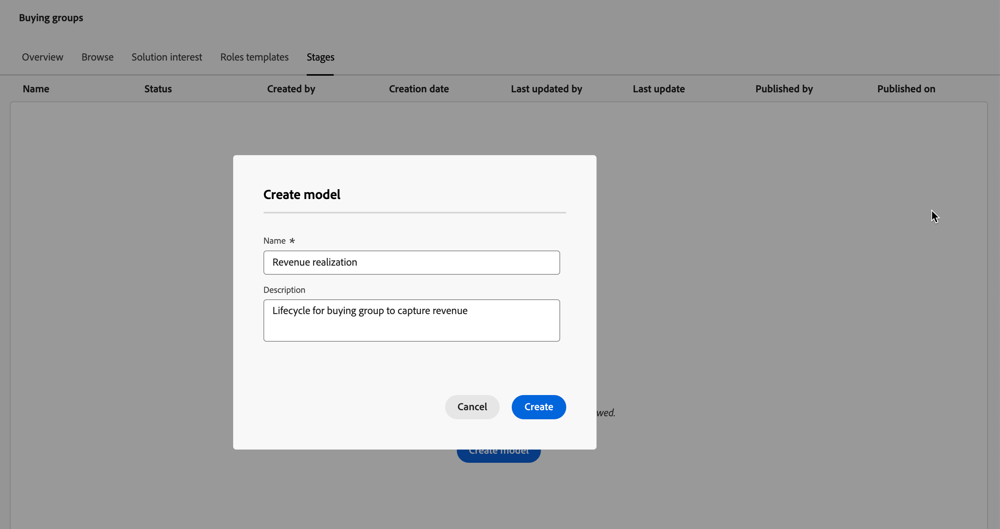

# Fasi del gruppo acquisti

Le fasi di acquisto dei gruppi sono progettate per tenere traccia della progressione dei gruppi di acquisto nella conversione delle opportunità in clienti. Utilizza questa funzione per tenere traccia della progressione del gruppo di acquisto e identificare le migliori azioni successive per i membri del gruppo di acquisto.

Definisci le fasi all’interno di un singolo modello di staging, definendo più fasi e il flusso di transizione tra di esse. Una o più fasi sono designate per l&#39;immissione nel ciclo di vita. Il modello consente anche una progressione non lineare, in cui è possibile specificare transizioni da uno stadio all&#39;altro, ad esempio dallo stadio A agli stadi B, C o D. È necessario che una fase sia designata come fase di successo, ad esempio un contratto di acquisto o firmato. È facoltativo che un&#39;altra fase sia designata come fase di fallimento, ad esempio un contratto rifiutato o l&#39;acquisto di una soluzione concorrente da un altro fornitore. Monitora queste fasi tramite [dashboard intelligenti](../dashboards/intelligent-dashboard.md) che mostrano l&#39;avanzamento dei gruppi di acquisto in termini di completamento di un&#39;opportunità di vendita o di conversione di un&#39;opportunità in un cliente.

{width="800" zoomable="yes"}

{width="30"} [Guarda la panoramica video](#overview-video)

## Definire il modello di fasi del gruppo di acquisto

Per creare e configurare un modello di fasi del gruppo di acquisto, effettuare le operazioni riportate di seguito.

* Aggiunta delle fasi del ciclo di vita
* Definizione dei flussi di transizione
* Definizione delle fasi di entrata e destinazione

È supportato un solo modello, quindi è importante lavorare con i team di marketing e vendita per pianificare il modello ottimale per la tua organizzazione prima di crearlo e pubblicarlo in Journey Optimizer B2B edition.<!-- Initially, only one stage model can be created, but future releases will support multiple stage models, allowing users to select which model to use in a journey. -->

Quando si crea il modello di fase del gruppo di acquisto, questo viene automaticamente impostato sullo stato _Bozza_ e non può essere eliminato o rinominato. Rimane in questo stato mentre definisci le fasi e configuri il flusso di transizione tra le fasi. Quando il modello si trova nello stato pubblicato (_Live_), non può essere modificato.

### Creare il modello

1. Nel menu di navigazione a sinistra, vai a **[!UICONTROL Account]** > **[!UICONTROL Gruppi di acquisto]**.

1. Nella pagina Gruppi di acquisto selezionare la scheda **[!UICONTROL Fasi]**.

   {width="800" zoomable="yes"}

   La scheda _[!UICONTROL Fasi]_ è in uno stato _vuoto_ fino alla creazione del modello.

1. Fai clic su **[!UICONTROL Crea modello]** al centro della pagina.

1. Nella finestra di dialogo, immetti **[!UICONTROL Nome]** (obbligatorio) e **[!UICONTROL Descrizione]** (facoltativo) per il modello.

   {width="700" zoomable="yes"}

   Se fai clic su _[!UICONTROL Annulla]_ in questa finestra di dialogo, ritorni alla scheda _[!UICONTROL Fasi]_ in uno stato _vuoto_.

1. Fai clic su **[!UICONTROL Crea]**.

### Definire le fasi

Dopo aver creato il modello, questo viene aperto nel workspace e viene richiesto di creare gli stadi per il modello.

1. Fare clic su **[!UICONTROL Modifica fasi]**.

   {width="700" zoomable="yes"}

1. Definire la prima fase immettendo **[!UICONTROL Nome]** (obbligatorio) e **[!UICONTROL Descrizione]** (facoltativo).

   {width="700" zoomable="yes"}

   Gli stadi non devono essere aggiunti in un ordine specifico, ma determinano il modo in cui vengono elencati nella pagina dei dettagli del modello. Quando si definiscono le regole di transizione, è possibile specificare lo stadio di ingresso e il flusso tra gli stadi.

1. Fare clic su **[!UICONTROL Aggiungi fase]** e ripetere il passaggio 2 per definire un&#39;altra fase.

   Ripetete questo passo finché non avete le fasi necessarie per il modello.

   {width="700" zoomable="yes"}

1. Quando si è soddisfatti delle fasi definite, fare clic su **[!UICONTROL Salva]**.

   >[!IMPORTANT]
   >
   >**Le fasi del gruppo di acquisto salvate non possono essere rimosse.** Tuttavia, è possibile modificare il nome e la descrizione di uno qualsiasi degli stadi finché il modello rimane nello stato _Bozza_.

### Configurare il flusso di lavoro e le regole di transizione

Dopo aver salvato gli stadi, questo ritorna all&#39;area di lavoro del modello. La colonna _[!UICONTROL Transito consentito in]_ è vuota, a indicare che le regole di transizione per gli stadi del modello non sono ancora definite.

{width="700" zoomable="yes"}

Le regole di transizione determinano il modo in cui un gruppo di acquisto può spostarsi da una fase all&#39;altra. Ad esempio, può passare da una fase iniziale a una fase intermedia e da una fase intermedia a varie altre fasi. Una fase di ingresso è una fase iniziale che un gruppo di acquisto può inserire da uno stato vuoto e le fasi di destinazione sono classificate come fasi di successo o fallimento.

1. Fai clic su **[!UICONTROL Modifica regole di transizione]** in alto a destra.

   Questa azione apre la finestra di dialogo _[!UICONTROL Modifica regole fase]_, in cui puoi definire la logica per il flusso.

   Quando imposti le opzioni, sono disponibili alcune protezioni e messaggi incorporati per evitare errori di logica nel flusso. Puoi fare clic su _[!UICONTROL Annulla]_ per chiudere la finestra di dialogo e tornare alla scheda _[!UICONTROL Stadi]_ senza apportare modifiche.

1. Nella sezione _[!UICONTROL Seleziona fase]_, indicare le fasi iniziale e finale per il flusso:

   * **[!UICONTROL Fase punto di ingresso]** (obbligatorio) - Consente di designare una o più fasi di ingresso per l&#39;opportunità del gruppo di acquisto.

   * **[!UICONTROL Fase di successo]** (obbligatorio): indicare la fase che indica che l&#39;opportunità del gruppo di acquisto è stata completata (destinazione).

   * **[!UICONTROL Fase errore]** (facoltativo): indicare una o più fasi che indicano che l&#39;opportunità del gruppo di acquisto ha raggiunto un punto di errore (destinazione).

   {width="700" zoomable="yes"}

1. Per ogni fase non di destinazione, definisci una o più fasi successive nel flusso (transizione).

   Tutte le fasi non di destinazione devono avere almeno una fase **[!UICONTROL Transito consentito a]** selezionata. In caso contrario, la logica del modello non è valida e gli account possono ottenere _bloccato_ in quella fase senza alcun modo per procedere con successo o errore.

   {width="700" zoomable="yes"}

   Facoltativamente, potete specificare una transizione da una fase di errore. Ad esempio, è possibile designare una fase denominata _Nessuna risposta_ come fase di errore. Ma anche designare una fase denominata _Risorgenza_ come possibile transizione per identificare i casi in cui un account inattivo viene riattivato.

1. Fai clic su **[!UICONTROL Salva]**.

   Con il ritorno alla pagina dei dettagli del modello, gli stadi vengono elencati in una tabella con le transizioni consentite e le proprietà di destinazione e di immissione.

| Colonna | Descrizione |
| ------ | ---------- |
| **[!UICONTROL Nome fase]** | Nome della fase. Fare clic sull&#39;icona delle informazioni per visualizzare la descrizione dello stage. |
| **[!UICONTROL Transito consentito a]** | Elenca gli stadi validi per un&#39;azione _sposta in_ nel modello. |
| **[!UICONTROL Fase punto di ingresso]** | Indica se la fase è valida come fase del punto di ingresso ([!UICONTROL Sì] o [!UICONTROL No]). |
| **[!UICONTROL Destinazione]** | Indica se la fase è designata come fase di destinazione ([!UICONTROL Operazione riuscita] o [!UICONTROL Errore]). |

{width="700" zoomable="yes"}

## Modificare un modello 2D

Finché il modello di fasi del gruppo di acquisto rimane nello stato _Bozza_, puoi modificare le fasi e le regole di transizione.

_Per visualizzare il modello bozza :_

1. Nel menu di navigazione a sinistra, vai a **[!UICONTROL Account]** > **[!UICONTROL Gruppi di acquisto]**.

1. Nella pagina _Gruppi di acquisto_ selezionare la scheda **[!UICONTROL Fasi]**.

1. Fate clic sul nome del modello per aprirne i dettagli.

### Modificare gli stadi nel modello

1. Fare clic su **[!UICONTROL Modifica fasi]**.

   Nella finestra di dialogo _[!UICONTROL Modifica fasi]_ è possibile aggiungere nuove fasi o modificare il nome e la descrizione delle fasi esistenti.

   * Modifica **[!UICONTROL Nome]** o **[!UICONTROL Descrizione]** di qualsiasi fase in base alle esigenze.

   * Scorri verso il basso e fai clic su **[!UICONTROL Aggiungi fase]** per definire una nuova fase per il modello, se necessario.

1. Quando si è soddisfatti delle fasi definite, fare clic su **[!UICONTROL Salva]**.

   Puoi anche fare clic su _[!UICONTROL Annulla]_ per chiudere la finestra di dialogo e tornare alla pagina dei dettagli del modello senza apportare modifiche.

### Modificare le regole di transizione per il modello

1. Fai clic su **[!UICONTROL Modifica regole di transizione]**.

1. Nella finestra di dialogo _Modifica regole fase_, modifica le opzioni di flusso in base alle esigenze.

   Consulta [Configurare il flusso di lavoro e le regole di transizione](#configure-the-workflow-and-transition-rules) per ulteriori informazioni su queste opzioni e su come influiscono sul flusso del modello.

1. Una volta definite le regole di transizione, fare clic su **[!UICONTROL Salva]**.

   Puoi anche fare clic su _[!UICONTROL Annulla]_ per chiudere la finestra di dialogo e tornare alla pagina dei dettagli del modello senza apportare modifiche.

## Pubblicare il modello di fasi del gruppo di acquisto

In assenza di errori di convalida, il modello può essere pubblicato. Quando viene pubblicata, lo stato cambia in _Live_ e può essere utilizzato per avanzare nelle fasi dei gruppi di acquisto nei percorsi di account.

>[!IMPORTANT]
>
>**Dopo la pubblicazione, il modello non può essere aggiornato o eliminato.** Prima di pubblicare il modello, assicurati che le tue risorse siano corrette.

1. Rivedi attentamente le fasi e le transizioni definite.

   Se sono necessarie revisioni, modificate le fasi del modello.

1. Fai clic su **[!UICONTROL Pubblica]**.

1. Nella finestra di dialogo di conferma, fai clic su **[!UICONTROL Pubblica]**.

   Tornando alla pagina dei dettagli del modello, il modello viene designato come _[!UICONTROL Live]_. Fai clic sulla freccia _Indietro_ in alto a sinistra per tornare alla scheda _[!UICONTROL Stadi]_.

{width="700" zoomable="yes"}
<!-- list these later when the Published columns are working correctly

Columns - Name, Status, Created by, Created date, Last updated by, Last update, Published by, Published on.
Name - Name of the stage model, hyperlinked. Clicking on it will navigate to the stage inventory page. 
Info icon beside the name - display the description on click.
Status - Live, Draft. If a draft stage model is Published, then its status is updated to Live. -->

## Elimina il modello di fasi del gruppo di acquisto

È possibile eliminare il modello delle fasi del gruppo acquisti quando si trova nello stato Bozza o Pubblicato. Se è pubblicato (in tempo reale), puoi eliminarlo solo se non è associato a un interesse per la soluzione.

1. Nel menu di navigazione a sinistra, vai a **[!UICONTROL Account]** > **[!UICONTROL Gruppi di acquisto]**.

1. Nella pagina _Gruppi di acquisto_ selezionare la scheda **[!UICONTROL Fasi]**.

1. Fai clic sull&#39;icona del menu _Altro_ (**...**) accanto al nome del modello di stadi e scegli **[!UICONTROL Elimina]**.

   {width="700"}

1. Nella finestra di dialogo, fai clic su **[!UICONTROL Elimina]** per confermare.

## Utilizzare il modello nei percorsi di account

Quando il modello delle fasi di acquisto è in uno stato _Live_ (pubblicato), aggiungi il modello agli interessi della soluzione in cui desideri utilizzarlo per monitorare la progressione del gruppo di acquisto. Nei percorsi di account è possibile includere azioni per la transizione dei conti a uno stadio specifico e aggiungere transizioni di stadio come eventi che determinano il modo in cui i conti si spostano nel percorso.

### Associazione interessi soluzione

Per ogni interesse di soluzione esistente in cui si desidera associare il modello fasi gruppo di acquisto, aprire i dettagli relativi all&#39;interesse della soluzione e aggiungere il modello. Puoi anche aggiungere il modello alle proprietà quando [crei un interesse per la soluzione](./solution-interests.md#create-a-solution-interest).

1. Selezionare la scheda _[!UICONTROL Interesse soluzione]_.

1. Aprire l&#39;interesse della soluzione utilizzando uno dei metodi seguenti per aprire le proprietà per l&#39;interesse della soluzione che si desidera modificare:

   * Fai clic sul nome dell’interesse della soluzione.
   * Fai clic sui puntini di sospensione (**...**) accanto a esso e scegli **[!UICONTROL Modifica]**.

   {width="500" zoomable="no"}

1. Selezionare il **[!UICONTROL modello fase gruppo acquisti]** per utilizzare la progressione fase gruppo acquisti (facoltativo).

   {width="700" zoomable="yes"}

1. Se necessario, modificare l&#39;impostazione **[!UICONTROL Aggiorna gruppi di acquisto esistenti]**.

   Quando questa opzione è abilitata, tutti i gruppi di acquisto esistenti associati all’interesse della soluzione vengono aggiornati tramite il ciclo di sincronizzazione di 24 ore.

1. Fai clic su **[!UICONTROL Salva]**.

### Suddividi percorsi

Utilizzando un [nodo percorso suddiviso](../journeys/journey-nodes.md#split-paths), puoi filtrare a livello di account o di persone in base alle fasi del gruppo di acquisto. Ad esempio, aggiungi una fase del gruppo di acquisto come condizione del percorso quando dividi i percorsi per membro del gruppo di acquisto.

>[!BEGINTABS]

>[!TAB Livello account]

1. Apri il percorso di account nell’editor.

1. Fare clic sull&#39;icona più ( **+** ) in un percorso e scegliere **[!UICONTROL Dividi percorsi]**.

   {width="300"}

1. Nelle proprietà del nodo a destra, scegli **[!UICONTROL Account]** per la suddivisione.

1. Per definire una condizione applicabile a _[!UICONTROL Percorso 1]_, fare clic su **[!UICONTROL Applica condizione]**.

   {width="500"}

1. Nell’editor delle condizioni, aggiungi il filtro del gruppo di acquisto per definire il percorso di divisione.

   * A sinistra, espandi **[!UICONTROL Filtri speciali]** in basso e trascina l&#39;attributo **[!UICONTROL Gruppo acquisti]** nell&#39;area di lavoro filtri.

   * Impostare l&#39;interesse **[!UICONTROL Soluzione]** su un interesse associato al modello delle fasi del gruppo di acquisto.

   * Fai clic su **[!UICONTROL Aggiungi vincolo]** e scegli **[!UICONTROL Fase gruppo acquisti]**.

     {width="700" zoomable="yes"}

   * Fai clic su **[!UICONTROL Fine]**.

   Il percorso di [PROD143]e è definito nelle proprietà del nodo a destra.

   {width="600" zoomable="yes"}

1. Continuate a definire altri percorsi per il nodo diviso e salvate il percorso.

>[!TAB Livello persone]

1. Apri il percorso di account nell’editor.

1. Fare clic sull&#39;icona più ( **+** ) in un percorso e scegliere **[!UICONTROL Dividi percorsi]**.

   {width="300"}

1. Nelle proprietà del nodo a destra, scegli **[!UICONTROL Persone]** per la suddivisione.

   Lascia l&#39;attributo predefinito per _[!UICONTROL utilizzato per le condizioni]_ come **[!UICONTROL Solo attributi persone]**.

1. Per definire una condizione applicabile a _[!UICONTROL Percorso 1]_, fare clic su **[!UICONTROL Applica condizione]**.

   {width="500"}

1. Nell’editor delle condizioni, aggiungi il filtro del gruppo di acquisto per definire il percorso di divisione.

   * A sinistra, espandi **[!UICONTROL Filtri speciali]** in basso e trascina l&#39;attributo **[!UICONTROL Membro del gruppo acquisti]** nell&#39;area di lavoro filtri.

   * Impostare l&#39;interesse **[!UICONTROL Soluzione]** su un interesse associato al modello delle fasi del gruppo di acquisto.

   * Fai clic su **[!UICONTROL Aggiungi vincolo]** e scegli **[!UICONTROL Fase gruppo acquisti]**.

     {width="700" zoomable="yes"}

   * Fai clic su **[!UICONTROL Fine]**.

   Il percorso di [PROD143]e è definito nelle proprietà del nodo a destra.

   {width="600" zoomable="yes"}

1. Continuate a definire altri percorsi per il nodo diviso e salvate il percorso.

>[!ENDTABS]

### Aggiorna azione account fase gruppo di acquisto

Utilizzando un [nodo azione account](../journeys/journey-nodes.md#add-an-account-action), puoi aggiornare la fase del gruppo di acquisto. La definizione di questo nodo comporta la selezione dell’interesse della soluzione e la definizione della nuova fase per il gruppo di acquisto.

>[!NOTE]
>
>Se la nuova fase non è una transizione valida (come definita nel modello), l’azione non viene applicata al conto.

1. Apri il percorso di account nell’editor.

1. Fai clic sull&#39;icona più ( **+** ) in un percorso e scegli **[!UICONTROL Esegui un&#39;azione]**.

   {width="400"}

1. Nelle proprietà del nodo a destra, scegliere **[!UICONTROL Account]** per l&#39;azione.

1. Definisci l’azione per aggiornare la fase del gruppo di acquisto.

   * Per **[!UICONTROL Azione sugli account]**, selezionare **[!UICONTROL Aggiorna fase gruppo acquisti]**.

   * Per **[!UICONTROL Seleziona interesse soluzione]**, selezionane uno associato al modello di fasi del gruppo di acquisto.

   * Per **[!UICONTROL Nuova fase]**, selezionare la fase per la transizione dell&#39;account.

   L’azione è definita nelle proprietà del nodo a destra.

   {width="600" zoomable="yes"}

1. Continuare ad apportare altre modifiche e salvare il percorso.

### Evento account

Utilizza l’occorrenza di una modifica della fase del gruppo di acquisto per spostare l’account al passaggio successivo nel percorso. La definizione di questo nodo comporta la selezione dell’interesse della soluzione e dei vincoli aggiuntivi per soddisfare l’attivazione dell’evento.

1. Apri il percorso di account nell’editor.

1. Fai clic sull&#39;icona più ( **+** ) in un percorso e scegli **[!UICONTROL Ascolta un evento]**.

   {width="400"}

1. Nelle proprietà del nodo a destra, scegliere **[!UICONTROL Account]** per il tipo di evento.

1. Per **[!UICONTROL Seleziona evento account]**, scegli **[!UICONTROL Modifica in fase gruppo acquisti]**.

1. Fai clic su **[!UICONTROL Modifica evento]** e definisci i dettagli dell&#39;evento.

   * Per **[!UICONTROL Interesse soluzione]**, verifica la condizione per un interesse soluzione associato al modello di fasi del gruppo di acquisto.

   * Fare clic su **[!UICONTROL Aggiungi vincolo]** e selezionare la modifica della fase del gruppo di acquisto che si desidera utilizzare per attivare l&#39;evento.

     {width="700" zoomable="yes"}

   * Fai clic su **[!UICONTROL Fine]**.

   L’evento è definito nelle proprietà del nodo a destra.

   {width="700" zoomable="yes"}

1. Continuare ad apportare altre modifiche e salvare il percorso.

## Video di panoramica

>[!VIDEO](https://video.tv.adobe.com/v/3448702/?learn=on&captions=ita)
