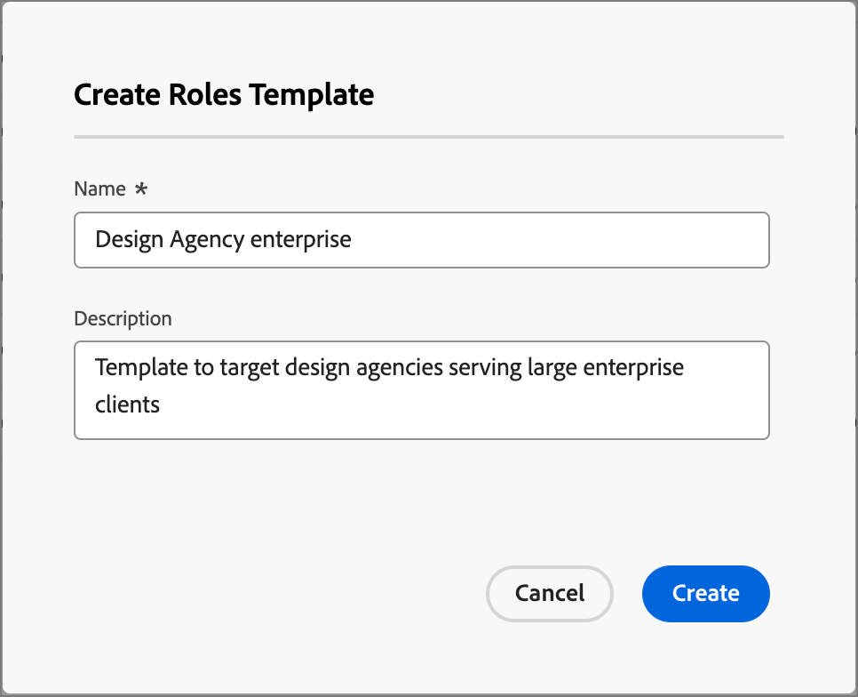

# Acquisto di modelli di ruolo del gruppo

In un mercato B2B, le decisioni di acquisto sono solitamente prese da più individui. Tali persone partecipano al processo decisionale in base al loro ruolo all’interno dell’organizzazione. Crea modelli di ruolo Gruppo acquisti che contengono queste definizioni di ruolo in base a ciascun tipo di offerta di prodotto o caso di utilizzo dell’account.

## Accedere e sfogliare i modelli di ruolo

1. Nella home page di Adobe Experience Platform, fare clic su Adobe Journey Optimizer B2B Edition.

1. Nel menu di navigazione a sinistra, fai clic su **[!UICONTROL Gruppi di acquisto]**.

1. Nella pagina _[!UICONTROL Gruppi di acquisto]_, seleziona la scheda **[!UICONTROL Modelli ruoli]**.

   {width="700" zoomable="yes"}

   La scheda fornisce un elenco di inventario di tutti i modelli di ruolo esistenti con le colonne seguenti:

   * [!UICONTROL Nome]
   * [!UICONTROL Stato]
   * [!UICONTROL Data di creazione]
   * [!UICONTROL Creato da]
   * [!UICONTROL Ultimo aggiornamento]
   * [!UICONTROL Ultimo aggiornamento eseguito da]
   * [!UICONTROL Pubblicato il]
   * [!UICONTROL Pubblicato da]

   Per impostazione predefinita, l&#39;elenco è ordinato in base alla colonna _[!UICONTROL Ultimo aggiornamento]_.

   Il numero di modelli di ruoli _live_ (pubblicati) viene visualizzato in alto a destra nella pagina. Tutti i modelli di ruoli hanno lo stato `Draft` o `Live`.

1. Per filtrare l’elenco per nome, utilizza il campo di ricerca nella parte superiore dell’elenco.

   Immettere i primi caratteri del nome per ridurre l&#39;elenco visualizzato agli elementi corrispondenti.

   {width="700" zoomable="yes"}

## Creare un modello di ruoli

1. Dalla scheda _[!UICONTROL Modelli ruoli]_, fai clic su **[!UICONTROL Crea modello]** nell&#39;angolo in alto a destra.

1. Nella finestra di dialogo, immetti un **[!UICONTROL Nome]** (obbligatorio) e una **[!UICONTROL Descrizione]** (facoltativo) univoci per il modello.

   {width="400"}

1. Aggiungere una regola per ogni ruolo che si desidera definire per il modello.

   * Scegliere il **[!UICONTROL Ruolo gruppo acquisti]** dall&#39;elenco.

     Per la versione corrente sono disponibili sei ruoli: `Decision Maker`, `Influencer`, `Practitioner`, `Executive Steering Committee`, `Champion` e `Other`.

     {width="700" zoomable="yes"}

   * Imposta **[!UICONTROL Ponderazione]** per il ruolo, utilizzato per calcolare il punteggio di coinvolgimento.

     Il valore di ciascuna opzione viene convertito in percentuale per il calcolo del punteggio: [!UICONTROL Trivial] = 20, [!UICONTROL Minor] = 40, [!UICONTROL Normal] = 60, [!UICONTROL Importante] = 80, e [!UICONTROL Vital] = 100.

     Ad esempio, un modello di ruolo con ruoli che utilizzano Vital, Importante e Normale viene quindi convertito come 100/240, 80/240, 60/240.

   * **[!UICONTROL Aggiungi condizioni per l&#39;assegnazione automatica]** - Selezionare questa casella di controllo per aggiungere condizioni per l&#39;assegnazione automatica dei membri al gruppo di acquisto che soddisfano la condizione. Se la casella di controllo non è selezionata, l’aggiunta di condizioni NON è richiesta.

   * **[!UICONTROL Necessario per il punteggio di completezza]** - Selezionare questa casella di controllo per il ruolo se si desidera che sia un requisito per il calcolo di un punteggio di completezza.

   * Fare clic su **[!UICONTROL Aggiungi condizione]**.

      * Nella finestra di dialogo della condizione, espandi l&#39;elenco di **[!UICONTROL attributi persona]** e individua un attributo che desideri utilizzare per corrispondere al ruolo. Trascinalo a destra e rilascialo nello spazio del filtro.

        {width="700" zoomable="yes"}

      * Utilizza l’attributo per creare un filtro corrispondente utilizzando uno o più valori.

        Nell’esempio seguente, l’attributo Job title viene utilizzato per identificare una corrispondenza per Decision Maker. Qualsiasi valore per il titolo che inizia con `Director` o `Sr Director` restituisce true per la condizione.

        {width="700" zoomable="yes"}

      * Se necessario, aggiungi un altro attributo e una condizione che perfeziona ulteriormente i criteri per una corrispondenza al ruolo.

      * Fai clic su **[!UICONTROL Fine]**.

   Per ogni ruolo aggiuntivo che si desidera includere nel modello, fare clic su **[!UICONTROL Aggiungi un altro ruolo]** e definire una o più condizioni corrispondenti per il ruolo.

   {width="700" zoomable="yes"}

1. Se il modello è pronto per l&#39;uso, fare clic su **[!UICONTROL Publish]** in alto a destra.

   La pubblicazione del modello lo imposta sullo stato _Live_ e lo rende disponibile per l&#39;associazione a un interesse per la soluzione. Per pubblicare il modello dei ruoli deve essere presente almeno un ruolo definito.

   Le modifiche vengono salvate automaticamente nello stato _Bozza_. Se non si è pronti per pubblicare il modello di ruoli, fare clic sulla freccia sinistra (indietro) nella parte superiore della pagina e tornare all&#39;elenco Modelli di ruoli.

## Modificare un modello di ruoli bozza

Quando un modello di ruoli si trova nello stato _Bozza_, è possibile continuare a modificare i ruoli definiti. Tutte le modifiche apportate vengono salvate automaticamente.

Modifica le impostazioni nell&#39;intestazione della scheda ruolo, inclusi il ruolo del gruppo di acquisto, la ponderazione, l&#39;assegnazione automatica e il requisito del punteggio di completezza.

{width="600"}

### Modificare i filtri per un ruolo

Per modificare la logica di filtro per uno dei ruoli, fare clic sull&#39;icona _Modifica_ (matita) in alto a destra della scheda del ruolo. Questa azione apre l&#39;area di lavoro _[!UICONTROL Condizioni]_ in cui è possibile modificare un filtro esistente, aggiungerne un altro, rimuovere un filtro o modificare la logica del filtro.

### Eliminare una scheda ruolo

Per rimuovere un ruolo dal modello, fare clic sull&#39;icona _Elimina_ (cestino) nella scheda ruolo.

### Impostare la priorità per i ruoli

È possibile riordinare i ruoli all’interno del modello, che determina la priorità per l’assegnazione dei lead a un ruolo. Sulla destra di ogni scheda ruolo è visualizzato un controller **[!UICONTROL Priority]**. Fai clic sulla freccia _Su_ o _Giù_ a destra per spostare la scheda Ruolo verso l&#39;alto o verso il basso nella priorità.

{width="700"}

## Eliminare un modello di ruoli

Puoi eliminare un modello di ruoli se si trova nello stato _Bozza_.

1. Selezionare il modello di ruoli dall&#39;elenco per aprirlo.

1. Fai clic su **[!UICONTROL Elimina]** in alto a destra.

   {width="700"}

1. Nella finestra di dialogo, fai clic su **[!UICONTROL Elimina]** per confermare.
