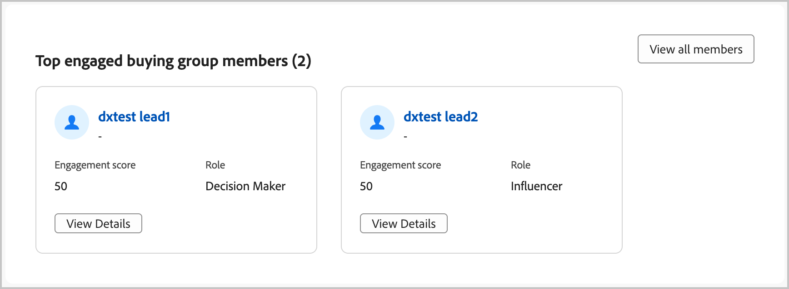

# Punteggi di coinvolgimento {#engagement-scores}

>[!CONTEXTUALHELP]
>id="ajo-b2b_buying_group_engagement_score"
>title="Punteggio di coinvolgimento"
>abstract="I punteggi di coinvolgimento determinano il livello di coinvolgimento dei membri del gruppo acquisti."

Un punteggio di coinvolgimento è un numero che indica il livello di coinvolgimento dei membri di un gruppo di acquisto. Questi punteggi si basano sulle attività dei membri del gruppo di acquisto, sulle azioni ponderate e sui ruoli ponderati. I punteggi risultanti vengono normalizzati all’interno di un tenant (istanza) per consentire un confronto coerente e ottenere informazioni fruibili. Il calcolo del punteggio viene avviato non appena si crea il gruppo di acquisto. Il data hub system di Journey Optimizer B2B edition calcola i punteggi ogni giorno e li carica sul sistema MySQL MLM (Multi-Level Marketing) utilizzando il servizio di acquisizione.

Esistono due tipi di punteggi di coinvolgimento:

* **Punteggio di coinvolgimento del gruppo di acquisto** - Il punteggio di coinvolgimento del gruppo di acquisto è un punteggio normalizzato compreso tra 0 e 100 ed è basato sul punteggio di coinvolgimento calcolato a livello di persona.

  Il punteggio di coinvolgimento del gruppo di acquisto viene visualizzato nella pagina [Dettagli gruppo di acquisto](./buying-group-details.md). Puoi anche visualizzare i gruppi di acquisto più coinvolti nella dashboard intelligente.

  {width="700" zoomable="yes"}

* **Punteggio di coinvolgimento della persona** - Il punteggio di coinvolgimento della persona si basa sulle attività di un singolo membro del gruppo di acquisto.

  Il punteggio di coinvolgimento della persona per ogni membro del gruppo di acquisto viene visualizzato nella pagina dei dettagli del gruppo di acquisto [_[!UICONTROL Membri ]_scheda](./buying-group-details.md#buying-group-members). Questi punteggi vengono visualizzati anche nelle pagine e nei dashboard che includono i membri più coinvolti e le informazioni sui contatti sovrapposte.

  {width="550" zoomable="yes"}

>[!BEGINSHADEBOX]

Il punteggio di coinvolgimento della persona è un attributo disponibile per il filtraggio in [modelli di ruoli](./buying-groups-role-templates.md#add-the-template-roles) e [nodi splt-path-by-people di percorso](../journeys/split-merge-paths-nodes.md#people-path-conditions).

{width="550" zoomable="yes"}

>[!ENDSHADEBOX]

Per calcolare i punteggi viene utilizzata qualsiasi attività ponderata del coinvolgimento eseguita dai membri del gruppo di acquisto negli ultimi 30 giorni. Nella finestra di 30 giorni, le occorrenze dell’attività scadono e i punteggi possono essere spostati verso il basso (decadimento dei punteggi). I punteggi visualizzati vengono arrotondati (ad esempio, un punteggio di 75,89999 viene visualizzato come 76).

## Attività utilizzate per il punteggio di coinvolgimento

Il punteggio del gruppo di acquisto non è _basato su trigger_. Si tratta di un processo giornaliero che valuta l’attività tra tutti i membri del gruppo di acquisto e ricalcola il punteggio. Le attività utilizzano _pesi_ per informare il punteggio del gruppo di acquisto in base al modello di ponderazione attivo, che determina la ponderazione di ogni attività.

Per ogni attività è presente un limite di frequenza giornaliero di 20. Se un membro di un gruppo di acquisto esegue la stessa attività più di 20 volte in un singolo giorno, il conteggio per l’attività è limitato a 20.

| Nome attività | Descrizione | Tipo di coinvolgimento | Frequenza massima giornaliera | Peso attività modello predefinito |
|---------------|-------------|-----------------|---------------------------|-------------------------------|
| Partecipa a un evento | Un membro ha partecipato a un evento | Evento | 20 | 60 |
| E-mail selezionata | Un membro fa clic su un collegamento in un’e-mail | E-mail | 20 | 30 |
| E-mail aperta | Un membro apre un’e-mail | E-mail | 20 | 30 |
| Modulo compilato | Un membro compila e invia un modulo in una pagina web | Web | 20 | 40 |
| Momento interessante | Un membro ha un momento interessante | Curato | 20 | 60 |
| Clic sui collegamenti | Un membro fa clic su un collegamento in una pagina web | Web | 20 | 40 |
| Page Views | Un membro visualizza una pagina web | Web | 20 | 40 |
| Registrati a un evento | Un membro registrato per un evento | Evento | 20 | 60 |

<!-- old list

| Activity name | Description | Engagement type | Max daily frequency count | Activity weight |
| --- | --- | --- | --- | --- |
| [!UICONTROL Visit Webpage]| A member visits a web page | Web | 20 | 40 |
| [!UICONTROL Fill Out Form]| A member fills and submits a form on a web page | Web | 20 | 40 |
| [!UICONTROL Click Link] | A member clicks a link on a web page | Web | 20 | 40 |
| [!UICONTROL Open Email] | A member opens an email | Email | 20 | 30 |
| [!UICONTROL Click Email] | A member clicks a link in an email | Email | 20 | 30 |
| [!UICONTROL Open Sales Email] | A member opens a sales email | Email | 20 | 30 |
| [!UICONTROL Click Sales Email] | A member clicks a link in a sales email | Email | 20 | 30 |
| [!UICONTROL Interesting Moment] | A member has an interesting moment | Curated | 20 | 60 |
| [!UICONTROL Tap Push Notification] | A member receives a push notification | Mobile | 20 | 30 |
| [!UICONTROL Mobile App Activity] | A member performs an activity on a mobile app | Mobile | 20 | 30 |
| [!UICONTROL Mobile App Session] | A member is active on a mobile app session | Mobile | 20 | 30 |
| [!UICONTROL Fill Out Facebook Lead Ads Form] | A member fills and submits a Lead Ads form on a Facebook page | Social | 20 | 30 |
| [!UICONTROL Click RTP Call to Action] | A member clicks a personalized call to action | Web | 20 | 60 |
| [!UICONTROL View In-App Message] | A member views an in-app message | Mobile | 20 | 30 |
| [!UICONTROL Tap In-App Message] | A member taps an in-app message | Mobile | 20 | 30 |
| [!UICONTROL Subscribe SMS] | A member subscribes to SMS communications | SMS | 20 | 90 |
| [!UICONTROL Reply to Sales Email] | A member replies to a sales email | Email | 20 | 30 |
| [!UICONTROL Engaged with a Dialogue] | A member engages with a Dynamic Chat dialogue | Chat | 20 | 90 |
| [!UICONTROL Interacted with Document in Dialogue] | A member interacts with a document in a Dynamic Chat dialogue | Chat | 20 | 90 |
| [!UICONTROL Scheduled Meeting in Dialogue] | A member schedules an appointment in a Dynamic Chat dialogue | Chat | 20 | 90 |
| [!UICONTROL Reached Dialogue Goal] | A member reaches a goal in a Dynamic Chat dialogue |  |20 | 90 |
| [!UICONTROL Responded to a poll in webinar] | A member responds to a poll in a webinar event | Chat | 20 | 90 |
| [!UICONTROL Call to action clicked in webinar] | A member clicks a call-to-action link in a webinar event | Call | 20 | 30 |
| [!UICONTROL Asset downloads in webinar] | A member downloads a file/asset in a webinar event | Event | 20 | 60 |
| [!UICONTROL Asks questions in webinar] | A member asks questions in a webinar event | Event | 20 | 60 |
| [!UICONTROL Has attended event] | A member attended an event | Event | 20 | 60 |
| [!UICONTROL Engaged with an Agent in Dialogue] | A member engages with an agent in a Dynamic Chat dialogue | Chat | 20 | 90 |
| [!UICONTROL Clicked Link in Chat in Dialogue] | A member clicks a link in a Dynamic Chat dialogue | Chat | 20 | 90 |
| [!UICONTROL Engaged with a Conversational Flow] | A member engages with a Dynamic Chat conversational flow | Chat | 20 | 90 |
| [!UICONTROL Scheduled Meeting in Conversational Flow] | A member schedules an appointment in a Dynamic Chat conversational flow | Chat | 20 | 90 |
| [!UICONTROL Reached Conversational Flow Goal] | A member reaches a goal in a Dynamic Chat conversational flow | Chat | 20 | 90 |
| [!UICONTROL Interacted with Document in Conversational Flow] | A member interacts with a document in a Dynamic Chat conversational flow | Chat | 20 | 90 |
| [!UICONTROL Engaged with an Agent in Conversational Flow] | A member engages with an Agent in a Dynamic Chat conversational flow | Chat | 20 | 90 |
| [!UICONTROL Clicked Link in Chat in Conversational Flow] | A member clicks a link in a Dynamic Chat conversational flow | Chat | 20 | 90 |
| [!UICONTROL Click Link in SMS V2] | A member clicks a link in an SMS message | SMS | 20 | 90 | -->

>[!NOTE]
>
>Le attività con punteggio di coinvolgimento vengono registrate nel registro attività di Marketo Engage per una persona. Puoi accedere a questo registro nell’istanza di Marketo Engage connessa. Per ulteriori informazioni, vedere [Individuare il registro attività per una persona](https://experienceleague.adobe.com/it/docs/marketo/using/product-docs/core-marketo-concepts/smart-lists-and-static-lists/managing-people-in-smart-lists/locate-the-activity-log-for-a-person){target="_blank"} nella documentazione di Marketo Engage.

## Ponderazione basata su modello ruolo {#engagement-score-weighting}

>[!CONTEXTUALHELP]
>id="ajo-b2b_buying_group_engagement_score_weighting"
>title="Ponderazione basata su ruolo per punteggio di coinvolgimento"
>abstract="Utilizza la ponderazione basata sul ruolo per personalizzare il calcolo del punteggio di coinvolgimento."

Gli utenti possono assegnare _ponderazione_ a ogni ruolo nel modello [ruoli](./buying-groups-role-templates.md) per allocare ponderazioni diverse per un ruolo.

{width="700" zoomable="yes"}

Ogni livello di ponderazione si traduce in un valore, utilizzato per calcolare il punteggio di coinvolgimento:

* [!UICONTROL Insignificante] = 20
* [!UICONTROL Minore] = 40
* [!UICONTROL Normale] = 60
* [!UICONTROL Importante] = 80
* [!UICONTROL Fondamentale] = 100

Un modello di ruoli con tre ruoli ponderati come _[!UICONTROL Fondamentale]_, _[!UICONTROL Importante]_ e _[!UICONTROL Normale]_ viene convertito nelle seguenti percentuali ponderate:

| Ruolo | Ponderazione | Valore di sistema | Calcolo del valore | Percentuale |
|-------------- |--------- |------------- |------------------ |---------- |
|               |          |              |                   |           |
| Responsabile delle decisioni | Fondamentale | 100 | 100/240 | 41,76% |
| Influencer | Importante | 80 | 80/240 | 33,33% |
| Professionista | Normale | 60 | 60/240 | 25% |
|               | Totale | 240 |                   |           |

## Esempio di calcolo del punteggio

L’esempio seguente illustra il calcolo del punteggio di coinvolgimento. Utilizza la percentuale di ponderazione del ruolo descritta, il conteggio delle attività in entrata per ciascun membro del gruppo di acquisto e un tetto giornaliero di 20 per ogni occorrenza dell’evento.

| Ruolo | Membro | Tipo di attività | Conteggio di ieri | Conteggio odierno | Calcolo | Punteggio totale |
|-------------- |--------- |-------------|-----------------|-------------|------|-----------|
|               |          |             |                 |             |      |           |
| Responsabile delle decisioni | Adam | Sito web visitato | 37 | 15 | 20 + 15 | 35 |
|               |          | E-mail cliccata | 1 | 1 | 1 + 1 | 2 |
|               |          |             |                 |             |      |           |
|               | Contrassegna | Sito web visitato | 5 | 3 | 5 + 3 | 8 |
|               |          | E-mail cliccata | 1 | 1 | 1 + 1 | 2 |
|               |          | Pub scaricato | 3 | 2 | 3 + 2 | 5 |
| **Punteggio totale responsabili delle decisioni** |         |             |                 |             |      | **52** |
|               |          |             |                 |             |      |           |
| Influencer | John | Sito web visitato | 19 | 9 | 19 + 9 | 28 |
| **Punteggio totale influencer** |         |             |                 |             |      | **28** |
|               |          |             |                 |             |      |           |
| Professionista | Bob | E-mail cliccata | 1 | 1 | 1 + 1 | 2 |
|               |          |             |                 |             |      |           |
|               | Paul | E-mail cliccata | 1 | 1 | 1 + 1 | 2 |
|               |          |             |                 |             |      |           |
|               | Calvin | E-mail cliccata | 1 | 1 | 1 + 1 | 2 |
|               |          | Sito web visitato | 1 | 7 | 1 + 7 | 8 |
|               |          | Pub scaricato | 1 | 2 | 1 + 2 | 3 |
| **Punteggio totale professionisti** |         |             |                 |             |      | **17** |

Il punteggio di coinvolgimento finale viene calcolato applicando la ponderazione per ciascuno dei punteggi dei ruoli:

| Ruolo | Punteggio totale ruolo | % peso ruolo | Punteggio X peso % |
|-------------- |---------------- |------------- |---------------- |
| Responsabili delle decisioni | 52 | 41,76% | 21,67 |
| Influencer | 28 | 33,33% | 9,33 |
| Professionisti | 17 | 25% | 4,25 |
| **Punteggio di coinvolgimento finale** |                |             | **35,25** |

## Logica di punteggio

Oltre alla logica di calcolo descritta nell’esempio di calcolo, esiste una normalizzazione significativamente complessa dei punteggi che si verifica nel sistema, per tutte le persone, i gruppi di acquisto e gli account nella tua istanza. Un punteggio di coinvolgimento di un gruppo di acquisto dipende dai punteggi di coinvolgimento della persona, in base alla seguente logica ordinata:

### Logica di calcolo del punteggio di coinvolgimento della persona

1. Identifica tutti i tipi di attività _engagement-weighted_ a cui sono associati peso e quota giornaliera, come visite al sito web, clic su e-mail e partecipazione a webinar.

1. Identifica tutte le azioni di _engagement-weighted_ eseguite nell&#39;intervallo di look-back dell&#39;attività, attualmente hardcoded su 30 giorni.

1. Normalizza i pesi del tipo di attività tra tutti i pesi del tipo di attività _engagement-weighted_ identificati nel passaggio 1, ignorando quelli che non si sono verificati nell&#39;intervallo di look-back.

   Questo passaggio sfrutta _Normalizzazione min-max_ e riduce in modo significativo la diluizione artificiale del peso del tipo di attività per un tenant che non sfrutta la maggior parte di essi.

1. Applica il filtro quota giornaliero per persona e tipo di attività.

   Questo passaggio attenua il fatto di avere valori erratici molto grandi evitando attività di valore/volume elevato che distorcono i punteggi.

1. Calcola il punteggio di coinvolgimento della persona non elaborato sommando l’attività giornaliera per tipo di attività, moltiplicandola per il peso associato e quindi sommando i risultati per tutti i giorni dell’intervallo di look-back.

1. Utilizza una trasformazione _Power Transformation_ (Square Root) per stabilizzare la varianza riducendo possibili valori anomali.

   Queste trasformazioni contribuiscono a ridurre lo sfasamento e a rendere più lineari i pattern nei dati.

1. Applica un&#39;ulteriore trasformazione _Normalizzazione ridimensionata_ per garantire che i punteggi sfruttino l&#39;intero intervallo da 0 a 100.

### Logica di calcolo del punteggio di coinvolgimento del gruppo di acquisto

1. Applicare un peso normalizzato a ogni membro del gruppo di acquisto in base al ruolo, in base al peso configurato nel modello dei ruoli.

1. Normalizza il peso del ruolo del gruppo di acquisto per ogni gruppo di acquisto.

   Questa normalizzazione evita un’inutile diluizione del peso dei ruoli se un gruppo di acquisto non utilizza tutti i ruoli.

1. Aggrega tutti i punteggi di coinvolgimento persona di un membro del gruppo di acquisto moltiplicando il punteggio di coinvolgimento persona per il peso del ruolo normalizzato della persona e aggiungendoli insieme.

1. Applica una trasformazione _Power Transformation_ (Square Root) per stabilizzare la varianza riducendo possibili valori anomali, in particolare per gruppi di acquisto molto grandi.

1. Applica un&#39;ulteriore trasformazione _Normalizzazione ridimensionata_ per garantire che i punteggi sfruttino l&#39;intero intervallo da 0 a 100.
