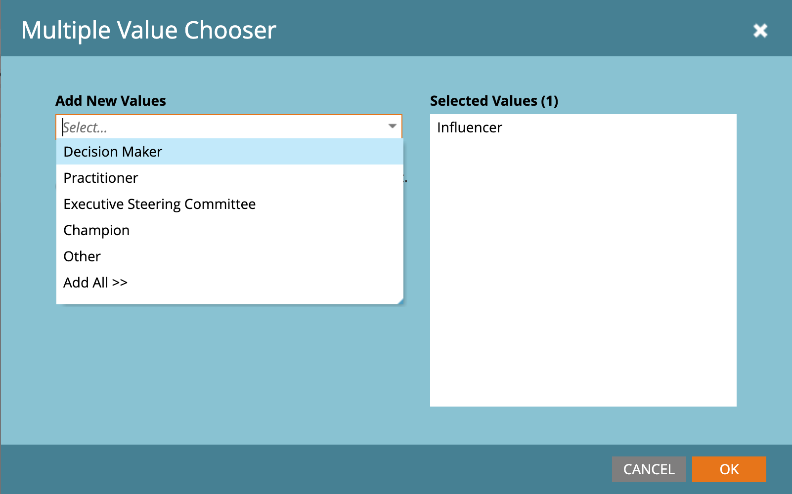

# Acquistare filtri di gruppo in Market Engage

In qualità di addetto al marketing, potresti voler eliminare le campagne di Marketo Engage per gli utenti che fanno parte di gruppi di acquisto in Journey Optimizer B2B edition. Puoi anche informare i flussi di lavoro per il punteggio dei lead all’interno di Marketo Engage, utilizzando le informazioni sui lead associati ai gruppi di acquisto. Ad esempio:

* Questo lead fa parte di un gruppo di acquisto?
* Il gruppo di acquisto è completo e coinvolto?

Se queste condizioni sono vere, puoi scegliere di ottenere un punteggio maggiore. In caso contrario, puoi scegliere di non contrassegnarlo come lead qualificato per il marketing (MQL).

Nell&#39;istanza del Marketo Engage connessa a Journey Optimizer B2B edition, è possibile utilizzare il filtro _[!UICONTROL Membro del gruppo di acquisto]_ negli elenchi smart per identificare questi lead in base alla strategia della campagna.

1. Dopo aver [creato un elenco avanzato nel Marketo Engage](https://experienceleague.adobe.com/en/docs/marketo/using/product-docs/core-marketo-concepts/smart-lists-and-static-lists/creating-a-smart-list/create-a-smart-list){target="_blank"}, selezionare la scheda **[!UICONTROL Elenco avanzato]** per aprire l&#39;editor filtri.

1. Nell&#39;elenco dei filtri a destra, scorri verso il basso ed espandi la cartella **[!UICONTROL Filtri speciali]**.

1. Fare clic sul filtro **[!UICONTROL Membro del gruppo di acquisto]** e trascinarlo nell&#39;area di definizione del filtro.

   {width="700" zoomable="yes"}

1. Impostare l&#39;opzione _[!UICONTROL Membro del gruppo di acquisto]_ su **[!UICONTROL true]** o **[!UICONTROL false]**.

   Questo vincolo è obbligatorio per la definizione.

1. (Facoltativo) Aggiungi altri vincoli relativi al gruppo di acquisto al filtro in base alla modalità di identificazione dei lead per l’elenco avanzato.

   * Fai clic su **[!UICONTROL Aggiungi vincolo]** in alto a destra nella scheda del filtro.

     {width="700" zoomable="yes"}

   * Selezionare il vincolo da aggiungere, ad esempio _Punteggio di completezza_ o _Interesse soluzione_.

   * Impostare la valutazione da utilizzare per una corrispondenza. Per un punteggio, puoi utilizzare una corrispondenza esatta o un intervallo superiore o inferiore al numero immesso.

     Per un articolo discreto, ad esempio gli interessi della soluzione definiti in Journey Optimizer B2B edition, è possibile selezionare uno o più articoli per l&#39;elenco.

     {width="600" zoomable="yes"}

     Seleziona il primo e fai di nuovo clic sul selettore per aprire la finestra di dialogo _[!UICONTROL Selezione di più valori]_.

     {width="500" zoomable="yes"}

     Spostare gli elementi rimanenti verso destra e fare clic su **[!UICONTROL OK]** quando si dispone dell&#39;elenco di elementi che si desidera utilizzare per il vincolo.

   * Ripetete queste azioni per aggiungere tutti i vincoli necessari.

   {width="600" zoomable="yes"}
