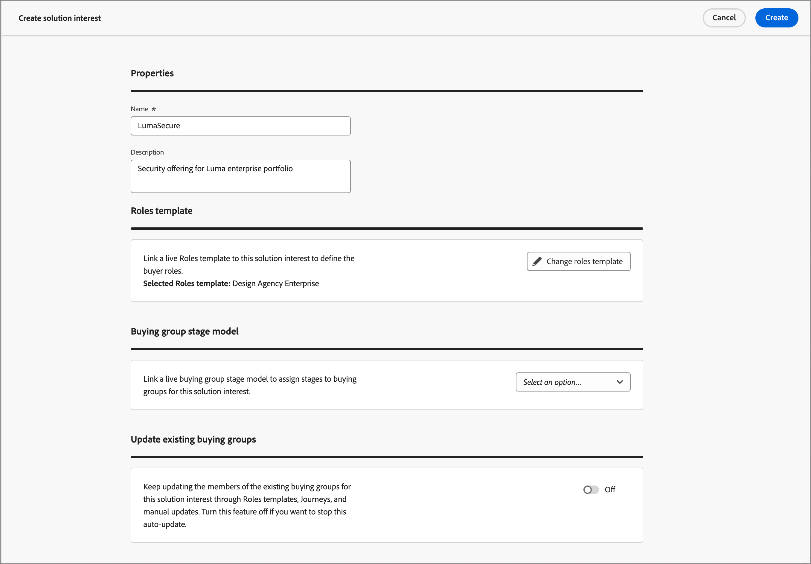

# Interessi soluzione

Prima di creare i gruppi di acquisto, è necessario sapere cosa si sta vendendo e chi si desidera eseguire il targeting. La strategia di marketing e vendita deve essere allineata in modo da poter aggiungere l&#39;interesse della soluzione per i gruppi di acquisto.

## Accedere e sfogliare gli interessi della soluzione

1. Nella home page di Adobe Experience Platform, fare clic su Adobe Journey Optimizer B2B Edition.

1. Nel menu di navigazione a sinistra, fai clic su **[!UICONTROL Gruppi di acquisto]**.

1. Nella pagina Gruppi di acquisto selezionare la scheda **[!UICONTROL Interesse per la soluzione]**.

   {width="700" zoomable="yes"}

   La scheda fornisce un elenco di tutti gli interessi della soluzione esistenti. Fornisce informazioni come _[!UICONTROL Nome]_, _[!UICONTROL Modello ruoli]_, _[!UICONTROL Processi di creazione gruppo acquisti]_, _[!UICONTROL Ultimo aggiornamento il]_, _[!UICONTROL Aggiornato da]_, _[!UICONTROL Creato il]_ e _[!UICONTROL Creato da]_ in formato colonna.

   Per impostazione predefinita, l&#39;elenco è ordinato in base alla colonna _[!UICONTROL Ultimo aggiornamento il]_. Fai clic sul titolo della colonna nell’intestazione per impostare l’ordinamento tra decrescente e crescente.

## Visualizza ed elimina processi del gruppo acquisti

Dalla scheda _[!UICONTROL Interesse soluzione]_, nella colonna **[!UICONTROL Processi di creazione gruppo acquisti]** viene visualizzato il numero di processi creati per ogni interesse soluzione. Il numero è un collegamento e facendo clic su di esso viene aperta una finestra di dialogo in cui viene visualizzato l’elenco dei processi creati per la soluzione desiderata.

{width="700" zoomable="yes"}

Per eliminare un processo del gruppo acquisti, fai clic sui puntini di sospensione (...) accanto al nome del processo e scegli **[!UICONTROL Elimina]**.

## Creare un interesse per la soluzione

Prima di creare un interesse per la soluzione, è necessario disporre di un modello di ruoli live (pubblicato) che definisca i ruoli di destinazione. Per ulteriori informazioni sulla creazione di un modello di ruoli e sulla pubblicazione di un modello di ruoli, vedere [Acquisto di modelli di ruolo di gruppo](./buying-groups-role-templates.md).

1. Dalla scheda _[!UICONTROL Interesse soluzione]_, fai clic su **[!UICONTROL Crea interesse soluzione]** in alto a destra.

1. Immetti un **[!UICONTROL Nome]** univoco (obbligatorio) e una **[!UICONTROL Descrizione]** (facoltativo).

1. Scegli un **[!UICONTROL Modello ruoli]** (obbligatorio).

   Fai clic sul selettore e scegli un modello di ruoli live dall’elenco visualizzato. È possibile associare un solo modello di ruoli live a un interesse della soluzione.

   {width="700" zoomable="yes"}

1. Fai clic su **[!UICONTROL Crea]** nell&#39;angolo superiore destro.

   Il nuovo interesse della soluzione viene visualizzato in Interessi della soluzione

## Modificare un interesse per la soluzione

In qualsiasi momento, puoi modificare il nome e la descrizione di un interesse per la soluzione. Impossibile modificare il modello dei ruoli a causa della dipendenza dei gruppi di acquisto in base all&#39;interesse della soluzione e all&#39;associazione del modello dei ruoli. In questo caso, devi creare un nuovo interesse della soluzione utilizzando un altro modello di ruoli.

1. Dalla scheda _[!UICONTROL Interesse per la soluzione]_, utilizzare uno dei metodi seguenti per aprire le proprietà per l&#39;interesse per la soluzione che si desidera modificare:

   * Fai clic sul nome dell’interesse della soluzione.
   * Fai clic sui puntini di sospensione (**...**) accanto a esso e scegli **[!UICONTROL Modifica]**.

   {width="500" zoomable="no"}

1. Se necessario, aggiorna il nome (obbligatorio e univoco) e la descrizione (facoltativa).

1. Se necessario, modificare l&#39;impostazione **[!UICONTROL Aggiorna gruppi di acquisto esistenti]**.

   Quando questa opzione è abilitata, tutti i gruppi di acquisto esistenti associati all’interesse della soluzione vengono aggiornati tramite il ciclo di sincronizzazione di 24 ore.

1. Fai clic su **[!UICONTROL Salva]**.

## Eliminare un interesse della soluzione

Qualsiasi interesse di soluzione attualmente in uso da un processo o percorso di account del gruppo di acquisto non può essere eliminato. Inoltre, non è possibile recuperare un interesse di soluzione eliminato.

1. Dalla scheda _[!UICONTROL Interesse soluzione]_, fai clic sui puntini di sospensione (**...**) accanto all&#39;interesse della soluzione e scegli **[!UICONTROL Elimina]**.

   Questa azione apre una finestra di dialogo di conferma.

   Se l’interesse della soluzione è attualmente utilizzato da un percorso di account o da un processo del gruppo di acquisto, l’azione apre una finestra di dialogo informativa che avvisa che non è possibile eliminarlo. Fare clic su [!UICONTROL OK] per interrompere l&#39;eliminazione.

1. Fare clic su **[!UICONTROL Elimina]** per confermare l&#39;eliminazione oppure interrompere il processo facendo clic su _[!UICONTROL Annulla]_.
